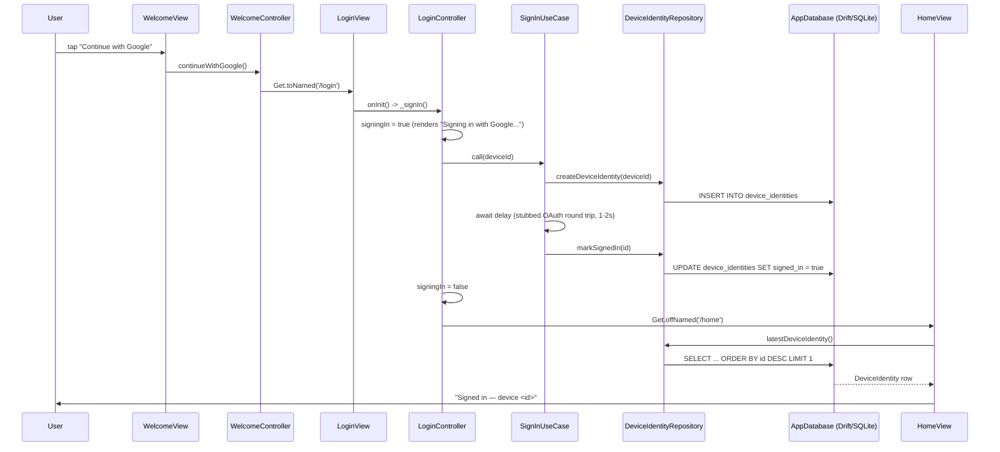

# Data flow — walking skeleton (E00-T04/T05)

> How one tap becomes one real local write. Proportional on purpose — this
> is genesis's proof the architecture wires top to bottom, not a feature.

## Narrative

Welcome (`lib/features/welcome/`) is purely navigational — its controller
has no domain/data layer because it makes no decisions and holds no state;
tapping the button hands off to `/login`. Login
(`lib/features/login/`) is where the real wiring lives: its
`LoginController` (presentation) calls `SignInUseCase` (domain), which is
a stand-in for the real Google OAuth round trip — a fixed delay instead of
a network call, per the task's explicit "do NOT implement real
Firebase/Google auth" boundary. The use case writes through
`DeviceIdentityRepository` (data) into `AppDatabase` (`core/persistence`,
Drift/SQLite — ADR-0001): one `INSERT`, then one `UPDATE` marking the row
signed in. On completion the controller navigates to `/home`
(`lib/features/home/`), a genesis-only placeholder that reads the same row
back through the same repository — proving the write is real, not just
fire-and-forget.

Nothing here touches `core/crypto`, `core/transport`, or `core/auth` — per
the task brief those stay structural stubs. `core/observability` is
initialized once in `main()` (a console no-op today) and is the only
`core/` service actually exercised end to end.
