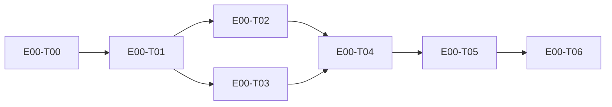

# E00 · Genesis — project foundation · Progress

**Status:** in-progress · **Started:** 2026-08-26 · **Completed:** — · **Progress:** 7/7 done (E00 exit gate below still requires human sign-off + 2 open follow-ups, OQ-E00-2/3)

> Only the ORCHESTRATOR edits this file.
> todo → in-progress → review-requested → (changes-requested →) done → verified
> · side: blocked, frozen

## Tasks
- [x] E00-T00 · Domain analysis + spec/ conversion · done · 2026-08-26
- [x] E00-T01 · Foundational ADRs (0001–0006) · done · 2026-08-26
- [x] E00-T02 · Conventions (`docs/conventions.md`) · done · 2026-08-26
- [x] E00-T03 · Design contracts (extract + gap pass) · done · 2026-08-26
- [x] E00-T04 · Repo skeleton + route/data-flow maps · done (reviewed, approved) · 2026-08-26
- [x] E00-T05 · Walking skeleton (real request, end to end, running) · done (reviewed, approved) · 2026-08-26
- [x] E00-T06 · CI, branch protection, hooks, design self-test · done (reviewed, approved; branch protection itself remains a genuinely open human follow-up — OQ-E00-2, not silently dropped scope) · 2026-08-26

## Dependency graph

## Review log
- 2026-08-26 · E00-T04/T05/T06 · Opus · approve with notes (3 non-blocking notes, all fixed same-day) · design gate n/a — DOM-based `make design-verify` cannot probe a compiled Flutter/Android build (OQ-E00-3); reviewer manually diffed welcome/login copy against `design/screens/{welcome,login}.md`, 100% string match

## Blocked / Frozen
(none)

## Event log (append-only)
- 2026-08-26 E00-T01 todo→done (all 6 ADRs accepted by human in this session)
- 2026-08-26 E00-T02 todo→done (docs/conventions.md written)
- 2026-08-26 E00-T04 todo→in-progress (dispatched to builder · worktree isolation)
- 2026-08-26 E00-T04 in-progress→review-requested (Flutter Android skeleton
  scaffolded, lib/ tree per docs/conventions.md, docs/routes.md +
  docs/data-flow.md written; commit 9f48b8e on epic_00_task_04)
- 2026-08-26 E00-T05 todo→review-requested (welcome + login screens built
  against their design contracts, GetX controller -> SignInUseCase ->
  DeviceIdentityRepository -> Drift wired end to end with a stubbed
  1s "Continue with Google" delay; `flutter analyze` clean, `flutter test`
  green (1 widget test proving welcome->login navigation + the Drift
  write), `flutter build apk --debug` succeeded — no emulator available in
  this environment, so boot was not confirmed on-device; commit 9f48b8e)
- 2026-08-26 E00-T06 todo→review-requested (.github/workflows/ci.yml added
  — pub get/analyze/test/build apk --debug on push+PR; git hooks were
  already installed (core.hooksPath → agent/hooks/githooks, confirmed
  active); `node design/tools/selftest.mjs` green; GitHub branch
  protection on main/development NOT done — requires GitHub UI/API access
  this worktree doesn't have, left as a human follow-up; design-verify for
  welcome/login NOT wired — requires the built app served for the gate's
  IMPL target, deferred per task brief as a later-epic nice-to-have;
  commit e1a63e5)
- 2026-08-26 E00-T04/T05/T06 review-requested→review approved with notes
  (independent review, Opus — rule 5 satisfied, executed_by=Sonnet builder).
  Re-ran `flutter analyze`/`flutter test`/`flutter build apk --debug`/
  `node design/tools/selftest.mjs` independently — all confirmed green.
  ADR compliance, scope discipline, and dependency list all passed. Three
  notes required before these tasks move to `done`: (1) this tracker's
  status/title had drifted from what was actually built — corrected here;
  (2) `docs/conventions.md`'s "no inline string literals in presentation/"
  rule is not yet followed (deviation logged, see conventions.md); (3) one
  invented design token (`welcomeBg`) needs a `design/gaps.md` entry per
  rule 2. Not merge-blocking; tracked as fix-ups below.
- 2026-08-26 E00-T04/T05/T06 fix-ups applied (tracker/epic accounting
  corrected, conventions.md deviation entry added, design/gaps.md entry
  added for `welcomeBg`) — tasks move to done pending merge to `epic_00`.
