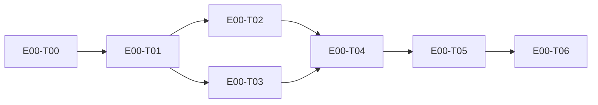

# E00 · Genesis — project foundation · Progress

**Status:** in-progress · **Started:** 2026-08-26 · **Completed:** — · **Progress:** 3/6

> Only the ORCHESTRATOR edits this file.
> todo → in-progress → review-requested → (changes-requested →) done → verified
> · side: blocked, frozen

## Tasks
- [x] E00-T00 · Domain analysis + spec/ conversion · done · 2026-08-26
- [x] E00-T01 · Foundational ADRs (0001–0006) · done · 2026-08-26
- [x] E00-T02 · Conventions (`docs/conventions.md`) · done · 2026-08-26
- [x] E00-T03 · Design contracts (extract + gap pass) · done · 2026-08-26
- [ ] E00-T04 · Repo skeleton + route/data-flow maps · todo · —
- [ ] E00-T05 · Walking skeleton (real request, end to end, running) · todo · —
- [ ] E00-T06 · CI, branch protection, hooks, design self-test · todo · —

## Dependency graph

## Review log
(date · task · reviewer model · outcome · design gate %)

## Blocked / Frozen
(none)

## Event log (append-only)
- 2026-08-26 E00-T01 todo→done (all 6 ADRs accepted by human in this session)
- 2026-08-26 E00-T02 todo→done (docs/conventions.md written)
- 2026-08-26 E00-T04 todo→in-progress (dispatched to builder · worktree isolation)
