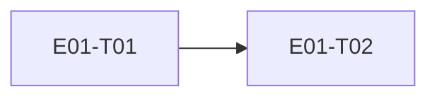

# E01 · Identity & Access · Progress

**Status:** in-progress · **Started:** 2026-08-26 · **Completed:** — · **Progress:** 0/2

> Only the ORCHESTRATOR edits this file.
> todo → in-progress → review-requested → (changes-requested →) done → verified
> · side: blocked, frozen

## Tasks
- [ ] E01-T01 · Real Google Sign-In + device identity · review-requested · builder (sonnet)
- [ ] E01-T02 · Firebase account/device metadata wrapper · todo · —

## Dependency graph

## Review log
(date · task · reviewer model · outcome · design gate %)

## Blocked / Frozen
(none)

## Event log (append-only)
- 2026-08-26 E01 drafted as part of Wave 1 epic-breakdown, status todo, awaiting 🧍 `epic_breakdown_and_wave` approval.
- 2026-08-26 E01-T01 implemented on `epic_01_task_01` (builder, sonnet).
  `flutter analyze` clean, `flutter test` green (4/4: EARS-AUTH-1/2/3 +
  updated walking-skeleton widget test). Deployed to the Wi-Fi device
  (192.168.0.145:5555): found and fixed a real crash (`main()` called
  `Firebase.initializeApp()` before `WidgetsFlutterBinding.ensureInitialized()`,
  throwing before `runApp()` ever ran — blank screen). After the fix the
  welcome screen renders correctly (screenshot evidence). Could NOT get a
  synthetic `adb input tap`/`swipe`/`monkey` on the "Continue with Google"
  button to register with the app on this device — no navigation, no
  logcat activity after the tap — so the real Google account-picker flow
  was not completed end-to-end in this session. Status set to
  `review-requested`; manual on-device tap-through by a human (or a
  physical touch instead of ADB-injected input) is still needed before
  this can be called `verified`. See task file §9 Deviations for the two
  file-list gaps (device_identity_repository.dart, test files) taken to
  satisfy the task's own data/test contract.
