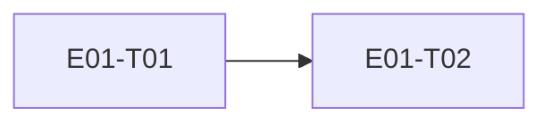

# E01 · Identity & Access · Progress

**Status:** in-progress · **Started:** 2026-08-26 · **Completed:** — · **Progress:** 2/2 done

> Only the ORCHESTRATOR edits this file.
> todo → in-progress → review-requested → (changes-requested →) done → verified
> · side: blocked, frozen

## Tasks
- [x] E01-T01 · Real Google Sign-In + device identity · done · builder (sonnet) → reviewer (opus)
- [x] E01-T02 · Firebase account/device metadata wrapper (Realtime Database, pivoted from Firestore) · done · builder (sonnet) → reviewer (opus)

## Dependency graph

## Review log
- 2026-08-26 · E01-T01 · Opus · approve with notes (3 notes: 2 fixed — null-clobber on re-sign-in, untested v1→v2 migration path; 1 left as noted, non-blocking — `signIn()` cancellation branch needs a platform-interface mock to cover directly) · design gate n/a (no UI change)
- 2026-08-26 · E01-T02 · Opus · changes requested → fixed → done (1 blocking: `registerDevice` could hang sign-in indefinitely on a write that never resolves — fixed with a bounded timeout + regression test; 2 non-blocking notes carried to E11: `createdAt`/`lastSeenAt` always equal, rules lack `.validate`) · design gate n/a (no UI change)

## Blocked / Frozen
(none)

## Event log (append-only)
- 2026-08-26 E01 drafted as part of Wave 1 epic-breakdown, status todo, awaiting 🧍 `epic_breakdown_and_wave` approval.
- 2026-08-26 E01-T01 implemented on `epic_01_task_01` (builder, sonnet).
  `flutter analyze` clean, `flutter test` green (4/4: EARS-AUTH-1/2/3 +
  updated walking-skeleton widget test). Deployed to the Wi-Fi device
  (192.168.0.145:5555): found and fixed a real crash (`main()` called
  `Firebase.initializeApp()` before `WidgetsFlutterBinding.ensureInitialized()`,
  throwing before `runApp()` ever ran — blank screen). After the fix the
  welcome screen renders correctly (screenshot evidence). Could NOT get a
  synthetic `adb input tap`/`swipe`/`monkey` on the "Continue with Google"
  button to register with the app on this device — no navigation, no
  logcat activity after the tap — so the real Google account-picker flow
  was not completed end-to-end in this session. Status set to
  `review-requested`; manual on-device tap-through by a human (or a
  physical touch instead of ADB-injected input) is still needed before
  this can be called `verified`. See task file §9 Deviations for the two
  file-list gaps (device_identity_repository.dart, test files) taken to
  satisfy the task's own data/test contract.
- 2026-08-26 Human physical tap-through on the Wi-Fi device: real Google
  account picker appeared, sign-in completed, app showed "Signed in —
  device 99a7011d" and landed on `/home`. Manual acceptance step 1 closed.
- 2026-08-26 Independent review (Opus, rule 5): re-ran `flutter
  analyze`/`flutter test` in the worktree, confirmed green; verified ADR-0005
  compliance, migration correctness, dependency list, and the binding-order
  fix. Verdict: approve with notes. Applied 2 of 3 notes (null-clobber fix
  in `markSignedIn`; added `database_migration_test.dart` exercising the
  v1→v2 upgrade for real, since the Wi-Fi device is literally at v1 right
  now). Third note (cancellation-path unit test) left open, non-blocking.
  `flutter analyze`/`flutter test` re-confirmed green (5/5) after fixes.
  E01-T01 → `done`.
- 2026-08-26 E01-T02 implemented on `epic_01_task_02` (builder, sonnet).
  Added `FirebaseMetadataService.registerDevice` (writes exactly
  `{deviceId, createdAt, lastSeenAt, platform}` to
  `/users/{uid}/devices/{deviceId}`, best-effort — swallows/logs any
  Firestore error), wired into `SignInUseCase` after the local Drift write,
  `firestore.rules` restricting to the owning uid, `firebase.json` updated
  to point at it. `cloud_firestore` added as a dependency (logged in
  `docs/conventions.md`). Tests written first (red confirmed before each
  implementation): EARS-FB-1/2 at both the service level and the
  `SignInUseCase` level. `flutter analyze` clean, `flutter test` green
  (9/9). Deviation: touched `sign_in_use_case.dart`/its test and
  `pubspec.yaml`/`.lock`/`docs/conventions.md`, which are not in this
  task's YAML `files:` list — treated as a sharding omission since the
  task's own §3/§7 prose requires this wiring; see task file §9 Deviations.
  Deliberately did NOT run `firebase deploy --only firestore:rules`
  (live-project change, flagged for a human/orchestrator call). Ran the app
  on the Wi-Fi device (192.168.0.145:5555) — welcome screen renders — but
  synthetic `adb input tap` on "Continue with Google" again did not
  register (same limitation as E01-T01), so manual on-device Firestore
  verification could not be completed; a human physical tap is still
  needed. Status set to `review-requested`.
- 2026-08-26 Attempted to deploy `firestore.rules` → Firestore requires
  the Blaze billing plan just to provision a database. Asked the human;
  **billing declined.** Human chose Realtime Database over deferring
  cloud sync entirely.
- 2026-08-26 Rewrote E01-T02 for Realtime Database: `firebase_database`
  replaces `cloud_firestore`, `database.rules.json` replaces
  `firestore.rules`, `ServerValue.timestamp` replaces
  `FieldValue.serverTimestamp()`. `flutter analyze`/`flutter test`
  re-confirmed green (9/9). RTDB instance provisioning turned out to need
  a human click-through in the Firebase console (no MCP tool and no
  scriptable CLI path for a project's *first* RTDB instance — the
  interactive wizard's account-selection prompt can't be driven by piped
  stdin, and a REST-API token-extraction fallback was correctly blocked
  by the session's safety classifier). Human created
  `nexora-b3a97-default-rtdb` via console; `firebase deploy --only
  database` (MCP) then succeeded.
- 2026-08-26 Human physical tap-through on the rebuilt app: real sign-in
  completed. Verified via `firebase database:get /users --instance
  nexora-b3a97-default-rtdb` that the write landed for real —
  `users/{uid}/devices/bff526fdfe311d35` with exactly the four allowed
  fields. E01-T02 → `review-requested` → dispatching independent review
  (rule 5) next.
