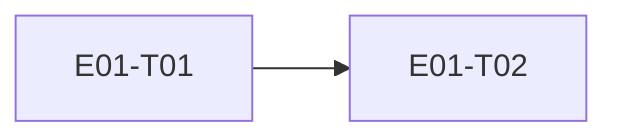

# E01 · Identity & Access · Progress

**Status:** in-progress · **Started:** 2026-08-26 · **Completed:** — · **Progress:** 0/2

> Only the ORCHESTRATOR edits this file.
> todo → in-progress → review-requested → (changes-requested →) done → verified
> · side: blocked, frozen

## Tasks
- [ ] E01-T01 · Real Google Sign-In + device identity · todo · —
- [ ] E01-T02 · Firebase account/device metadata wrapper · todo · —

## Dependency graph

## Review log
(date · task · reviewer model · outcome · design gate %)

## Blocked / Frozen
(none)

## Event log (append-only)
- 2026-08-26 E01 drafted as part of Wave 1 epic-breakdown, status todo, awaiting 🧍 `epic_breakdown_and_wave` approval.
