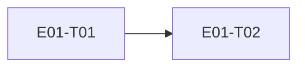

# E01 · Identity & Access · Progress

**Status:** in-progress · **Started:** 2026-08-26 · **Completed:** — · **Progress:** 1/2

> Only the ORCHESTRATOR edits this file.
> todo → in-progress → review-requested → (changes-requested →) done → verified
> · side: blocked, frozen

## Tasks
- [x] E01-T01 · Real Google Sign-In + device identity · done · builder (sonnet) → reviewer (opus)
- [ ] E01-T02 · Firebase account/device metadata wrapper · todo · —

## Dependency graph

## Review log
- 2026-08-26 · E01-T01 · Opus · approve with notes (3 notes: 2 fixed — null-clobber on re-sign-in, untested v1→v2 migration path; 1 left as noted, non-blocking — `signIn()` cancellation branch needs a platform-interface mock to cover directly) · design gate n/a (no UI change)

## Blocked / Frozen
(none)

## Event log (append-only)
- 2026-08-26 E01 drafted as part of Wave 1 epic-breakdown, status todo, awaiting 🧍 `epic_breakdown_and_wave` approval.
- 2026-08-26 E01-T01 implemented on `epic_01_task_01` (builder, sonnet).
  `flutter analyze` clean, `flutter test` green (4/4: EARS-AUTH-1/2/3 +
  updated walking-skeleton widget test). Deployed to the Wi-Fi device
  (192.168.0.145:5555): found and fixed a real crash (`main()` called
  `Firebase.initializeApp()` before `WidgetsFlutterBinding.ensureInitialized()`,
  throwing before `runApp()` ever ran — blank screen). After the fix the
  welcome screen renders correctly (screenshot evidence). Could NOT get a
  synthetic `adb input tap`/`swipe`/`monkey` on the "Continue with Google"
  button to register with the app on this device — no navigation, no
  logcat activity after the tap — so the real Google account-picker flow
  was not completed end-to-end in this session. Status set to
  `review-requested`; manual on-device tap-through by a human (or a
  physical touch instead of ADB-injected input) is still needed before
  this can be called `verified`. See task file §9 Deviations for the two
  file-list gaps (device_identity_repository.dart, test files) taken to
  satisfy the task's own data/test contract.
- 2026-08-26 Human physical tap-through on the Wi-Fi device: real Google
  account picker appeared, sign-in completed, app showed "Signed in —
  device 99a7011d" and landed on `/home`. Manual acceptance step 1 closed.
- 2026-08-26 Independent review (Opus, rule 5): re-ran `flutter
  analyze`/`flutter test` in the worktree, confirmed green; verified ADR-0005
  compliance, migration correctness, dependency list, and the binding-order
  fix. Verdict: approve with notes. Applied 2 of 3 notes (null-clobber fix
  in `markSignedIn`; added `database_migration_test.dart` exercising the
  v1→v2 upgrade for real, since the Wi-Fi device is literally at v1 right
  now). Third note (cancellation-path unit test) left open, non-blocking.
  `flutter analyze`/`flutter test` re-confirmed green (5/5) after fixes.
  E01-T01 → `done`.
