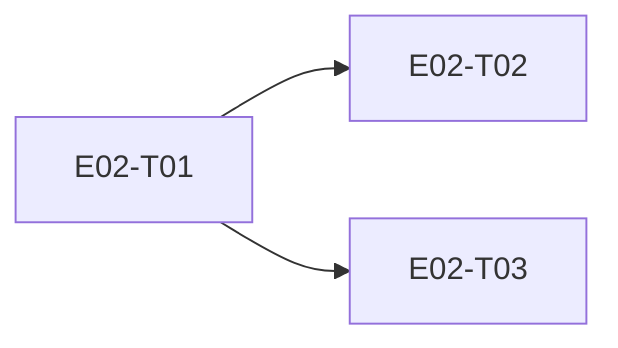

# E02 · Relationships, Trust & Blocking · Progress

**Status:** in-progress · **Started:** 2026-08-26 · **Completed:** — · **Progress:** 0/3

> Only the ORCHESTRATOR edits this file.

## Tasks
- [ ] E02-T01 · Relationship domain (trust states, evaluation, blocking) · todo · —
- [ ] E02-T02 · Devices screen · todo · —
- [ ] E02-T03 · Settings screen (top-level menu) · todo · —

## Dependency graph

Note: T02/T03 share `lib/app/routes.dart` + `bindings.dart` — serialize, don't parallelize.

## Review log
(date · task · reviewer model · outcome · design gate %)

## Blocked / Frozen
(none)

## Event log (append-only)
- 2026-08-26 E02 drafted as part of Wave 1 epic-breakdown, status todo, awaiting 🧍 `epic_breakdown_and_wave` approval.
