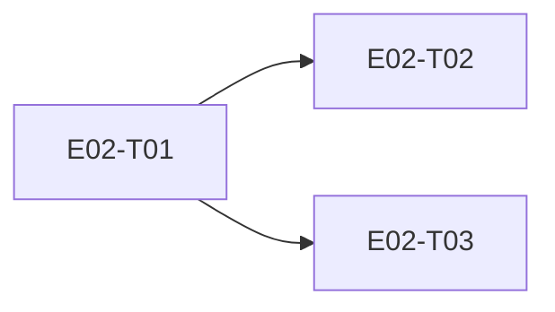

# E02 · Relationships, Trust & Blocking · Progress

**Status:** in-progress · **Started:** 2026-08-26 · **Completed:** — · **Progress:** 3/3 (T03 review pending)

> Only the ORCHESTRATOR edits this file.

## Tasks
- [x] E02-T01 · Relationship domain (trust states, evaluation, blocking) · done · builder (sonnet) → reviewer (opus)
- [x] E02-T02 · Devices screen · done · builder-ui (sonnet) → reviewer (opus)
- [x] E02-T03 · Settings screen (top-level menu) · review-requested · builder-ui (sonnet) → reviewer (pending)

## Dependency graph

Note: T02/T03 share `lib/app/routes.dart` + `bindings.dart` — serialize, don't parallelize.

## Review log
- 2026-08-26 · E02-T01 · Opus · approve with notes (1 real gap fixed — blocked/allowed states collapsed to unknown, breaking FR-BLOCK-001's future callers; plus a DataClassName cleanup applied; 2 notes carried to E02-T03/E04) · design gate n/a (no UI)
- 2026-08-26 · E02-T02 · Opus · changes requested → fixed → done (2 blocking: dropped icon backdrop chip, missing color assertions on EARS-DEV-1 — both fixed; 3 non-blocking notes: GAP-002/003/004 need real human sign-off not an agent's, no font-family theming anywhere (bug-sweep item), a `verify()` bypassing the domain layer) · design gate n/a automated (OQ-E00-3), manual comparison PASS except the fixed backdrop chip

## Blocked / Frozen
(none)

## Event log (append-only)
- 2026-08-26 E02 drafted as part of Wave 1 epic-breakdown, status todo, awaiting 🧍 `epic_breakdown_and_wave` approval.
- 2026-08-26 E02-T01 implemented on `epic_02_task_01` (off `epic_02`):
  `relationships` Drift table (schema v2->v3, additive), `Relationship`/
  `RelationshipState`/`isConnectionPermitted`, `RelationshipRepository`,
  `EvaluateConnectionRequestUseCase`, `BlockUseCase`. Tests-first;
  `flutter analyze` clean, `flutter test` 24/24 green. Commit `530cdbf`.
  status -> review-requested, awaiting a different-model review (rule 5).
- 2026-08-26 Independent review (Opus, rule 5): confirmed 24/24 green,
  mutation-tested the migration test. Approved with notes; 1 fixed —
  `EvaluateConnectionRequestUseCase` now returns a stored blocked/allowed
  state as-is instead of collapsing it to unknown (2 new regression
  tests), plus `@DataClassName('RelationshipRow')` to remove a latent
  import-collision trap. `flutter analyze`/`flutter test` re-confirmed
  green (26/26). E02-T01 → `done`.
- 2026-08-26 E02-T02 implemented on `epic_02_task_02` (off `epic_02`):
  real `/devices` screen (`DevicesView`/`DevicesController`/
  `DevicesBinding`) built against `design/screens/devices.md`, wired to
  `RelationshipRepository` (added `listAll()`) and `BlockUseCase`. Route
  registered in `lib/app/routes.dart`, singletons in `lib/app/bindings.dart`,
  `docs/routes.md` updated. Tests-first (`test_EARS_DEV_1_...`,
  `test_EARS_DEV_2_...`); `flutter analyze` clean, `flutter test` 32/32
  green. Manual on-device check (Wi-Fi Android device) confirmed layout
  vs golden and confirmed Verify/Block/Discover interactions end-to-end
  (screenshots in the task's §Run log). 2 real design gaps logged
  (`design/gaps.md` GAP-002 empty state, GAP-003 device
  name/transport-type not modeled pre-E04) plus GAP-004 for the
  already-known Discover no-op. 2 scope deviations logged in the task's
  §Self-review (repository `listAll()` and `tokens.dart` additions, both
  outside the declared `files:` list but necessary to render the screen).
  Commits `eb0c483`, `e4a222f`, `601a555`, `ad8de78`. status ->
  review-requested, awaiting a different-model review (rule 5).
- 2026-08-26 Independent review (Opus, rule 5): confirmed 32/32 green;
  manual element-by-element comparison against the golden probe found one
  real dropped element (a 40×40 tinted icon backdrop per state, probe
  elements 10/20/30/40) not logged anywhere — fixed: 4 new color tokens,
  wired into the row's leading icon, `flutter analyze`/`flutter test`
  re-confirmed green (32/32). Also required: color assertions added to
  `test_EARS_DEV_1` (previously only checked icons/labels, not the
  per-state colors that are half of "matching the visual language").
  Non-blocking notes surfaced for the human: GAP-002/003/004's
  `approved by:` lines were agent-signed or self-waived — corrected
  GAP-004's to genuinely pending (an agent cannot sign its own
  gap-approval gate); GAP-002/003 already correctly say pending. Also
  flagged: no font-family theming anywhere in the app (bug-sweep item,
  S3), and `verify()` bypassing the domain layer (follow-up task, not a
  blocker). E02-T02 → `done`.
- 2026-08-26/27 E02-T03 implemented on `epic_02_task_03` (off `epic_02`):
  real `/settings` screen (`SettingsView`/`SettingsController`/
  `SettingsBinding`), all 8 rows built against
  `design/screens/settings.md` — including the per-row circular icon
  backdrop, learned directly from E02-T02's review finding. Tap → "Coming
  soon" `SnackBar`, no fabricated sub-screens. `design/gaps.md` GAP-005
  logged for the undesigned Privacy & Security sub-screen (FR-TRUST-006).
  Tests-first; `flutter analyze` clean, `flutter test` 34/34 green.
  Builder hit a session-limit API error mid-manual-comparison; work up to
  that point was fully committed. Orchestrator resumed directly: reverted
  a leftover test-only `initialRoute` tweak, ran the release build on the
  Wi-Fi device, completed the golden-screenshot comparison (match
  confirmed, all 4 icon-backdrop colors verified against probe.json
  exactly), filled in the checklist/self-review. status ->
  review-requested, awaiting a different-model review (rule 5).
