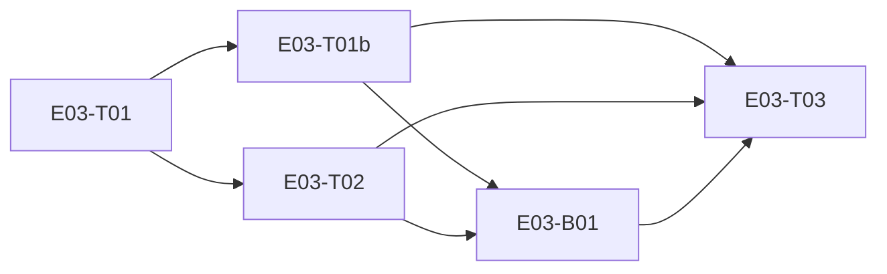

# E03 · E2E Encryption & Threat Protection · Progress

**Status:** done · **Started:** 2026-08-27 · **Completed:** 2026-08-27 · **Progress:** 6/7 (B03 deferred to backlog by design)

> Only the ORCHESTRATOR edits this file.

## Tasks
- [x] E03-T01 · libsignal_protocol_dart + Drift-backed protocol store · done · builder (sonnet) → reviewer (opus)
- [x] E03-T01b · Persist remote-peer identity trust across restarts (closes OQ-E03-T01-1) · done · builder (sonnet) → reviewer (opus)
- [x] E03-T02 · Local identity generation + prekey bundle service · done · builder (sonnet) → reviewer (opus)
- [x] E03-B01 · One-time prekey ids restart at 1 after pool drains (S2 bug) · done · builder (sonnet) → reviewer (opus)
- [x] E03-T03 · Real core/crypto API — X3DH session + Double Ratchet encrypt/decrypt · done · builder (sonnet) → reviewer (opus)
- [x] E03-B02 · Same one-time prekey issued to every peer (S2, P1) · done · builder (sonnet) → reviewer (opus)
- [ ] E03-B03 · InvalidMessageException not catchable by type (S3, P3 — deferred to E05/E06) · backlog · —

## Dependency graph

T01b and T02 both landed. B01 (bug, found in T02's review) now owns a
schema change (`crypto_counters` table) and must land before T03.

## Review log
- 2026-08-27 · E03-T01 · Opus · approve with notes (0 blocking; a real spec
  gap found and promoted to `## Open Questions` as OQ-E03-T01-1 rather than
  fixed in-diff: remote-peer identity trust is in-memory only, forgotten on
  restart — doesn't block T02, blocks T03 until resolved) · design gate n/a
  (no UI). `flutter analyze`/`flutter test` re-confirmed green (42/42) by
  the reviewer independently.
- 2026-08-27 · E03-T03 · Opus · APPROVE (full security lens; this task's own
  risk note demanded a real proof, not a superficial one, so no "approve
  with notes" on a weak security claim was acceptable here). Mutation-tested
  the whole suite (swapped decrypt()'s PreKey branch to the wrong library
  call → all 5 proof tests failed, confirming they're genuinely wired to
  behavior, not decorative). 2 of 5 proof tests strengthened after being
  found weaker than their names claimed: the relay-cannot-decrypt test
  originally only proved a precondition check, not a cryptographic failure
  — rewritten with a fully-resourced third party (own identity, keys, and a
  genuine live session with Alice) failing on real MAC verification instead;
  the post-compromise-recovery test's assertion (`throwsA(isException)`)
  was loose enough to pass on an unrelated broken-fixture error — tightened
  to the specific MAC/key-derivation failure. Forward-secrecy and replay
  tests verified genuine via library-source reading plus a throwaway probe
  proving the hypothesized false-positive shape does NOT occur.
  `flutter analyze`/`flutter test` re-confirmed 65/65 by the reviewer
  independently. 2 non-blocking notes carried to the sweep: skipped/
  undelivered message keys stay decryptable from a compromised device
  (inherent to Signal, bounds the forward-secrecy claim to in-order
  messages — should be documented wherever users see that guarantee), and
  `InvalidMessageException` isn't exported from the library barrel (E05/E06
  can't catch the common decrypt-failure case by type).

## Blocked / Frozen
(none)

## Event log (append-only)
- 2026-08-27 E03 sharded into 3 tasks (task-sharding skill). OQ-E03-1
  (specific crypto library) resolved at epic level before sharding:
  `libsignal_protocol_dart` (mixin.dev, pure Dart, GPL-3.0 dependency
  accepted by the human) — see `epic.md` Open Questions.
- 2026-08-27 Analyze report run (6/7 clean, 1 justified MoSCoW exception —
  all 3 tasks are `must`, no optional slice exists in this strictly-linear
  infra chain). 🧍 `analyze_report` gate cleared by human, approved as-is.
  Dispatching E03-T01.
- 2026-08-27 E03-T01 implemented on `epic_03_task_01` (off `epic_03`):
  `libsignal_protocol_dart` dependency added; `signal_identity`,
  `signal_signed_prekeys`, `signal_one_time_prekeys`, `signal_sessions`
  Drift tables (schema v3->v4, additive `onUpgrade`); `DriftSignalProtocolStore`
  implementing the library's `IdentityKeyStore`/`PreKeyStore`/
  `SignedPreKeyStore`/`SessionStore` interfaces. Tests-first;
  `flutter analyze` clean, `flutter test` 42/42 green. status ->
  review-requested, awaiting a different-model review (rule 5).
- 2026-08-27 Independent review (Opus, rule 5): re-confirmed 42/42 green
  and the migration test's real onUpgrade proof independently. Verified
  the singleton-identity-row enforcement (fixed id=0, plain `insert()`
  raises on a racing second write, not silent overwrite), no key material
  logged anywhere, and every store method signature matches the real
  installed package (v0.8.2) source — no stubs standing in for the
  library. One real finding: the builder's own logged Deviation #2
  (remote-peer identity trust kept in an in-memory `Map`, forgotten on
  restart) was correctly scoped out of this task's `files:`/Data contract,
  but the builder's claim that this doesn't block T03 was wrong — T03's
  own contract requires `isTrustedIdentity` to actually detect a changed
  remote key across restarts. Promoted to `OQ-E03-T01-1` rather than fixed
  in-diff (a spec gap, not a coding defect). Squash-merged to `epic_03`
  (`403c94e`); `flutter analyze`/`flutter test` re-confirmed green on
  `epic_03` (42/42). E03-T01 → `done`. E03-T02 cleared to start; E03-T03
  blocked pending OQ-E03-T01-1 resolution.
- 2026-08-27 Human resolved OQ-E03-T01-1: shard a new task rather than fold
  into T02 or defer. E03-T01b written, `epic.md` OQ closed, E03-T03's
  `depends_on` updated to `[E03-T02, E03-T01b]`. Dispatching E03-T01b and
  E03-T02 in parallel (disjoint files, both depend only on T01).
- 2026-08-27 E03-T01b implemented on `epic_03_task_01b` (off `epic_03`):
  `signal_trusted_identities` table (schema v4->v5), `DriftSignalProtocolStore`
  rewired off the in-memory Map. Tests-first; `flutter analyze` clean,
  `flutter test` 45/45. Reviewer (Opus) proved the regression test genuinely
  fails against the pre-fix code before confirming green post-fix — approve,
  0 blocking. Squash-merged to `epic_03` (`a4aa0f5`). E03-T01b → `done`.
- 2026-08-27 E03-T02 implemented on `epic_03_task_02` (off `epic_03`):
  `IdentityService` (ensureLocalIdentity/ensureSignedPreKey/
  replenishOneTimePreKeys/getLocalPreKeyBundle) on top of T01's store, using
  the real `libsignal_protocol_dart` `KeyHelper`. Tests-first; `flutter
  analyze` clean, `flutter test` 51/51. Reviewer (Opus) found a real S2
  defect: one-time prekey ids allocated from `max(live rows) + 1` restart at
  1 once the pool fully drains, reissuing ids under different key material —
  latent until T03 consumes prekeys. Added one missing test (empty-pool
  StateError, 52/52), filed **E03-B01**, left T02 approve-with-notes since
  the defect traces back to T02's own §6 risk note suggesting the flawed
  algorithm. Squash-merged to `epic_03` (`98b865a`, includes E03-B01.md).
  E03-T02 → `done`. E03-T03's `depends_on` extended to include E03-B01.
- 2026-08-27 🧍 Rule-3 gate: human chose a dedicated `crypto_counters` table
  (over a column on `signal_identity`) for E03-B01's monotonic
  one-time-prekey-id counter. E03-B01 finalized with a full `files:` list
  and fix contract; `depends_on` narrowed to `[E03-T01b]` (already merged,
  so B01 owns the schema change directly). Dispatching E03-B01.
- 2026-08-27 E03-B01 fixed on `epic_03_bug_01` (off `epic_03`):
  `crypto_counters` table (schema v5->v6, additive, backfilled from live
  rows on upgrade), `DriftSignalProtocolStore.allocateOneTimePreKeyIds()`
  replaces `max(existingIds)+1` with an atomic monotonic counter. Builder
  confirmed the exact repro failed pre-fix and passed post-fix. `flutter
  analyze` clean, `flutter test` 59/59. Reviewer (Opus, the same reviewer
  who filed this bug) independently reproduced the falsification, then
  found and fixed a SECOND instance of the same defect class: allocation
  wrapped at libsignal's advertised `Medium.MAX_VALUE` instead of its real
  `MAX_VALUE - 1` arithmetic, which could silently reissue id 1 with fresh
  key material at ~16.7M allocations — narrowed the modulus, added a
  falsifiable regression test. Also strengthened a migration-backfill test
  that couldn't distinguish a correct backfill from a wrong one (both
  yielded the same counter value on an empty pool). Squash-merged to
  `epic_03` (`b907a0e`); `flutter analyze`/`flutter test` re-confirmed
  green (60/60). E03-B01 → `done`. E03-T03 fully unblocked — dispatching.
- 2026-08-27 First E03-T03 attempt interrupted mid-run by a session-limit
  API error; no commits existed, only a small untested uncommitted edit —
  discarded, redispatched fresh (no work lost).
- 2026-08-27 E03-T03 implemented on `epic_03_task_03` (off `epic_03`):
  `CryptoService.establishSession/encrypt/decrypt` wrapping the library's
  `SessionBuilder`/`SessionCipher`, replacing the genesis stub. Tests-first,
  the 5 EARS security-proof tests written; `flutter analyze` clean,
  `flutter test` 65/65 green. Reviewer (Opus, full security lens) approved
  after mutation-testing the suite and strengthening 2 of 5 proof tests that
  were weaker than their names claimed (see Review log above).
  Squash-merged to `epic_03` (`91e8259`); `flutter analyze`/`flutter test`
  re-confirmed green (65/65). E03-T03 → `done`. Task statuses normalized to
  `done` across the epic (T01/T01b were left at `review-requested` post-merge
  by their reviewers — corrected for consistency).
  **E03 build-complete: 5/5 tasks done. Proceeding to bug sweep.**
- 2026-08-27 Bug sweep (Opus, `agent/skills/bug-sweep`) run against
  `epic_03` @ `4862642`, targeting cross-task seams per `skills/bug-sweep`
  ("bugs live in the seams no task owned"). 6 seams probed end-to-end
  through public APIs only. 2 defects found:
  - **E03-B02 (S2, live today, not latent)**: `getLocalPreKeyBundle()`
    returns row-zero unconditionally — every peer after the first gets the
    SAME one-time prekey, so a second contact's first message is
    permanently undecryptable. Verified: `bob=1 carol=1` (identical id AND
    key material), 19 unused prekeys sitting idle — not exhaustion, a
    selection bug. This is the *distribution* half of the invariant B01
    fixed the *allocation* half of; no task's `files:` fence covered "one
    device, two peers." Written up with a 7-step reviewer-verified repro,
    3 named regression tests (confirmed red), 2 schema-change options
    presented per rule 3.
  - **E03-B03 (S3, advisory P3)**: `InvalidMessageException` isn't exported
    from the `libsignal_protocol_dart` barrel — the commonest decrypt
    failure has no catchable type, forcing a runtime-type-name string
    match (already in T03's own test suite). Not blocking; reviewer's own
    advisory is to schedule alongside whichever epic first writes a
    `catch` around `decrypt()` (E05/E06), so the taxonomy is shaped by
    real UI needs rather than designed in isolation.
  - Confirmed NOT a defect: identity-trust rejection on a changed peer key
    — genuinely wired on both the X3DH initiating and responder path,
    verified end-to-end through the public `CryptoService` API (not in
    isolation). FR-SEC-003's MITM claim holds.
  - Confirmed accurate, not a bug: skipped/undelivered message keys stay
    decryptable from a compromised device — correct Signal design (needed
    for out-of-order delivery), bounds the forward-secrecy claim to
    in-order messages. Carried as a documentation note, not a bug task.
  - `flutter analyze`/`flutter test` unchanged, 65/65 green throughout.
  🧍 `bug_priorities` gate: human set E03-B02 → **P1** (matches the
  reviewer's advisory — must not leave this epic, since E06 is
  multi-contact and this means every second contact is silently
  unreachable) and E03-B03 → P3 (backlog, deferred to E05/E06). 🧍 rule-3
  gate: human chose **Option 2 (monotonic issue cursor)** for E03-B02 —
  a second counter on the existing `crypto_counters` table, reusing B01's
  already-tested atomic transaction machinery, over a per-row `issued`
  marker. Dispatching E03-B02.
  **Retro flag**: this is the same invariant (never reuse an issued
  one-time prekey) broken at two different points — B01 (allocation) then
  B02 (distribution). L-backend-002's lesson ("a boundary case the test
  plan didn't name") is now recurrence 3 across this pattern — promotion
  territory per rule 8, to be handled at `skills/retro`.
- 2026-08-27 E03-B02 fixed on `epic_03_bug_02` (off `epic_03`):
  `next_issued_one_time_prekey_id` cursor added to `crypto_counters` (schema
  v6->v7, additive), `DriftSignalProtocolStore.issueOneTimePreKey()`
  atomically selects+advances. All 3 regression tests confirmed red
  pre-fix, green post-fix; T03's mutation check re-run (4/5 proof tests
  fail under a deliberate corruption), confirming they're still genuine
  proofs, not weakened by this fix. `flutter analyze` clean, `flutter test`
  68/68. Reviewer (Opus) independently reproduced all 4 of the builder's
  falsification claims, then found and fixed two more issues in the same
  pass: **R2 (blocking, a live regression the fix itself introduced)** —
  `replenishOneTimePreKeys()` still counted live rows, not *issuable* rows,
  so a device with 20 issued-but-unconsumed bundles would report a healthy
  pool and never replenish, hard-locking bundle issuance forever — fixed
  with `countIssuableOneTimePreKeys()`. **R1** — the v6->v7 migration step
  had zero test coverage; added a real test, verified the guard is correct
  by mutation (weakening it fails 5 migration tests with `duplicate column
  name`). Squash-merged to `epic_03` (`a2f6282`); `flutter analyze`/
  `flutter test` re-confirmed green (70/70). E03-B02 → `done`.
  **E03 build-complete, bug sweep clean (P1/P2 = 0), 70/70 green. Retro
  next; merge to `development` awaits the human `epic_dev_merge` gate
  (rule 4) — asked in chat rather than self-cleared.**
