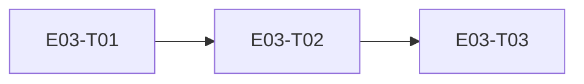

# E03 · E2E Encryption & Threat Protection · Progress

**Status:** in-progress · **Started:** 2026-08-27 · **Completed:** — · **Progress:** 1/3

> Only the ORCHESTRATOR edits this file.

## Tasks
- [x] E03-T01 · libsignal_protocol_dart + Drift-backed protocol store · done · builder (sonnet) → reviewer (opus)
- [ ] E03-T02 · Local identity generation + prekey bundle service · todo · builder (sonnet) → reviewer (opus)
- [ ] E03-T03 · Real core/crypto API — X3DH session + Double Ratchet encrypt/decrypt · blocked (OQ-E03-T01-1) · builder (sonnet) → reviewer (opus)

## Dependency graph

Strictly linear — each task's store/service is the next task's only seam.
No parallel dispatch candidates in this epic.

## Review log
- 2026-08-27 · E03-T01 · Opus · approve with notes (0 blocking; a real spec
  gap found and promoted to `## Open Questions` as OQ-E03-T01-1 rather than
  fixed in-diff: remote-peer identity trust is in-memory only, forgotten on
  restart — doesn't block T02, blocks T03 until resolved) · design gate n/a
  (no UI). `flutter analyze`/`flutter test` re-confirmed green (42/42) by
  the reviewer independently.

## Blocked / Frozen
- E03-T03 — blocked on OQ-E03-T01-1 (remote-peer identity trust persistence)
  until the planner/human resolve it. Not a task-execution blocker; a spec
  gap discovered during E03-T01's review.

## Event log (append-only)
- 2026-08-27 E03 sharded into 3 tasks (task-sharding skill). OQ-E03-1
  (specific crypto library) resolved at epic level before sharding:
  `libsignal_protocol_dart` (mixin.dev, pure Dart, GPL-3.0 dependency
  accepted by the human) — see `epic.md` Open Questions.
- 2026-08-27 Analyze report run (6/7 clean, 1 justified MoSCoW exception —
  all 3 tasks are `must`, no optional slice exists in this strictly-linear
  infra chain). 🧍 `analyze_report` gate cleared by human, approved as-is.
  Dispatching E03-T01.
- 2026-08-27 E03-T01 implemented on `epic_03_task_01` (off `epic_03`):
  `libsignal_protocol_dart` dependency added; `signal_identity`,
  `signal_signed_prekeys`, `signal_one_time_prekeys`, `signal_sessions`
  Drift tables (schema v3->v4, additive `onUpgrade`); `DriftSignalProtocolStore`
  implementing the library's `IdentityKeyStore`/`PreKeyStore`/
  `SignedPreKeyStore`/`SessionStore` interfaces. Tests-first;
  `flutter analyze` clean, `flutter test` 42/42 green. status ->
  review-requested, awaiting a different-model review (rule 5).
- 2026-08-27 Independent review (Opus, rule 5): re-confirmed 42/42 green
  and the migration test's real onUpgrade proof independently. Verified
  the singleton-identity-row enforcement (fixed id=0, plain `insert()`
  raises on a racing second write, not silent overwrite), no key material
  logged anywhere, and every store method signature matches the real
  installed package (v0.8.2) source — no stubs standing in for the
  library. One real finding: the builder's own logged Deviation #2
  (remote-peer identity trust kept in an in-memory `Map`, forgotten on
  restart) was correctly scoped out of this task's `files:`/Data contract,
  but the builder's claim that this doesn't block T03 was wrong — T03's
  own contract requires `isTrustedIdentity` to actually detect a changed
  remote key across restarts. Promoted to `OQ-E03-T01-1` rather than fixed
  in-diff (a spec gap, not a coding defect). Squash-merged to `epic_03`
  (`403c94e`); `flutter analyze`/`flutter test` re-confirmed green on
  `epic_03` (42/42). E03-T01 → `done`. E03-T02 cleared to start; E03-T03
  blocked pending OQ-E03-T01-1 resolution.
