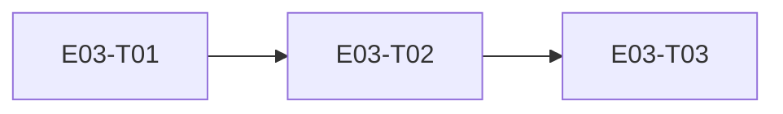

# E03 · E2E Encryption & Threat Protection · Progress

**Status:** in-progress · **Started:** 2026-08-27 · **Completed:** — · **Progress:** 0/3

> Only the ORCHESTRATOR edits this file.

## Tasks
- [ ] E03-T01 · libsignal_protocol_dart + Drift-backed protocol store · todo · builder (sonnet) → reviewer (opus)
- [ ] E03-T02 · Local identity generation + prekey bundle service · todo · builder (sonnet) → reviewer (opus)
- [ ] E03-T03 · Real core/crypto API — X3DH session + Double Ratchet encrypt/decrypt · todo · builder (sonnet) → reviewer (opus)

## Dependency graph

Strictly linear — each task's store/service is the next task's only seam.
No parallel dispatch candidates in this epic.

## Review log
(none yet)

## Blocked / Frozen
(none)

## Event log (append-only)
- 2026-08-27 E03 sharded into 3 tasks (task-sharding skill). OQ-E03-1
  (specific crypto library) resolved at epic level before sharding:
  `libsignal_protocol_dart` (mixin.dev, pure Dart, GPL-3.0 dependency
  accepted by the human) — see `epic.md` Open Questions.
- 2026-08-27 Analyze report run (6/7 clean, 1 justified MoSCoW exception —
  all 3 tasks are `must`, no optional slice exists in this strictly-linear
  infra chain). 🧍 `analyze_report` gate cleared by human, approved as-is.
  Dispatching E03-T01.
