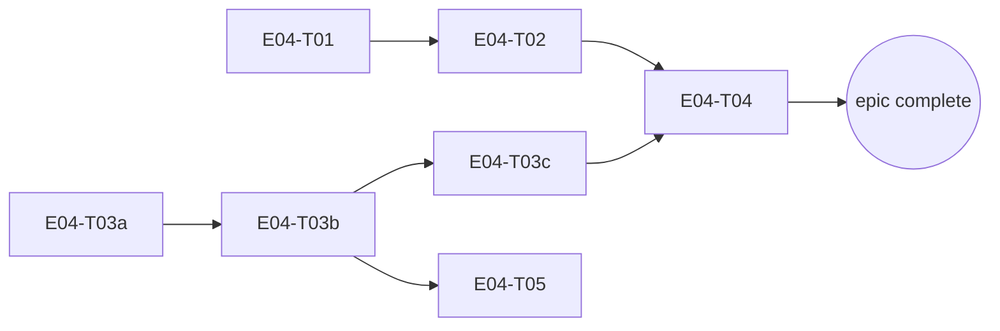

# E04 · Mesh Discovery, Relay & Dynamic Routing · Progress

**Status:** all tasks + bug fixes done, P1/P2 = 0. On-device Bluetooth
verification (E04-B04/B05/B06/B07) found and fixed four real S1 defects
that zero unit test could have caught — the fix stack for real Bluetooth
mesh delivery (connect() wired in, an accept loop added, and known-peer
connection subscriptions seeded independent of live discovery) is now
believed complete. Real-hardware two-device retest still deferred
(`OQ-E04-B06-1`) — a second physical device has not been available since
mid-session; an Android emulator cannot substitute (no real Bluetooth
Classic radio).
**Started:** 2026-08-27 · **Completed:** — · **Progress:** 10/10 tasks,
14/14 tasks+bugs

> Only the ORCHESTRATOR edits this file.

## Tasks
- [x] E04-T01 · Route/battery/latency/partition simulator · done · builder (sonnet) → reviewer (opus)
- [x] E04-T02 · Routing engine (cost/selection/migration/failure recovery) · done · builder (sonnet) → reviewer (opus) x2
- [x] E04-T03a · Pigeon transport schema + Dart facade + native loopback · done · builder (sonnet) → reviewer (opus)
- [x] E04-T03b · Real Bluetooth discovery + connect · done · builder (sonnet) → reviewer (opus)
- [x] E04-T03c · Real Bluetooth data transfer · done · builder (sonnet) → reviewer (opus)
- [x] E04-T04 · Store-and-forward relay engine · done · builder (sonnet) → reviewer (opus)
- [x] E04-T05 · Wire real discovery into Devices screen · done · builder-ui (sonnet) → reviewer (opus)
- [x] E04-B01 · Relay traffic permanently suppresses route migration (S2, P1) · done · builder (sonnet) → reviewer (opus)
- [x] E04-B02 · Forwarded relay packets retained forever (S3, P2) · done · builder (sonnet) → reviewer (opus)
- [x] E04-B03 · No production link-quality data source (S3, P2) · done · builder (sonnet) → reviewer (opus)
- [x] E04-B04 · Bluetooth discovery's `ACTION_FOUND` receiver registered with the wrong export flag (S1, P1) · done · orchestrator (sonnet) → reviewer (opus)
- [x] E04-B05 · `TransportService.connect()` had zero production callers — `RelayEngine`'s send path could never succeed against a real device (S1, P1) · done · orchestrator (sonnet) → reviewer (opus) x3
- [x] E04-B06 · `BluetoothTransport` had no server-side accept loop — `connect()` was client-only, so two real devices could never connect to each other (S1, P1) · done · orchestrator (sonnet) → reviewer (opus) x3
- [x] E04-B07 · `InboundPipeline`/`MessagingCoordinator` only subscribe to a device's connection state after discovering it THIS process run — an accepted connection from an already-known peer is silently dropped (S1, P1) · done · orchestrator (sonnet) → reviewer (opus) x2
- [ ] E04-B08 · Two real, never-manually-paired devices still cannot complete a Bluetooth Classic connection — discoverability, bonding, and (newly confirmed 2026-09-08) a peer-identity/real-MAC mismatch, all unowned (S2, priority unset) · **blocked** · 🧍 needs human `bug_priorities` scope call before any fix is attempted

**B08 note:** this is the third time this exact gap has surfaced —
`E04-B04.md` §Carried-forward #2 and `E04-B06.md`'s equivalent both flagged
"the app never makes itself discoverable" with no owner; live 2026-09-08
hardware testing (Redmi 10 2022 + Pixel 8 Pro) rediscovered it and added a
third, more specific finding (peer identity ≠ real Bluetooth MAC). Filed as
its own bug per `skills/bug-sweep`'s L-process-008 rather than left as a
third unread carried-forward note.

## Dependency graph

T01 and T03a share no files and have no dependency on each other — safe to
dispatch in parallel. T02 (needs T01) and T03b (needs T03a) are also
independent of each other — safe to run in parallel once their respective
prerequisites land. T05 only needs T03b (discovery), not the full T03c/T04
chain — can start once discovery is real, in parallel with T03c/T04.

## Review log
(none yet)

## Blocked / Frozen
(none)

## Event log (append-only)
- 2026-08-27 E04 sharded into 7 tasks (task-sharding skill), split from an
  original 5-task plan because T03 (Pigeon Bluetooth transport) would have
  been an `L` task — split into T03a (Pigeon plumbing + loopback, no
  hardware needed), T03b (real discovery/connect), T03c (real data
  transfer), per the epic's own risk mitigation ("sub-shard by transport,
  Bluetooth-only first"). OQ-E04-1 (routing cost formula) and OQ-E04-2
  (migration threshold) resolved using the recommended defaults already
  named in `epic.md` at genesis time (human decision on file, not a fresh
  ask). T03b/T03c are explicitly hardware-dependent — their own task files
  disclose that no meaningful hardware-free unit test exists and require
  honest on-device manual verification, following the same pattern E01-T01
  established for Google Sign-In's manual tap-through.
- 2026-08-27 E04-T01 implemented + reviewed: `NetworkSimulator`/
  `SimulatedLink`, seeded-random determinism, partition/heal. Reviewer
  strengthened the determinism test (was comparing 1 of 20 outcomes) and
  added directional-link coverage. Squash-merged (`0cc14ab`), 80/80 green.
  Reviewer flagged 5 API-shape notes for T02 (no `==`/`hashCode` on
  `SimulatedLink`, `tick()` has no sampling hook, per-message not
  per-byte cost, no accumulator reset).
- 2026-08-27 E04-T03a implemented + reviewed in parallel with T02: Pigeon
  schema/codegen, `TransportService` facade, native loopback. Reviewer
  found and fixed a real defect (`connect()` could hang forever if the
  native reply and the state-change event raced) — loopback's fixed delay
  had fully masked it. On-device round-trip smoke test blocked by a MIUI
  physical-tap install restriction (confirmed twice, genuinely
  unavoidable headlessly) — carried forward to T03b, which needs the same
  tap anyway. Squash-merged (`61be281`), 84/84 green.
- 2026-08-27 E04-T02 implemented + reviewed: cost formula, Dijkstra route
  selection, migration policy, failure recovery. Reviewer found a real S2
  bug (migration compared against a stale cached route cost, so a rotted
  active route was never abandoned — reproduced staying on a 90%-loss
  link for 50+ samples with a 33x-better route available) and fixed it in
  the same pass; since that broke rule 5's independence for that one fix,
  dispatched a second, independent reviewer pass that reproduced the
  falsification itself and confirmed the fix — CONFIRMED, gap closed.
  F3 (the `routes` table having no writer/reader) resolved: intentionally
  in-memory only, matching epic.md's own "ephemeral" data model note, no
  follow-up task. Squash-merged (`d0cdb55`), 99/99 green. Dispatching
  E04-T03b (needs only T03a, already merged).
- 2026-08-27 E04-T03b implemented + reviewed: real Bluetooth Classic
  discovery (BroadcastReceiver) + connect (RFCOMM socket, dedicated
  background thread, never blocks the platform thread). Reviewer verified
  the threading contract end-to-end, receiver register/unregister
  lifecycle, permission branching against the merged manifest. No blocking
  issues found. On-device round-trip still blocked (same MIUI restriction,
  third confirmation; only one physical radio reachable regardless).
  Squash-merged (`fa1cca5`), 99/99 green.
- 2026-08-27 E04-T03c implemented + reviewed (final Bluetooth piece):
  length-prefixed send/receive framing, synchronized writes, partial-
  read-safe read loop. Reviewer found send() could deadlock the platform
  thread permanently (Pigeon's send channel has no TaskQueue, so send()
  runs on the UI thread; RFCOMM writes can block indefinitely under flow
  control, and disconnect() -- the only escape hatch -- is itself a host
  call on that same blocked thread) -- bounded to 3s with teardown-on-
  timeout. Also widened an exception catch that could have killed the
  process, and fixed a thread-tracking race on fast disconnect/reconnect.
  Squash-merged (`0a8dd27`), 99/99 green. Escalated as a standing item:
  third consecutive transport task with zero real-hardware verification.
- 2026-08-27 E04-T05 implemented + reviewed: DevicesController.discover()
  wired to real TransportService discovery, routed through E02's
  EvaluateConnectionRequestUseCase. Reviewer found a real defect: the
  de-dup set permanently blacklisted device ids, so a discovered Unknown
  device -- wiped from the list by load() (called by both verify() and
  block()) since it has no Relationship row -- could never reappear
  despite real Bluetooth re-announcing it every scan cycle. Fixed: dedup
  is now an in-flight guard, not a permanent blacklist. Squash-merged
  (`8330181`), 104/104 green. Zero devices reachable this session --
  reviewer's explicit judgment: E04 must not be declared complete on
  mocked evidence alone; recommends a required human two-phone pass
  before the epic's development merge gate.
- 2026-08-27 An Android emulator became available mid-session (plus the
  human signed a real Google account into it). Used it for a real
  end-to-end smoke test on `epic_04`: build + install succeeded, app
  launched with zero crashes in logcat, and (via the accessibility tree --
  screencap itself has a rendering bug on this AVD, confirmed unrelated to
  the app) the full real Google Sign-In flow was exercised live: welcome
  screen -> "Continue with Google" -> real account picker -> consent ->
  "Signing in with Google..." -> "Signed in -- device 4122ffe0" -> /home.
  This closes E01-T01's long-open manual second-device sign-in
  verification gap as a side effect. Emulators cannot exercise real
  Bluetooth radios, so this does NOT close the T03b/T03c/T05 on-device
  Bluetooth gap above -- that still needs the physical MIUI device (or
  two real radios).
- 2026-08-27 E04-T04 implemented + reviewed (final task): `relay_packets`
  table, priority/age-ordered queue, TTL enforcement, route-failure retry.
  Reviewer confirmed FR-ROUTE-003 (payload opacity) independently -- zero
  `core/crypto` imports, zero logging primitives, byte-identical pass-
  through proven with genuinely non-message-shaped garbage bytes. No
  blocking issues, but surfaced a real spec-level contradiction (not a
  coding defect): `epic.md`/T04 §2 claims relay forwarding closes T02's
  make-before-break validation seam, but `processQueue()` forwards over
  `computeRoute()` (always cheapest known path) with no gate on
  `considerMigration`'s >=20%/>=10-sample threshold. Reviewer wrote a
  guarded fix, proved by its own regression test that it couldn't actually
  close the gap given the current greedy design, and correctly reverted
  rather than ship an unverifiable change -- routed to the bug sweep/
  planner instead of bounced back to the builder. Squash-merged
  (`7b78f6b`), 112/112 green.
  **E04 build-complete: 7/7 tasks done. Proceeding to bug sweep.**
- 2026-08-27 Bug sweep (Opus, `agent/skills/bug-sweep`) run against
  `epic_04` @ `cbc2efd`, aimed at the seams flagged during T04's review.
  Added `test/core/persistence/routing_migration_test.dart` directly
  (test-only, well-precedented pattern, no bug task needed) — proved both
  T02's v7->v8 and T04's v8->v9 migrations genuinely run `onUpgrade`, not
  just fresh-schema creation. 3 real findings:
  - **E04-B01 (S2)**: `RelayEngine._attempt` calls
    `RoutingEngine.setActiveRoute` on every forward attempt (as a
    side-channel for `onRouteFailure` link-blaming), which clears
    migration-tracking state as a side effect — reproduced empirically:
    60 samples with interleaved relay traffic, migration never fires,
    vs. 10 samples without relay traffic, migration fires exactly as
    designed. Also found T04's own §2 and `epic.md` both claim relay
    forwarding "closes T02's make-before-break seam" — false as merged,
    contradicted by T04's own §4. Root cause: a bookkeeping call meaning
    "this is the link I'm using" is read by `RoutingEngine` as "a route
    switch happened."
  - **E04-B02 (S3)**: `sweepExpired()` only reclaims `queued` packets;
    nothing ever reclaims a `relay_packets` row (or its `payload` BLOB)
    once it reaches `forwarding`/`delivered`/`expired` — a relay device
    accumulates other peers' ciphertext indefinitely, contradicting
    `epic.md`'s own "local only, ephemeral" data-model claim. (The T04
    reviewer's original "forwarding is a dead-end" worry was investigated
    and found NOT to be a defect — a different, real defect underneath it.)
  - **E04-B03 (S3)**: `RoutingEngine._knownLinks` has no production
    populator — `pigeons/transport.dart` exposes discovery/connection/
    data events but no latency/loss/RSSI signal, so on a real device
    `computeRoute()` always returns `null` and the mesh can move bytes
    point-to-point but cannot route. Not disclosed anywhere in `epic.md`;
    contradicts the epic's own analyze-report "Contract sanity" line.
  🧍 `bug_priorities` + rule-3 gates: human resolved all three —
  **B01 → P1**, fix the provable defect (separate the two signals),
  correct T04/epic.md's overclaiming docs; a full validated-migration
  probe for relay traffic explicitly declined as out of a bug fix's scope.
  **B02 → P2**, reclaim (null) the payload BLOB once a terminal-state row
  passes its own `expires_at` — no extra grace period — keep the row for
  E13 diagnostics; requires a small additive schema change (nullable
  `payload`, v9->v10).
  **B03 → P2**, extend the Pigeon schema now (`int? rssi` +
  `onLinkQuality` event) while E04 still owns the transport boundary,
  Kotlin side left genuinely unfed (no synthetic values) — E05 wires the
  native emission. Dispatching B01 and B03 in parallel (disjoint files);
  B02 serialized after B01 (both touch `relay_engine.dart`).
- 2026-08-27 E04-B03 fixed + reviewed: extended `pigeons/transport.dart`
  with `int? rssi` + `onLinkQuality` event, genuinely unfed on both sides
  (reviewer independently grepped for and confirmed zero fabricated
  values, confirmed nullable-not-defaulted on both Dart/Kotlin). `epic.md`
  gets an explicit Carry-forward entry + a qualified "Contract sanity"
  line. Squash-merged (`0198986`), 114/114 green.
- 2026-08-27 E04-B01 fixed + reviewed (the P1): `RelayEngine` no longer
  calls `setActiveRoute` per forward attempt — new `noteAttemptedRoute`/
  `_lastAttemptedRoute` separate "which link I'm using" from "a validated
  switch happened." Builder's first attempt (the task's literal
  suggestion) still failed its own regression test; diagnosed why and
  built the actual fix instead of shipping the literal suggestion.
  Reviewer independently re-derived the same failure, then found a
  second real bug in the fix itself (`setActiveRoute` didn't clear the
  new tracking map, so a stale attempted-route could survive a validated
  switch and cause wrong-link-blaming) and fixed it in the same pass.
  T04's overclaiming docs corrected. Squash-merged (`bc38b06`), 117/117
  green.
- 2026-08-27 E04-B02 fixed + reviewed (last bug): new
  `RelayEngine.reclaimPayloads()` nulls the payload BLOB of any
  terminal-state row past its own `expires_at` (schema v9->v10, nullable
  payload column, SQLite table-rebuild migration). Reviewer found a real
  blocking defect in the migration itself — the four rebuild statements
  weren't transaction-wrapped, so a crash mid-migration could either
  permanently brick the database (stale intermediate table blocking
  retry) or silently drop the entire relay store — fixed by wrapping the
  rebuild in an explicit transaction. Also added a 4th regression test
  for the `expired` terminal state (builder's three covered
  forwarding/delivered only). Squash-merged (`05aaf44`), 124/124 green.
  **P1/P2 = 0. All 10 E04 tasks/bugs done.**
  Reviewer's overall gate assessment (verbatim judgment, not code): the
  code is ready; the paperwork and hardware verification are not. Two
  concrete asks before the human gate — (1) this tracker was stale at
  review time, now corrected; (2) **T03a/T03b/T03c/T05's on-device manual
  verification boxes are still unticked** — T03b/T03c in particular have
  no hardware-free test coverage at all by their own task files' design,
  so their correctness currently rests entirely on code review and
  reasoning, never an actual physical Bluetooth round trip. This is the
  single largest real risk left in E04 and the one thing a review pass
  cannot substitute for. Retro next, then the human `epic_dev_merge`
  gate — with the on-device gap surfaced explicitly, not buried.
- 2026-09-07 E04-B04 found + fixed on real hardware: discovery's own
  `ACTION_FOUND`/`ACTION_DISCOVERY_FINISHED` broadcast receiver was
  registered `RECEIVER_NOT_EXPORTED`, silently denying the cross-process
  system broadcast — exactly the real, on-device gap the epic's own
  retro flagged as unverified. Fixed (`RECEIVER_EXPORTED`), confirmed
  live on two real devices with a genuine before/after logcat capture.
  PR #160, reviewed (opus), merged.
- 2026-09-08 E04-B05 found + fixed on real hardware, continuing
  `OQ-E06-T04-2`'s live two-device test: `TransportService.connect()` —
  fully implemented, fully reviewed (`E04-T03b`) — had zero production
  callers anywhere in `lib/`. Native `BluetoothTransport.send()` requires
  an already-open socket that nothing ever opened, so no real message
  could ever be delivered to a real peer; confirmed live (a composed
  message never arrived, zero Bluetooth-tagged logcat output on either
  device). New `ConnectionEnsuringSender` connects then sends,
  coalesced per-device. Three review rounds (all opus, all independent):
  round 1 found four production call sites still bypassing the fix
  entirely (widened via a new `MessagingStack.directSend` field, plus a
  genuine root-cause bug in `PrekeyExchange._sendControlFrame` silently
  swallowing a failed send, plus a genuine Dart `Future<Never>`
  reification bug with `.timeout()`); round 2 found the whole suite
  could not tell the fix apart from the original bug (reverting the
  ENTIRE wiring left 1335/1335 green) — fixed with two new tests that
  mock `connect` to fail and assert `send` is never reached; round 3
  independently re-verified every prior finding plus attempted its own
  additional partial-revert falsifications, **APPROVE**. PR #177 merged
  into `development`.
- 2026-09-08 E04-B06 found immediately after rebuilding/reinstalling both
  physical devices with E04-B05's merged fix: a real chat message
  (composed via the new E06-T14 Message button) reverted its own
  optimistic local echo and never persisted. `adb dumpsys
  bluetooth_manager` showed the real `connect()` attempt (now genuinely
  happening thanks to E04-B05) failing with a link-layer `Page Timeout`.
  Grepped the entire native Android source for any listen/accept
  implementation and found none — `BluetoothTransport.connect()` was, and
  always had been, purely client-side. Fixed with a new
  `ensureListening()`/`acceptLoop()` pair mirroring `connect()`'s own
  successful-path bookkeeping exactly. Three review rounds (all opus, all
  independent): round 1 found a cross-thread visibility race
  (`serverSocket`/`acceptThread` needed `@Volatile` + a conditional clear,
  mirroring `startReadLoop`'s own established pattern) and a real,
  out-of-fence Dart-side bug (filed as E04-B07); round 2 found a
  one-word invalid `status:` field on E04-B07's own task file
  (`L-process-012`) plus a scope-widening suggestion (E04-B07 also
  belongs to `MessagingCoordinator`, not just `InboundPipeline`); round 3
  **APPROVE**. PR #180 merged into `development`. Real on-device
  two-device retest deferred (`OQ-E04-B06-1`) — the second physical
  device became unavailable mid-session (human needed it back), and an
  Android emulator was confirmed unable to substitute (no real Bluetooth
  Classic radio). E04-B07 filed as `blocked`, awaiting the human
  `bug_priorities` gate before it can be dispatched.
- 2026-09-08 Human said "do what is good, do not wait for me" (standing
  extended autonomy grant). Resolved E04-B07's `bug_priorities` gate
  (severity S1 unchanged from the reviewer, priority P1) and its own
  scope Open Question (seed `trusted`/`allowed` relationships only, not
  `unknown`/`blocked`) and dispatched it. Fix: both `InboundPipeline` and
  `MessagingCoordinator` gained `_seedKnownDevices()`, called from
  `start()`, seeding a `connectionState` subscription for every
  already-known `trusted`/`allowed` device up front — reusing
  `_onDeviceDiscovered`'s own existing idempotency guard rather than
  duplicating it. No eager `connect()` anywhere. Two review rounds (both
  opus, both independent): round 1 found a real bug (a fire-and-forget
  seed could repopulate subscriptions on an already-stopped pipeline if
  `stop()` raced ahead of its own DB read, then crash on an
  already-closed stream controller) — fixed with a one-line guard plus a
  regression test reproducing the reviewer's own probe; round 2
  **APPROVE**, after independently confirming the fix via its own
  20-iteration timing probe and Dart event-loop/microtask reasoning. PR
  #182 merged into `development`. **P1/P2 = 0.** The fix stack for real
  Bluetooth mesh delivery (E04-B05 connect()-wiring + E04-B06 accept-loop
  + E04-B07 known-peer subscription seeding) is now believed complete;
  `OQ-E04-B06-1`'s real two-device retest remains the one thing only
  physical hardware can prove.
