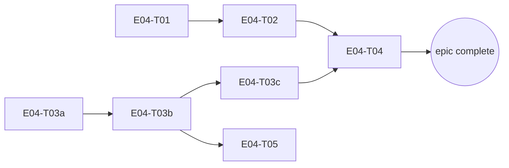

# E04 · Mesh Discovery, Relay & Dynamic Routing · Progress

**Status:** build-complete, pending bug sweep · **Started:** 2026-08-27 · **Completed:** — · **Progress:** 7/7

> Only the ORCHESTRATOR edits this file.

## Tasks
- [x] E04-T01 · Route/battery/latency/partition simulator · done · builder (sonnet) → reviewer (opus)
- [x] E04-T02 · Routing engine (cost/selection/migration/failure recovery) · done · builder (sonnet) → reviewer (opus) x2
- [x] E04-T03a · Pigeon transport schema + Dart facade + native loopback · done · builder (sonnet) → reviewer (opus)
- [x] E04-T03b · Real Bluetooth discovery + connect · done · builder (sonnet) → reviewer (opus)
- [x] E04-T03c · Real Bluetooth data transfer · done · builder (sonnet) → reviewer (opus)
- [x] E04-T04 · Store-and-forward relay engine · done · builder (sonnet) → reviewer (opus)
- [x] E04-T05 · Wire real discovery into Devices screen · done · builder-ui (sonnet) → reviewer (opus)

## Dependency graph

T01 and T03a share no files and have no dependency on each other — safe to
dispatch in parallel. T02 (needs T01) and T03b (needs T03a) are also
independent of each other — safe to run in parallel once their respective
prerequisites land. T05 only needs T03b (discovery), not the full T03c/T04
chain — can start once discovery is real, in parallel with T03c/T04.

## Review log
(none yet)

## Blocked / Frozen
(none)

## Event log (append-only)
- 2026-08-27 E04 sharded into 7 tasks (task-sharding skill), split from an
  original 5-task plan because T03 (Pigeon Bluetooth transport) would have
  been an `L` task — split into T03a (Pigeon plumbing + loopback, no
  hardware needed), T03b (real discovery/connect), T03c (real data
  transfer), per the epic's own risk mitigation ("sub-shard by transport,
  Bluetooth-only first"). OQ-E04-1 (routing cost formula) and OQ-E04-2
  (migration threshold) resolved using the recommended defaults already
  named in `epic.md` at genesis time (human decision on file, not a fresh
  ask). T03b/T03c are explicitly hardware-dependent — their own task files
  disclose that no meaningful hardware-free unit test exists and require
  honest on-device manual verification, following the same pattern E01-T01
  established for Google Sign-In's manual tap-through.
- 2026-08-27 E04-T01 implemented + reviewed: `NetworkSimulator`/
  `SimulatedLink`, seeded-random determinism, partition/heal. Reviewer
  strengthened the determinism test (was comparing 1 of 20 outcomes) and
  added directional-link coverage. Squash-merged (`0cc14ab`), 80/80 green.
  Reviewer flagged 5 API-shape notes for T02 (no `==`/`hashCode` on
  `SimulatedLink`, `tick()` has no sampling hook, per-message not
  per-byte cost, no accumulator reset).
- 2026-08-27 E04-T03a implemented + reviewed in parallel with T02: Pigeon
  schema/codegen, `TransportService` facade, native loopback. Reviewer
  found and fixed a real defect (`connect()` could hang forever if the
  native reply and the state-change event raced) — loopback's fixed delay
  had fully masked it. On-device round-trip smoke test blocked by a MIUI
  physical-tap install restriction (confirmed twice, genuinely
  unavoidable headlessly) — carried forward to T03b, which needs the same
  tap anyway. Squash-merged (`61be281`), 84/84 green.
- 2026-08-27 E04-T02 implemented + reviewed: cost formula, Dijkstra route
  selection, migration policy, failure recovery. Reviewer found a real S2
  bug (migration compared against a stale cached route cost, so a rotted
  active route was never abandoned — reproduced staying on a 90%-loss
  link for 50+ samples with a 33x-better route available) and fixed it in
  the same pass; since that broke rule 5's independence for that one fix,
  dispatched a second, independent reviewer pass that reproduced the
  falsification itself and confirmed the fix — CONFIRMED, gap closed.
  F3 (the `routes` table having no writer/reader) resolved: intentionally
  in-memory only, matching epic.md's own "ephemeral" data model note, no
  follow-up task. Squash-merged (`d0cdb55`), 99/99 green. Dispatching
  E04-T03b (needs only T03a, already merged).
- 2026-08-27 E04-T03b implemented + reviewed: real Bluetooth Classic
  discovery (BroadcastReceiver) + connect (RFCOMM socket, dedicated
  background thread, never blocks the platform thread). Reviewer verified
  the threading contract end-to-end, receiver register/unregister
  lifecycle, permission branching against the merged manifest. No blocking
  issues found. On-device round-trip still blocked (same MIUI restriction,
  third confirmation; only one physical radio reachable regardless).
  Squash-merged (`fa1cca5`), 99/99 green.
- 2026-08-27 E04-T03c implemented + reviewed (final Bluetooth piece):
  length-prefixed send/receive framing, synchronized writes, partial-
  read-safe read loop. Reviewer found send() could deadlock the platform
  thread permanently (Pigeon's send channel has no TaskQueue, so send()
  runs on the UI thread; RFCOMM writes can block indefinitely under flow
  control, and disconnect() -- the only escape hatch -- is itself a host
  call on that same blocked thread) -- bounded to 3s with teardown-on-
  timeout. Also widened an exception catch that could have killed the
  process, and fixed a thread-tracking race on fast disconnect/reconnect.
  Squash-merged (`0a8dd27`), 99/99 green. Escalated as a standing item:
  third consecutive transport task with zero real-hardware verification.
- 2026-08-27 E04-T05 implemented + reviewed: DevicesController.discover()
  wired to real TransportService discovery, routed through E02's
  EvaluateConnectionRequestUseCase. Reviewer found a real defect: the
  de-dup set permanently blacklisted device ids, so a discovered Unknown
  device -- wiped from the list by load() (called by both verify() and
  block()) since it has no Relationship row -- could never reappear
  despite real Bluetooth re-announcing it every scan cycle. Fixed: dedup
  is now an in-flight guard, not a permanent blacklist. Squash-merged
  (`8330181`), 104/104 green. Zero devices reachable this session --
  reviewer's explicit judgment: E04 must not be declared complete on
  mocked evidence alone; recommends a required human two-phone pass
  before the epic's development merge gate.
- 2026-08-27 An Android emulator became available mid-session (plus the
  human signed a real Google account into it). Used it for a real
  end-to-end smoke test on `epic_04`: build + install succeeded, app
  launched with zero crashes in logcat, and (via the accessibility tree --
  screencap itself has a rendering bug on this AVD, confirmed unrelated to
  the app) the full real Google Sign-In flow was exercised live: welcome
  screen -> "Continue with Google" -> real account picker -> consent ->
  "Signing in with Google..." -> "Signed in -- device 4122ffe0" -> /home.
  This closes E01-T01's long-open manual second-device sign-in
  verification gap as a side effect. Emulators cannot exercise real
  Bluetooth radios, so this does NOT close the T03b/T03c/T05 on-device
  Bluetooth gap above -- that still needs the physical MIUI device (or
  two real radios).
- 2026-08-27 E04-T04 implemented + reviewed (final task): `relay_packets`
  table, priority/age-ordered queue, TTL enforcement, route-failure retry.
  Reviewer confirmed FR-ROUTE-003 (payload opacity) independently -- zero
  `core/crypto` imports, zero logging primitives, byte-identical pass-
  through proven with genuinely non-message-shaped garbage bytes. No
  blocking issues, but surfaced a real spec-level contradiction (not a
  coding defect): `epic.md`/T04 §2 claims relay forwarding closes T02's
  make-before-break validation seam, but `processQueue()` forwards over
  `computeRoute()` (always cheapest known path) with no gate on
  `considerMigration`'s >=20%/>=10-sample threshold. Reviewer wrote a
  guarded fix, proved by its own regression test that it couldn't actually
  close the gap given the current greedy design, and correctly reverted
  rather than ship an unverifiable change -- routed to the bug sweep/
  planner instead of bounced back to the builder. Squash-merged
  (`7b78f6b`), 112/112 green.
  **E04 build-complete: 7/7 tasks done. Proceeding to bug sweep.**
