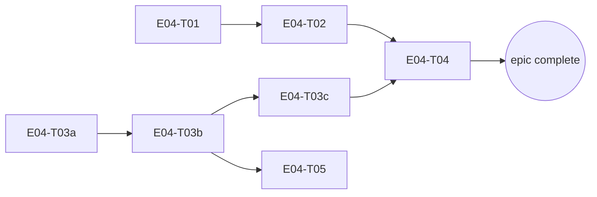

# E04 · Mesh Discovery, Relay & Dynamic Routing · Progress

**Status:** todo · **Started:** — · **Completed:** — · **Progress:** 0/7

> Only the ORCHESTRATOR edits this file.

## Tasks
- [ ] E04-T01 · Route/battery/latency/partition simulator · todo · builder (sonnet) → reviewer (opus)
- [ ] E04-T02 · Routing engine (cost/selection/migration/failure recovery) · todo · builder (sonnet) → reviewer (opus)
- [ ] E04-T03a · Pigeon transport schema + Dart facade + native loopback · todo · builder (sonnet) → reviewer (opus)
- [ ] E04-T03b · Real Bluetooth discovery + connect · todo · builder (sonnet) → reviewer (opus)
- [ ] E04-T03c · Real Bluetooth data transfer · todo · builder (sonnet) → reviewer (opus)
- [ ] E04-T04 · Store-and-forward relay engine · todo · builder (sonnet) → reviewer (opus)
- [ ] E04-T05 · Wire real discovery into Devices screen · todo · builder-ui (sonnet) → reviewer (opus)

## Dependency graph

T01 and T03a share no files and have no dependency on each other — safe to
dispatch in parallel. T02 (needs T01) and T03b (needs T03a) are also
independent of each other — safe to run in parallel once their respective
prerequisites land. T05 only needs T03b (discovery), not the full T03c/T04
chain — can start once discovery is real, in parallel with T03c/T04.

## Review log
(none yet)

## Blocked / Frozen
(none)

## Event log (append-only)
- 2026-08-27 E04 sharded into 7 tasks (task-sharding skill), split from an
  original 5-task plan because T03 (Pigeon Bluetooth transport) would have
  been an `L` task — split into T03a (Pigeon plumbing + loopback, no
  hardware needed), T03b (real discovery/connect), T03c (real data
  transfer), per the epic's own risk mitigation ("sub-shard by transport,
  Bluetooth-only first"). OQ-E04-1 (routing cost formula) and OQ-E04-2
  (migration threshold) resolved using the recommended defaults already
  named in `epic.md` at genesis time (human decision on file, not a fresh
  ask). T03b/T03c are explicitly hardware-dependent — their own task files
  disclose that no meaningful hardware-free unit test exists and require
  honest on-device manual verification, following the same pattern E01-T01
  established for Google Sign-In's manual tap-through.
