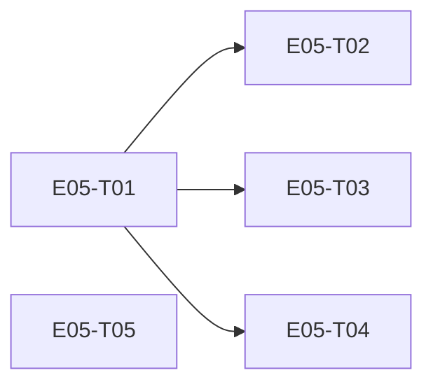

# E05 · Messaging Reliability & Multi-Device Sync · Progress

**Status:** bugs resolved, retro pending · **Started:** 2026-08-29 · **Completed:** — · **Progress:** 5/5 tasks + 3/3 bugs (B01 fixed P2, B02 deferred to E06, B03 fixed P3)

> Only the ORCHESTRATOR edits this file.

## Tasks
- [x] E05-T01 · Message domain model + delivery-state machine + tables · done · builder (sonnet) → reviewer (opus) APPROVE round 2, squash-merged 77d5b40
- [x] E05-T02 · Offline outgoing message queue · done · builder (sonnet) → reviewer (opus) APPROVE, squash-merged ea7c9fb
- [x] E05-T03 · Incoming message handling (dedup, ordering) · done · builder (sonnet) → reviewer (opus) APPROVE, squash-merged 984f83e
- [x] E05-T04 · Multi-device sync cursors · done · builder (sonnet) → reviewer (opus) APPROVE round 2, squash-merged 6b638c9
- [x] E05-T05 · Conflict resolution (security-restrictive precedence) · done · builder (sonnet) → reviewer (opus) APPROVE, squash-merged af86907

## Dependency graph

T02/T03/T04 all depend only on T01 and touch disjoint files (`domain/
send_message_use_case.dart` vs `domain/receive_message_use_case.dart` vs
`persistence/sync_tables.dart` + `domain/sync_cursor_service.dart`) — safe
to dispatch in parallel once T01 lands. T05 has no dependencies at all
(pure functions over E02's existing `RelationshipState`) — safe to
dispatch immediately, in parallel with T01.

## Review log
(none yet)

## Blocked / Frozen
(none)

## Event log (append-only)
- 2026-08-29 E05-B01 fixed (2 rounds: round 1 built the envelope seam fix,
  round 2 fixed a non-discriminating regression test + disclosed a new
  crash-window hazard), reviewed APPROVE both rounds by reviewer-opus
  (round 2 re-falsified the test independently), squash-merged to
  epic_05 (2074198). E05-B03 fixed (Option A, docs+test only), reviewed
  APPROVE, squash-merged (d3e3aa7). Human set priorities: B01=P2,
  B03=P3. E05-B02 deferred to E06 per human decision, owner named in
  its own file. P1/P2 = 0 unresolved -- epic ready for retro then the
  human merge gate.
- 2026-08-29 End-of-epic bug sweep (reviewer-opus) found 3 real seam bugs
  (baseline 245/245 tests, clean analyze) and confirmed 5 candidate
  seams as non-issues (delivery_states orphan, T02 crash-recovery
  window, OQ-E05-T04-1 gap-fill, migration v10->v11->v12 collision,
  ConflictResolver ratchet -- all correctly out of E05's scope or
  benign today). Real bugs: E05-B01 (S2, send/receive envelope seam --
  T02 never serializes the MessageEnvelope T03 requires, so nothing
  sent this epic is receivable), E05-B02 (S2, nothing drives
  RelayEngine's queue -- processQueue/sweepExpired/reclaimPayloads have
  zero callers, EARS-MSG-1's "send once a route is available" half is
  unimplemented), E05-B03 (S3, "Sent" is written on a bare local INSERT
  with no route check, task file's own §2/§3 contradict each other on
  what it means). Human decisions: B02 deferred to E06 (app-lifecycle/
  background-policy owner); B03 Option A (Sent = enqueued locally, docs
  fixed to match, no new state). B01 dispatched for a real fix
  (self-contained, no human decision needed). B03 dispatched as a
  documentation + regression-test fix per Option A.
- 2026-08-29 E05-T04 round-1 fix (guarded single-statement upsert
  replacing the read-then-write) reviewed APPROVE (reviewer-opus
  falsified independently: reverted the fix, confirmed the regression
  test fails for the exact right reason, restored, confirmed green;
  ran two additional stress probes -- 20x50 and 400 interleaved
  concurrent calls -- both clean), squash-merged to epic_05 (6b638c9).
  All 5 E05 tasks now built, reviewed, and merged to epic_05. Next:
  bug sweep across task seams, then retro, then human merge gate.
- 2026-08-29 E05-T03 built (builder-sonnet), reviewed APPROVE (reviewer-
  opus traced drift's NativeDatabase transaction-locking source itself
  to confirm the dedup-check-then-insert is genuinely serialized --
  same race class as T04's bug, but here the lock is real, backed by
  messages.id's own PRIMARY KEY as a second line of defence), squash-
  merged to epic_05 (984f83e). Non-blocking note: message_tables.dart's
  comment about deliveryState "never written directly" is about
  mutation, not row creation -- writing accepted at insert is correct.
- 2026-08-29 E05-T02 built (builder-sonnet), reviewed APPROVE (reviewer-
  opus, independently falsified the sequence_number concurrency claim
  with a 60-way concurrent probe and drift source-level analysis rather
  than trusting the passing test), squash-merged to epic_05 (ea7c9fb).
  Five non-blocking observations recorded for the epic bug sweep:
  (1) contract ambiguity between epic §2 and task §3 on what "Sent"
  means -- RelayEngine.enqueue essentially cannot fail, so Failed is
  near-dead in production; reconcile before E06 renders a Sent tick;
  (2) delivery_states (T01's transition log) is written by nobody yet;
  (3) a crash between enqueue-success and the Sent UPDATE leaves a
  Queued row nothing reconciles (correct per scope, but a real seam for
  T04/T05's future gap-fill); (4) _generateId is unique per instance
  only (consistent with already-approved RelayEngine._generateId
  precedent); (5) CryptoService.init() never being called would surface
  as the same messaging.no_session failure as a real missing session.
- 2026-08-29 E05-T05 built (builder-sonnet), reviewed APPROVE (reviewer-opus,
  independent verification of RelationshipState ordering against
  relationship.dart + FR-TRUST-004), squash-merged to epic_05 (af86907).
- 2026-08-29 E05-T01 built (builder-sonnet, resumed from an interrupted
  prior session), 180/180 tests, status review-requested; independent
  opus review found a real blocker (round 1, CHANGES): the v10->v11
  migration's createTable() does not also create the declared
  idx_messages_conversation_created_at index (drift only does this via
  createAll() on fresh installs) -- upgrading installs silently get no
  index on the keyset-paginated messages query. Fix dispatched to
  builder-sonnet.
- 2026-08-27 E05 sharded into 5 tasks (task-sharding skill). No epic-level
  Open Questions blocked sharding, but two task-level Open Questions were
  surfaced and left open rather than guessed at: OQ-E05-T02-1 (no
  prekey-bundle exchange mechanism exists anywhere yet — E01-E04 never
  built one, so real end-to-end sending is impossible until it's answered,
  likely E06's problem) and OQ-E05-T04-1 (the gap-fill protocol for
  multi-device sync isn't built — this epic only produces the cursor data
  such a mechanism would need). Both are honest scope boundaries, not
  blockers to sharding these 5 tasks, which are each independently
  buildable and testable without either gap being closed.
- 2026-08-29 E05-B01's fix (produce/consume the wire envelope on the
  send/receive seam) raised a new open question, OQ-E05-B01-1: who
  reconstructs a `CiphertextMessage` from relayed wire bytes, and how —
  `libsignal_protocol_dart` 0.8.2's `PreKeySignalMessage`/`SignalMessage`
  constructors aren't self-describing from bytes alone, and no caller in
  `lib/` builds either today. Recorded in full in `E05-B01.md` (§Open
  Questions and the source header of `receive_message_use_case.dart`), not
  yet in this tracker until now. Reviewer's own suggested cheapest fix:
  `CryptoService.encrypt` already returns a `CiphertextMessage` whose
  `getType()` is known at send time — carry that type tag alongside the
  wire bytes in E04's own relay-packet framing (if it has room), rather than
  a try-both-message-types heuristic on receive. Whoever wires a live
  transport receive path (most likely E06) needs this closed first.
