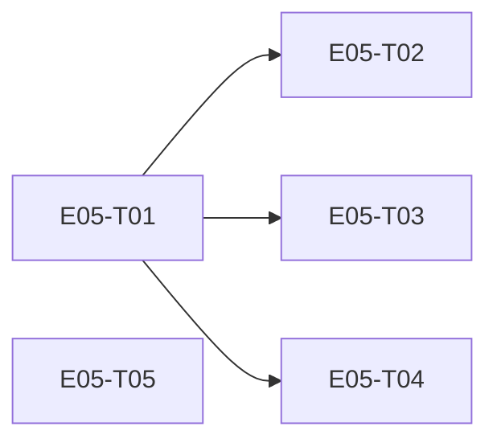

# E05 · Messaging Reliability & Multi-Device Sync · Progress

**Status:** in-progress · **Started:** 2026-08-29 · **Completed:** — · **Progress:** 3/5

> Only the ORCHESTRATOR edits this file.

## Tasks
- [x] E05-T01 · Message domain model + delivery-state machine + tables · done · builder (sonnet) → reviewer (opus) APPROVE round 2, squash-merged 77d5b40
- [x] E05-T02 · Offline outgoing message queue · done · builder (sonnet) → reviewer (opus) APPROVE, squash-merged ea7c9fb
- [ ] E05-T03 · Incoming message handling (dedup, ordering) · review-requested (224/224 tests) · builder (sonnet) → reviewer (opus, in progress)
- [ ] E05-T04 · Multi-device sync cursors · changes-requested (round 1: recordLocalProgress read-then-write race, demonstrated regressing the cursor 10->4 under concurrency) · builder (sonnet) → reviewer (opus)
- [x] E05-T05 · Conflict resolution (security-restrictive precedence) · done · builder (sonnet) → reviewer (opus) APPROVE, squash-merged af86907

## Dependency graph

T02/T03/T04 all depend only on T01 and touch disjoint files (`domain/
send_message_use_case.dart` vs `domain/receive_message_use_case.dart` vs
`persistence/sync_tables.dart` + `domain/sync_cursor_service.dart`) — safe
to dispatch in parallel once T01 lands. T05 has no dependencies at all
(pure functions over E02's existing `RelationshipState`) — safe to
dispatch immediately, in parallel with T01.

## Review log
(none yet)

## Blocked / Frozen
(none)

## Event log (append-only)
- 2026-08-29 E05-T02 built (builder-sonnet), reviewed APPROVE (reviewer-
  opus, independently falsified the sequence_number concurrency claim
  with a 60-way concurrent probe and drift source-level analysis rather
  than trusting the passing test), squash-merged to epic_05 (ea7c9fb).
  Five non-blocking observations recorded for the epic bug sweep:
  (1) contract ambiguity between epic §2 and task §3 on what "Sent"
  means -- RelayEngine.enqueue essentially cannot fail, so Failed is
  near-dead in production; reconcile before E06 renders a Sent tick;
  (2) delivery_states (T01's transition log) is written by nobody yet;
  (3) a crash between enqueue-success and the Sent UPDATE leaves a
  Queued row nothing reconciles (correct per scope, but a real seam for
  T04/T05's future gap-fill); (4) _generateId is unique per instance
  only (consistent with already-approved RelayEngine._generateId
  precedent); (5) CryptoService.init() never being called would surface
  as the same messaging.no_session failure as a real missing session.
- 2026-08-29 E05-T05 built (builder-sonnet), reviewed APPROVE (reviewer-opus,
  independent verification of RelationshipState ordering against
  relationship.dart + FR-TRUST-004), squash-merged to epic_05 (af86907).
- 2026-08-29 E05-T01 built (builder-sonnet, resumed from an interrupted
  prior session), 180/180 tests, status review-requested; independent
  opus review found a real blocker (round 1, CHANGES): the v10->v11
  migration's createTable() does not also create the declared
  idx_messages_conversation_created_at index (drift only does this via
  createAll() on fresh installs) -- upgrading installs silently get no
  index on the keyset-paginated messages query. Fix dispatched to
  builder-sonnet.
- 2026-08-27 E05 sharded into 5 tasks (task-sharding skill). No epic-level
  Open Questions blocked sharding, but two task-level Open Questions were
  surfaced and left open rather than guessed at: OQ-E05-T02-1 (no
  prekey-bundle exchange mechanism exists anywhere yet — E01-E04 never
  built one, so real end-to-end sending is impossible until it's answered,
  likely E06's problem) and OQ-E05-T04-1 (the gap-fill protocol for
  multi-device sync isn't built — this epic only produces the cursor data
  such a mechanism would need). Both are honest scope boundaries, not
  blockers to sharding these 5 tasks, which are each independently
  buildable and testable without either gap being closed.
