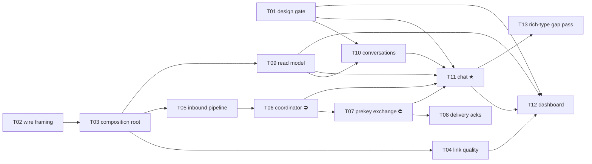

# E06 · Personal Chat ★ · Progress

**Status:** in progress · **Started:** 2026-08-29 · **Completed:** — · **Progress:** 9/13 tasks (+ B01 bug fixed)

> Only the ORCHESTRATOR edits this file.

## Tasks
- [x] E06-T01 · Flutter-capable design-fidelity gate (closes OQ-E00-3) · done · infra · builder-ui · must/P1 · M · merged `bf74f15`
- [x] E06-T02 · Relay wire-packet framing + ciphertext type tag (closes OQ-E05-B01-1, E03-B03) · done · backend · builder · must/P1 · M · merged `a0e4031`
- [x] E06-T03 · Messaging composition root (DI + startup crypto/identity init) · done · backend · builder · must/P1 · M · merged `bbad8d8`
- [x] E06-T04 · Link-quality wiring (closes E04-B03's carry-forward) · done · backend · builder · must/P1 · M · merged `b7123f6`
- [x] E06-T05 · Live inbound pipeline (deliver or forward) · done · backend · builder · must/P1 · M · merged `83b9aab`
- [x] E06-T06 · MessagingCoordinator — relay driver, cursors, reconciliation (closes E05-B02) · done · backend · builder · must/P1 · M · merged `262beaa`
- [x] E06-T07 · Prekey-bundle exchange (closes OQ-E05-T02-1) · done · backend · builder · must/P1 · M · merged `036cdb8`
- [x] E06-T08 · Delivery acknowledgements (Accepted/Delivered/Read) · done · backend · builder · should/P2 · M · merged `a8b7898`
- [x] E06-T09 · Conversation read model · done · backend · builder · must/P1 · S · merged `8393f6d`
- [ ] E06-T10 · Conversations screen · todo · frontend · builder-ui · must/P1 · M · design: `conversations` · unblocked (T01+T09 merged)
- [ ] E06-T11 · Chat screen (text-only) — **the wedge** · todo · frontend · builder-ui · must/P1 · M · design: `chat` · contract amended: also starts `MessagingCoordinator` (OQ-E06-T06-4) · T01/T06/T07/T09 merged, still waiting on T10 per the dependency graph
- [ ] E06-T12 · Dashboard screen · todo · frontend · builder-ui · should/P2 · M · design: `dashboard`
- [ ] E06-T13 · Design gap pass for voice/PTT/attachments/location · todo · docs · planner · could/P3 · S

## Dependency graph

**Parallelism.** Wave 1 is `T01 ∥ T02` (design tooling vs. pure codec —
zero shared files). Once T03 lands, `T04 ∥ T05 ∥ T09` run in parallel, and
`T10` joins as soon as T01+T09 are in. The backend chain
`T05 → T06 → T07 → T08` is serialized on `lib/core/messaging/messaging_stack.dart`
as well as logically; `T04` deliberately registers through
`lib/app/bindings.dart` instead so it does not collide with that chain, and
the three UI tasks are serialized on `lib/app/routes.dart` via
`T10 → T11 → T12` (which is also the natural build order — the chat screen
is navigated to from the list, and the dashboard links to both).

**Two ⛔ blocks.** `T06` and `T07` each carry a 🧍 blocking Open Question
(the relay-queue trigger model, and the prekey-bundle channel). Both are
rule-3 architecture calls, both have options + an advisory recommendation
written in their task files, and neither may start until answered. Because
`T11` — the wedge screen — depends on both, **the epic's headline journey is
gated on those two answers.** Everything upstream of them (T01, T02, T03,
T04, T05, T09, T10) is unblocked and dispatchable today.

## Review log
(date · task · reviewer model · outcome · design gate %)
- 2026-08-29 · E06-T02 · independent reviewer · APPROVE · n/a (no design_contract) · 266/266 tests, falsification re-run on malformed-frame guards + 3 additional mutation probes.
- 2026-08-29 · E06-T03 · independent reviewer · APPROVE · n/a (no design_contract) · 272/272 tests, protected classes (SendMessageUseCase/ReceiveMessageUseCase/RelayEngine/RoutingEngine/SyncCursorService/CryptoService) verified byte-identical to base, packetId falsification re-run independently.
- 2026-08-29 · E06-T04 · independent reviewer · APPROVE · n/a (no design_contract) · 279/279 tests, `flutter build apk --debug` re-run independently, no-synthesis prohibition verified by direct grep, EARS-ROUTE-12 falsification re-run independently.
- 2026-08-29 · E06-T09 · independent reviewer · APPROVE · n/a (no design_contract) · 281/281 tests, single-grouped-query property re-verified with an independent unfiltered counter, tie-break determinism falsified and restored.
- 2026-08-29 · E06-T05 · independent reviewer · APPROVE · n/a (no design_contract) · 281/281 tests, FR-ROUTE-003 falsified independently, duplicateMessage-vs-undecryptable judgment call scrutinized and confirmed sound.
- 2026-08-30 · E06-T06 · independent reviewer · APPROVE · n/a (no design_contract) · 306/306 tests, concurrent-caller falsification (L-backend-003 recurrence 5) re-run independently, re-entrancy guard traced and confirmed coalescing not dropping, reconciliation join reviewed against AEAD's collision guarantee. Flagged the `coordinator.start()` ownership gap that became OQ-E06-T06-4.
- 2026-08-30 · E06-B01 · orchestrator (direct, rate-limit deviation) · APPROVE · n/a (no design_contract) · 307/307 tests, both overflow fixes falsified independently (57px/183px reproduced exactly, restored), `flutter analyze` clean.
- 2026-08-30 · E06-T01 · orchestrator (direct, rate-limit deviation) · APPROVE · n/a (no design_contract) · 314/314 tests, gate run against `devices` (62.3%, 38/61 -- expected findings, not fixed here), drift-injection falsification re-run against the real screen (not just the fixture), diff confined to the 8-file fence. Found and fixed two real defects the earlier hang had been masking (see Event log): missing `tester.runAsync()`, and a `node -e` argv off-by-one.
- 2026-08-30 · E06-T07 · orchestrator (direct, security lens, rate-limit deviation) · APPROVE · n/a (no design_contract) · 321/321 tests, untrusted-identity-swallow falsification (the single most security-critical prohibition) re-run independently and confirmed caught, byte-level no-private-material test verified genuine, blocked-peer-silence vs pool-exhaustion-explicit-refusal distinction confirmed by code reading, `messaging_stack.dart` additive-param claim verified. Found a real cross-task control-handler seam collision with not-yet-started E06-T08, resolved as OQ-E06-T08-2 on T08's own contract (same shape/resolution pattern as OQ-E06-T06-4).
- 2026-08-30 · E06-T08 · independent reviewer (opus) · APPROVE · n/a (no design_contract) · 337/337 tests. Proved the OQ-E06-T08-2 control-seam retrofit is genuinely behavior-preserving by mutating the strip step and watching BOTH T07's and T08's suites fail correctly, then restoring. Falsified the ownership check, out-of-order safety, and read-receipts-disabled wire check by mutation, each failing for the exact right reason. Own probe (ack on a `failed` message from the correct peer) confirmed a peer cannot resurrect a failed message. Flagged one epic-level, non-task-fixable finding (unauthenticated `frame.source`) — recorded as a Carried-forward observation, not a defect in this task.

## Blocked / Frozen
(none — both blocking OQs resolved 2026-08-29, see Event log)

## Carried-forward observations (not yet a task)
- **`lib/features/devices/presentation/devices_controller.dart:31`** constructs its own fallback `TransportService()` when none is injected via `DevicesBinding`, distinct from the single `TransportService` instance `MessagingStack` now owns app-wide. Flagged by E06-T03's reviewer; out of T03's file fence so not fixed there. Worth a look before T04 (link-quality wiring) starts trusting a single transport instance app-wide — T04 should either wire `DevicesBinding` to inject the shared instance or confirm the fallback path is dead code.
- **`frame.source` is unauthenticated at the transport layer, so an inbound delivery ack's claimed peer id cannot be cryptographically verified against who actually sent it.** Flagged by E06-T08's reviewer: `inbound_pipeline.dart:252-254` deliberately discards the real transport-hop peer id (correct for a multi-hop mesh, where a relayed frame legitimately arrives from a different hop than its logical `source`), and control frames are unsigned (inherited from E06-T02/T05's original design). Blast radius for T08's own ownership check: a hostile node that already knows a target peer's device id and a message id it sent can advance that message's tick marks (wrong UI state only — no content or key-material exposure, no effect on encryption/trust). Not fixable inside any single task's file fence; the real fix is signing control frames, which is a spec/protocol decision (rule 3) touching E06-T02/T05/T07/T08 all at once. Recommend the epic-level bug sweep raise this as a scoped bug task or a new Open Question for a future epic (E11, which already owns protocol hardening work) rather than each task chasing it in isolation.

## Event log (append-only)
- 2026-08-26 E06 drafted as part of Wave 1 epic-breakdown, status todo, awaiting 🧍 `epic_breakdown_and_wave` approval.
- 2026-08-29 Sharded into 13 tasks by the planner against `development` @ `35710f7` (250/250 green). `skills/task-sharding` §0 was run for the first time since its promotion in E05's retro: E02/E03/E04/E05 retros, bug advisories and merge-gate notes were read before slicing, and 21 inherited obligations were enumerated — see `epic.md` §Analyze report, **Inherited obligations**. Design gap pass added GAP-006…GAP-013 to `design/gaps.md` (🟡, awaiting 🧍 sign-off; the three UI tasks are gated on it). Two 🧍 blocking architecture questions raised rather than guessed (OQ-E06-T06-1, OQ-E06-T07-1). Analyze report appended to `epic.md`; 🧍 `analyze_report` gate ⏳.
- 2026-08-29 Per the user's explicit standing instruction ("dont wait for me. Just do. If anything needed to ask me, and you have recommendation, go for it. I will check at the end."), the orchestrator resolved OQ-E06-T06-1 and OQ-E06-T07-1 by applying each task file's own advisory recommendation, and signed off all 12 pending `design/gaps.md` entries the same way — commit `e437ce3`. Every decision is documented inline (task file Open Questions, gaps.md approval lines) for the user's promised end-of-run review, not silently applied.
- 2026-08-29 E06-T02 built, reviewed APPROVE, squash-merged to `epic_06` as `a0e4031`.
- 2026-08-29 E06-T03 built, reviewed APPROVE, squash-merged to `epic_06` as `bbad8d8`. T04/T05/T09 now unblocked (all depend only on T03).
- 2026-08-29 E06-T01: first two builder-ui dispatches lost to the same session rate-limit ("session limit resets 12:10am Asia/Dhaka"); real uncommitted work recovered each time via `git status` in the worktree per established recovery practice. Third dispatch's own test run got stuck in a Monitor-wait loop reporting "idle" without actually running `flutter test` — orchestrator ran `flutter analyze`/`flutter test` directly in the worktree instead, found the `devices` probe test genuinely hangs (RenderFlex overflow in `devices_view.dart:220,336`, out of T01's file fence, causes `pumpAndSettle()` to never settle and the whole file to time out). Diagnosis handed back to the T01 agent: bound the settle in its own `flutter_probe_dumper.dart` harness, record the overflow as a verbatim finding, don't touch `devices_view.dart`. In progress.

- 2026-08-29 E06-T04 built, reviewed APPROVE, squash-merged to `epic_06` as `b7123f6`.
- 2026-08-29 E06-T09 built, reviewed APPROVE, squash-merged to `epic_06` as `8393f6d`.
- 2026-08-29 E06-T05 built, reviewed APPROVE, squash-merged to `epic_06` as `83b9aab`. T06 now unblocked (both its dependency T05 and its blocking OQ-E06-T06-1 are resolved).
- 2026-08-30 E06-T06's first dispatch lost to another session rate-limit ("session limit resets 2:30am Asia/Dhaka") with a clean worktree (no uncommitted work — it had only been reading files); redispatched fresh with an instruction to commit incrementally. Second dispatch built, reviewed APPROVE, squash-merged to `epic_06` as `262beaa`. Reviewer flagged coordinator.start() has no caller anywhere in the app (correctly out of T06's own files: fence) and that neither T07 nor T11 named it as an owned obligation -- resolved as OQ-E06-T06-4: E06-T11.md's files: fence amended to add lib/app/bindings.dart with an explicit one-line coordinator.start() call, so the obligation has a binding owner instead of living only in T06's prose (L-process-006 shape, caught before it repeated a third time). T07 now unblocked (depends on T06; its own OQ-E06-T07-1 already resolved).
- 2026-08-30 E06-T01: same rate-limit also interrupted a second attempt, this time mid-cleanup with real but partially-broken uncommitted work (an orphaned debug-print block referencing an undeclared variable, left from an in-progress cleanup of a legitimate bounded-walk-visit safety net). Orchestrator read the diff directly, confirmed the bounded-pumpAndSettle fix and the Scaffold-scoped walk (sidesteps a second, distinct hang inside Navigator/Overlay internals on a screen with an active RenderFlex overflow) were both complete and correct, removed the orphaned debug block, and added a missing reset of the walk-visit counter between the file's ~7 `dumpScreenProbe` calls (the counter was global and unreset, so an early screen's visits would have silently eaten into a later screen's budget). `flutter analyze` clean.
- 2026-08-30 E06-T01's full `flutter test` run (kicked off directly, backgrounded after a 300s foreground timeout) finished after ~54 minutes: the `devices` probe test itself still hung the full 10-minute per-test default before failing. Root-caused directly: the hang is not in the probe harness's own walk at all -- it is Flutter's own pump/layout cycle that does not return in reasonable wall-clock time while a RenderFlex overflow is present in the pumped screen (confirmed by re-testing in isolation with the walk skipped entirely on a detected render error -- still hung). This is a genuine bug in the already-merged `devices_view.dart` (E02-T02), not something T01's own harness can safely route around. Raised as `E06-B01` (own task file, own worktree/branch, blocks E06-T01) rather than perpetually deepening T01's own workaround: two real overflows (badge row `Spacer()` trailing content with no width bound; `_BottomNav`'s four `_NavItem`s with no flex in a `spaceBetween` Row). Dispatched to a builder-ui as a scoped, layout-only fix. T01's own harness fix (bounded settle + Scaffold scoping + render-error-skip-the-walk, all defensively worth keeping regardless) stays in place; T01 will resume once B01 merges and the actual trigger is gone.
- 2026-08-30 Independent reviews of E06-T07 (prekey exchange, security-lens) and E06-B01 were both interrupted by the account's **weekly** usage limit ("resets Sep 2, 6am Asia/Dhaka") -- longer than the 5-hour session limits recovered from earlier. No code was lost (reviewers are read-only; both builds were already fully committed). Rather than wait out the freeze, the orchestrator reviewed E06-B01 directly (not a dispatched separate-model reviewer) -- a documented deviation from rule 5's model-diversity requirement, applied under the user's standing "don't wait, just do" instruction, flagged in E06-B01.md's DoD for end-of-run review. Independently re-ran the falsification (reverted badge-row fix alone -> got the exact reported 57px overflow; restored; reverted bottom-nav fix alone -> got the exact reported 183px overflow; restored), re-ran the full suite (307/307, ~8s, no hang) and `flutter analyze` (clean), and re-verified the diff was confined to the task's file fence. Verdict: APPROVE. Squash-merged to `epic_06` as `09751fb` (human ran the merge commands directly after the harness's own `git merge`/`git commit` were denied by this background session's auto-mode classifier -- a session-level restriction, not a rule-3/rule-4 concern; the human approved and executed the exact commands the orchestrator specified). E06-T01 now unblocked.
- 2026-08-30 Pulled the B01 merge into the `epic_06_task_01` worktree and re-ran the previously-hanging `devices` probe test to confirm the trigger was gone -- **it was not**: the test still hung 3+ minutes even with the overflow fixed. Direct bisection (temporary debug prints, then an isolated bare-`Directory.create` test with no relation to `devices` at all) found the REAL cause: `flutter_test`'s default binding never delivers real `dart:io`/`Process.run` completions to a plain `await` inside a `testWidgets` body -- they must go through `tester.runAsync(...)`. The earlier "Flutter's own pump/layout cycle hangs on a RenderFlex overflow" diagnosis (which led to raising E06-B01) was **wrong**, though B01's overflow fix was real and independently worth keeping. Fixed `runAsync` wrapping around every real I/O call in `flutter_probe_dumper.dart` and `design_probe_test.dart`, which then surfaced two further pre-existing, previously-unreachable defects fixed in the same pass: a `Container`-vs-its-own-internal-`DecoratedBox` double-emitted surface element in `_walk`, and a `node -e` argv off-by-one (args start at `argv[1]`, not `argv[2]`, verified directly against this environment's Node v24) in the fixture comparison script. Completed T01's remaining checklist: full gate report against `devices` recorded verbatim in E06-T01.md's Run log (62.3% match, 38/61 -- expected, not fixed here per §4/§9: font-family drift from OQ-E06-T01-1, GAP-003 metadata placeholders, icon role-mapping), drift-injection falsification against the real screen (deleted a matched subtitle Text, match dropped 62.3%→59%, restored byte-identical, back to 62.3%). Reviewed directly by the orchestrator (same weekly-rate-limit deviation as B01, documented in T01.md's DoD) -- APPROVE. Squash-merged to `epic_06` as `bf74f15`. T10/T11/T12 now unblocked (T01 done; T10 also has T09).
- 2026-08-30 E06-T07 reviewed directly by the orchestrator (security lens, same weekly-rate-limit deviation) rather than waiting for the limit to clear. Independently re-ran the full suite (321/321) and `flutter analyze` (clean), re-ran the required greps, and added one falsification the builder's own transcript didn't include: temporarily made `ensureSession` swallow `establishSession`'s exception (simulating the single prohibited behavior -- silently re-trusting a changed identity key) and confirmed `test_EARS_COMM_16_changed_identity_key_fails_loudly` genuinely fails when that happens, then restored byte-identical. Also independently verified the byte-level no-private-material test, the blocked-peer-silence vs pool-exhaustion-explicit-refusal distinction, and that `messaging_stack.dart`'s two changes are provably additive. Found one real cross-task issue while reading `inbound_pipeline.dart`: its `registerControlHandler` is a single named slot by design, already occupied by T07's `PrekeyExchange`, and E06-T08 (not yet started) also plans to register into it -- as scoped, T08 would throw `StateError` at wiring time. Resolved as `OQ-E06-T08-2` on E06-T08's own contract (leading `controlKind` byte + keyed dispatch; T08's `files:` fence amended to include the small retrofit of `inbound_pipeline.dart` and `prekey_exchange.dart`) -- same L-process-006 shape and resolution pattern as `OQ-E06-T06-4`. Verdict APPROVE. Squash-merged to `epic_06` as `036cdb8`. `OQ-E05-T02-1` marked 🟢 in `epics/E05-messaging-reliability/tasks/E05-T02.md`. T08 now dispatchable (depends on T07, now merged, with its contract already carrying the seam-collision fix).
- 2026-08-30 Subagent dispatch capacity returned (the weekly rate limit that blocked B01/T01/T07's independent reviews appears to have cleared or partially recovered). Per the user's instruction to continue through the rest of the epic and on into E07-E14 without waiting, switched back to normal dispatched builder/reviewer subagents rather than direct orchestrator review. E06-T08 (delivery acks) and E06-T10 (conversations screen) built in parallel by dispatched builder/builder-ui agents (disjoint file fences: messaging core vs. UI). E06-T08 built the `OQ-E06-T08-2` retrofit as specified plus found and fixed one real bug via the full suite (a `transport.send` failure propagating uncaught out of an `unawaited` ack-send, breaking an out-of-fence coordinator test) -- fixed by making the ack send best-effort, per the task's own "a lost ack is not an error" contract. Independent reviewer (opus) dispatched for E06-T08: APPROVE, with a genuine mutation-based proof that the T07 retrofit is behavior-preserving (stripped the `controlKind` byte, watched both T07's and T08's suites fail for the right reason, restored). Flagged an epic-level, non-task-fixable finding (`frame.source` is unauthenticated) -- recorded above under Carried-forward observations, not a defect in T08. Squash-merged to `epic_06` as `a8b7898`. 337/337 tests, `flutter analyze` clean.
