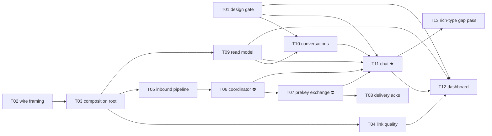

# E06 · Personal Chat ★ · Progress

**Status:** in progress · **Started:** 2026-08-29 · **Completed:** — · **Progress:** 6/13 tasks

> Only the ORCHESTRATOR edits this file.

## Tasks
- [ ] E06-T01 · Flutter-capable design-fidelity gate (closes OQ-E00-3) · in progress · infra · builder-ui · must/P1 · M
- [x] E06-T02 · Relay wire-packet framing + ciphertext type tag (closes OQ-E05-B01-1, E03-B03) · done · backend · builder · must/P1 · M · merged `a0e4031`
- [x] E06-T03 · Messaging composition root (DI + startup crypto/identity init) · done · backend · builder · must/P1 · M · merged `bbad8d8`
- [x] E06-T04 · Link-quality wiring (closes E04-B03's carry-forward) · done · backend · builder · must/P1 · M · merged `b7123f6`
- [x] E06-T05 · Live inbound pipeline (deliver or forward) · done · backend · builder · must/P1 · M · merged `83b9aab`
- [x] E06-T06 · MessagingCoordinator — relay driver, cursors, reconciliation (closes E05-B02) · done · backend · builder · must/P1 · M · merged `262beaa`
- [ ] E06-T07 · Prekey-bundle exchange (closes OQ-E05-T02-1) · todo · backend · builder · must/P1 · M · unblocked, OQ-E06-T07-1 resolved by recommendation (`e437ce3`)
- [ ] E06-T08 · Delivery acknowledgements (Accepted/Delivered/Read) · todo · backend · builder · should/P2 · M
- [x] E06-T09 · Conversation read model · done · backend · builder · must/P1 · S · merged `8393f6d`
- [ ] E06-T10 · Conversations screen · todo · frontend · builder-ui · must/P1 · M · design: `conversations`
- [ ] E06-T11 · Chat screen (text-only) — **the wedge** · todo · frontend · builder-ui · must/P1 · M · design: `chat` · contract amended: also starts `MessagingCoordinator` (OQ-E06-T06-4)
- [ ] E06-T12 · Dashboard screen · todo · frontend · builder-ui · should/P2 · M · design: `dashboard`
- [ ] E06-T13 · Design gap pass for voice/PTT/attachments/location · todo · docs · planner · could/P3 · S

## Dependency graph

**Parallelism.** Wave 1 is `T01 ∥ T02` (design tooling vs. pure codec —
zero shared files). Once T03 lands, `T04 ∥ T05 ∥ T09` run in parallel, and
`T10` joins as soon as T01+T09 are in. The backend chain
`T05 → T06 → T07 → T08` is serialized on `lib/core/messaging/messaging_stack.dart`
as well as logically; `T04` deliberately registers through
`lib/app/bindings.dart` instead so it does not collide with that chain, and
the three UI tasks are serialized on `lib/app/routes.dart` via
`T10 → T11 → T12` (which is also the natural build order — the chat screen
is navigated to from the list, and the dashboard links to both).

**Two ⛔ blocks.** `T06` and `T07` each carry a 🧍 blocking Open Question
(the relay-queue trigger model, and the prekey-bundle channel). Both are
rule-3 architecture calls, both have options + an advisory recommendation
written in their task files, and neither may start until answered. Because
`T11` — the wedge screen — depends on both, **the epic's headline journey is
gated on those two answers.** Everything upstream of them (T01, T02, T03,
T04, T05, T09, T10) is unblocked and dispatchable today.

## Review log
(date · task · reviewer model · outcome · design gate %)
- 2026-08-29 · E06-T02 · independent reviewer · APPROVE · n/a (no design_contract) · 266/266 tests, falsification re-run on malformed-frame guards + 3 additional mutation probes.
- 2026-08-29 · E06-T03 · independent reviewer · APPROVE · n/a (no design_contract) · 272/272 tests, protected classes (SendMessageUseCase/ReceiveMessageUseCase/RelayEngine/RoutingEngine/SyncCursorService/CryptoService) verified byte-identical to base, packetId falsification re-run independently.
- 2026-08-29 · E06-T04 · independent reviewer · APPROVE · n/a (no design_contract) · 279/279 tests, `flutter build apk --debug` re-run independently, no-synthesis prohibition verified by direct grep, EARS-ROUTE-12 falsification re-run independently.
- 2026-08-29 · E06-T09 · independent reviewer · APPROVE · n/a (no design_contract) · 281/281 tests, single-grouped-query property re-verified with an independent unfiltered counter, tie-break determinism falsified and restored.
- 2026-08-29 · E06-T05 · independent reviewer · APPROVE · n/a (no design_contract) · 281/281 tests, FR-ROUTE-003 falsified independently, duplicateMessage-vs-undecryptable judgment call scrutinized and confirmed sound.
- 2026-08-30 · E06-T06 · independent reviewer · APPROVE · n/a (no design_contract) · 306/306 tests, concurrent-caller falsification (L-backend-003 recurrence 5) re-run independently, re-entrancy guard traced and confirmed coalescing not dropping, reconciliation join reviewed against AEAD's collision guarantee. Flagged the `coordinator.start()` ownership gap that became OQ-E06-T06-4.

## Blocked / Frozen
(none — both blocking OQs resolved 2026-08-29, see Event log)

## Carried-forward observations (not yet a task)
- **`lib/features/devices/presentation/devices_controller.dart:31`** constructs its own fallback `TransportService()` when none is injected via `DevicesBinding`, distinct from the single `TransportService` instance `MessagingStack` now owns app-wide. Flagged by E06-T03's reviewer; out of T03's file fence so not fixed there. Worth a look before T04 (link-quality wiring) starts trusting a single transport instance app-wide — T04 should either wire `DevicesBinding` to inject the shared instance or confirm the fallback path is dead code.

## Event log (append-only)
- 2026-08-26 E06 drafted as part of Wave 1 epic-breakdown, status todo, awaiting 🧍 `epic_breakdown_and_wave` approval.
- 2026-08-29 Sharded into 13 tasks by the planner against `development` @ `35710f7` (250/250 green). `skills/task-sharding` §0 was run for the first time since its promotion in E05's retro: E02/E03/E04/E05 retros, bug advisories and merge-gate notes were read before slicing, and 21 inherited obligations were enumerated — see `epic.md` §Analyze report, **Inherited obligations**. Design gap pass added GAP-006…GAP-013 to `design/gaps.md` (🟡, awaiting 🧍 sign-off; the three UI tasks are gated on it). Two 🧍 blocking architecture questions raised rather than guessed (OQ-E06-T06-1, OQ-E06-T07-1). Analyze report appended to `epic.md`; 🧍 `analyze_report` gate ⏳.
- 2026-08-29 Per the user's explicit standing instruction ("dont wait for me. Just do. If anything needed to ask me, and you have recommendation, go for it. I will check at the end."), the orchestrator resolved OQ-E06-T06-1 and OQ-E06-T07-1 by applying each task file's own advisory recommendation, and signed off all 12 pending `design/gaps.md` entries the same way — commit `e437ce3`. Every decision is documented inline (task file Open Questions, gaps.md approval lines) for the user's promised end-of-run review, not silently applied.
- 2026-08-29 E06-T02 built, reviewed APPROVE, squash-merged to `epic_06` as `a0e4031`.
- 2026-08-29 E06-T03 built, reviewed APPROVE, squash-merged to `epic_06` as `bbad8d8`. T04/T05/T09 now unblocked (all depend only on T03).
- 2026-08-29 E06-T01: first two builder-ui dispatches lost to the same session rate-limit ("session limit resets 12:10am Asia/Dhaka"); real uncommitted work recovered each time via `git status` in the worktree per established recovery practice. Third dispatch's own test run got stuck in a Monitor-wait loop reporting "idle" without actually running `flutter test` — orchestrator ran `flutter analyze`/`flutter test` directly in the worktree instead, found the `devices` probe test genuinely hangs (RenderFlex overflow in `devices_view.dart:220,336`, out of T01's file fence, causes `pumpAndSettle()` to never settle and the whole file to time out). Diagnosis handed back to the T01 agent: bound the settle in its own `flutter_probe_dumper.dart` harness, record the overflow as a verbatim finding, don't touch `devices_view.dart`. In progress.

- 2026-08-29 E06-T04 built, reviewed APPROVE, squash-merged to `epic_06` as `b7123f6`.
- 2026-08-29 E06-T09 built, reviewed APPROVE, squash-merged to `epic_06` as `8393f6d`.
- 2026-08-29 E06-T05 built, reviewed APPROVE, squash-merged to `epic_06` as `83b9aab`. T06 now unblocked (both its dependency T05 and its blocking OQ-E06-T06-1 are resolved).
- 2026-08-30 E06-T06's first dispatch lost to another session rate-limit ("session limit resets 2:30am Asia/Dhaka") with a clean worktree (no uncommitted work — it had only been reading files); redispatched fresh with an instruction to commit incrementally. Second dispatch built, reviewed APPROVE, squash-merged to `epic_06` as `262beaa`. Reviewer flagged coordinator.start() has no caller anywhere in the app (correctly out of T06's own files: fence) and that neither T07 nor T11 named it as an owned obligation -- resolved as OQ-E06-T06-4: E06-T11.md's files: fence amended to add lib/app/bindings.dart with an explicit one-line coordinator.start() call, so the obligation has a binding owner instead of living only in T06's prose (L-process-006 shape, caught before it repeated a third time). T07 now unblocked (depends on T06; its own OQ-E06-T07-1 already resolved).
- 2026-08-30 E06-T01: same rate-limit also interrupted a second attempt, this time mid-cleanup with real but partially-broken uncommitted work (an orphaned debug-print block referencing an undeclared variable, left from an in-progress cleanup of a legitimate bounded-walk-visit safety net). Orchestrator read the diff directly, confirmed the bounded-pumpAndSettle fix and the Scaffold-scoped walk (sidesteps a second, distinct hang inside Navigator/Overlay internals on a screen with an active RenderFlex overflow) were both complete and correct, removed the orphaned debug block, and added a missing reset of the walk-visit counter between the file's ~7 `dumpScreenProbe` calls (the counter was global and unreset, so an early screen's visits would have silently eaten into a later screen's budget). `flutter analyze` clean.
- 2026-08-30 E06-T01's full `flutter test` run (kicked off directly, backgrounded after a 300s foreground timeout) finished after ~54 minutes: the `devices` probe test itself still hung the full 10-minute per-test default before failing. Root-caused directly: the hang is not in the probe harness's own walk at all -- it is Flutter's own pump/layout cycle that does not return in reasonable wall-clock time while a RenderFlex overflow is present in the pumped screen (confirmed by re-testing in isolation with the walk skipped entirely on a detected render error -- still hung). This is a genuine bug in the already-merged `devices_view.dart` (E02-T02), not something T01's own harness can safely route around. Raised as `E06-B01` (own task file, own worktree/branch, blocks E06-T01) rather than perpetually deepening T01's own workaround: two real overflows (badge row `Spacer()` trailing content with no width bound; `_BottomNav`'s four `_NavItem`s with no flex in a `spaceBetween` Row). Dispatched to a builder-ui as a scoped, layout-only fix. T01's own harness fix (bounded settle + Scaffold scoping + render-error-skip-the-walk, all defensively worth keeping regardless) stays in place; T01 will resume once B01 merges and the actual trigger is gone.
