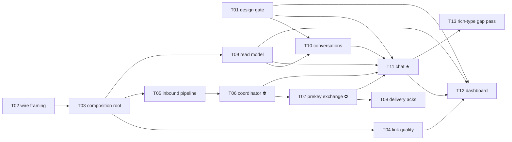

# E06 · Personal Chat ★ · Progress

**Status:** sharded, blocked on 2 human decisions · **Started:** — · **Completed:** — · **Progress:** 0/13 tasks

> Only the ORCHESTRATOR edits this file.

## Tasks
- [ ] E06-T01 · Flutter-capable design-fidelity gate (closes OQ-E00-3) · todo · infra · builder · must/P1 · M
- [ ] E06-T02 · Relay wire-packet framing + ciphertext type tag (closes OQ-E05-B01-1, E03-B03) · todo · backend · builder · must/P1 · M
- [ ] E06-T03 · Messaging composition root (DI + startup crypto/identity init) · todo · backend · builder · must/P1 · M
- [ ] E06-T04 · Link-quality wiring (closes E04-B03's carry-forward) · todo · backend · builder · must/P1 · M
- [ ] E06-T05 · Live inbound pipeline (deliver or forward) · todo · backend · builder · must/P1 · M
- [ ] E06-T06 · MessagingCoordinator — relay driver, cursors, reconciliation (closes E05-B02) · todo · backend · builder · must/P1 · M · ⛔ **blocked: OQ-E06-T06-1**
- [ ] E06-T07 · Prekey-bundle exchange (closes OQ-E05-T02-1) · todo · backend · builder · must/P1 · M · ⛔ **blocked: OQ-E06-T07-1**
- [ ] E06-T08 · Delivery acknowledgements (Accepted/Delivered/Read) · todo · backend · builder · should/P2 · M
- [ ] E06-T09 · Conversation read model · todo · backend · builder · must/P1 · S
- [ ] E06-T10 · Conversations screen · todo · frontend · builder-ui · must/P1 · M · design: `conversations`
- [ ] E06-T11 · Chat screen (text-only) — **the wedge** · todo · frontend · builder-ui · must/P1 · M · design: `chat`
- [ ] E06-T12 · Dashboard screen · todo · frontend · builder-ui · should/P2 · M · design: `dashboard`
- [ ] E06-T13 · Design gap pass for voice/PTT/attachments/location · todo · docs · planner · could/P3 · S

## Dependency graph

**Parallelism.** Wave 1 is `T01 ∥ T02` (design tooling vs. pure codec —
zero shared files). Once T03 lands, `T04 ∥ T05 ∥ T09` run in parallel, and
`T10` joins as soon as T01+T09 are in. The backend chain
`T05 → T06 → T07 → T08` is serialized on `lib/core/messaging/messaging_stack.dart`
as well as logically; `T04` deliberately registers through
`lib/app/bindings.dart` instead so it does not collide with that chain, and
the three UI tasks are serialized on `lib/app/routes.dart` via
`T10 → T11 → T12` (which is also the natural build order — the chat screen
is navigated to from the list, and the dashboard links to both).

**Two ⛔ blocks.** `T06` and `T07` each carry a 🧍 blocking Open Question
(the relay-queue trigger model, and the prekey-bundle channel). Both are
rule-3 architecture calls, both have options + an advisory recommendation
written in their task files, and neither may start until answered. Because
`T11` — the wedge screen — depends on both, **the epic's headline journey is
gated on those two answers.** Everything upstream of them (T01, T02, T03,
T04, T05, T09, T10) is unblocked and dispatchable today.

## Review log
(date · task · reviewer model · outcome · design gate %)

## Blocked / Frozen
- **E06-T06** ⛔ `OQ-E06-T06-1` — 🧍 relay-queue trigger model (timer /
  event / both / background). Inherited from E05-B02, deferred to E06 by
  explicit human decision. Advisory: option (c), timer floor + event
  triggers, 60 s, foreground-only; background execution shaped as an E10
  task.
- **E06-T07** ⛔ `OQ-E06-T07-1` — 🧍 prekey-bundle channel (mesh-inline /
  Firebase directory / both). Inherited from OQ-E05-T02-1. Advisory:
  option (a), mesh-inline for E06, with the Firebase fallback as an E11
  task.

## Event log (append-only)
- 2026-08-26 E06 drafted as part of Wave 1 epic-breakdown, status todo, awaiting 🧍 `epic_breakdown_and_wave` approval.
- 2026-08-29 Sharded into 13 tasks by the planner against `development` @ `35710f7` (250/250 green). `skills/task-sharding` §0 was run for the first time since its promotion in E05's retro: E02/E03/E04/E05 retros, bug advisories and merge-gate notes were read before slicing, and 21 inherited obligations were enumerated — see `epic.md` §Analyze report, **Inherited obligations**. Design gap pass added GAP-006…GAP-013 to `design/gaps.md` (🟡, awaiting 🧍 sign-off; the three UI tasks are gated on it). Two 🧍 blocking architecture questions raised rather than guessed (OQ-E06-T06-1, OQ-E06-T07-1). Analyze report appended to `epic.md`; 🧍 `analyze_report` gate ⏳.
