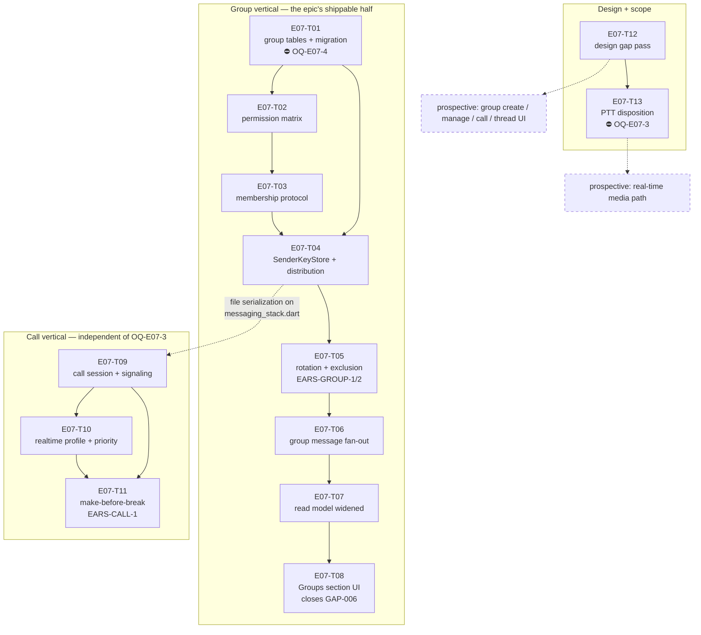

# E07 · Groups & Voice Calls · Progress

**Status:** in-progress (T01/T02/T12/T13 merged to `epic_07`, GAP-023 approved,
T03 dispatched) ·
**Started:** 2026-08-31 ·
**Completed:** — · **Progress:** 2/13

## Tasks

| Task | Title | Layer | Size | MoSCoW | depends_on | Status |
|---|---|---|---|---|---|---|
| E07-T01 | Group data model + schema migration | backend | M | must | — | done · builder (sonnet) → reviewer (opus) · APPROVE round 2 · squash-merged `6d5a861` (PR #1) |
| E07-T02 | Group role permission matrix | backend | S | must | T01 | done · builder (sonnet) → reviewer (opus) · APPROVE · squash-merged `e0ec39b` (PR #2) |
| E07-T03 | Group membership control protocol | backend | M | must | T02 | in-progress · builder (sonnet) → reviewer (opus) |
| E07-T04 | Drift-backed `SenderKeyStore` + key distribution | backend | M | must | T01, T03 | todo |
| E07-T05 | Key rotation on membership change + exclusion | backend | M | must | T04 | todo |
| E07-T06 | Group message send/receive fan-out | backend | M | must | T05 | todo |
| E07-T07 | Conversation read model widened to groups | backend | S | must | T06 | todo |
| E07-T08 | Conversations "Groups" section (closes GAP-006) | frontend | M | must | T07 | todo |
| E07-T09 | Call session state machine + signaling | backend | M | should | T04 | todo |
| E07-T10 | Real-time traffic profile + call priority | backend | M | should | T09 | todo |
| E07-T11 | Make-before-break call route migration | backend | M | must | T09, T10 | todo |
| E07-T12 | E07 design gap pass — derived contracts | docs | M | must | — | done · planner (opus) → reviewer (sonnet), APPROVE · merged `6f808fc` |
| E07-T13 | PTT — resolve `OQ-E07-2` ⛔ | docs | S | could | T12 | done · planner (opus) → reviewer (sonnet) · APPROVE · squash-merged `5f6a81e` (PR #3); GAP-023 human-approved `23c88ab` |

⛔ = carries or is blocked by a 🧍 Open Question — see §Blocked.

## Dependency graph

**Parallel sets** (file-collision-checked, analyze gate §Collision matrix):
`{T01, T12}` → `{T02}` → `{T03}` → `{T04}` → `{T06, T09}` →
`{T07, T10}` → `{T08, T11, T13}`.

**T09's `depends_on: [E07-T04]` is deliberate serialization, not a semantic
dependency** — call signaling needs nothing from the sender-key layer, but
both register a control kind in `lib/core/messaging/messaging_stack.dart`.
Do not "fix" the DAG by removing it.

## Blocked / Frozen

- **`E07-T01` — 🧍 `OQ-E07-4` (schema migration 12 → 13).** Rule 3 names
  schema migrations as a human call. The DDL and three forks are on the
  task file. **The whole group vertical T02…T08 sits behind this.**
- **`E07-T13` — 🔴 `OQ-E07-3` (real-time media transport).** The human's
  own parking condition for PTT (`IMP-001`). T13 must not start while
  `OQ-E07-3` is open.
- **Prospective media path, and the four prospective UI tasks** — blocked
  on `OQ-E07-3` and on 🧍 `design_contract_approval` for GAP-018…GAP-022
  respectively. Neither is sharded; see `epic.md` §Tasks.

**Not blocked, contrary to first appearance:** `E07-T09`, `E07-T10` and
`E07-T11` are dispatchable without `OQ-E07-3` — the epic is sliced so the
call session, priority and migration *control* are independent of the media
transport, with `NullCallMediaTransport` as the honest v1 seam.

## Gates

| Gate | State |
|---|---|
| 🧍 `analyze_report` | ⏳ AWAITING HUMAN acceptance of the disclosed MoSCoW exception (`epic.md` §Analyze report) — not blocking dispatch |
| 🧍 `OQ-E07-4` — schema migration | ✅ resolved 2026-08-31 — all 3 advisories accepted; unblocks T01→T08 |
| 🟢 `OQ-E07-3` — real-time media transport | ✅ resolved 2026-08-31 — (a) datagram audio over mesh, (c) named fallback; unblocks T13 + prospective media path |
| 🧍 `design_contract_approval` | ✅ cleared by human, 2026-08-31 — GAP-018…GAP-022 (`design/gaps.md`) |

## Review log
(date · task · reviewer model · outcome · design gate %)
- 2026-08-31 · E07-T12 · independent reviewer (sonnet-5, ≠ executed_by
  claude-opus-5/planner, rule 5) · APPROVE · n/a (docs task, no
  `design_contract` — the three new contracts are `source: derived`
  screens with no golden yet, so `make design-verify` does not apply at
  this stage per `design-fidelity` §3; confirmed with `node design/tools/
  verify.mjs --screen group-create` → "no screen matched", the expected
  result). Scope confined to `files:` (3 new contracts + `design/gaps.md`
  `built:`/clarification lines only) — independently confirmed empty
  `git diff` on `chat.md`/`conversations.md`/`devices.md`/`dashboard.md`/
  `chat-voice.md`/`design/thresholds.yaml`/`docs/impact/
  IMP-001-ptt-rehome-to-e07.md`. GAP-019's two fork resolutions (full-screen
  confirm, no modal primitive; plain text role label, no icon) honoured
  literally in `group-manage.md`. `call.md`'s 4+1 states complete and
  honest — `failed` states plainly that audio can't be carried
  (`NullCallMediaTransport`), never renders as connected; no speaker/video/
  add-participant/keypad/hold/record anywhere. GAP-022's migration UI is a
  real distinct `in-call-degraded` state, not conflated with `failed` or
  `in-call`. Independently spot-checked ≥5 token values per new contract
  against the parent contracts' own element/token rows — all traced, no
  invented value. All 5 `approved by:` lines on GAP-018..022 confirmed
  pre-existing on `epic_07` (commit `88a4d5c`, authored by the human,
  predating this task's branch point) — `E07-T12` only cites them, never
  authors one (`L-process-002` clean). GAP-017 byte-identical, `IMP-001`
  untouched. Both flagged deviations judged sound: `docs/routes.md`
  correctly withheld as genuinely outside the `files:` fence (rule 6 over
  a conflicting §3/§7 instruction, route info preserved in each contract's
  `impl_path`); the top `design_contract_approval` gate line correctly left
  untouched since it was cleared by the human in `88a4d5c`, already on
  `epic_07` before this task branched — reverting it would have erased a
  real human decision, not corrected a stale checklist item. See
  `epics/E07-groups-calls/tasks/E07-T12.md` Run log for full evidence.
- 2026-08-31 · E07-T13 · independent reviewer (sonnet-5, ≠ executed_by
  claude-opus-5/planner, rule 5) · APPROVE · n/a (docs task, `design_contract:
  n/a`). Diff is exactly `design/gaps.md`, `epics/E07-groups-calls/epic.md`
  and this task file — no Dart file touched (`git diff --stat` against
  `epic_07` confirmed 3 files, 445 insertions, 0 code files), `pubspec.yaml`
  unchanged, `flutter analyze` clean and `flutter test` 337/337 green
  (worktree not on this branch's exact commit, but irrelevant here since the
  diff contains zero Dart changes by construction). **Load-bearing claim
  independently re-derived, not trusted from the transcript:** read
  `spec/srs.md` directly — FR-STORE-002 ("store voice messages, PTT
  recordings, and call recordings locally on-device") does read as a stored
  artifact, not a live channel; FR-CALL-001/002/003 (the entire call
  chapter) never mention PTT; FR-NOTIFY-001 and FR-PLAT-001 list PTT as its
  own item alongside voice messages/calls, consistent with either reading
  but not asserting a live one. The spec reading behind outcome (b) is
  accurate and not cherry-picked. **GAP-023 read in full:** supersedes
  GAP-017 by reference — confirmed by diffing `design/gaps.md`, which
  contains **zero removed/changed lines**, only two pure-insertion hunks (a
  new blockquote note above the clearance history, and the new GAP-023
  section) — GAP-017's own block is untouched. The proposed UI delta (P1-P6)
  is genuinely derivative: press-and-hold on the existing `mic` button (no
  new element), GAP-014's V3/V4/V5 transmitting treatment unchanged, one new
  string `Transmitting…`, no stop/cancel (release commits), the delivered
  bubble V10-V16 unchanged — no new token, geometry or glyph invented.
  `approved by:` is bare (`_<human>_ on _<date>_`), not self-approved.
  **Group PTT reasoning judged sound, not a dodge:** under the
  message-artifact reading (itself spec-supported, not invented for
  convenience), two members holding the button simultaneously do produce two
  independent voice-message clips with no shared resource to arbitrate —
  the floor-control problem only exists under the live-channel reading,
  which GAP-023 explicitly flags as an open fork for the human rather than
  silently foreclosing. This is a genuine consequence of the chosen
  interpretation, not a reframing that avoids the question — and the entry
  says outright that floor control returns if the human takes the other
  fork, rather than hiding that cost. **The `files:`-fence deviation
  (inlining the delta into GAP-023 instead of `chat-ptt.md`/`chat-voice.md`)
  was the right call**: §5 named those files as the artifact shape but
  `files:`'s `create:` is empty and `chat-voice.md` is not in `update:`;
  rule 6 makes the fence binding over a conflicting task-authoring
  instruction, and amending an already-approved contract file before the
  human approves the amendment is exactly what `L-process-002` exists to
  prevent. A named follow-on docs task to fold the rows into
  `chat-voice.md` post-approval is the correct resolution — stopping to
  escalate would have been needless process for a documented, reasoned,
  rule-6-compliant substitution that stayed inside the letter of the task's
  own `files:` contract. `IMP-001` confirmed untouched (`git diff` empty).
  `epic.md`'s `OQ-E07-2` confirmed 🟢 with the GAP-023 answer copied
  verbatim (matched sentence-for-sentence against the GAP-023 source, not
  paraphrased) into both the §Open Questions entry and the §Tasks/
  §Follow-on/§Risks rows, all consistent with outcome (b). **Noted, not
  fixed (out of this task's scope, flagged by the planner and confirmed
  present):** `epic.md`'s `OQ-E07-3` block carries three leftover template
  lines (`**Answer:** _<empty>_` / `**Answered by:** _<human>_` / `**Date:**
  _<YYYY-MM-DD>_`) sitting directly below the human's real, filled-in
  Status/Answered by/Date lines for that question — left for the
  orchestrator's own cleanup commit, correctly not touched here since it
  sits inside a human decision record. **GAP-023 itself is not approved by
  this review** — it is 🟡, `design_contract_approval` still open on it, and
  that sign-off is a separate 🧍 human gate outside this review's scope to
  grant.

## Carried-forward observations (not yet a task)
_(empty at sharding — created deliberately so it has a reader from day one.
`L-process-008`, promoted to a rule after E06: **read this section before
each new dispatch and cross-check the next task's `files:` fence.** E06's
highest-severity finding, `E06-B02` (S1), sat correctly recorded in this
exact section for eight tasks with no reader.)_

- **2026-08-31 · E07-T01 · migration-test completeness (advisory, S4).**
  `test_EARS_GROUP_5_v12_upgrades_to_v13_additively` proves every pre-existing
  table's DDL is byte-identical across 12→13 and that the 4 expected tables +
  3 expected indexes exist — but it does not assert the added set is *exactly*
  those 7, so an unintended 8th entity created by a future migration step would
  not fail it. Property holds today (reviewer-probed at round 1). **Fold into
  whichever later E07 task edits the `from < 13` step or adds a `from < 14`
  step** (`E07-T02`/`T03`/`T04` all depend on T01 and may touch
  `database.dart`), or explicitly note why it stays out of scope.
  - **2026-08-31 · checked at E07-T02 dispatch:** T02's `files:` fence creates
    two new files only and does not touch `database.dart` — correctly stays
    out of scope. Re-check at T03/T04.
  - **2026-08-31 · checked at E07-T03 dispatch:** T03's `files:` fence
    updates `messaging_stack.dart` only, not `database.dart` — stays out of
    scope. Re-check at T04 (which does touch persistence for
    `SenderKeyStore`).

- **2026-08-31 · E07-T02 · `allows` throws where §5 says it never does
  (advisory, S3 — a spec-text defect, not a code defect).** `E07-T02.md:107`
  ("Total — never throws, never returns null") contradicts `E07-T02.md:136`
  ("Assert loudly rather than defaulting to `false`"). The implementation
  correctly follows §6 and throws `ArgumentError` when `removeMember`/
  `removeAdmin` get a `null` subject (`group_permissions.dart:63-69, 78-84`).
  **Risk lands on E07-T03/T06:** a caller reading only §5 writes
  `if (!GroupPermissions.allows(...)) deny;` and gets an uncaught
  `ArgumentError` — at a network-frame boundary — where it expected a denial.
  **Fold into E07-T03** (the first caller): either wrap the call or assert the
  subject non-null before it, and have the planner correct §5's wording.

- **2026-08-31 · E07-T02 · removed members are not expressible in
  `GroupRole` (advisory, S2 if it reaches a caller unhandled).** §2
  (`E07-T02.md:64-66`) makes `removed_at_epoch IS NOT NULL` a hard `false` for
  every action, but `GroupPermissions` is pure and takes only a `GroupRole`,
  which has no "removed" value — `sendMessage` returns `true` unconditionally
  (`group_permissions.dart:110-111`). This is correct per §4 (the caller loads
  the roles) and unfixable inside T02's fence, but it means **any T03/T06 query
  that loads a `GroupMembers` row without `WHERE removed_at_epoch IS NULL`
  silently grants a removed member full member rights.** T01 deliberately
  retains removed rows rather than deleting them (`group_tables.dart:118-121`),
  so the stale row is always there to be loaded. **Fold into E07-T03 and
  E07-T06** — the enforcing layers — as an explicit precondition on every role
  load.

- **(from E07-T03 review, 2026-08-31) Group-control authentication is only as
  strong as the project's trust-on-first-use identity model — owner: E11, not
  this epic.** E07-T03 correctly routes around E06-B04 (verified: a forged
  `frame.source` cannot authenticate a membership frame). One residual gap
  sits *below* it, in shared crypto that T03's fence does not reach:
  `decodeCiphertextControlBody` accepts `PreKeySignalMessage` as well as
  `SignalMessage` (`group_control.dart`), and
  `DriftSignalProtocolStore.isTrustedIdentity`
  (`drift_signal_store.dart:139-150`) returns `true` whenever no identity key
  is yet recorded for an address. So for a group member this device has
  **never** exchanged messages with, an attacker can send a
  `PreKeySignalMessage` with `source: <that member>`, establish a fresh
  session under that address, decrypt successfully, and set a matching
  `actorDeviceId` — passing both of T03's gates. Reach is narrow: any member
  already talked to is protected (their stored identity key makes the forgery
  fail with `untrustedIdentity`), and the same TOFU applies to every ordinary
  chat message today, so this is **not** a regression T03 introduced and is
  strictly stronger than the `frame.source` trust it replaces. It is the
  identity-verification half of ADR-0003 that no epic has yet owned. Revisit
  trigger: E11's transport-frame signing / identity-verification work, or the
  first journey where a user is added to a group by a device they have never
  messaged. **Do not fold into E07-T04/T05/T06** — none of their fences reach
  `drift_signal_store.dart`.

## Review log

### E07-T01 — 2026-08-31 — 📋 **CHANGES** (reviewer: opus; `executed_by`: builder-sonnet ✅ rule 5)

- **scope:** in-contract. `git diff --name-only epic_07...epic_07_task_01` =
  exactly the 4 files in `files:` + the task file. `git diff` on
  `crypto_tables.dart` / `message_tables.dart` / `relay_tables.dart` /
  `relationships_table.dart` / `sync_tables.dart` is **empty** (verified).
  §4 respected — no `SenderKeyStore`, no permission matrix, no rotation, no
  `Conversations` table, no new dependency.
- **OQ-E07-4 (all three human decisions verified in the built DDL,** dumped
  from `sqlite_master` by my own probe, not read off the source**):**
  1. ✅ `group_sender_keys ... PRIMARY KEY ("group_id", "sender_device_id", "membership_epoch")` — epoch **in** the PK.
  2. ✅ `group_members."removed_at_epoch" INTEGER NULL`; row retained, never deleted (`group_tables.dart:118-121`).
  3. ✅ `group_events` is its own table; `messages` untouched.
- **suite:** ✅ ran myself — `flutter analyze` → *No issues found!*;
  `flutter test` → **391/391 pass** (384 prior + 7 new). Builder's numbers confirmed.
- **regeneration:** ✅ `database.g.dart` not hand-edited — I re-ran
  `dart run build_runner build` and the result is **content-identical** to the
  committed file (`git diff` empty; md5 differs only by CRLF/LF). The 3895/1306
  line churn is drift's manager-class boilerplate, machine output throughout.
- **index materialization (the E05-T01 lesson):** ✅ all three indexes are
  created by explicit `customStatement` in the `from < 13` step
  (`database.dart:277-295`), and my probe confirms they exist **on both paths** —
  fresh `createAll` install *and* v12 upgrade — with the correct DDL, including
  the partial predicate `WHERE role = 'owner' AND removed_at_epoch IS NULL`.
- **falsification re-run (independently, not trusting the builder's claim):**
  removed the `idx_group_single_owner` `customStatement` →
  `test_EARS_GROUP_4_second_current_owner_is_rejected` failed
  (*Expected: throws anything / Actual: Instance of 'Future<int>'*) **and**
  `test_EARS_GROUP_5_v12_upgrades_to_v13_additively` failed
  (*idx_group_single_owner should exist*). Both failed **for the right reason**.
  Restored → md5 `269f8b51a1a5a8500213539be4f49130`, byte-identical, suite green.
- **EARS:** 3/3 have a test named by their id; **GROUP-3 ✅, GROUP-4 ✅,
  GROUP-5 ⚠️ partially verified** — see the finding.
- **design gate:** n/a (`design_contract: n/a`, pure persistence).
- **security lens:** n/a — no auth/payment/RBAC surface. No key material is
  generated, parsed or logged; `record` stays an opaque BLOB.

**❌ Finding (must fix, 1):**
`test/core/persistence/group_tables_test.dart:221-244` — the
`preExistingTables` loop is labelled *"Byte-identical schema check on every
non-group table: the CREATE TABLE SQL captured by sqlite_master for each must
be exactly what it was pre-migration"* and it does `SELECT sql FROM
sqlite_master`, but then **discards the `sql` column and asserts only
`expect(rows, hasLength(1))`** — i.e. it proves the table still *exists*,
never that its DDL is unchanged. §8 requires the assertion explicitly
("assert … that `messages`, `relationships` and every `signal_*` table are
**byte-identical in schema** to before"), the test's own comment claims it,
and the §9 DoD box is ticked for it — three places assert a check that isn't
there. **Why it matters:** an `ALTER TABLE` added to the `from < 13` step by
any future task would leave this test fully green. That is exactly the
E05-T01 class of migration bug the task's §6 warns against, in the one test
guarding the epic's riskiest property. Fix: capture the `sql` strings before
opening `AppDatabase`, and compare after the migration.

**Note — the underlying property is TRUE, only unproven by the suite.** My own
probe captured `sqlite_master.sql` for `messages`,
`idx_messages_conversation_created_at`, `relationships` and `signal_sessions`
pre-migration and string-compared post-migration: all identical, and the set
added by 12→13 is exactly the 4 tables + 3 indexes and nothing else. So this
is a **test-strength** fix, not a code fix — `group_tables.dart` and the
migration step need no change.

### E07-T01 — 2026-08-31 — ✅ **APPROVE** (round 2; reviewer: opus; `executed_by`: builder-sonnet ✅ rule 5)

Round-1's single finding is **closed**. Verified independently from the diff and
a re-run, not from the builder's transcript.

- **scope: in-contract.** `git diff d319db6..a9fe875 --name-only` returns exactly
  two paths: `test/core/persistence/group_tables_test.dart` and
  `epics/E07-groups-calls/tasks/E07-T01.md`. The three production files are
  provably untouched — blob hashes are identical on both sides:
  `group_tables.dart` `e6a7436…`, `database.dart` `7d4d3e7…`,
  `database.g.dart` `bc28885…`. So round 1's substantive approval still stands
  unchanged; this round only re-judged test strength.
- **the fix is real, not dressed up.** `group_tables_test.dart:191-209` opens a
  raw `sqlite3` in-memory handle, builds the v12 schema, and snapshots each
  pre-existing table's `sqlite_master.sql` into `preMigrationSql` — all of it
  **before** `AppDatabase.forTesting(...)` is constructed at line 212. The
  "before" snapshot therefore cannot have been taken through a migrated
  connection; the migration provably has not run at snapshot time.
  The assertion at `group_tables_test.dart:271-275` is a genuine string
  equality on the `sql` column (`rows.single.read<String>('sql')` vs the
  snapshot), not a weaker check. The map is typed `<String, String>` and built
  with `.single`, so a missing table throws rather than silently comparing
  against `null` — the degenerate always-green path is closed too.
- **EARS: 3/3.** EARS-GROUP-3 → `test_EARS_GROUP_3_new_group_has_epoch_zero_and_one_owner`;
  EARS-GROUP-4 → `test_EARS_GROUP_4_second_current_owner_is_rejected` (verified
  round 1 by falsification); EARS-GROUP-5 →
  `test_EARS_GROUP_5_v12_upgrades_to_v13_additively`, which now actually proves
  the "without altering any pre-existing table" clause it is named for.
- **suite: pass.** `flutter analyze` → *No issues found!*; `flutter test` →
  **391/391**, re-run by the reviewer on `a9fe875`.
- **falsification — reviewer's own probe, not the builder's.** Inserted
  `ALTER TABLE messages ADD COLUMN reviewer_probe_e07t01 TEXT;` into the
  `from < 13` step (`database.dart:275`, a different column name and site than
  the builder's `temp_falsification_check`, so the code cannot have been tuned
  to it). The test failed **for the right reason**: a DDL mismatch at
  `group_tables_test.dart:271`, reason string *"messages DDL should be
  byte-identical after migration"*, differing at offset 272 with the injected
  column visible in Actual. **The decisive detail:** the failure landed on
  line 271 (the new equality), *not* line 270 (`hasLength(1)`) — the pre-fix
  assertion passed this mutation, which is precisely the round-1 finding and
  precisely what the fix now catches. Probe reverted; `git diff` empty; full
  suite back to **391/391**.
- **design gate: n/a** (`design_contract: n/a`, pure persistence).
- **security: n/a** — no auth/payment/RBAC path. The single-owner invariant is
  DB-enforced (`idx_group_single_owner`), verified round 1.

**Carried forward (advisory, NOT a blocker):** round 1 also suggested
*considering* an assertion that the set 12→13 *adds* is exactly the 4 tables +
3 indexes, which would catch an unintended extra entity. That was phrased as
optional and remains unimplemented; the current test verifies the 7 expected
entities exist but would not notice an 8th. The property holds today (confirmed
by the round-1 probe). Recorded in §Carried-forward observations for whichever
later E07 task touches this migration — not grounds to hold this PR.

### E07-T02 — 2026-08-31 — 📋 **APPROVE** (reviewer: opus; `executed_by`: builder-sonnet ✅ rule 5)

- **scope: in-contract.** `git diff --stat origin/epic_07...origin/epic_07_task_02`
  = exactly the 2 files in `files:` (`lib/features/groups/domain/group_permissions.dart`,
  `test/features/groups/domain/group_permissions_test.dart`) + the task file.
  §4 respected: the source imports only `GroupRole` (an enum) and `AppFailure`,
  both `show`-scoped — no `drift`, no `dart:io`, no `DateTime.now()`, no
  `GroupRepository`, no controller, no UI, no 4th role, no trust/blocking.
- **§5 matrix: 11/11 rows verified cell-by-cell, independently.** I did not
  read the builder's expectation table as evidence — I re-encoded §5 myself as
  a literal string table (`'leave|*': 'FTT'` etc.) in a throwaway probe and ran
  it against the shipped code: **105/105 pass**. Probe deleted; `git status`
  clean.
- **No owner shortcut (the §6 risk).** `group_permissions.dart:108` is
  `return actorRole != GroupRole.owner` for `leave`, and there is no
  `if (role == owner) return true` anywhere. **Falsified, not assumed:** I
  injected exactly that line at the top of `allows` → my probe failed on
  `§5 leave|* actor=owner` (*Expected: false / Actual: true*) and the builder's
  suite failed **14** tests. Reverted; `git diff` empty.
- **Second falsification** — inverted the owner-protection guard at
  `group_permissions.dart:70` (`subjectRole != GroupRole.member` →
  `== GroupRole.admin`) → my probe failed on `§5 removeMember|owner` for both
  owner and admin actors, and `test_nobody_can_remove_the_owner` failed.
  Reverted; suite back to green. Both probes failed for the *right* reason.
- **Exhaustiveness: genuinely 120, verified by count not by claim.** Ran the
  matrix group alone with `--plain-name` → `+120: All tests passed!`; whole
  file → `+128`. That is `GroupAction.values (10) × subjects (3 roles + null)
  × GroupRole.values (3)`, a real triple-nested Cartesian loop
  (`group_permissions_test.dart:106-137`), not spot checks.
- **EARS: 2/2 verified.**
  - EARS-GROUP-6 → `test_EARS_GROUP_6_owner_may_perform_every_fr_group_002_action`,
    which asserts all six actions `spec/srs.md:121` names, by name.
  - EARS-GROUP-7 → `test_EARS_GROUP_7_admin_cannot_grant_admin_or_transfer_or_delete`,
    `..._member_cannot_perform_any_management_action`, and
    `..._denial_returns_group_forbidden_failure` (asserts `failure!.code ==
    'group.forbidden'` **and** `null` on the allowed path).
- **suite: ✅ ran myself** on `733ee60` — `flutter analyze` → *No issues found!*;
  `flutter test` → **519/519** (391 prior + 128 new). Builder's numbers confirmed.
- **`AppFailure('group.forbidden')` is the existing convention, not a new
  shape.** Repo-wide survey of `AppFailure('…')` literals returns
  `auth.google_sign_in_failed`, `messaging.bundle_unavailable`,
  `messaging.no_session`, `messaging.peer_blocked` — `<domain>.<snake_case>`,
  and `messaging.peer_blocked` is the direct denial analogue. The import path
  (`core/auth/google_auth_service.dart`) matches
  `lib/features/messaging/domain/send_message_use_case.dart` and three others.
  (`docs/conventions.md:52` still describes an aspirational `sealed class
  AppFailure` with a `message` field that the concrete E06-T02 class does not
  have — a pre-existing repo-wide divergence, not this task's to fix.)
- **OQ-E07-5 correctly left open** — still 🟡 important, `Answer: _<empty>_`,
  `E07-T02.md:266-280`. The narrow reading shipped; the widening decision was
  not silently taken.
- **design gate: n/a** (`design_contract: n/a`, pure function).
- **security lens (RBAC — run, not skipped):**
  - #6 default-deny → **PASS**. The `switch` at `group_permissions.dart:60-110`
    has no `default:` and no trailing `return`; a future `GroupAction` value is
    a *compile error*, not a silent allow. Fail-closed at compile time.
  - #7 not-only-in-the-UI → **PASS** by construction; §4 forbids a second
    UI-side rule and GAP-019 defers the group-manage rows to this matrix.
  - #9 no privilege-escalation path → **PASS**, probed above. Admin is denied
    `grantAdmin`/`revokeAdmin`/`transferOwnership`/`deleteGroup`/`removeAdmin`,
    and the *wrong-action* escalation (an Admin removing another Admin via
    `removeMember`) is closed at `group_permissions.dart:70-76`.
  - 🧍 `auth_or_payment_code` gate **not triggered**: no file under an auth or
    payment path changed — `lib/core/auth/` is imported for a type only, and is
    byte-identical on this branch.
- **`L-process-008` check.** T01's carried-forward migration-test item names
  `E07-T02` as a candidate. T02's `files:` fence creates two new files and does
  not touch `database.dart` or the `from < 13` step, so it correctly **stays out
  of scope** here — re-check at T03/T04.
- **The three self-resolved cells (§Deviations) — judged, not rubber-stamped.
  All three are sound and correctly kept inside the contract:**
  1. `removeMember` with `subjectRole == admin` → `false`. **Forced, not
     chosen.** Had it returned `owner||admin`, an Admin could remove another
     Admin through the wrong action — precisely the power §5's
     `removeAdmin (subject = admin)` row reserves for the Owner. Denial is the
     only reading under which the two actions are not redundant. Escalating
     this would have been over-caution.
  2. `removeAdmin` with `subjectRole` = `owner`/`member` → `false`. Correct;
     `owner` is mandated by the never-remove-the-owner invariant and `member`
     simply isn't this action's subject. A `throw` was equally defensible here,
     but denial is the conservative, reversible choice.
  3. `null` subject → `ArgumentError`. §6 (`E07-T02.md:135-138`) instructs this
     literally for `removeMember`; generalizing it to `removeAdmin` — the only
     other subject-conditioned action, identical failure mode — is the only
     consistent reading. Correct.
  **My one dissent is procedural, not substantive** — see §Carried-forward.

**Carried forward (advisory, NOT blockers — neither is fixable inside this
task's fence):**
1. **§5/§6 contradict each other on throwing.** `E07-T02.md:107` says `allows`
   is "Total — never throws"; `E07-T02.md:136` says to assert loudly on a null
   subject. The builder resolved toward §6 (the specific risk note over the
   generic prose) and documented it in the dartdoc — the right call — but
   resolved it *in code* rather than naming it as a contract defect. It matters
   for **E07-T03**: an implementer reading only §5 will write
   `if (!allows(...)) deny;` and get an uncaught `ArgumentError` where they
   expected a denial, at a network-frame boundary. Planner should fix §5's
   wording; T03's brief should carry the null-subject precondition explicitly.
2. **The removed-member seam.** §2 (`E07-T02.md:64-66`) makes
   `removed_at_epoch IS NOT NULL` a hard `false` for *every* action, but
   `GroupRole` has no "removed" value and this pure function cannot express it —
   `sendMessage` returns `true` unconditionally
   (`group_permissions.dart:110-111`). Correct per §4 (the caller loads the
   roles), but a **T03/T06 caller that loads a `GroupMembers` row without
   filtering `removed_at_epoch IS NULL` will permit a removed member to send.**
   The source header names the caller's duty to load roles but not this
   precondition. Fold into E07-T03/T06 — the enforcing layers.

### E07-T03 — 2026-08-31 — 📋 **CHANGES** (reviewer: `claude-opus-5`; `executed_by`: `claude-sonnet-5` ✅ rule 5)
PR #4 → `epic_07`. Verdict comment:
https://github.com/SHAJED99/nexora/pull/4#issuecomment-5476821197

- **scope: in-contract.** Diff is exactly the 7 `files:` entries + the task
  file. Independently confirmed **empty** `git diff epic_07 epic_07_task_03`
  on `inbound_pipeline.dart`, `prekey_exchange.dart`, `delivery_ack.dart`,
  `relay_packet_frame.dart`. `messaging_stack.dart` is a 24-line pure
  insertion (3 imports, one `late final` field, construction +
  `registerControlHandler(kControlKindGroupControl, ...)`) — no existing
  member's wiring touched. §4 respected: no `SenderKeyStore`/rotation/
  fan-out/UI anywhere in the diff.
- **suite: pass, run by the reviewer.** `flutter analyze` → *No issues
  found!*; `flutter test` → **546/546**. New-test count measured
  independently by running only the three new files: **exactly 27**
  (519 + 27 = 546); the PR body's "~26" was one short.
- **EARS: 4/4 verified** with a named test each, GROUP-10 additionally
  falsified (neutering the `actorDeviceId` guard at
  `group_membership_service.dart:459` makes it fail for the right reason —
  `Expected: <1> Actual: <0>` on `groupUnauthenticated`; restored verbatim,
  green again).
- **design gate: n/a** (`design_contract: n/a`, backend task).
- **security lens (E06-B04 inheritance): PASS.** The `frame.source`
  decrypt-hint deviation is real, narrow and justified. The
  `inbound_pipeline.dart:349` precedent it cites genuinely exists on
  `epic_07`. Two independent gates hold: a lie in `frame.source` selects the
  wrong session so `CryptoService.decrypt` fails →
  `groupUnauthenticated` + silent drop
  (`group_membership_service.dart:423-430`); a frame that decrypts honestly
  but claims a different actor is caught at `:459`. Reviewer wrote the
  complementary test the builder did not — E06-B04's literal shape, a
  **forged `frame.source`** (device-b encrypts under device-a's session,
  sets `source: 'device-a'`, tries to remove device-c) — and it is
  correctly rejected: `groupUnauthenticated == 1`, device-c still a member,
  epoch still 0. **E06-B04 is not inherited.**
- **Carried-forward finding #2 (`removed_at_epoch`) CLOSED.** Read the
  actual Drift query: `group_repository.dart:roleOf` and `currentMembers`
  both filter `t.removedAtEpoch.isNull()`; `_checkPermission` loads every
  role through `roleOf`, so no stale role can reach `GroupPermissions`.
- **Carried-forward finding #1 CLOSED on the receive side, REOPENED on the
  send side** — the one blocking finding:
  ❌ **F1 (S3)** `group_membership_service.dart:270` skips the subject-role
  lookup when the subject is this device but does not re-route the action,
  so `removeMember(groupId, <self>)` reaches
  `GroupPermissions.check(removeMember, subjectRole: null)` at `:283` and
  throws an uncaught `ArgumentError` out of a `Future<AppFailure?>` API
  (`group_permissions.dart:125` → `:66`). Reproduced with an independent
  probe. Contradicts the file's own comment at `:272-277`. Sender and
  receiver disagree: `group_repository.dart:_checkPermission` correctly maps
  a self-targeted `memberRemoved` to `GroupAction.leave`; `:270` does not.
  Not remotely exploitable (the network path goes through
  `applyEvent`/`_checkPermission`, verified). Fix: evaluate
  `GroupAction.leave` for a self-subject, + a regression test.

Round 1 → back to the same implementer (`claude-sonnet-5`).

### E07-T03 — 2026-08-31 — 📋 **APPROVE** (round 2; reviewer: `claude-opus-5`; `executed_by`: `claude-sonnet-5` ✅ rule 5)
PR #4 → `epic_07`. Fix commits `b2bb3e7` (fix) + `fb862eb` (bookkeeping).
Re-review scoped to F1 and to proving nothing else moved.

- **scope: in-contract.** `git diff --stat 6a2a064 fb862eb` (round-1 review
  point → fix tip) is **exactly three files**: `E07-T03.md` (+52/-1 doc),
  `group_membership_service.dart` (+17/-1), and
  `group_membership_service_test.dart` (+30). Nothing else. The two
  round-1 CLOSED findings are provably untouched: `git diff 6a2a064
  fb862eb -- lib/core/messaging/group_control.dart
  lib/features/groups/data/group_repository.dart
  lib/core/messaging/messaging_stack.dart` → **empty output**.
- ✅ **F1 (S3) CLOSED.** `group_membership_service.dart:268,278-280`: a
  local `var effectiveAction = action;` is set to `GroupAction.leave` when
  `subjectDeviceId == _stack.selfDeviceId && action ==
  GroupAction.removeMember`, and `:299` now passes `action:
  effectiveAction` to `GroupPermissions.check`. The null-subject hazard is
  gone because `GroupPermissions.allows`'s `leave` row
  (`group_permissions.dart:104`) never reads `subjectRole`.
- **Sender/receiver parity verified by reading both, not by claim.**
  Receiver `group_repository.dart:324-333` branches on `subject ==
  frame.actorDeviceId` → `GroupAction.leave`. Sender branches on
  `subjectDeviceId == _stack.selfDeviceId`, and the sender stamps
  `actorDeviceId: _stack.selfDeviceId` on the frame it builds
  (`group_membership_service.dart:305`), so the two predicates are the
  same predicate. Both therefore deny an Owner's self-removal (leave
  denies Owner) and permit a Member's — they agree in both directions,
  which is the property that was broken.
- **`_kindFor` still keyed on the ORIGINAL action** — `kind: _kindFor(action)`
  at `group_membership_service.dart:302`, not `effectiveAction`. Verified
  empirically, not just by reading: the reviewer's own probe asserts the
  persisted `group_events` row at epoch 1 has `kind == 'memberRemoved'`
  with `actorDeviceId == subjectDeviceId == 'me'`. The permission-check
  substitution is local and does not leak onto the wire.
- **Falsification of the builder's regression test — passes.** Deleting the
  three-line `effectiveAction = GroupAction.leave` assignment makes
  `test_EARS_GROUP_9_self_targeted_removeMember_reroutes_to_leave_not_ArgumentError`
  fail **for exactly the right reason**: `Invalid argument (subjectRole):
  GroupAction.removeMember requires a subjectRole` at
  `group_permissions.dart:66` → `:125` →
  `group_membership_service.dart:295 _perform` — the literal F1 stack.
  Restored verbatim (`git diff --stat` → empty), green again.
- **Reviewer's own independent probe (stronger than the builder's).** The
  builder's test only covers the Owner case, where "re-routed to leave" and
  "blanket denied" are indistinguishable. The reviewer bootstrapped a group
  where the local device is a plain **Member** and called
  `removeMember(groupId, <self>)`: it returns `null` (permitted), the
  `GroupMembers` row is actually removed, and the event is `memberRemoved`.
  So the re-route is a genuine `leave` decision, not a deny-everything
  patch. Probe deleted after the run; working tree clean.
- **suite: pass, run by the reviewer.** `flutter analyze` → *No issues
  found!* (2.6s). `flutter test` → **547/547 passed, 0 failed** — the exact
  claimed count, 546 + exactly one new test.
- **design gate: n/a** (backend task, `design_contract: n/a`).
- **security lens: unchanged from round 1 — PASS.** The E06-B04 inheritance
  analysis and the `removed_at_epoch` finding both rest on files with an
  empty diff this round, so round 1's evidence stands unmodified.
- **Residual, non-blocking (recorded, not a finding):** self-targeted
  `GroupAction.removeAdmin` still leaves `subjectRole == null` and would
  throw, but it is unreachable — no `GroupMembershipService` entry point
  emits `removeAdmin`, and `_kindFor` itself throws `UnsupportedError` for
  it (`group_membership_service.dart:337-345`). Documented in-source. If
  E07-T04/T06 ever add a `removeAdmin` entry point, the same re-route
  question must be answered there.

No second rejection; no planner escalation needed. Ready for the
orchestrator to squash-merge to `epic_07`.

## Bug sweep
_(after all 13 tasks land — `skills/bug-sweep`. Note `L-process-009`: every
E07 bug task file must carry a §4 scope fence; every bug file in the
project before E06's retro lacked one.)_

## Event log (append-only)
- 2026-08-26 E07 drafted during Wave 1 epic-breakdown; deferred to a later wave.
- 2026-08-30 PTT re-homed from E06 to E07 by human decision (`IMP-001`,
  `GAP-017`); recorded as `OQ-E07-2` with the owner named as "this epic's
  sharding pass".
- 2026-08-31 **Sharded into 13 tasks** by the planner against `development`
  @ `73eb4b3` (384/384 green). `skills/task-sharding` §0 run before slicing:
  E06's retro + tracker (bug sweep, carried-forward observations, merge-gate
  notes), E05's and E03's retros, `IMP-001`, `design/gaps.md` GAP-006/017,
  and the E06 bug files were read, and **17 inherited obligations were
  enumerated** — see `epic.md` §Analyze report, *Inherited obligations*.
  `OQ-E07-2` (PTT) discharged into a named task, `E07-T13`. Design gap pass
  added GAP-018…GAP-022 to `design/gaps.md` (🟡, `design_contract_approval`
  reopened); only `E07-T08` is a sharded frontend task, the rest are
  prospective by rule 2. **Two rule-3 questions raised rather than guessed:**
  `OQ-E07-3` (real-time media transport for calls and PTT — no ADR covers
  it, every option is a new dependency) and `OQ-E07-4` (the group schema
  migration). ADR-0003's deferred Sender-Keys layering was designed
  deliberately at this pass, as that ADR and this epic's own §Risks both
  required, and recorded as `OQ-E07-8` for cheap rejection. Analyze report
  appended to `epic.md`; 🧍 `analyze_report` gate ⏳.
