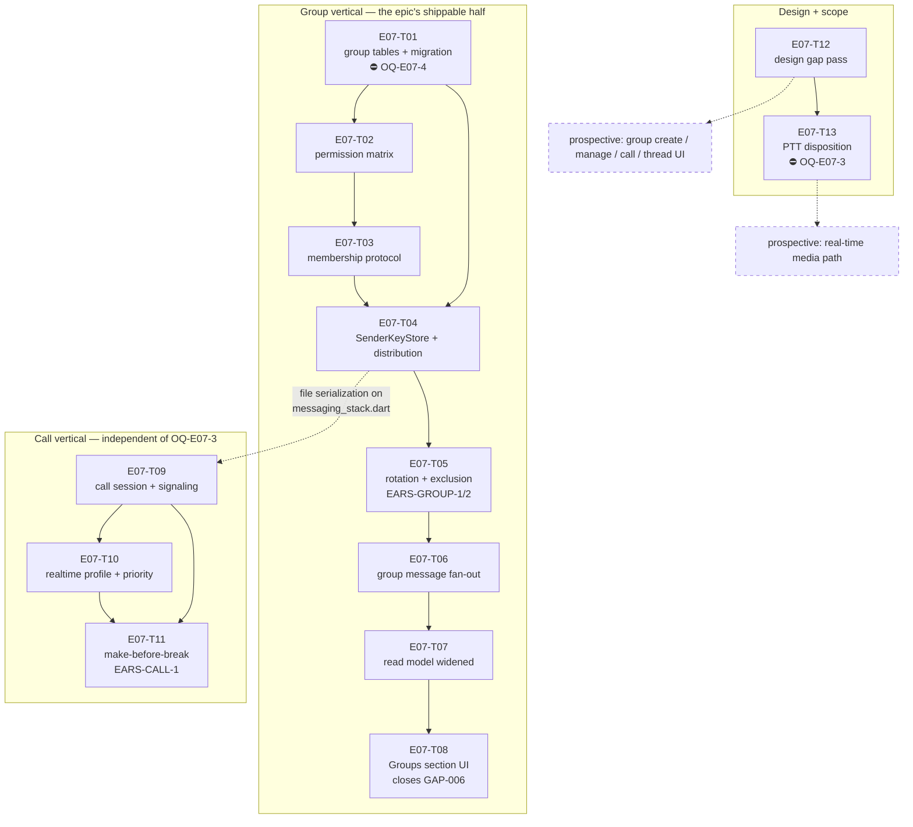

# E07 · Groups & Voice Calls · Progress

**Status:** in-progress (T01+T12 merged to `epic_07`, T02+T13 dispatched) ·
**Started:** 2026-08-31 ·
**Completed:** — · **Progress:** 2/13

## Tasks

| Task | Title | Layer | Size | MoSCoW | depends_on | Status |
|---|---|---|---|---|---|---|
| E07-T01 | Group data model + schema migration | backend | M | must | — | done · builder (sonnet) → reviewer (opus) · APPROVE round 2 · squash-merged `6d5a861` (PR #1) |
| E07-T02 | Group role permission matrix | backend | S | must | T01 | in-progress · builder (sonnet) → reviewer (opus) |
| E07-T03 | Group membership control protocol | backend | M | must | T02 | todo |
| E07-T04 | Drift-backed `SenderKeyStore` + key distribution | backend | M | must | T01, T03 | todo |
| E07-T05 | Key rotation on membership change + exclusion | backend | M | must | T04 | todo |
| E07-T06 | Group message send/receive fan-out | backend | M | must | T05 | todo |
| E07-T07 | Conversation read model widened to groups | backend | S | must | T06 | todo |
| E07-T08 | Conversations "Groups" section (closes GAP-006) | frontend | M | must | T07 | todo |
| E07-T09 | Call session state machine + signaling | backend | M | should | T04 | todo |
| E07-T10 | Real-time traffic profile + call priority | backend | M | should | T09 | todo |
| E07-T11 | Make-before-break call route migration | backend | M | must | T09, T10 | todo |
| E07-T12 | E07 design gap pass — derived contracts | docs | M | must | — | done · planner (opus) → reviewer (sonnet), APPROVE · merged `6f808fc` |
| E07-T13 | PTT — resolve `OQ-E07-2` ⛔ | docs | S | could | T12 | in-progress · planner (opus) → reviewer (sonnet) |

⛔ = carries or is blocked by a 🧍 Open Question — see §Blocked.

## Dependency graph

**Parallel sets** (file-collision-checked, analyze gate §Collision matrix):
`{T01, T12}` → `{T02}` → `{T03}` → `{T04}` → `{T06, T09}` →
`{T07, T10}` → `{T08, T11, T13}`.

**T09's `depends_on: [E07-T04]` is deliberate serialization, not a semantic
dependency** — call signaling needs nothing from the sender-key layer, but
both register a control kind in `lib/core/messaging/messaging_stack.dart`.
Do not "fix" the DAG by removing it.

## Blocked / Frozen

- **`E07-T01` — 🧍 `OQ-E07-4` (schema migration 12 → 13).** Rule 3 names
  schema migrations as a human call. The DDL and three forks are on the
  task file. **The whole group vertical T02…T08 sits behind this.**
- **`E07-T13` — 🔴 `OQ-E07-3` (real-time media transport).** The human's
  own parking condition for PTT (`IMP-001`). T13 must not start while
  `OQ-E07-3` is open.
- **Prospective media path, and the four prospective UI tasks** — blocked
  on `OQ-E07-3` and on 🧍 `design_contract_approval` for GAP-018…GAP-022
  respectively. Neither is sharded; see `epic.md` §Tasks.

**Not blocked, contrary to first appearance:** `E07-T09`, `E07-T10` and
`E07-T11` are dispatchable without `OQ-E07-3` — the epic is sliced so the
call session, priority and migration *control* are independent of the media
transport, with `NullCallMediaTransport` as the honest v1 seam.

## Gates

| Gate | State |
|---|---|
| 🧍 `analyze_report` | ⏳ AWAITING HUMAN acceptance of the disclosed MoSCoW exception (`epic.md` §Analyze report) — not blocking dispatch |
| 🧍 `OQ-E07-4` — schema migration | ✅ resolved 2026-08-31 — all 3 advisories accepted; unblocks T01→T08 |
| 🟢 `OQ-E07-3` — real-time media transport | ✅ resolved 2026-08-31 — (a) datagram audio over mesh, (c) named fallback; unblocks T13 + prospective media path |
| 🧍 `design_contract_approval` | ✅ cleared by human, 2026-08-31 — GAP-018…GAP-022 (`design/gaps.md`) |

## Review log
(date · task · reviewer model · outcome · design gate %)
- 2026-08-31 · E07-T12 · independent reviewer (sonnet-5, ≠ executed_by
  claude-opus-5/planner, rule 5) · APPROVE · n/a (docs task, no
  `design_contract` — the three new contracts are `source: derived`
  screens with no golden yet, so `make design-verify` does not apply at
  this stage per `design-fidelity` §3; confirmed with `node design/tools/
  verify.mjs --screen group-create` → "no screen matched", the expected
  result). Scope confined to `files:` (3 new contracts + `design/gaps.md`
  `built:`/clarification lines only) — independently confirmed empty
  `git diff` on `chat.md`/`conversations.md`/`devices.md`/`dashboard.md`/
  `chat-voice.md`/`design/thresholds.yaml`/`docs/impact/
  IMP-001-ptt-rehome-to-e07.md`. GAP-019's two fork resolutions (full-screen
  confirm, no modal primitive; plain text role label, no icon) honoured
  literally in `group-manage.md`. `call.md`'s 4+1 states complete and
  honest — `failed` states plainly that audio can't be carried
  (`NullCallMediaTransport`), never renders as connected; no speaker/video/
  add-participant/keypad/hold/record anywhere. GAP-022's migration UI is a
  real distinct `in-call-degraded` state, not conflated with `failed` or
  `in-call`. Independently spot-checked ≥5 token values per new contract
  against the parent contracts' own element/token rows — all traced, no
  invented value. All 5 `approved by:` lines on GAP-018..022 confirmed
  pre-existing on `epic_07` (commit `88a4d5c`, authored by the human,
  predating this task's branch point) — `E07-T12` only cites them, never
  authors one (`L-process-002` clean). GAP-017 byte-identical, `IMP-001`
  untouched. Both flagged deviations judged sound: `docs/routes.md`
  correctly withheld as genuinely outside the `files:` fence (rule 6 over
  a conflicting §3/§7 instruction, route info preserved in each contract's
  `impl_path`); the top `design_contract_approval` gate line correctly left
  untouched since it was cleared by the human in `88a4d5c`, already on
  `epic_07` before this task branched — reverting it would have erased a
  real human decision, not corrected a stale checklist item. See
  `epics/E07-groups-calls/tasks/E07-T12.md` Run log for full evidence.

## Carried-forward observations (not yet a task)
_(empty at sharding — created deliberately so it has a reader from day one.
`L-process-008`, promoted to a rule after E06: **read this section before
each new dispatch and cross-check the next task's `files:` fence.** E06's
highest-severity finding, `E06-B02` (S1), sat correctly recorded in this
exact section for eight tasks with no reader.)_

- **2026-08-31 · E07-T01 · migration-test completeness (advisory, S4).**
  `test_EARS_GROUP_5_v12_upgrades_to_v13_additively` proves every pre-existing
  table's DDL is byte-identical across 12→13 and that the 4 expected tables +
  3 expected indexes exist — but it does not assert the added set is *exactly*
  those 7, so an unintended 8th entity created by a future migration step would
  not fail it. Property holds today (reviewer-probed at round 1). **Fold into
  whichever later E07 task edits the `from < 13` step or adds a `from < 14`
  step** (`E07-T02`/`T03`/`T04` all depend on T01 and may touch
  `database.dart`), or explicitly note why it stays out of scope.

## Review log

### E07-T01 — 2026-08-31 — 📋 **CHANGES** (reviewer: opus; `executed_by`: builder-sonnet ✅ rule 5)

- **scope:** in-contract. `git diff --name-only epic_07...epic_07_task_01` =
  exactly the 4 files in `files:` + the task file. `git diff` on
  `crypto_tables.dart` / `message_tables.dart` / `relay_tables.dart` /
  `relationships_table.dart` / `sync_tables.dart` is **empty** (verified).
  §4 respected — no `SenderKeyStore`, no permission matrix, no rotation, no
  `Conversations` table, no new dependency.
- **OQ-E07-4 (all three human decisions verified in the built DDL,** dumped
  from `sqlite_master` by my own probe, not read off the source**):**
  1. ✅ `group_sender_keys ... PRIMARY KEY ("group_id", "sender_device_id", "membership_epoch")` — epoch **in** the PK.
  2. ✅ `group_members."removed_at_epoch" INTEGER NULL`; row retained, never deleted (`group_tables.dart:118-121`).
  3. ✅ `group_events` is its own table; `messages` untouched.
- **suite:** ✅ ran myself — `flutter analyze` → *No issues found!*;
  `flutter test` → **391/391 pass** (384 prior + 7 new). Builder's numbers confirmed.
- **regeneration:** ✅ `database.g.dart` not hand-edited — I re-ran
  `dart run build_runner build` and the result is **content-identical** to the
  committed file (`git diff` empty; md5 differs only by CRLF/LF). The 3895/1306
  line churn is drift's manager-class boilerplate, machine output throughout.
- **index materialization (the E05-T01 lesson):** ✅ all three indexes are
  created by explicit `customStatement` in the `from < 13` step
  (`database.dart:277-295`), and my probe confirms they exist **on both paths** —
  fresh `createAll` install *and* v12 upgrade — with the correct DDL, including
  the partial predicate `WHERE role = 'owner' AND removed_at_epoch IS NULL`.
- **falsification re-run (independently, not trusting the builder's claim):**
  removed the `idx_group_single_owner` `customStatement` →
  `test_EARS_GROUP_4_second_current_owner_is_rejected` failed
  (*Expected: throws anything / Actual: Instance of 'Future<int>'*) **and**
  `test_EARS_GROUP_5_v12_upgrades_to_v13_additively` failed
  (*idx_group_single_owner should exist*). Both failed **for the right reason**.
  Restored → md5 `269f8b51a1a5a8500213539be4f49130`, byte-identical, suite green.
- **EARS:** 3/3 have a test named by their id; **GROUP-3 ✅, GROUP-4 ✅,
  GROUP-5 ⚠️ partially verified** — see the finding.
- **design gate:** n/a (`design_contract: n/a`, pure persistence).
- **security lens:** n/a — no auth/payment/RBAC surface. No key material is
  generated, parsed or logged; `record` stays an opaque BLOB.

**❌ Finding (must fix, 1):**
`test/core/persistence/group_tables_test.dart:221-244` — the
`preExistingTables` loop is labelled *"Byte-identical schema check on every
non-group table: the CREATE TABLE SQL captured by sqlite_master for each must
be exactly what it was pre-migration"* and it does `SELECT sql FROM
sqlite_master`, but then **discards the `sql` column and asserts only
`expect(rows, hasLength(1))`** — i.e. it proves the table still *exists*,
never that its DDL is unchanged. §8 requires the assertion explicitly
("assert … that `messages`, `relationships` and every `signal_*` table are
**byte-identical in schema** to before"), the test's own comment claims it,
and the §9 DoD box is ticked for it — three places assert a check that isn't
there. **Why it matters:** an `ALTER TABLE` added to the `from < 13` step by
any future task would leave this test fully green. That is exactly the
E05-T01 class of migration bug the task's §6 warns against, in the one test
guarding the epic's riskiest property. Fix: capture the `sql` strings before
opening `AppDatabase`, and compare after the migration.

**Note — the underlying property is TRUE, only unproven by the suite.** My own
probe captured `sqlite_master.sql` for `messages`,
`idx_messages_conversation_created_at`, `relationships` and `signal_sessions`
pre-migration and string-compared post-migration: all identical, and the set
added by 12→13 is exactly the 4 tables + 3 indexes and nothing else. So this
is a **test-strength** fix, not a code fix — `group_tables.dart` and the
migration step need no change.

### E07-T01 — 2026-08-31 — ✅ **APPROVE** (round 2; reviewer: opus; `executed_by`: builder-sonnet ✅ rule 5)

Round-1's single finding is **closed**. Verified independently from the diff and
a re-run, not from the builder's transcript.

- **scope: in-contract.** `git diff d319db6..a9fe875 --name-only` returns exactly
  two paths: `test/core/persistence/group_tables_test.dart` and
  `epics/E07-groups-calls/tasks/E07-T01.md`. The three production files are
  provably untouched — blob hashes are identical on both sides:
  `group_tables.dart` `e6a7436…`, `database.dart` `7d4d3e7…`,
  `database.g.dart` `bc28885…`. So round 1's substantive approval still stands
  unchanged; this round only re-judged test strength.
- **the fix is real, not dressed up.** `group_tables_test.dart:191-209` opens a
  raw `sqlite3` in-memory handle, builds the v12 schema, and snapshots each
  pre-existing table's `sqlite_master.sql` into `preMigrationSql` — all of it
  **before** `AppDatabase.forTesting(...)` is constructed at line 212. The
  "before" snapshot therefore cannot have been taken through a migrated
  connection; the migration provably has not run at snapshot time.
  The assertion at `group_tables_test.dart:271-275` is a genuine string
  equality on the `sql` column (`rows.single.read<String>('sql')` vs the
  snapshot), not a weaker check. The map is typed `<String, String>` and built
  with `.single`, so a missing table throws rather than silently comparing
  against `null` — the degenerate always-green path is closed too.
- **EARS: 3/3.** EARS-GROUP-3 → `test_EARS_GROUP_3_new_group_has_epoch_zero_and_one_owner`;
  EARS-GROUP-4 → `test_EARS_GROUP_4_second_current_owner_is_rejected` (verified
  round 1 by falsification); EARS-GROUP-5 →
  `test_EARS_GROUP_5_v12_upgrades_to_v13_additively`, which now actually proves
  the "without altering any pre-existing table" clause it is named for.
- **suite: pass.** `flutter analyze` → *No issues found!*; `flutter test` →
  **391/391**, re-run by the reviewer on `a9fe875`.
- **falsification — reviewer's own probe, not the builder's.** Inserted
  `ALTER TABLE messages ADD COLUMN reviewer_probe_e07t01 TEXT;` into the
  `from < 13` step (`database.dart:275`, a different column name and site than
  the builder's `temp_falsification_check`, so the code cannot have been tuned
  to it). The test failed **for the right reason**: a DDL mismatch at
  `group_tables_test.dart:271`, reason string *"messages DDL should be
  byte-identical after migration"*, differing at offset 272 with the injected
  column visible in Actual. **The decisive detail:** the failure landed on
  line 271 (the new equality), *not* line 270 (`hasLength(1)`) — the pre-fix
  assertion passed this mutation, which is precisely the round-1 finding and
  precisely what the fix now catches. Probe reverted; `git diff` empty; full
  suite back to **391/391**.
- **design gate: n/a** (`design_contract: n/a`, pure persistence).
- **security: n/a** — no auth/payment/RBAC path. The single-owner invariant is
  DB-enforced (`idx_group_single_owner`), verified round 1.

**Carried forward (advisory, NOT a blocker):** round 1 also suggested
*considering* an assertion that the set 12→13 *adds* is exactly the 4 tables +
3 indexes, which would catch an unintended extra entity. That was phrased as
optional and remains unimplemented; the current test verifies the 7 expected
entities exist but would not notice an 8th. The property holds today (confirmed
by the round-1 probe). Recorded in §Carried-forward observations for whichever
later E07 task touches this migration — not grounds to hold this PR.

## Bug sweep
_(after all 13 tasks land — `skills/bug-sweep`. Note `L-process-009`: every
E07 bug task file must carry a §4 scope fence; every bug file in the
project before E06's retro lacked one.)_

## Event log (append-only)
- 2026-08-26 E07 drafted during Wave 1 epic-breakdown; deferred to a later wave.
- 2026-08-30 PTT re-homed from E06 to E07 by human decision (`IMP-001`,
  `GAP-017`); recorded as `OQ-E07-2` with the owner named as "this epic's
  sharding pass".
- 2026-08-31 **Sharded into 13 tasks** by the planner against `development`
  @ `73eb4b3` (384/384 green). `skills/task-sharding` §0 run before slicing:
  E06's retro + tracker (bug sweep, carried-forward observations, merge-gate
  notes), E05's and E03's retros, `IMP-001`, `design/gaps.md` GAP-006/017,
  and the E06 bug files were read, and **17 inherited obligations were
  enumerated** — see `epic.md` §Analyze report, *Inherited obligations*.
  `OQ-E07-2` (PTT) discharged into a named task, `E07-T13`. Design gap pass
  added GAP-018…GAP-022 to `design/gaps.md` (🟡, `design_contract_approval`
  reopened); only `E07-T08` is a sharded frontend task, the rest are
  prospective by rule 2. **Two rule-3 questions raised rather than guessed:**
  `OQ-E07-3` (real-time media transport for calls and PTT — no ADR covers
  it, every option is a new dependency) and `OQ-E07-4` (the group schema
  migration). ADR-0003's deferred Sender-Keys layering was designed
  deliberately at this pass, as that ADR and this epic's own §Risks both
  required, and recorded as `OQ-E07-8` for cheap rejection. Analyze report
  appended to `epic.md`; 🧍 `analyze_report` gate ⏳.
