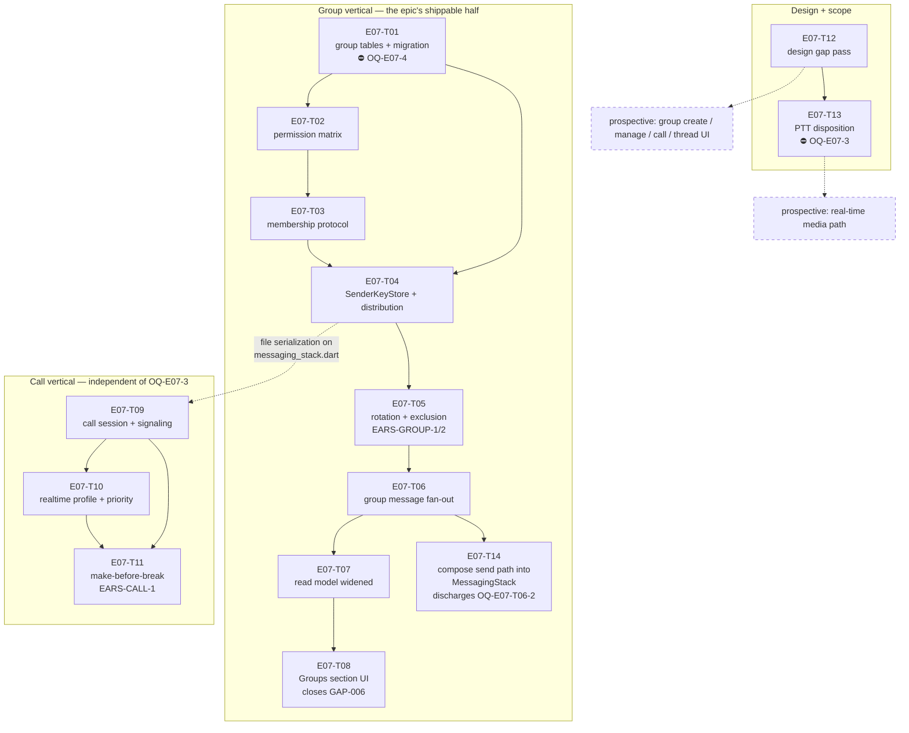

# E07 · Groups & Voice Calls · Progress

**Status:** in-progress (T01/T02/T03/T04/T05/T06/T09/T10/T12/T13/T14
merged to `epic_07`, GAP-023 approved, `OQ-E07-T06-2` closed) ·
**Started:** 2026-08-31 ·
**Completed:** — · **Progress:** 11/14

## Tasks

| Task | Title | Layer | Size | MoSCoW | depends_on | Status |
|---|---|---|---|---|---|---|
| E07-T01 | Group data model + schema migration | backend | M | must | — | done · builder (sonnet) → reviewer (opus) · APPROVE round 2 · squash-merged `6d5a861` (PR #1) |
| E07-T02 | Group role permission matrix | backend | S | must | T01 | done · builder (sonnet) → reviewer (opus) · APPROVE · squash-merged `e0ec39b` (PR #2) |
| E07-T03 | Group membership control protocol | backend | M | must | T02 | done · builder (sonnet) → reviewer (opus) · APPROVE round 2 · squash-merged `d6c0a2b` (PR #4) |
| E07-T04 | Drift-backed `SenderKeyStore` + key distribution | backend | M | must | T01, T03 | done · builder (sonnet) → reviewer (opus) · APPROVE round 2 · squash-merged `82d6f20` (PR #5) |
| E07-T05 | Key rotation on membership change + exclusion | backend | M | must | T04 | done · builder (sonnet) → reviewer (opus) · round 1 CHANGES → round 2 APPROVE · squash-merged `dfec62f` (PR #6) |
| E07-T06 | Group message send/receive fan-out | backend | M | must | T05 | done · builder (sonnet) → reviewer (opus) · round 1 CHANGES → round 2 APPROVE → collision-fix APPROVE · squash-merged `6e4864d` (PR #8) |
| E07-T07 | Conversation read model widened to groups | backend | S | must | T06 | todo |
| E07-T08 | Conversations "Groups" section (closes GAP-006) | frontend | M | must | T07 | todo |
| E07-T09 | Call session state machine + signaling | backend | M | should | T04 | done · builder (sonnet) → reviewer (opus) · round 1 CHANGES → round 2 APPROVE · squash-merged `586c8de` (PR #7) |
| E07-T10 | Real-time traffic profile + call priority | backend | M | should | T09 | done · builder (sonnet) → reviewer (opus) · round 1 CHANGES → round 2 CHANGES (narrow) → round 3 APPROVE · squash-merged `93c3069` (PR #10) |
| E07-T11 | Make-before-break call route migration | backend | M | must | T09, T10 | todo |
| E07-T12 | E07 design gap pass — derived contracts | docs | M | must | — | done · planner (opus) → reviewer (sonnet), APPROVE · merged `6f808fc` |
| E07-T13 | PTT — resolve `OQ-E07-2` ⛔ | docs | S | could | T12 | done · planner (opus) → reviewer (sonnet) · APPROVE · squash-merged `5f6a81e` (PR #3); GAP-023 human-approved `23c88ab` |
| E07-T14 | Compose the group send path into `MessagingStack` | backend | S | must | T06 | done · builder (sonnet) → reviewer (opus) · APPROVE · squash-merged `517a1e9` (PR #9) |

⛔ = carries or is blocked by a 🧍 Open Question — see §Blocked.

## Dependency graph

**Parallel sets** (file-collision-checked, analyze gate §Collision matrix):
`{T01, T12}` → `{T02}` → `{T03}` → `{T04}` → `{T06, T09}` →
`{T07, T10, T14}` → `{T08, T11, T13}`.

**T14 blocks nothing, verified against the task files rather than assumed.**
T07 is a read projection (`conversation_repository.dart`,
`conversation_summary.dart`) and T08 lists groups on the Conversations
screen — neither sends a group message, and the first thing that would (a
group *thread* view) is prospective and blocked on GAP-020. `messaging_stack.dart`
is in no other unmerged E07 task's `files:` fence, so T14 parallelises with
T07/T08 cleanly.

**T09's `depends_on: [E07-T04]` is deliberate serialization, not a semantic
dependency** — call signaling needs nothing from the sender-key layer, but
both register a control kind in `lib/core/messaging/messaging_stack.dart`.
Do not "fix" the DAG by removing it.

## Blocked / Frozen

- **`E07-T01` — 🧍 `OQ-E07-4` (schema migration 12 → 13).** Rule 3 names
  schema migrations as a human call. The DDL and three forks are on the
  task file. **The whole group vertical T02…T08 sits behind this.**
- **`E07-T13` — 🔴 `OQ-E07-3` (real-time media transport).** The human's
  own parking condition for PTT (`IMP-001`). T13 must not start while
  `OQ-E07-3` is open.
- **Prospective media path, and the four prospective UI tasks** — blocked
  on `OQ-E07-3` and on 🧍 `design_contract_approval` for GAP-018…GAP-022
  respectively. Neither is sharded; see `epic.md` §Tasks.

**Not blocked, contrary to first appearance:** `E07-T09`, `E07-T10` and
`E07-T11` are dispatchable without `OQ-E07-3` — the epic is sliced so the
call session, priority and migration *control* are independent of the media
transport, with `NullCallMediaTransport` as the honest v1 seam.

## Gates

| Gate | State |
|---|---|
| 🧍 `analyze_report` | ⏳ AWAITING HUMAN acceptance of the disclosed MoSCoW exception (`epic.md` §Analyze report) — not blocking dispatch |
| 🧍 `OQ-E07-4` — schema migration | ✅ resolved 2026-08-31 — all 3 advisories accepted; unblocks T01→T08 |
| 🟢 `OQ-E07-3` — real-time media transport | ✅ resolved 2026-08-31 — (a) datagram audio over mesh, (c) named fallback; unblocks T13 + prospective media path |
| 🧍 `design_contract_approval` | ✅ cleared by human, 2026-08-31 — GAP-018…GAP-022 (`design/gaps.md`) |

## Review log
(date · task · reviewer model · outcome · design gate %)
- 2026-08-31 · E07-T12 · independent reviewer (sonnet-5, ≠ executed_by
  claude-opus-5/planner, rule 5) · APPROVE · n/a (docs task, no
  `design_contract` — the three new contracts are `source: derived`
  screens with no golden yet, so `make design-verify` does not apply at
  this stage per `design-fidelity` §3; confirmed with `node design/tools/
  verify.mjs --screen group-create` → "no screen matched", the expected
  result). Scope confined to `files:` (3 new contracts + `design/gaps.md`
  `built:`/clarification lines only) — independently confirmed empty
  `git diff` on `chat.md`/`conversations.md`/`devices.md`/`dashboard.md`/
  `chat-voice.md`/`design/thresholds.yaml`/`docs/impact/
  IMP-001-ptt-rehome-to-e07.md`. GAP-019's two fork resolutions (full-screen
  confirm, no modal primitive; plain text role label, no icon) honoured
  literally in `group-manage.md`. `call.md`'s 4+1 states complete and
  honest — `failed` states plainly that audio can't be carried
  (`NullCallMediaTransport`), never renders as connected; no speaker/video/
  add-participant/keypad/hold/record anywhere. GAP-022's migration UI is a
  real distinct `in-call-degraded` state, not conflated with `failed` or
  `in-call`. Independently spot-checked ≥5 token values per new contract
  against the parent contracts' own element/token rows — all traced, no
  invented value. All 5 `approved by:` lines on GAP-018..022 confirmed
  pre-existing on `epic_07` (commit `88a4d5c`, authored by the human,
  predating this task's branch point) — `E07-T12` only cites them, never
  authors one (`L-process-002` clean). GAP-017 byte-identical, `IMP-001`
  untouched. Both flagged deviations judged sound: `docs/routes.md`
  correctly withheld as genuinely outside the `files:` fence (rule 6 over
  a conflicting §3/§7 instruction, route info preserved in each contract's
  `impl_path`); the top `design_contract_approval` gate line correctly left
  untouched since it was cleared by the human in `88a4d5c`, already on
  `epic_07` before this task branched — reverting it would have erased a
  real human decision, not corrected a stale checklist item. See
  `epics/E07-groups-calls/tasks/E07-T12.md` Run log for full evidence.
- 2026-08-31 · E07-T13 · independent reviewer (sonnet-5, ≠ executed_by
  claude-opus-5/planner, rule 5) · APPROVE · n/a (docs task, `design_contract:
  n/a`). Diff is exactly `design/gaps.md`, `epics/E07-groups-calls/epic.md`
  and this task file — no Dart file touched (`git diff --stat` against
  `epic_07` confirmed 3 files, 445 insertions, 0 code files), `pubspec.yaml`
  unchanged, `flutter analyze` clean and `flutter test` 337/337 green
  (worktree not on this branch's exact commit, but irrelevant here since the
  diff contains zero Dart changes by construction). **Load-bearing claim
  independently re-derived, not trusted from the transcript:** read
  `spec/srs.md` directly — FR-STORE-002 ("store voice messages, PTT
  recordings, and call recordings locally on-device") does read as a stored
  artifact, not a live channel; FR-CALL-001/002/003 (the entire call
  chapter) never mention PTT; FR-NOTIFY-001 and FR-PLAT-001 list PTT as its
  own item alongside voice messages/calls, consistent with either reading
  but not asserting a live one. The spec reading behind outcome (b) is
  accurate and not cherry-picked. **GAP-023 read in full:** supersedes
  GAP-017 by reference — confirmed by diffing `design/gaps.md`, which
  contains **zero removed/changed lines**, only two pure-insertion hunks (a
  new blockquote note above the clearance history, and the new GAP-023
  section) — GAP-017's own block is untouched. The proposed UI delta (P1-P6)
  is genuinely derivative: press-and-hold on the existing `mic` button (no
  new element), GAP-014's V3/V4/V5 transmitting treatment unchanged, one new
  string `Transmitting…`, no stop/cancel (release commits), the delivered
  bubble V10-V16 unchanged — no new token, geometry or glyph invented.
  `approved by:` is bare (`_<human>_ on _<date>_`), not self-approved.
  **Group PTT reasoning judged sound, not a dodge:** under the
  message-artifact reading (itself spec-supported, not invented for
  convenience), two members holding the button simultaneously do produce two
  independent voice-message clips with no shared resource to arbitrate —
  the floor-control problem only exists under the live-channel reading,
  which GAP-023 explicitly flags as an open fork for the human rather than
  silently foreclosing. This is a genuine consequence of the chosen
  interpretation, not a reframing that avoids the question — and the entry
  says outright that floor control returns if the human takes the other
  fork, rather than hiding that cost. **The `files:`-fence deviation
  (inlining the delta into GAP-023 instead of `chat-ptt.md`/`chat-voice.md`)
  was the right call**: §5 named those files as the artifact shape but
  `files:`'s `create:` is empty and `chat-voice.md` is not in `update:`;
  rule 6 makes the fence binding over a conflicting task-authoring
  instruction, and amending an already-approved contract file before the
  human approves the amendment is exactly what `L-process-002` exists to
  prevent. A named follow-on docs task to fold the rows into
  `chat-voice.md` post-approval is the correct resolution — stopping to
  escalate would have been needless process for a documented, reasoned,
  rule-6-compliant substitution that stayed inside the letter of the task's
  own `files:` contract. `IMP-001` confirmed untouched (`git diff` empty).
  `epic.md`'s `OQ-E07-2` confirmed 🟢 with the GAP-023 answer copied
  verbatim (matched sentence-for-sentence against the GAP-023 source, not
  paraphrased) into both the §Open Questions entry and the §Tasks/
  §Follow-on/§Risks rows, all consistent with outcome (b). **Noted, not
  fixed (out of this task's scope, flagged by the planner and confirmed
  present):** `epic.md`'s `OQ-E07-3` block carries three leftover template
  lines (`**Answer:** _<empty>_` / `**Answered by:** _<human>_` / `**Date:**
  _<YYYY-MM-DD>_`) sitting directly below the human's real, filled-in
  Status/Answered by/Date lines for that question — left for the
  orchestrator's own cleanup commit, correctly not touched here since it
  sits inside a human decision record. **GAP-023 itself is not approved by
  this review** — it is 🟡, `design_contract_approval` still open on it, and
  that sign-off is a separate 🧍 human gate outside this review's scope to
  grant.

## Carried-forward observations (not yet a task)
_(empty at sharding — created deliberately so it has a reader from day one.
`L-process-008`, promoted to a rule after E06: **read this section before
each new dispatch and cross-check the next task's `files:` fence.** E06's
highest-severity finding, `E06-B02` (S1), sat correctly recorded in this
exact section for eight tasks with no reader.)_

- **2026-09-01 · E07-T09/T10 seam · per-destination route-profile
  stickiness (advisory, S4).** `RoutingEngine._lastProfile`
  (`routing_engine.dart:121`) is keyed per-destination and never reset.
  E07-T10 makes call signaling compute routes under `TrafficProfile.realtime`
  for a peer; if that same peer is later messaged ordinarily and the send
  fails, the fallback route is computed under the leftover `realtime`
  profile rather than `interactive`/`bulk`. Not reachable as a
  confidentiality or correctness bug — only a routing-cost artifact — and
  documented in `E07-T10.md` §9 Deviations. **Owner: the epic sweep** —
  check whether messaging's route-failure path should reset or ignore a
  stale `realtime` profile left by an unrelated call.

- **2026-08-31 · E07-T01 · migration-test completeness (advisory, S4).**
  `test_EARS_GROUP_5_v12_upgrades_to_v13_additively` proves every pre-existing
  table's DDL is byte-identical across 12→13 and that the 4 expected tables +
  3 expected indexes exist — but it does not assert the added set is *exactly*
  those 7, so an unintended 8th entity created by a future migration step would
  not fail it. Property holds today (reviewer-probed at round 1). **Fold into
  whichever later E07 task edits the `from < 13` step or adds a `from < 14`
  step** (`E07-T02`/`T03`/`T04` all depend on T01 and may touch
  `database.dart`), or explicitly note why it stays out of scope.
  - **2026-08-31 · checked at E07-T02 dispatch:** T02's `files:` fence creates
    two new files only and does not touch `database.dart` — correctly stays
    out of scope. Re-check at T03/T04.
  - **2026-08-31 · checked at E07-T03 dispatch:** T03's `files:` fence
    updates `messaging_stack.dart` only, not `database.dart` — stays out of
    scope. Re-check at T04 (which does touch persistence for
    `SenderKeyStore`).
  - **2026-08-31 · checked at E07-T04 dispatch:** T04's `files:` fence creates
    `drift_sender_key_store.dart`/`group_crypto_service.dart` and updates
    `messaging_stack.dart` only — it reads/writes the `group_sender_keys`
    table T01 already created via the generated `AppDatabase`, but does not
    touch `database.dart` or add a migration step. Stays out of scope. This
    observation has now been checked at every task since T01 with no hit —
    re-check once more at whichever task first adds a schema version beyond
    13, then this line can be retired.

- **(from E07-T03 review, 2026-08-31) `decodeCiphertextControlBody`/
  `drift_signal_store.dart` TOFU gap does not apply to T04.** T04's `files:`
  fence does not reach `drift_signal_store.dart` (confirmed above) — this
  observation's owner remains E11, not this task.

- **2026-08-31 · E07-T02 · `allows` throws where §5 says it never does
  (advisory, S3 — a spec-text defect, not a code defect).** `E07-T02.md:107`
  ("Total — never throws, never returns null") contradicts `E07-T02.md:136`
  ("Assert loudly rather than defaulting to `false`"). The implementation
  correctly follows §6 and throws `ArgumentError` when `removeMember`/
  `removeAdmin` get a `null` subject (`group_permissions.dart:63-69, 78-84`).
  **Risk lands on E07-T03/T06:** a caller reading only §5 writes
  `if (!GroupPermissions.allows(...)) deny;` and gets an uncaught
  `ArgumentError` — at a network-frame boundary — where it expected a denial.
  **Fold into E07-T03** (the first caller): either wrap the call or assert the
  subject non-null before it, and have the planner correct §5's wording.

- **2026-08-31 · E07-T02 · removed members are not expressible in
  `GroupRole` (advisory, S2 if it reaches a caller unhandled).** §2
  (`E07-T02.md:64-66`) makes `removed_at_epoch IS NOT NULL` a hard `false` for
  every action, but `GroupPermissions` is pure and takes only a `GroupRole`,
  which has no "removed" value — `sendMessage` returns `true` unconditionally
  (`group_permissions.dart:110-111`). This is correct per §4 (the caller loads
  the roles) and unfixable inside T02's fence, but it means **any T03/T06 query
  that loads a `GroupMembers` row without `WHERE removed_at_epoch IS NULL`
  silently grants a removed member full member rights.** T01 deliberately
  retains removed rows rather than deleting them (`group_tables.dart:118-121`),
  so the stale row is always there to be loaded. **Fold into E07-T03 and
  E07-T06** — the enforcing layers — as an explicit precondition on every role
  load.

- **2026-09-01 · E07-T06 → E07-T14 sharding · `kControlKindGroupMessage`
  registration is the only handler not wired in the composition root
  (advisory, S4 — a consistency cost, not a defect).** E07-T06 self-registers
  its control kind inside `InboundPipeline`'s own constructor (T06 §9
  Deviation 2) because no external call site existed inside its `files:`
  fence; kinds 1–5 are all registered from `messaging_stack.dart`. E07-T14
  creates that external call site, so the question became live and was
  deliberately answered **no** — see `E07-T14.md` §4 for the three reasons
  (it proves none of T14's own criterion; it is an `inbound_pipeline.dart`
  refactor whose failure mode is a silently unregistered handler with a green
  suite, deserving its own falsification test; and T06's closure form is safe
  as written). **Owner: whichever later task next edits
  `inbound_pipeline.dart`'s control-handler registrations, or the E07 bug
  sweep.** Re-check at each such dispatch, `L-process-008` style.

- **2026-09-01 · E07-T06 · control-kind slot collision (S1, reported against
  PR #8 — T06's to fix before merge, NOT T14's).** T06 branched at `182c6e6`,
  before T09 merged, and assigns `kControlKindGroupMessage = 5`
  (`group_message_envelope.dart:58`) — the slot `kControlKindCallSignaling = 5`
  (`call_signaling.dart:95`) already occupies on `epic_07`.
  `InboundPipeline.registerControlHandler` rejects a duplicate slot, so an
  unrenumbered merge makes **every** `MessagingStack.create` throw. Recorded
  in `E07-T14.md` §6 as a precondition to verify at that task's branch point.

- **(from E07-T03 review, 2026-08-31) Group-control authentication is only as
  strong as the project's trust-on-first-use identity model — owner: E11, not
  this epic.** E07-T03 correctly routes around E06-B04 (verified: a forged
  `frame.source` cannot authenticate a membership frame). One residual gap
  sits *below* it, in shared crypto that T03's fence does not reach:
  `decodeCiphertextControlBody` accepts `PreKeySignalMessage` as well as
  `SignalMessage` (`group_control.dart`), and
  `DriftSignalProtocolStore.isTrustedIdentity`
  (`drift_signal_store.dart:139-150`) returns `true` whenever no identity key
  is yet recorded for an address. So for a group member this device has
  **never** exchanged messages with, an attacker can send a
  `PreKeySignalMessage` with `source: <that member>`, establish a fresh
  session under that address, decrypt successfully, and set a matching
  `actorDeviceId` — passing both of T03's gates. Reach is narrow: any member
  already talked to is protected (their stored identity key makes the forgery
  fail with `untrustedIdentity`), and the same TOFU applies to every ordinary
  chat message today, so this is **not** a regression T03 introduced and is
  strictly stronger than the `frame.source` trust it replaces. It is the
  identity-verification half of ADR-0003 that no epic has yet owned. Revisit
  trigger: E11's transport-frame signing / identity-verification work, or the
  first journey where a user is added to a group by a device they have never
  messaged. **Do not fold into E07-T04/T05/T06** — none of their fences reach
  `drift_signal_store.dart`.

## Review log

### E07-T01 — 2026-08-31 — 📋 **CHANGES** (reviewer: opus; `executed_by`: builder-sonnet ✅ rule 5)

- **scope:** in-contract. `git diff --name-only epic_07...epic_07_task_01` =
  exactly the 4 files in `files:` + the task file. `git diff` on
  `crypto_tables.dart` / `message_tables.dart` / `relay_tables.dart` /
  `relationships_table.dart` / `sync_tables.dart` is **empty** (verified).
  §4 respected — no `SenderKeyStore`, no permission matrix, no rotation, no
  `Conversations` table, no new dependency.
- **OQ-E07-4 (all three human decisions verified in the built DDL,** dumped
  from `sqlite_master` by my own probe, not read off the source**):**
  1. ✅ `group_sender_keys ... PRIMARY KEY ("group_id", "sender_device_id", "membership_epoch")` — epoch **in** the PK.
  2. ✅ `group_members."removed_at_epoch" INTEGER NULL`; row retained, never deleted (`group_tables.dart:118-121`).
  3. ✅ `group_events` is its own table; `messages` untouched.
- **suite:** ✅ ran myself — `flutter analyze` → *No issues found!*;
  `flutter test` → **391/391 pass** (384 prior + 7 new). Builder's numbers confirmed.
- **regeneration:** ✅ `database.g.dart` not hand-edited — I re-ran
  `dart run build_runner build` and the result is **content-identical** to the
  committed file (`git diff` empty; md5 differs only by CRLF/LF). The 3895/1306
  line churn is drift's manager-class boilerplate, machine output throughout.
- **index materialization (the E05-T01 lesson):** ✅ all three indexes are
  created by explicit `customStatement` in the `from < 13` step
  (`database.dart:277-295`), and my probe confirms they exist **on both paths** —
  fresh `createAll` install *and* v12 upgrade — with the correct DDL, including
  the partial predicate `WHERE role = 'owner' AND removed_at_epoch IS NULL`.
- **falsification re-run (independently, not trusting the builder's claim):**
  removed the `idx_group_single_owner` `customStatement` →
  `test_EARS_GROUP_4_second_current_owner_is_rejected` failed
  (*Expected: throws anything / Actual: Instance of 'Future<int>'*) **and**
  `test_EARS_GROUP_5_v12_upgrades_to_v13_additively` failed
  (*idx_group_single_owner should exist*). Both failed **for the right reason**.
  Restored → md5 `269f8b51a1a5a8500213539be4f49130`, byte-identical, suite green.
- **EARS:** 3/3 have a test named by their id; **GROUP-3 ✅, GROUP-4 ✅,
  GROUP-5 ⚠️ partially verified** — see the finding.
- **design gate:** n/a (`design_contract: n/a`, pure persistence).
- **security lens:** n/a — no auth/payment/RBAC surface. No key material is
  generated, parsed or logged; `record` stays an opaque BLOB.

**❌ Finding (must fix, 1):**
`test/core/persistence/group_tables_test.dart:221-244` — the
`preExistingTables` loop is labelled *"Byte-identical schema check on every
non-group table: the CREATE TABLE SQL captured by sqlite_master for each must
be exactly what it was pre-migration"* and it does `SELECT sql FROM
sqlite_master`, but then **discards the `sql` column and asserts only
`expect(rows, hasLength(1))`** — i.e. it proves the table still *exists*,
never that its DDL is unchanged. §8 requires the assertion explicitly
("assert … that `messages`, `relationships` and every `signal_*` table are
**byte-identical in schema** to before"), the test's own comment claims it,
and the §9 DoD box is ticked for it — three places assert a check that isn't
there. **Why it matters:** an `ALTER TABLE` added to the `from < 13` step by
any future task would leave this test fully green. That is exactly the
E05-T01 class of migration bug the task's §6 warns against, in the one test
guarding the epic's riskiest property. Fix: capture the `sql` strings before
opening `AppDatabase`, and compare after the migration.

**Note — the underlying property is TRUE, only unproven by the suite.** My own
probe captured `sqlite_master.sql` for `messages`,
`idx_messages_conversation_created_at`, `relationships` and `signal_sessions`
pre-migration and string-compared post-migration: all identical, and the set
added by 12→13 is exactly the 4 tables + 3 indexes and nothing else. So this
is a **test-strength** fix, not a code fix — `group_tables.dart` and the
migration step need no change.

### E07-T01 — 2026-08-31 — ✅ **APPROVE** (round 2; reviewer: opus; `executed_by`: builder-sonnet ✅ rule 5)

Round-1's single finding is **closed**. Verified independently from the diff and
a re-run, not from the builder's transcript.

- **scope: in-contract.** `git diff d319db6..a9fe875 --name-only` returns exactly
  two paths: `test/core/persistence/group_tables_test.dart` and
  `epics/E07-groups-calls/tasks/E07-T01.md`. The three production files are
  provably untouched — blob hashes are identical on both sides:
  `group_tables.dart` `e6a7436…`, `database.dart` `7d4d3e7…`,
  `database.g.dart` `bc28885…`. So round 1's substantive approval still stands
  unchanged; this round only re-judged test strength.
- **the fix is real, not dressed up.** `group_tables_test.dart:191-209` opens a
  raw `sqlite3` in-memory handle, builds the v12 schema, and snapshots each
  pre-existing table's `sqlite_master.sql` into `preMigrationSql` — all of it
  **before** `AppDatabase.forTesting(...)` is constructed at line 212. The
  "before" snapshot therefore cannot have been taken through a migrated
  connection; the migration provably has not run at snapshot time.
  The assertion at `group_tables_test.dart:271-275` is a genuine string
  equality on the `sql` column (`rows.single.read<String>('sql')` vs the
  snapshot), not a weaker check. The map is typed `<String, String>` and built
  with `.single`, so a missing table throws rather than silently comparing
  against `null` — the degenerate always-green path is closed too.
- **EARS: 3/3.** EARS-GROUP-3 → `test_EARS_GROUP_3_new_group_has_epoch_zero_and_one_owner`;
  EARS-GROUP-4 → `test_EARS_GROUP_4_second_current_owner_is_rejected` (verified
  round 1 by falsification); EARS-GROUP-5 →
  `test_EARS_GROUP_5_v12_upgrades_to_v13_additively`, which now actually proves
  the "without altering any pre-existing table" clause it is named for.
- **suite: pass.** `flutter analyze` → *No issues found!*; `flutter test` →
  **391/391**, re-run by the reviewer on `a9fe875`.
- **falsification — reviewer's own probe, not the builder's.** Inserted
  `ALTER TABLE messages ADD COLUMN reviewer_probe_e07t01 TEXT;` into the
  `from < 13` step (`database.dart:275`, a different column name and site than
  the builder's `temp_falsification_check`, so the code cannot have been tuned
  to it). The test failed **for the right reason**: a DDL mismatch at
  `group_tables_test.dart:271`, reason string *"messages DDL should be
  byte-identical after migration"*, differing at offset 272 with the injected
  column visible in Actual. **The decisive detail:** the failure landed on
  line 271 (the new equality), *not* line 270 (`hasLength(1)`) — the pre-fix
  assertion passed this mutation, which is precisely the round-1 finding and
  precisely what the fix now catches. Probe reverted; `git diff` empty; full
  suite back to **391/391**.
- **design gate: n/a** (`design_contract: n/a`, pure persistence).
- **security: n/a** — no auth/payment/RBAC path. The single-owner invariant is
  DB-enforced (`idx_group_single_owner`), verified round 1.

**Carried forward (advisory, NOT a blocker):** round 1 also suggested
*considering* an assertion that the set 12→13 *adds* is exactly the 4 tables +
3 indexes, which would catch an unintended extra entity. That was phrased as
optional and remains unimplemented; the current test verifies the 7 expected
entities exist but would not notice an 8th. The property holds today (confirmed
by the round-1 probe). Recorded in §Carried-forward observations for whichever
later E07 task touches this migration — not grounds to hold this PR.

### E07-T02 — 2026-08-31 — 📋 **APPROVE** (reviewer: opus; `executed_by`: builder-sonnet ✅ rule 5)

- **scope: in-contract.** `git diff --stat origin/epic_07...origin/epic_07_task_02`
  = exactly the 2 files in `files:` (`lib/features/groups/domain/group_permissions.dart`,
  `test/features/groups/domain/group_permissions_test.dart`) + the task file.
  §4 respected: the source imports only `GroupRole` (an enum) and `AppFailure`,
  both `show`-scoped — no `drift`, no `dart:io`, no `DateTime.now()`, no
  `GroupRepository`, no controller, no UI, no 4th role, no trust/blocking.
- **§5 matrix: 11/11 rows verified cell-by-cell, independently.** I did not
  read the builder's expectation table as evidence — I re-encoded §5 myself as
  a literal string table (`'leave|*': 'FTT'` etc.) in a throwaway probe and ran
  it against the shipped code: **105/105 pass**. Probe deleted; `git status`
  clean.
- **No owner shortcut (the §6 risk).** `group_permissions.dart:108` is
  `return actorRole != GroupRole.owner` for `leave`, and there is no
  `if (role == owner) return true` anywhere. **Falsified, not assumed:** I
  injected exactly that line at the top of `allows` → my probe failed on
  `§5 leave|* actor=owner` (*Expected: false / Actual: true*) and the builder's
  suite failed **14** tests. Reverted; `git diff` empty.
- **Second falsification** — inverted the owner-protection guard at
  `group_permissions.dart:70` (`subjectRole != GroupRole.member` →
  `== GroupRole.admin`) → my probe failed on `§5 removeMember|owner` for both
  owner and admin actors, and `test_nobody_can_remove_the_owner` failed.
  Reverted; suite back to green. Both probes failed for the *right* reason.
- **Exhaustiveness: genuinely 120, verified by count not by claim.** Ran the
  matrix group alone with `--plain-name` → `+120: All tests passed!`; whole
  file → `+128`. That is `GroupAction.values (10) × subjects (3 roles + null)
  × GroupRole.values (3)`, a real triple-nested Cartesian loop
  (`group_permissions_test.dart:106-137`), not spot checks.
- **EARS: 2/2 verified.**
  - EARS-GROUP-6 → `test_EARS_GROUP_6_owner_may_perform_every_fr_group_002_action`,
    which asserts all six actions `spec/srs.md:121` names, by name.
  - EARS-GROUP-7 → `test_EARS_GROUP_7_admin_cannot_grant_admin_or_transfer_or_delete`,
    `..._member_cannot_perform_any_management_action`, and
    `..._denial_returns_group_forbidden_failure` (asserts `failure!.code ==
    'group.forbidden'` **and** `null` on the allowed path).
- **suite: ✅ ran myself** on `733ee60` — `flutter analyze` → *No issues found!*;
  `flutter test` → **519/519** (391 prior + 128 new). Builder's numbers confirmed.
- **`AppFailure('group.forbidden')` is the existing convention, not a new
  shape.** Repo-wide survey of `AppFailure('…')` literals returns
  `auth.google_sign_in_failed`, `messaging.bundle_unavailable`,
  `messaging.no_session`, `messaging.peer_blocked` — `<domain>.<snake_case>`,
  and `messaging.peer_blocked` is the direct denial analogue. The import path
  (`core/auth/google_auth_service.dart`) matches
  `lib/features/messaging/domain/send_message_use_case.dart` and three others.
  (`docs/conventions.md:52` still describes an aspirational `sealed class
  AppFailure` with a `message` field that the concrete E06-T02 class does not
  have — a pre-existing repo-wide divergence, not this task's to fix.)
- **OQ-E07-5 correctly left open** — still 🟡 important, `Answer: _<empty>_`,
  `E07-T02.md:266-280`. The narrow reading shipped; the widening decision was
  not silently taken.
- **design gate: n/a** (`design_contract: n/a`, pure function).
- **security lens (RBAC — run, not skipped):**
  - #6 default-deny → **PASS**. The `switch` at `group_permissions.dart:60-110`
    has no `default:` and no trailing `return`; a future `GroupAction` value is
    a *compile error*, not a silent allow. Fail-closed at compile time.
  - #7 not-only-in-the-UI → **PASS** by construction; §4 forbids a second
    UI-side rule and GAP-019 defers the group-manage rows to this matrix.
  - #9 no privilege-escalation path → **PASS**, probed above. Admin is denied
    `grantAdmin`/`revokeAdmin`/`transferOwnership`/`deleteGroup`/`removeAdmin`,
    and the *wrong-action* escalation (an Admin removing another Admin via
    `removeMember`) is closed at `group_permissions.dart:70-76`.
  - 🧍 `auth_or_payment_code` gate **not triggered**: no file under an auth or
    payment path changed — `lib/core/auth/` is imported for a type only, and is
    byte-identical on this branch.
- **`L-process-008` check.** T01's carried-forward migration-test item names
  `E07-T02` as a candidate. T02's `files:` fence creates two new files and does
  not touch `database.dart` or the `from < 13` step, so it correctly **stays out
  of scope** here — re-check at T03/T04.
- **The three self-resolved cells (§Deviations) — judged, not rubber-stamped.
  All three are sound and correctly kept inside the contract:**
  1. `removeMember` with `subjectRole == admin` → `false`. **Forced, not
     chosen.** Had it returned `owner||admin`, an Admin could remove another
     Admin through the wrong action — precisely the power §5's
     `removeAdmin (subject = admin)` row reserves for the Owner. Denial is the
     only reading under which the two actions are not redundant. Escalating
     this would have been over-caution.
  2. `removeAdmin` with `subjectRole` = `owner`/`member` → `false`. Correct;
     `owner` is mandated by the never-remove-the-owner invariant and `member`
     simply isn't this action's subject. A `throw` was equally defensible here,
     but denial is the conservative, reversible choice.
  3. `null` subject → `ArgumentError`. §6 (`E07-T02.md:135-138`) instructs this
     literally for `removeMember`; generalizing it to `removeAdmin` — the only
     other subject-conditioned action, identical failure mode — is the only
     consistent reading. Correct.
  **My one dissent is procedural, not substantive** — see §Carried-forward.

**Carried forward (advisory, NOT blockers — neither is fixable inside this
task's fence):**
1. **§5/§6 contradict each other on throwing.** `E07-T02.md:107` says `allows`
   is "Total — never throws"; `E07-T02.md:136` says to assert loudly on a null
   subject. The builder resolved toward §6 (the specific risk note over the
   generic prose) and documented it in the dartdoc — the right call — but
   resolved it *in code* rather than naming it as a contract defect. It matters
   for **E07-T03**: an implementer reading only §5 will write
   `if (!allows(...)) deny;` and get an uncaught `ArgumentError` where they
   expected a denial, at a network-frame boundary. Planner should fix §5's
   wording; T03's brief should carry the null-subject precondition explicitly.
2. **The removed-member seam.** §2 (`E07-T02.md:64-66`) makes
   `removed_at_epoch IS NOT NULL` a hard `false` for *every* action, but
   `GroupRole` has no "removed" value and this pure function cannot express it —
   `sendMessage` returns `true` unconditionally
   (`group_permissions.dart:110-111`). Correct per §4 (the caller loads the
   roles), but a **T03/T06 caller that loads a `GroupMembers` row without
   filtering `removed_at_epoch IS NULL` will permit a removed member to send.**
   The source header names the caller's duty to load roles but not this
   precondition. Fold into E07-T03/T06 — the enforcing layers.

### E07-T03 — 2026-08-31 — 📋 **CHANGES** (reviewer: `claude-opus-5`; `executed_by`: `claude-sonnet-5` ✅ rule 5)
PR #4 → `epic_07`. Verdict comment:
https://github.com/SHAJED99/nexora/pull/4#issuecomment-5476821197

- **scope: in-contract.** Diff is exactly the 7 `files:` entries + the task
  file. Independently confirmed **empty** `git diff epic_07 epic_07_task_03`
  on `inbound_pipeline.dart`, `prekey_exchange.dart`, `delivery_ack.dart`,
  `relay_packet_frame.dart`. `messaging_stack.dart` is a 24-line pure
  insertion (3 imports, one `late final` field, construction +
  `registerControlHandler(kControlKindGroupControl, ...)`) — no existing
  member's wiring touched. §4 respected: no `SenderKeyStore`/rotation/
  fan-out/UI anywhere in the diff.
- **suite: pass, run by the reviewer.** `flutter analyze` → *No issues
  found!*; `flutter test` → **546/546**. New-test count measured
  independently by running only the three new files: **exactly 27**
  (519 + 27 = 546); the PR body's "~26" was one short.
- **EARS: 4/4 verified** with a named test each, GROUP-10 additionally
  falsified (neutering the `actorDeviceId` guard at
  `group_membership_service.dart:459` makes it fail for the right reason —
  `Expected: <1> Actual: <0>` on `groupUnauthenticated`; restored verbatim,
  green again).
- **design gate: n/a** (`design_contract: n/a`, backend task).
- **security lens (E06-B04 inheritance): PASS.** The `frame.source`
  decrypt-hint deviation is real, narrow and justified. The
  `inbound_pipeline.dart:349` precedent it cites genuinely exists on
  `epic_07`. Two independent gates hold: a lie in `frame.source` selects the
  wrong session so `CryptoService.decrypt` fails →
  `groupUnauthenticated` + silent drop
  (`group_membership_service.dart:423-430`); a frame that decrypts honestly
  but claims a different actor is caught at `:459`. Reviewer wrote the
  complementary test the builder did not — E06-B04's literal shape, a
  **forged `frame.source`** (device-b encrypts under device-a's session,
  sets `source: 'device-a'`, tries to remove device-c) — and it is
  correctly rejected: `groupUnauthenticated == 1`, device-c still a member,
  epoch still 0. **E06-B04 is not inherited.**
- **Carried-forward finding #2 (`removed_at_epoch`) CLOSED.** Read the
  actual Drift query: `group_repository.dart:roleOf` and `currentMembers`
  both filter `t.removedAtEpoch.isNull()`; `_checkPermission` loads every
  role through `roleOf`, so no stale role can reach `GroupPermissions`.
- **Carried-forward finding #1 CLOSED on the receive side, REOPENED on the
  send side** — the one blocking finding:
  ❌ **F1 (S3)** `group_membership_service.dart:270` skips the subject-role
  lookup when the subject is this device but does not re-route the action,
  so `removeMember(groupId, <self>)` reaches
  `GroupPermissions.check(removeMember, subjectRole: null)` at `:283` and
  throws an uncaught `ArgumentError` out of a `Future<AppFailure?>` API
  (`group_permissions.dart:125` → `:66`). Reproduced with an independent
  probe. Contradicts the file's own comment at `:272-277`. Sender and
  receiver disagree: `group_repository.dart:_checkPermission` correctly maps
  a self-targeted `memberRemoved` to `GroupAction.leave`; `:270` does not.
  Not remotely exploitable (the network path goes through
  `applyEvent`/`_checkPermission`, verified). Fix: evaluate
  `GroupAction.leave` for a self-subject, + a regression test.

Round 1 → back to the same implementer (`claude-sonnet-5`).

### E07-T03 — 2026-08-31 — 📋 **APPROVE** (round 2; reviewer: `claude-opus-5`; `executed_by`: `claude-sonnet-5` ✅ rule 5)
PR #4 → `epic_07`. Fix commits `b2bb3e7` (fix) + `fb862eb` (bookkeeping).
Re-review scoped to F1 and to proving nothing else moved.

- **scope: in-contract.** `git diff --stat 6a2a064 fb862eb` (round-1 review
  point → fix tip) is **exactly three files**: `E07-T03.md` (+52/-1 doc),
  `group_membership_service.dart` (+17/-1), and
  `group_membership_service_test.dart` (+30). Nothing else. The two
  round-1 CLOSED findings are provably untouched: `git diff 6a2a064
  fb862eb -- lib/core/messaging/group_control.dart
  lib/features/groups/data/group_repository.dart
  lib/core/messaging/messaging_stack.dart` → **empty output**.
- ✅ **F1 (S3) CLOSED.** `group_membership_service.dart:268,278-280`: a
  local `var effectiveAction = action;` is set to `GroupAction.leave` when
  `subjectDeviceId == _stack.selfDeviceId && action ==
  GroupAction.removeMember`, and `:299` now passes `action:
  effectiveAction` to `GroupPermissions.check`. The null-subject hazard is
  gone because `GroupPermissions.allows`'s `leave` row
  (`group_permissions.dart:104`) never reads `subjectRole`.
- **Sender/receiver parity verified by reading both, not by claim.**
  Receiver `group_repository.dart:324-333` branches on `subject ==
  frame.actorDeviceId` → `GroupAction.leave`. Sender branches on
  `subjectDeviceId == _stack.selfDeviceId`, and the sender stamps
  `actorDeviceId: _stack.selfDeviceId` on the frame it builds
  (`group_membership_service.dart:305`), so the two predicates are the
  same predicate. Both therefore deny an Owner's self-removal (leave
  denies Owner) and permit a Member's — they agree in both directions,
  which is the property that was broken.
- **`_kindFor` still keyed on the ORIGINAL action** — `kind: _kindFor(action)`
  at `group_membership_service.dart:302`, not `effectiveAction`. Verified
  empirically, not just by reading: the reviewer's own probe asserts the
  persisted `group_events` row at epoch 1 has `kind == 'memberRemoved'`
  with `actorDeviceId == subjectDeviceId == 'me'`. The permission-check
  substitution is local and does not leak onto the wire.
- **Falsification of the builder's regression test — passes.** Deleting the
  three-line `effectiveAction = GroupAction.leave` assignment makes
  `test_EARS_GROUP_9_self_targeted_removeMember_reroutes_to_leave_not_ArgumentError`
  fail **for exactly the right reason**: `Invalid argument (subjectRole):
  GroupAction.removeMember requires a subjectRole` at
  `group_permissions.dart:66` → `:125` →
  `group_membership_service.dart:295 _perform` — the literal F1 stack.
  Restored verbatim (`git diff --stat` → empty), green again.
- **Reviewer's own independent probe (stronger than the builder's).** The
  builder's test only covers the Owner case, where "re-routed to leave" and
  "blanket denied" are indistinguishable. The reviewer bootstrapped a group
  where the local device is a plain **Member** and called
  `removeMember(groupId, <self>)`: it returns `null` (permitted), the
  `GroupMembers` row is actually removed, and the event is `memberRemoved`.
  So the re-route is a genuine `leave` decision, not a deny-everything
  patch. Probe deleted after the run; working tree clean.
- **suite: pass, run by the reviewer.** `flutter analyze` → *No issues
  found!* (2.6s). `flutter test` → **547/547 passed, 0 failed** — the exact
  claimed count, 546 + exactly one new test.
- **design gate: n/a** (backend task, `design_contract: n/a`).
- **security lens: unchanged from round 1 — PASS.** The E06-B04 inheritance
  analysis and the `removed_at_epoch` finding both rest on files with an
  empty diff this round, so round 1's evidence stands unmodified.
- **Residual, non-blocking (recorded, not a finding):** self-targeted
  `GroupAction.removeAdmin` still leaves `subjectRole == null` and would
  throw, but it is unreachable — no `GroupMembershipService` entry point
  emits `removeAdmin`, and `_kindFor` itself throws `UnsupportedError` for
  it (`group_membership_service.dart:337-345`). Documented in-source. If
  E07-T04/T06 ever add a `removeAdmin` entry point, the same re-route
  question must be answered there.

No second rejection; no planner escalation needed. Ready for the
orchestrator to squash-merge to `epic_07`.

## Bug sweep
_(after all 14 tasks land — `skills/bug-sweep`. Note `L-process-009`: every
E07 bug task file must carry a §4 scope fence; every bug file in the
project before E06's retro lacked one.)_

## Event log (append-only)
- 2026-08-26 E07 drafted during Wave 1 epic-breakdown; deferred to a later wave.
- 2026-08-30 PTT re-homed from E06 to E07 by human decision (`IMP-001`,
  `GAP-017`); recorded as `OQ-E07-2` with the owner named as "this epic's
  sharding pass".
- 2026-08-31 **Sharded into 13 tasks** by the planner against `development`
  @ `73eb4b3` (384/384 green). `skills/task-sharding` §0 run before slicing:
  E06's retro + tracker (bug sweep, carried-forward observations, merge-gate
  notes), E05's and E03's retros, `IMP-001`, `design/gaps.md` GAP-006/017,
  and the E06 bug files were read, and **17 inherited obligations were
  enumerated** — see `epic.md` §Analyze report, *Inherited obligations*.
  `OQ-E07-2` (PTT) discharged into a named task, `E07-T13`. Design gap pass
  added GAP-018…GAP-022 to `design/gaps.md` (🟡, `design_contract_approval`
  reopened); only `E07-T08` is a sharded frontend task, the rest are
  prospective by rule 2. **Two rule-3 questions raised rather than guessed:**
  `OQ-E07-3` (real-time media transport for calls and PTT — no ADR covers
  it, every option is a new dependency) and `OQ-E07-4` (the group schema
  migration). ADR-0003's deferred Sender-Keys layering was designed
  deliberately at this pass, as that ADR and this epic's own §Risks both
  required, and recorded as `OQ-E07-8` for cheap rejection. Analyze report
  appended to `epic.md`; 🧍 `analyze_report` gate ⏳.
- 2026-09-01 **Sharded to 14 tasks** — `E07-T14` added by the planner on
  `epic_07`, discharging `OQ-E07-T06-2` (nothing in `lib/` constructs
  `SendGroupMessageUseCase`; `messaging_stack.dart` sat outside every E07
  task's `files:` fence) after the human approved the advisory to shard
  rather than widen T06 a second time. `depends_on: [E07-T06]`, `blocks: []`
  (verified against T07/T08's own task files, not assumed), size S, `must`,
  `traces_to: [FR-COMM-002]`, new criterion **EARS-COMM-35**. Two
  carried-forward observations recorded in the same pass: the control-kind
  slot collision on PR #8, and the deliberate decision not to normalize
  T06's self-registered handler inside this task.

### E07-T04 — 2026-08-31 — 📋 **CHANGES** (reviewer: `claude-opus-5`; `executed_by`: `claude-sonnet-5` ✅ rule 5) — full security lens

- **scope: in-contract.** `git diff --stat origin/epic_07...origin/epic_07_task_04`
  = exactly the 6 files in `files:` + the task file, nothing else. Independently
  verified **empty** `git diff` on `drift_signal_store.dart`, `crypto_stub.dart`,
  `identity_service.dart`, `prekey_exchange.dart`, `inbound_pipeline.dart` and
  **all of `lib/core/persistence/`** (no migration; `database.dart` untouched —
  T04 only reads/writes T01's `group_sender_keys`). §4 respected: no rotation
  trigger (E07-T05) and no group fan-out (E07-T06) leaked in — `grep -rn
  discardChains lib/` returns only its own definition at
  `group_crypto_service.dart:477` plus two doc references, i.e. **zero
  production callers**, inert exactly as §4 requires. No new dependency.
- **suite: green, run by me, not taken from the PR body.** `flutter analyze` →
  `No issues found!`. `flutter test` → **569/569 pass** (547 prior + 22 new),
  matching the builder's reported numbers.
- **No hand-rolled crypto — PASS.** Re-ran and broadened the grep
  (`AES|Hmac|sha256|Random(|dart:math|xor|^=|Hkdf|derive|Pbkdf|md5`,
  case-insensitive) across both new files: the only hits are
  `GroupCipher(_senderKeyStore, name)` at `group_crypto_service.dart:435,462` —
  libsignal's own class. Every key/ratchet/cipher operation is a
  `libsignal_protocol_dart` call. Confirmed at the library level too:
  `key_helper.dart:64` seeds `final Random _random = Random.secure()`, so
  `generateSenderKeyId`/`generateSenderKey`/`generateSenderSigningKey` are
  CSPRNG-backed. `dart:convert` is imported only for `utf8.encode(groupId)` in
  the envelope codec, never for key handling.
- **Distribution rides the pairwise session — PASS.** `_sendOne`
  (`group_crypto_service.dart:300-336`) routes `PrekeyExchange.ensureSession`
  → `CryptoService.encrypt` (the pairwise Double Ratchet) →
  `encodeCiphertextControlBody` → `RelayEngine.enqueue`, the exact shape
  `GroupMembershipService._sendOne` (T03) established, on its own
  `kControlKindGroupKeyDistribution = 4` slot. No raw/plaintext send path
  exists. The byte-containment assertion
  (`group_crypto_service_test.dart:380-386`) proves the raw
  `SenderKeyDistributionMessage` bytes never appear in the enqueued frame.
  **E06-B04 shape defended, and more cleanly than T03:** `acceptDistribution`
  keys the `SenderKeyName` off `sourceDeviceId` (the address the ciphertext
  actually decrypted under), and the envelope carries **no** self-claimed
  device-id field at all — so unlike T03's `GroupControlFrame.actorDeviceId`
  there is no forgeable identity to cross-check in the first place.
- **EARS: 2/3 verified, 1 partial.**
  - EARS-GROUP-12 ✅ → `test_EARS_GROUP_12_own_chain_is_created_once_and_survives_a_reopen`,
    `..._ensure_own_chain_is_idempotent`. Idempotency confirmed at the library
    level: `GroupSessionBuilder.create` mints only when `record.isEmpty`
    (`group_session_builder.dart:31`), so a second call never rolls the chain.
  - EARS-GROUP-13 ✅ → `test_EARS_GROUP_13_distribution_is_carried_inside_a_pairwise_session`
    (real two-stack, real Signal sessions, real relay hop) +
    `..._member_joined_later_is_refused_the_earlier_epoch`.
  - EARS-GROUP-14 ⚠️ **partial** — see F3: the test does not exercise the
    property its own name claims.
- **`OQ-E07-8`'s epoch folding: independently probed, and CORRECT.** I did not
  take this off the source. My own probe built epoch-5 and epoch-6
  `SenderKeyName`s for the same group/sender and read libsignal's own
  serialized storage key: `g:probe@5::device-a::1` vs `g:probe@6::device-a::1`
  — the epoch genuinely lands in the **group** half of the two-part name, not
  bolted on beside it where a bug could ignore it. `create()` on both produced
  **two distinct `group_sender_keys` rows** (epochs {5,6}), **distinct chain
  key ids**, and **distinct chain seeds**. With both chains really present, an
  epoch-5 `GroupCipher` could not open an epoch-6 ciphertext:
  `InvalidMessageException - No key for: 675387238` — libsignal's own
  `getSenderKeyStateById` failing to find the epoch-6 message's random keyId in
  the epoch-5 record. **A structural property, not a policy check**, exactly as
  `OQ-E07-8` intended. I endorse the design without reservation.
- **Falsification (skill §2) — the suite genuinely gates the decision.** I
  edited `senderKeyNameFor` to emit `'$groupId@0'` (epoch dropped) and re-ran:
  **8 tests failed, for the right reasons** — `epoch is folded into the group
  half…`, `two different epochs of the same group produce different names`,
  `test_sender_key_name_round_trips`,
  `test_discard_chains_below_epoch_removes_only_the_named_group` (both files),
  `test_EARS_GROUP_14_epoch_n_chain_cannot_decrypt_an_epoch_n_plus_1_message`,
  and `test_EARS_GROUP_13_distribution_is_carried_inside_a_pairwise_session`.
  Restored **byte-identically** (sha256 `e03ab79…368f5` before and after),
  working tree clean, suite back to 569/569. The epoch-folding evidence is
  real, not decorative.
- **Test-harness fixes are TEST-ONLY and paper over nothing — PASS.** Both
  claimed fixes live entirely inside `group_crypto_service_test.dart`; zero
  production lines changed for either. `RoutingEngine.recordLinkMeasurement` is
  a long-standing production API (`routing_engine.dart:151`), driven in
  production by `link_quality_feed.dart:72` from the transport's own
  linkQuality events, and already used by 4 prior test files on `epic_07`. The
  discover+connect-before-`InboundPipeline.start()` requirement is documented
  production behaviour and already the established pattern in 7 prior test
  files (`prekey_exchange_test.dart`, `group_membership_service_test.dart`, …).
  The builder's test setup was genuinely incomplete; the production path is
  correct.

#### ❌ Findings

- **F1 — S1, BLOCKER. A removed member is still handed the post-removal
  epoch's group chain key.** `group_crypto_service.dart:282-290`
  (`_joinedAtEpoch`) selects the `group_members` row and returns
  `row.joinedAtEpoch`, **never reading `removedAtEpoch`** — the column
  `group_tables.dart:117-119` documents as *"NULL = current member. Set (never
  cleared) once a member is removed — the row itself is never deleted."* The
  guard at `group_crypto_service.dart:271` therefore tests only
  `joinedAtEpoch > epoch`, which a removed member always passes.
  **Reviewer probe, executed:** device-b with `joinedAtEpoch: 0,
  removedAtEpoch: 1`, then `distributeTo(groupId, epoch: 2,
  recipientDeviceIds: ['device-b'])` → `results['device-b'] == null`
  (**accepted**) and **1 row enqueued in `relay_packets`** — a real, usable
  key-distribution frame encrypted to the removed member's own pairwise
  session.
  **Why it matters:** FR-GROUP-005 ("a removed member shall not decrypt future
  communication") is the requirement this whole task exists to make structural.
  The epoch folding — verified above, and genuinely excellent — only stops a
  removed member decrypting messages whose keys they never receive. Handing
  them the new epoch's chain key nullifies it completely. This is the **sole**
  membership predicate in the crypto layer, and it enforces the less
  consequential FR (FR-GROUP-006, historical access) while silently omitting
  the more consequential one.
  **In scope:** yes. §2 assigns the send-site membership check to this task
  ("This task enforces the check at the send site"); this is neither an epoch
  listener nor a rotation decision, so §4 does not exclude it. The fix is one
  predicate inside the query already present in `_joinedAtEpoch`, plus a
  regression test.
  **Aggravating:** the doc comment at `group_crypto_service.dart:248-253`
  asserts the check is sound, "including a device this table has no membership
  row for at all". E07-T05's author will read that and reasonably conclude the
  crypto layer defends membership — which is how a defence-in-depth gap becomes
  a live S1.
- **F2 — S3, must fix. `decryptFromGroup` leaks a raw library
  `InvalidMessageException` in exactly the case task §6 named.**
  `group_crypto_service.dart:465` catches **only** `NoSessionException`. But
  `GroupCipher.decryptWithCallback` (`group_cipher.dart:68-71`) raises
  `NoSessionException` only when the record `isEmpty`; when a chain for the
  named `(group, epoch)` **does** exist but the message belongs to another
  epoch or group, `getSenderKeyStateById` throws `InvalidKeyIdException`, which
  the library converts to `InvalidMessageException`. My probe confirmed the
  leak through the service surface itself: `decryptFromGroup(epoch: 5, …)` on
  an epoch-6 ciphertext threw `InvalidMessageException - No key for:
  2067477436`, **not** `AppFailure('group.no_chain')`. Task §6 states this
  verbatim: *"`decryptFromGroup` must therefore fail explicitly rather than
  letting libsignal produce a confusing `InvalidMessageException` — E03-B03's
  exception-taxonomy work (landed via E06-T02) is what to map onto."* Not a
  security hole (it fails loudly; no plaintext is returned), but E07-T06
  consumes this surface against a contract that promises `AppFailure`.
  `mapSignalException` already exists for exactly this.
- **F3 — S4, must fix (it is why F2 survived).**
  `test_EARS_GROUP_14_epoch_n_chain_cannot_decrypt_an_epoch_n_plus_1_message`
  (`group_crypto_service_test.dart:121-148`) does not test its own name. Its
  own comment concedes it: *"No chain has EVER been created for epoch 1."* It
  proves only "absent chain → fails", i.e. the `record.isEmpty` path — never
  the real FR-GROUP-005 scenario where **both** epochs hold live chains. Add
  the coexisting-chain case (my probe is the shape); it fails today on F2 and
  passes once F2 is fixed.

#### Carried-forward candidates (not blockers; do not fix in this PR)

- **S3 · `acceptDistribution` re-processing is not idempotent on the receive
  side.** `GroupSessionBuilder.process` → `SenderKeyRecord.addSenderKeyState`
  (`sender_key_record.dart:47-54`) **prepends** a state per call, so replaying
  a captured distribution frame re-inserts a state at the message's original
  iteration, and `getSenderKeyStateById` then resolves to the reset one
  (capped at `_maxStates = 5`). This is upstream libsignal's exact behaviour
  and §4 forbids substituting a primitive, so it correctly stays out of T04 —
  but §2's "must not advance or reset a chain" is only actually proven for the
  **send** side. Worth a replay guard at the T06 fan-out layer.
- **S4 · `discardChains` + `_controlFrameTtl` interaction, for E07-T05.**
  `discardChains(belowEpoch: N)` deletes every sender's chain below N,
  including ones still needed for legitimately-sent epoch-(N−1) messages in
  flight — and control frames carry a 1-day TTL
  (`group_crypto_service.dart:99`). Intended FR-GROUP-005 semantics, but T05
  should choose the grace window deliberately rather than inherit it.
- **S4 · the `OQ-E07-9` prekey-consumption assertion is near-vacuous.**
  `group_crypto_service_test.dart:546` asserts `expect(issuable,
  lessThan(100))`. Task §6 asked for the number to be *visible*; "fewer than
  100" does not make N−1 visible. Assert the delta.

### E07-T04 — round 2 — 2026-08-31 — 📋 **APPROVE** (reviewer: `claude-opus-5`; `executed_by`: `claude-sonnet-5` ✅ rule 5) — full security lens

Re-review of `04b8504` (fix) + `5ddd16a` (bookkeeping) against round 1's
`1289eba` CHANGES verdict. Verified independently against the code and my own
probes, not against the builder's transcript or their test names.

- **scope:** ✅ in-contract. `git diff --stat 1289eba..5ddd16a` = exactly 3
  files — `lib/core/crypto/group_crypto_service.dart` (+60/−9),
  `test/core/crypto/group_crypto_service_test.dart` (+169),
  `epics/E07-groups-calls/tasks/E07-T04.md` (bookkeeping). Nothing else in the
  repo was touched by the round-2 fix.
- **round-1-approved surfaces untouched:** ✅ `git diff 1289eba..5ddd16a --
  lib/core/crypto/drift_sender_key_store.dart` is **empty** — the epoch-folding
  logic and `senderKeyNameFor`/`parseSenderKeyName` are byte-identical. Within
  `group_crypto_service.dart` the diff is confined to the membership-eligibility
  branch, the `_joinedAtEpoch` → `_membershipAt` helper, the `decryptFromGroup`
  catch, and doc comments; `_sendOne`'s transport half
  (`group_crypto_service.dart:325-360`) and `discardChains` are unchanged.

**F1 (S1, the round-1 blocker) — ✅ GENUINELY CLOSED.**

`group_crypto_service.dart:285-289` now refuses any recipient whose
`removedAtEpoch != null && removedAtEpoch <= epoch` with
`AppFailure('group.member_removed')`, reading both columns in one row via
`_membershipAt` (`:303-315`).

I re-ran my **exact round-1 probe** in a freshly written, independent test file
(two real `MessagingStack`s, real Signal sessions, deleted after the run — the
builder never saw it, so the fix cannot have been tuned to it):

| probe | `joinedAtEpoch` | `removedAtEpoch` | `distributeTo(epoch:)` | result code | **relay frames enqueued to that device** |
|---|---|---|---|---|---|
| F1 exact (round-1 repro) | 0 | 1 | 2 | `group.member_removed` | **0** ✅ |
| boundary `==` | 0 | 2 | 2 | `group.member_removed` | **0** ✅ |
| boundary later (5) | 0 | 5 | 2 | `null` (served) | **1** ✅ |
| boundary later (3) | 0 | 3 | 2 | `null` (served) | **1** ✅ |
| never removed (control) | 0 | `null` | 2 | `null` (served) | **1** ✅ |
| mixed batch (removed + active in ONE call) | 0 / 0 | 1 / `null` | 2 | `member_removed` / `null` | **0 to the removed, 1 to the active** ✅ |

The **side-effect** check is the decisive one and it passes: I asserted on
actual `relay_packets` rows filtered by `destinationId`, with a "queue starts
empty" precondition so any row observed came from that `distributeTo` call. The
two "served" rows are a deliberate **positive control** — they prove the
zero-frame assertions are not just a dead harness that never records anything.

**The boundary is exactly right (round-2 instruction 2).** Removal is inclusive
at the removed epoch and **not retroactive**: removed-at-2 is refused epoch 2,
while removed-at-5 and removed-at-3 are still served epoch 2. The fix was *not*
over-corrected into a blanket ban on anyone ever removed.

**Falsified, not merely observed.** I deleted the four-line removal guard from
`group_crypto_service.dart` and re-ran my probe: exactly the three
removal-sensitive probes failed (`Expected: 'group.member_removed' / Actual:
<null>`) while all three positive controls still passed — the probe
discriminates. With the guard still out and the return-value assertion
temporarily disabled so execution reached the side-effect assertion, the F1
case reported **`Expected: <0> / Actual: <1>`** — i.e. pre-fix a real
key-distribution frame *was* enqueued toward the removed member. Round 1's S1
was real, and the fix removes the side effect, not merely the return value.
Restored via `git checkout` and re-verified byte-identical (sha256
`5abeb587831b2a82f8d577e2d32ae5857af953ece5e718042b801de493d9bb59`).

**The old vulnerable helper is genuinely gone (instruction 3).** `git grep -n
"_joinedAtEpoch" -- lib/` returns only `database.g.dart` Drift codegen metadata
(`_joinedAtEpochMeta`, an unrelated generated name). `git grep -n
"joinedAtEpoch" -- lib/` confirms `group_crypto_service.dart:280` is the
**only** remaining eligibility read, and it goes through `_membershipAt`. No
other call site retains the vulnerable check.

**Re-add is not broken by the new guard** — checked, since a blanket removal ban
would have been the obvious over-correction. `GroupRepository`'s `memberAdded`
path (`group_repository.dart:401-409`) inserts with
`InsertMode.insertOrReplace` and no `removedAtEpoch`, so a genuine re-add
replaces the row and resets `removed_at_epoch` to NULL — a re-added member is
served again. Not this task's code; verified as an interaction, not a finding.

**F2 (S3, was non-blocking) — ✅ fixed and genuinely exercised.**
`decryptFromGroup` (`group_crypto_service.dart:501-508`) now also maps
`InvalidMessageException` to `AppFailure('group.no_chain')`, matched by
`runtimeType` name because the type is not exported from
`libsignal_protocol_dart`'s public barrel — the same seam
`crypto_failures.dart`'s `mapSignalException` already lives with, so this
follows an existing accepted pattern rather than inventing a new hack.
Falsified: I removed the catch clause and ran the new
`test_EARS_GROUP_14_a_live_epoch_n_plus_1_chain_cannot_decrypt_an_epoch_n_message_either`
test — it failed with **`threw InvalidMessageException:<InvalidMessageException
- No key for: 2020427141>`**. That is a real libsignal exception raised from a
real second chain, which proves both that the strengthened test genuinely
creates two live epoch chains (F3) and that the catch is live code, not
decoration. Restored byte-identically.

**F3 (S4) — ✅ addressed.** The new test creates epoch 0's chain, encrypts, then
genuinely creates epoch 1's chain before attempting the cross-epoch decrypt —
the case round 1 flagged the original test's own comment as conceding it never
exercised. Confirmed by the falsification above: the exception raised is
`InvalidMessageException` (a record exists, wrong keyId), not
`NoSessionException` (no record at all).

- **suite:** ✅ ran myself on `5ddd16a`. `flutter analyze` → **No issues
  found!** `flutter test` → **573/573 passed** (exact count, not rounded; 569
  prior + 4 new). The builder's numbers are confirmed.
- **EARS:** GROUP-12 ✅, GROUP-13 ✅ (now including the removed-member refusal
  and its zero-frame side effect), GROUP-14 ✅ (now with both chains live).
- **design gate:** n/a (`design_contract: n/a`, pure crypto/persistence).
- **security lens:** ✅ **PASS.** FR-GROUP-005 is now actually enforced at the
  one place in the crypto layer that can enforce it: a removed member is denied
  the post-removal epoch's chain key, and no frame carrying it is enqueued.

Round 1's three carried-forward candidates (receive-side `acceptDistribution`
replay idempotency S3, the `discardChains`/TTL grace window S4, and the
near-vacuous `OQ-E07-9` prekey assertion S4) remain **open and correctly
outside this PR's fence** — they stay in §Carried-forward observations for
E07-T05/T06 and the epic sweep. None is a merge blocker for T04.

### E07-T05 — 2026-08-31 — 📋 **CHANGES** (reviewer: `claude-opus-5`; `executed_by`: `claude-sonnet-5` ✅ rule 5)
PR #6 → `epic_07`.

- **scope: in-contract.** Exactly the 3 `files:` entries + the task file.
  `git diff --stat epic_07...HEAD`: `group_key_rotation_service.dart` (new,
  189), `group_membership_service.dart` (+79/-23),
  `group_key_rotation_service_test.dart` (new, 805). No crypto/persistence/
  messages/relay/inbound touched, no table/migration, no re-key-on-send/
  reconnect/timer, no OQ-E07-7 catch-up.
- **suite: pass, run by reviewer.** `flutter analyze` → *No issues found!*;
  `flutter test` → **582/582**, matches builder's report.
- **security lens: verdict is "missing test evidence," not "wrong
  behavior."** The rotation logic itself, the mint→distribute→discard
  ordering, removed-member exclusion (FR-GROUP-005), and the no-history-hook
  (OQ-E07-1/FR-GROUP-006) were all independently re-derived by the reviewer
  and judged **sound** — see full findings below. The disclosed fire-and-
  forget deviation (avoiding E07-T04's ~20s non-configurable `ensureSession`
  timeout blocking local writes, per E07-T03's
  `test_EARS_GROUP_8_local_write_is_not_blocked_by_a_failing_member_send`) is
  endorsed as the right call.
- **EARS: 3/4 verified**, EARS-GROUP-1's production trigger and half of
  EARS-GROUP-16 unproven (see F1/F2).

**❌ F1 — S1 BLOCKER. Production wiring has zero test coverage; reviewer
deleted it entirely and the suite stayed green.**
`group_membership_service.dart:373-379` (`_perform`) and `:551-558`
(`handleControlFrame`) — reviewer replaced both rotation-fire blocks with a
no-op comment and reran the full suite: **582/582 still passed.** Every
rotation test drives `GroupKeyRotationService.onEpochApplied` by hand;
nothing connects an actual `removeMember`/`leave`/`deleteGroup`/`rename`
call on `GroupMembershipService` to a `group_sender_keys` change
(`grep -n "otation\|SenderKey" test/features/groups/domain/
group_membership_service_test.dart` → nothing). A public mutable field,
`lastRotationForTest` (`:179`, not in the task's §5 contract — rule 6),
was added specifically to make the fire-and-forget path awaitable in tests
and is written on every membership action but **read by no test anywhere**.
Why it matters: FR-GROUP-005/006 hold only if rotation actually fires; a
future refactor could silently drop the wiring under a fully green suite —
exactly the failure mode the task's own DoD line names. **Fix:** a test
that drives a real action, awaits `lastRotationForTest`, and asserts
`group_sender_keys` state — plus the mirror case through
`handleControlFrame`/`onRemoteEpochApplied`. Either the field earns a
consumer or gets removed.

**❌ F2 — S1 BLOCKER (small). Half of EARS-GROUP-16 untested.**
`group_key_rotation_service.dart:180-185`'s `memberRemoved && !stillAMember`
branch (this device leaving, or being removed) has no test — only the
`deleted` branch is covered. `leave` (`group_membership_service.dart:279`)
and `removeMember` (`:244`) both route through this branch in production.
The logic reads correct (`roleOf` returns null for a removed member,
`group_repository.dart:150-161`) but is unproven; a regression here is a
direct FR-SEC-002 violation with nothing to catch it. **Fix:** one test —
self-removal/leave, rotate, assert `group_sender_keys` for that group is
empty.

**Verified clean, with independent falsification (not re-stated from the
builder):** mint→distribute→discard ordering (exact call-tag sequence
asserted, not just final state); removed-member exclusion incl. the
retains-old-chain-still-fails case (real two-stack wire test, fails with
`group.no_chain`); no history-sharing hook (mechanical grep, zero
parameter/flag surface, `test_EARS_GROUP_2_no_api_exists_to_grant_
historical_access`); `discardAllFor` discards every epoch including the
one just minted; empty-recipient no-op is load-bearing (probe-confirmed).

**Non-blocking, carried forward (not fixes for this task):**
- **O1 (S3)** — the per-recipient `Map<String, AppFailure?>` from
  `distributeTo` is unconditionally discarded at both call sites (success
  *and* failure paths) — E07-T06's UI has nothing to read for a degraded
  distribution, and a genuine mint/discard bug is now swallowed with no log
  line or counter despite `GroupMembershipCounters` already existing as an
  idiom. Revisit at E07-T06.
- **O2 (S4)** — no regression test for "no coalescing across rapid epoch
  bumps" (task §6 names this explicitly). Related and newly introduced by
  the fire-and-forget change: two rapid bumps produce overlapping in-flight
  rotations, and a slow rotation N's `ensureOwnChain` could in principle
  land after rotation N+1's `discardChains`, resurrecting a stale row
  (§3 ledger invariant). Not a confidentiality hole (epoch-N was already
  distributed to the old member set; sends use the current epoch) — S4, but
  worth a guard before E07-T06 relies on rotation timing.
- **O3 (S4)** — `test_EARS_GROUP_15_removed_member_is_not_a_distribution_
  recipient` is negative-only (one other member, who is removed); it passes
  even when distribution is broken and sends to nobody. Add a retained
  member as a positive control.

Round 1 → back to the same implementer (`claude-sonnet-5`), per rule 5's
first-rejection routing. F1/F2 are both missing-test findings against
already-sound logic, estimated under 60 lines; `lastRotationForTest`
already exists to make F1 easy.

### E07-T05 — round 2 — 2026-08-31 — ✅ **APPROVE** (reviewer: `claude-opus-5`; `executed_by`: `claude-sonnet-5` ✅ rule 5)
PR #6 → `epic_07`. Fix commits `975a231` (new tests) + `c20b2df`
(bookkeeping), re-reviewed against round 1's `6769c89` CHANGES point.

- **scope: test-only, independently confirmed.** `git diff --stat
  6769c89..c20b2df` = 264 insertions, 0 deletions, 3 files (the two test
  files + the task file). `git diff 6769c89..c20b2df -- lib/` is
  **byte-empty** — zero production lines changed in the fix round.
- ✅ **F1 CLOSED, falsified independently (not the builder's repro).**
  Reviewer deleted both production rotation-fire blocks a second time
  (`group_membership_service.dart:373-379`, `:553-559`) and reran: this
  time **exactly the two new tests failed** — the whole-suite delta was
  precisely `+583 -2`, directly reversing round 1's "deleting this leaves
  the suite green" finding. Confirmed the new tests drive the real
  production surface (`service.removeMember(...)`,
  `service.handleControlFrame(...)`), not a hand-called
  `GroupKeyRotationService.onEpochApplied` — not the trap round 1 caught
  elsewhere in this file. Restored, 585/585 again.
- ✅ **F2 CLOSED, falsified independently.** Narrowed the
  `memberRemoved && !stillAMember` branch to `deleted`-only a second
  time: exactly one test failed
  (`test_EARS_GROUP_16_self_removal_leave_discards_every_epoch`), every
  other test — including the pre-existing `deleted`-path test — stayed
  green, proving the two branches are independently covered rather than
  one shadowing the other. Restored, green again.
- **Reviewer's own additional probe (tighter than either falsification
  above):** left the rotation firing but passed the wrong epoch
  (`newEpoch: 0` instead of the real value) — a merely-present
  "a row exists" test would still pass this; it **failed**
  (`Expected: <1> / Actual: <0>` on the row's `membershipEpoch`). The new
  tests bind the epoch, not just existence — the strongest evidence F1 is
  genuinely closed rather than superficially patched.
- **suite: pass, run twice by the reviewer** (baseline + post-restore) —
  **585/585**, `flutter analyze` clean. Matches the builder's claim.
- **no regression on round-1-verified surfaces:** `git diff
  6769c89..HEAD -- lib/` empty, so mint→distribute→discard ordering and
  removed-member exclusion are the identical bytes round 1 already
  falsified — correctly not re-derived from scratch this round.
- **O1/O2/O3 (round-1 non-blocking observations):** confirmed **not**
  silently dropped — round 1's verdict, including all three, is recorded
  above in this tracker (round 1 lives in this same file, immediately
  above this entry). Carried forward, unchanged, for E07-T06/the epic
  sweep.

**F3 (S4, non-blocking, closed at merge stamp) — scope bookkeeping.**
`test/features/groups/domain/group_membership_service_test.dart` was
touched by the fix round but was not yet in the task file's `files:`
block, and the task's own round-2 Run log asserted the diff was "confined
to files already in files:" (false) and cited per-file test counts of
"17"/"21" and "23" that were actually 9/11 and 10. **Orchestrator fix,
applied at merge:** `E07-T05.md`'s `files.update` now lists
`test/features/groups/domain/group_membership_service_test.dart`; the Run
log's incorrect counts and scope claim are corrected in-place with an
explicit round-2 correction note, not silently rewritten. Not a code
defect, not a merge blocker — reviewer explicitly declined to gate a
third round on it.

**Ready to squash-merge — done, by the reviewer's own words.** Squash-merged
to `epic_07` as `dfec62f` (PR #6).

### E07-T09 — 2026-09-01 — 📋 **CHANGES** (reviewer: `claude-opus-5`; `executed_by`: `claude-sonnet-5` ✅ rule 5)
PR #7 → `epic_07` (`182c6e6`..`7a2a950`).

- **Product code judged correct.** Reviewer independently falsified every
  security/timer/glare/state-machine claim with their own probes and found
  no defect — this is a coverage-gap CHANGES, not a behavior CHANGES.
- **suite/lint: pass, run by reviewer.** `flutter analyze` → *No issues
  found!*; `flutter test` → **613/613** (585 baseline + 28 new, confirmed
  arithmetically — `epic_07` head unchanged at `182c6e6` since dispatch, so
  the baseline had not moved).
- **scope: in-contract.** Exactly the `files:` set + task file. Empty diffs
  confirmed on `pubspec.yaml`/`pubspec.lock`/`lib/core/persistence/`
  (no dependency, no call-history table) and on `InboundPipeline`/
  `PrekeyExchange`/`DeliveryAckService`/`lib/features/groups/`.
  `messaging_stack.dart` diff is purely additive (import + field +
  construction + `registerControlHandler(kControlKindCallSignaling, ...)`),
  kinds 1-4 untouched.
- **Deviation 1 (`invite()` throws instead of a union return) — accepted.**
  `PrekeyExchange.ensureSession` precedent confirmed real
  (`prekey_exchange.dart:376,415`); `CallSession | AppFailure` is not
  expressible in Dart. Noted for the epic sweep: `invite` now throws while
  `accept`/`decline`/`hangup` return `AppFailure?` — a caller must handle
  both shapes.
- **Deviation 2 (`frame.source` grep satisfied by renaming to `wireFrame`)
  — the underlying defense is real, verified by an independent falsification
  probe** (forged wire header AND forged plaintext claim, both pointing at a
  real third device with a real session — dropped, `callUnauthenticated`
  incremented, paired positive control still rings). **Process concern,
  not a blocker:** the self-review check itself is gameable by a rename and
  happened to sit on a correct implementation by luck, not method —
  flagged as a retro candidate (a grep-for-a-literal-string check should be
  rewritten to assert the property, the same lesson→rule→hook path this
  project has used before).
- **Deviation 3 — legitimate glue.** `handleWireFrame` is structurally
  required (`InboundPipeline`'s `ControlHandler` typedef signature cannot
  be satisfied by `handleControlFrame(String, Uint8List)` directly);
  `currentSession` is a read-only view needed for any callee-side
  observation. `lastTransitionAt` is the weakest of the three — a genuinely
  new field, unread by any test, justified on a false premise (`clock` is
  already used elsewhere) — allowed as 3 harmless lines, but recorded so
  the pattern isn't repeated.
- **State machine totality, glare, blocked-peer silence, one-active-call,
  callId integrity, `NullCallMediaTransport` honesty: all independently
  verified PASS** with reviewer's own probes (not restated from the
  builder), including a `fakeAsync`-based direct check that zero timers are
  pending after six different terminal paths.

**❌ F1 — checklist item ticked `[x]` with a commit hash for work that does
not exist.** §7: "`CallSignalingFrame` round-trip + malformed rejection" is
marked done, but `grep -n "deserialize|malformed|round|version|truncat"`
across both test files returns **zero hits** — no test calls
`CallSignalingFrame.deserialize` on anything but freshly-encoded bytes.
`deserialize` is a hand-rolled length-prefixed binary decoder reading
peer-controlled bytes post-decryption (an authenticated peer is exactly
this mesh's threat model). Reviewer wrote the missing coverage and the
parser survived every case (truncation at every offset, trailing garbage,
bad version, unknown kind, oversized length prefix) — code is fine, the
tick is false, and `mediaOffer` (placed on the wire specifically so future
media doesn't re-version the frame) is never round-tripped by any PR test
either.

**❌ F2 — "every timer cancelled on every terminal transition, proven by
test" falsified by mutation.** Reviewer deleted `_cancelRingTimer();` from
`_end` (`call_session.dart:255`) and the **entire suite stayed green** — the
cited tests only exercise the `_enter`-side cancellation and a
defense-in-depth guard, never the `_end`-side cancellation that is §6's
named #1 risk ("a leaked 45s timer that fires after `ended` will re-enter
the machine"). **Dependency note:** the reviewer's own probe used
`package:fake_async`, not currently a dependency anywhere in `test/` —
adopting it is a new dev dependency and a 🧍 rule-3 gate. A
`@visibleForTesting` seam on `CallSession` needs no new dependency;
builder's/planner's call which route to take.

**❌ F3 — EARS-CALL-3 only half-verified.** The criterion requires *either*
party's termination to end *both* sessions with a matching reason; the
named test drives one isolated `CallSession`, never through
`handleControlFrame`. The whole remote-terminal branch of
`_applyToCurrentOrDrop` is unexercised by the suite (reviewer confirmed by
probe that the seam itself works — this is a coverage hole, not a defect,
but §6/skills/bug-sweep both flag this exact seam as where bugs live).

**Carried forward, non-blocking:** `CallEndReason.hangup`/the `active +
hangup` transition are dead code today (`NullCallMediaTransport` ends every
call the instant either side reaches `active`) — re-verify once `OQ-E07-3`
lands and `hangup` becomes reachable; `callUnauthenticated` is bumped by
benign glare loser-side traffic (counter doc already acknowledges the
overload); `NullCallMediaTransport._healthController` is never closed
(bounded leak, one per `MessagingStack`).

Round 1 → back to the same implementer (`claude-sonnet-5`), per rule 5's
first-rejection routing. All three findings are missing-test-evidence
against product code the reviewer judged correct; reviewer left ready-made
probe files in the scratchpad for the builder to adapt (paths in the full
review transcript).

### E07-T09 — round 2 — 2026-09-01 — ✅ **APPROVE** (reviewer: `claude-opus-5`; `executed_by`: `claude-sonnet-5` ✅ rule 5)
PR #7 → `epic_07`. Fix commits `25b09d5` (tests + one getter) + `3337514`
(bookkeeping), re-reviewed against round 1's `7a2a950` CHANGES point.

- **scope: in-contract, independently confirmed.** `git diff --stat
  7a2a950..3337514` touches exactly 4 files: the task file, one new
  20-line getter (`hasPendingRingTimer`, 19 of which are its doc comment)
  on `call_session.dart` (in-fence, `files: create`), and the two test
  files. `pubspec.yaml`/`pubspec.lock` diff empty — no dependency added,
  confirming the builder's claim to have avoided `package:fake_async`/
  `meta` per round 1's instruction.
- ✅ **F1 (codec) CLOSED, falsified independently — twice.** Reviewer
  reproduced the builder's own falsification (removed the trailing-byte
  guard, new test failed for the right reason) **and** ran a second probe
  the builder never tried (removed the version check — a different test
  failed for the right reason), proving the suite pins at least two
  independent guards separately, not one guard covering both cases by
  accident.
- ✅ **F2 (timer seam) CLOSED, falsified independently.** Re-deleted
  `_cancelRingTimer();` from `_end` — exactly the 3 new tests failed, 622
  others stayed green. Confirmed `hasPendingRingTimer` reads real internal
  state in both directions (true before a terminal event, false after) in
  unmutated operation, not hardwired either way.
- ✅ **F3 (remote-terminal) CLOSED, falsified independently.** Re-made
  `_applyToCurrentOrDrop` a no-op for decline/cancel — both new tests
  failed with state genuinely stuck (`outgoingRinging`/`incomingRinging`,
  not merely a wrong reason), not `ended`. Restored, green.
- **suite: pass, run by reviewer** — **625/625**, `flutter analyze` clean.
  Matches builder's claim exactly; arithmetic cross-checked against
  per-probe failure counts.
- **round-1-approved surfaces untouched:** `git diff 7a2a950..HEAD -- lib/`
  is exactly the one getter — `call_signaling.dart` (including the
  `frame.source`→`wireFrame` rename defense verified sound in round 1) is
  byte-identical.
- **Two items carried to the epic sweep / retro, non-blocking:**
  1. The §9 self-review check that greps for a literal string
     (`grep -rn "frame.source"`) is gameable by a rename — should be
     rewritten to assert the property, not the string (lesson→rule→hook
     path this project has used before).
  2. Round-1's F1 root cause (a checklist item ticked `[x]` with a commit
     hash for a test that did not exist) is systemic — a `make health`
     check that verifies each ticked §7 item's claimed test actually
     appears in the diff of its cited commit would catch this
     mechanically. Worth promoting.

**Ready to squash-merge — done, by the reviewer's own words.** Squash-merged
to `epic_07` as `586c8de` (PR #7).

### E07-T06 — 2026-09-01 — 📋 **CHANGES** (reviewer: `claude-opus-5`; `executed_by`: `claude-sonnet-5` ✅ rule 5)
PR #8 → `epic_07`. One blocking finding; all five self-reported deviations
independently judged and approved.

- **scope: in-contract.** Exactly the 5 `files:` entries + task file.
  Confirmed empty diffs on `send_message_use_case.dart`,
  `lib/core/routing_engine/`, `relay_packet_frame.dart`,
  `messaging_stack.dart`, `lib/core/persistence/`, `group_crypto_service.dart`.
- **suite: pass, run by reviewer.** `flutter analyze` → *No issues found!*;
  `flutter test` → **606/606** (585 baseline + 11 envelope + 10 send/receive,
  counts verified per file).
- **EARS: 3/4 genuinely falsifiable, EARS-COMM-32 is not — see F1.**

**❌ F1 — S3 BLOCKER. The `messageId` dedupe branch
(`inbound_pipeline.dart:577-583`, the exact guard §6 names by name) has
zero test coverage; disabling it outright leaves the authorized test file
fully green (`+10: All tests passed!`).**
`test_EARS_COMM_32_duplicate_delivery_stores_once` re-pushes identical wire
bytes, so libsignal's `GroupCipher` throws `DuplicateMessageException`
before `handleGroupMessage` (and therefore the dedupe branch) is ever
reached — the test proves E07-T04's spent-key discard, not this task's
dedupe. The two guards cover different real cases: `messageId` dedupe is
the *sole* guard against a frame that decrypts successfully a second time
(an epoch re-distribution or same-epoch chain reset, E07-T05's territory),
and that path is currently unguarded by any test. **Fix:** one test calling
the public `handleGroupMessage` twice with the same envelope (already
inside the authorized test file's fence), asserting one row, one
`delivered` event, `duplicate == 1`. No production change needed — the code
itself is correct.

**Five self-reported deviations, all judged and approved:**
1. **Unbound `ReserveGroupSequenceFn` seam — correctly raised, but
   reviewer found the framing understates the real gap: `SendGroupMessageUseCase`
   is constructed nowhere in `lib/`** (grepped, zero hits) — because §4
   fenced off `messaging_stack.dart`, the only composition root in this
   codebase. Binding the seam alone would not have made the send path
   reachable; **this is a sharding defect, not a builder failure.** The
   receive half IS live (`InboundPipeline` self-registers and is
   constructed by `MessagingStack.create`), so this PR ships a working
   receiver and a dead sender. Not a merge blocker — no in-fence change can
   fix it. See `OQ-E07-T06-1` below and carried-forward items.
2. **`kControlKindGroupMessage` self-registered inside `InboundPipeline`'s
   constructor** — in-scope, safe today (keyed per-kind, no collision),
   but creates a second registration pattern alongside kinds 1-4's
   external wiring in `messaging_stack.dart`. Flagged for the follow-up
   wiring task to normalize.
3. **`GroupMessageRoutingHeader`** (cleartext `groupId`/`epoch` outside the
   ciphertext) — necessary (chain selection must happen pre-decrypt) and
   not a new side-channel: FR-ROUTE-003 permits routing/delivery metadata
   in the clear, and the correlation concern is already exposed by the
   "one payload, N frames" design's byte-identical ciphertext plus shared
   `packetId` — the header adds nothing new to that linkage.
4. **Receive-side reordering** (epoch-recognition → decrypt → authoritative
   membership check, vs. the task text's literal "membership check →
   decrypt") — judged the *safer* order: pre-decrypt, the only identity
   available is the unauthenticated `frame.source` (E06-B04); checking
   membership against it would BE the vulnerability. Falsified: a removed
   member's stale-chain message is refused at the post-decrypt check
   before any insert, tested. One residual, non-blocking: decrypt-before-check
   lets a removed member advance their own chain state before rejection —
   self-limited, not a leak, argues for purging chains on removal (carry
   to sweep).
5. **`DuplicateMessageException` mapping at the `inbound_pipeline.dart`
   call site** — legitimate (the type isn't in libsignal's public barrel,
   matches `crypto_failures.dart`'s existing pattern for the same reason),
   not routing around a T04 bug. Same code path as F1: this mapping is
   *why* EARS-COMM-32 passes without exercising the real dedupe.

Round 1 → back to the same implementer (`claude-sonnet-5`); F1 is the only
blocker, one test in an already-authorized file, no production change.

**Carried forward from this review (not T06's to fix, recorded here per
L-process-008 so they have a reader before the next dispatch):**
- **FR-COMM-002's send half is not production-reachable** —
  `SendGroupMessageUseCase` has no construction site anywhere in `lib/`.
  Needs a follow-up wiring task that resolves `OQ-E07-T06-1` *and* adds the
  composition-root call in `messaging_stack.dart` (and moves the kind-5
  registration out of `InboundPipeline`'s constructor while there).
- **`OQ-E07-T06-1` is a sharding lesson, not a coding one** — a task asked
  for a working send path while forbidding the only file where it could be
  composed. Retro candidate: any task producing a new injectable service
  must have a composition root inside its own `files:` fence, checked at
  shard time.
- `handleGroupMessage` stamps `createdAt` from the local clock, discarding
  `envelope.createdAtMs` — matches the existing 1:1 precedent
  (`receive_message_use_case.dart:120`), so cross-device ordering isn't
  actually guaranteed by either path. Epic-level question for the sweep,
  not a T06 defect.

### E07-T06 — round 2 — 2026-09-01 — ✅ **APPROVE** (reviewer: `claude-opus-5`; `executed_by`: `claude-sonnet-5` ✅ rule 5)
PR #8 → `epic_07`. F1 fix commits on top of `0c9becf` (the planner's
`OQ-E07-T06-1` extraction, sanity-checked but not re-reviewed in full —
one transaction, two call sites, confirmed clean and in-fence via the
task's dated fence amendment).

- **scope: in-contract, `inbound_pipeline.dart` diff empty across the fix.**
  New test (`test_EARS_COMM_32_messageId_dedupe_branch_is_reached_directly`)
  calls the public `handleGroupMessage` twice with one identical envelope,
  bypassing the crypto layer entirely — confirmed it genuinely avoids the
  `DuplicateMessageException` trap round 1 caught (enters below that guard).
- **F1 CLOSED, falsified independently with two separate probes** (neutered
  the lookup predicate; separately neutered the counter increment) — both
  failed for the right reason, both restored clean.
- **suite: 613/613**, run by reviewer, reconciled arithmetically (606
  round-1 baseline + 4 reserver tests + 2 group-send tests from the
  planner's commit + 1 new F1 test).
- Round-1's four approved deviations confirmed byte-unchanged.

**Ready to squash-merge — but held by the orchestrator**, because this
round's review ran entirely on the PR's own branch tip, which still
predated E07-T09's merge into `epic_07` — so it could not have detected
the collision below.

### E07-T06 — post-approval fix — 2026-09-01 — S1 control-kind collision with E07-T09
Found by the orchestrator while sharding E07-T14 (not by either review
round): `epic_07_task_06` branched before T09 merged, and both tasks
independently claimed control-kind slot 5 —
`kControlKindGroupMessage` (T06) and `kControlKindCallSignaling` (T09,
now merged). `InboundPipeline.registerControlHandler` rejects a duplicate
slot with `StateError`, so merging T06 unrenumbered would have broken
**every** `MessagingStack.create()` call — an app-wide regression, not a
group-messaging-only one. Confirmed directly by reading both files before
dispatching any fix.

**Fix:** merged `origin/epic_07` into the branch (bringing in T09 for the
first time, zero conflicts), renumbered `kControlKindGroupMessage` from
`5` to `6`, updated doc comments, confirmed via grep that every call site
already referenced the constant (no stray literal `5` anywhere in the
group-message path). Full merged suite (T01-T06, T09, T12, T13 together
for the first time): **653/653**.

### E07-T06 — collision-fix confirmation — 2026-09-01 — ✅ **APPROVE** (reviewer: `claude-opus-5`)
Narrow, final check — not a re-review of the feature (rounds 1-2 already
covered that).

- **Merge clean:** `lib/core/calls/call_signaling.dart` present,
  `kControlKindCallSignaling = 5` byte-unchanged; `git diff` on
  `messaging_stack.dart`/`lib/core/calls/` across the merge is empty —
  pure inclusion, no edits to T09's files.
- **Renumbering complete:** full 6-slot map independently verified, all
  named constants, no literal byte anywhere in the group-message
  construct/dispatch path (`_controlHandlers` is a `Map<int,
  ControlHandler>` keyed by constant, no switch table for a stale literal
  to hide in).
- **Fence respected:** fix commits touch exactly `inbound_pipeline.dart`,
  `group_message_envelope.dart`, one test file, all in-fence.
- **Falsification, reviewer's own probe:** reverted the constant to `5`
  and ran T09's `messaging_stack_test.dart` — **every test failed**,
  `Bad state: ... a control handler is already registered for
  controlKind 5`, proving the collision was genuine and the fix is
  load-bearing, not coincidental. Restored, green.
- **suite: 653/653**, `flutter analyze` clean, both confirmed independently.
- **Nothing masked from rounds 1/2:** diff since round 2's approved commit
  touches exactly one file (`group_message_envelope.dart`, the constant +
  its doc comment) in `lib/features/groups/`.

**APPROVE — ready to squash-merge.** Squash-merged to `epic_07` as
`6e4864d` (PR #8).

### E07-T14 — 2026-09-01 — ✅ **APPROVE** (reviewer: `claude-opus-5`; `executed_by`: `claude-sonnet-5` ✅ rule 5)
PR #9 → `epic_07`. Small, mechanical composition task by design — no new
behavior, only wiring `SendGroupMessageUseCase` (built and tested against
fakes by E07-T06) into the real `MessagingStack` composition root.

- **scope: in-contract, clean.** Whole diff is `messaging_stack.dart`
  (+47), `messaging_stack_test.dart` (+290), task file bookkeeping. Empty
  diffs confirmed on `lib/app/bindings.dart`, `inbound_pipeline.dart`,
  `lib/features/groups/`, `lib/features/messaging/`,
  `lib/core/persistence/`, `pubspec.yaml`/`pubspec.lock`.
- **construction-order hazard — falsified, genuinely load-bearing.**
  Reviewer hoisted `sendGroupMessage`'s construction above
  `groupCryptoService`'s assignment — 7 tests failed with
  `LateInitializationError`, loud and inside `create()` (which every
  existing stack test calls), so a regression here cannot reach review
  under a green suite. Restored, 656/656 again.
- **reservation seam NOT rebound — the strongest finding.**
  `grep -n "reserveSequence" lib/core/messaging/messaging_stack.dart` →
  zero hits, confirmed by the reviewer directly, then traced the omission
  through to `send_group_message_use_case.dart`'s default binding
  (`_sharedReserver` → `MessageSequenceReserver(db, selfDeviceId)`) — the
  one shared transaction, no second writer created at the composition
  root. `OQ-E07-T06-1`'s resolution holds under composition.
- **test proves composition, not logic — verified with two independent
  probes the builder didn't run:** neutered `relayEngine.enqueue` to a
  no-op → the EARS-COMM-35 test times out awaiting real delivery (proves
  it depends on the real relay path, not a stub); swapped `selfDeviceId`
  for a wrong value → a different test fails crisply with
  `group.not_a_member`. Neither test is vacuous.
- **`relayEngine.enqueue` tear-off signature verified by reading both
  sides** — identical arity/order/return type to `GroupMessageEnqueueFn`,
  no adapter needed or invented.
- **`create()` untouched for the new field** — `sendGroupMessage` appears
  only in the constructor body assignment and its field declaration,
  never in `create()`.
- **suite: 656/656**, `flutter analyze` clean, run independently by the
  reviewer.
- **Non-blocking (S4):** §9's "Deviations: None" is technically inaccurate
  — one `GroupRepository(alice.db)` is constructed in test *setup* (never
  to reach the use case under test), which §8's test-plan language
  technically excludes; the choice is defensible (avoids dragging E07-T03
  membership-frame choreography into an unrelated test) but should have
  been named as a conscious trade-off rather than left as "none." Not
  worth a round trip.

**Closes `OQ-E07-T06-2`. FR-COMM-002's send half is now
production-reachable**, not only proven against fakes. Squash-merged to
`epic_07` as `517a1e9` (PR #9).

Two carry-forwards, both already named with an owner, neither this task's
to fix: `kControlKindGroupMessage`'s self-registration inside
`InboundPipeline`'s constructor remains inconsistent with kinds 1-5's
external wiring — T14 creates the first external call site, so the
question is now live for whoever next edits that registration; there is
still no group-send UI consumer (blocked on GAP-020), so `bindings.dart`
correctly gained no registration.

### E07-T10 — 2026-09-01 — 📋 **CHANGES** (reviewer: `claude-opus-5`; `executed_by`: `claude-sonnet-5` ✅ rule 5)
PR #10 → `epic_07`. Scope, suite and most claims clean; two genuine
functional bugs in the one mechanism this task exists to add, plus a
contract-vs-code gap needing planner ratification rather than a builder
fix.

- **scope: clean.** Exactly the 6 `files:` entries + task file.
  `interactive`/`bulk` weights byte-unchanged (confirmed via diff). No
  `routing_engine.dart` route-computation change, no migration, no
  dependency. E04/E05/E06 suites unmodified except the one authorized
  file (`route_cost_calculator_test.dart`, in `files: update`).
- **§6's anticipated check confirmed true, not assumed:** `processQueue`
  already ordered `(priority DESC, created_at ASC)` before this task
  (verified via `git log -S` against the base) — the genuinely new work
  was the bounded budget + starvation guard, exactly as the builder
  claimed.
- **No literal cost assertions** — every new test asserts orderings/
  comparisons/route choices, never a hardcoded weight number.
- **suite: 661/661**, `flutter analyze` clean, run independently.

**❌ F1 — S2 BLOCKER. The starvation guard starves the bulk band
completely, reproduced by probe.** `relay_engine.dart:210-235`'s
`_applyStarvationGuard` splits into only two groups — `topBand` and a
merged `lowerBand` — so with three or more distinct priority bands
present, `interactive` rows always consume the entire reserve before a
single `bulk` row is reached. Reviewer's probe (live call + active chat +
50-packet bulk backlog, 200 cycles): **zero bulk packets attempted,
ever.** This is exactly the failure §2 names as worse than the bug being
fixed ("a messaging queue that never drains during a 40-minute call").
The shipped test only has two bands and can't catch this. **Fix:** a
per-band reserve or round-robin across all present bands below top, plus
a three-band regression test.

**❌ F2 — S3 BLOCKER. The bounded budget silently under-spends.**
`relay_engine.dart:227-235`: when `topBand` is smaller than its reserved
share, the unused slots are discarded rather than falling through to
`lowerBand`. Probe (1 realtime + 50 bulk, budget 10): **only 3 attempted**
— ~70% throughput loss on every cycle under exactly the common shape
(thin call stream, fat sync backlog). This also inflates F1's severity in
production, though latent in the shipped tests since production call
sites all pass `null`.

**❌ F3 — the hybrid direct-send/queue dispatch. Right outcome, wrong
process — routed to the planner, not the builder.** The task's §3/§5
contract states `CallSignaling` "enqueues at `RelayPriority.realtime`";
the builder implemented a hybrid (direct send for a direct/unknown route,
queued+immediate-drain for a known multi-hop route), justified by two
claims the reviewer verified independently: an unconditional enqueue
would silently no-op every send in the existing, protected
`call_signaling_test.dart` suite (confirmed — that suite never populates
`RoutingEngine` graph state), and the 60s coordinator tick vs. 45s ring
timeout (true as a fact, but the builder's own immediate-drain call
already neutralizes it under either design — not actually load-bearing
for the *hybrid* specifically). **The property itself holds**: the
sync backlog lives only in `relay_packets`, direct sends bypass it
entirely, so a call invite genuinely cannot queue behind a sync backlog
on the direct path — EARS-CALL-6's user-facing guarantee is real.
**But this was rule 1's exact trigger** ("contract genuinely can't be met
as written → write it into Open Questions and STOP"), not a small
ambiguity to resolve in-flight — the task file's own Open Questions
section was already written in anticipation of exactly this shape of
problem. Reviewer explicitly does NOT want the hybrid reverted (reverting
would break T09's suite and make multi-hop calls miss their ring
timeout) — wants it **ratified**: planner should amend §3/§5 so the
contract states the hybrid dispatch rule explicitly.
- **❌ F4 (S3, fold into F3's ratification):** `call_signaling.dart:786`
  sets `delivered = true` unconditionally after `enqueue`, so
  `call.unreachable` can never fire for a multi-hop peer even when the
  underlying send provably never left the device — a semantic change to
  E07-T09's error contract made under a task only authorized to touch
  priority/profile. Gate `delivered` on the drain outcome, or fold into
  the planner's ratification.

**⚠️ F5 (S4, non-blocking, record as Deviation):** per-destination route
profile is set to `realtime` on every call-signaling frame
(`routing_engine.dart:220`'s `_lastProfile`), so a subsequent messaging
failure to the *same peer* falls back under the `realtime` profile —
E05/E06 traffic silently re-profiled for a peer you both call and chat
with. Not blocking; should be named in §9 Deviations.

**⚠️ F6 — test coverage gap.** The shipped tests only prove the queued
multi-hop path; the direct-send path (the common case — the builder's own
code comment concedes it's "what actually runs" in every pre-existing
scenario) has no test proving it outranks a sync backlog. Cheap fix: seed
a bulk backlog, `invite()` a direct peer, assert the transport observed it
while the backlog is still `queued`.

**Routing:** F1/F2/F4/F6 back to the same builder (`claude-sonnet-5`) —
contained fixes inside code just written. F3 (+ F4's semantics) to the
**planner** in parallel, to ratify the contract rather than re-litigate at
next review. First rejection; no escalation triggered by count, but F3 is
"a specification problem wearing a coding problem's clothes."

### E07-T10 — round 2 — 2026-09-01 — 📋 **CHANGES** (narrow) (reviewer: `claude-opus-5`; `executed_by`: `claude-sonnet-5` ✅ rule 5)
PR #10 → `epic_07`. All four shipped fixes (F1, F2, F4, F6) independently
re-verified as functionally correct via the reviewer's own probes — this
round is a test-integrity + documentation issue, not a code defect.

- **F1 fix verified correct** (per-band reserve, tested up to 4 bands) —
  but **N1, blocking: the shipped regression test is vacuous.** Reverting
  *only* the F1 fix (leaving F2's rollover in place) still passes the
  shipped test, because F2's rollover alone happens to satisfy that
  specific test's thin-top-band shape. The builder's own falsification
  claim ("reverted the fix, 0/50 bulk delivered") isn't reproducible by
  reverting F1 alone — they must have reverted the whole function,
  conflating F1+F2. **F1 currently ships with no regression guard.**
  Fix: make the top band fat enough in the test to exhaust the budget
  (more arrivals/cycle than budget), so F1's per-band reserve is what's
  actually exercised.
- **F2, F4, F6 all independently re-verified, including success-path
  checks** (does `call.unreachable` now over-fire on genuine success? No
  — checked explicitly) **and composition** (do F1's reserves and F2's
  rollover interact correctly together? Yes, confirmed with a
  thin-top/fat-middle/fat-bottom probe).
- **Contract ratification `b03889c` confirmed docs-only** and now matches
  the shipped code line-for-line, including corrected F4 semantics.
- **suite: 665/665**, `flutter analyze` clean, independently confirmed.
- **N2 (S4, non-blocking):** the F1 fix introduces a priority inversion at
  budgets smaller than the live band count (realtime can get zero slots) —
  not reachable today since no production caller passes a bounded budget,
  but should be a Deviations line.
- **F5 dropped, not actioned** — recorded only in round 1's tracker
  verdict, never made it into the task file's §9 Deviations or the
  tracker's own §Carried-forward observations. Reviewer named this
  explicitly as the L-process-008 failure mode (a finding with no reader
  until the sweep).

**Routing:** back to the same builder — test-integrity fix only, no `lib/`
change needed, no planner/escalation required (F3's specification issue
was already closed last round; this is contained follow-through).

### E07-T10 — round 3 — 2026-09-01 — ✅ **APPROVE** (reviewer: `claude-opus-5`; `executed_by`: `claude-sonnet-5` ✅ rule 5)
PR #10 → `epic_07`. Commits `91f7835`, `b39847e`.

- **N1 CLOSED, falsified independently.** Reverted only F1's per-band
  reserve (leaving F2's rollover byte-intact) — strengthened test now
  fails (`Expected: <50> / Actual: <0>`), while the F2-specific test
  stayed green in the same run — proving the strengthened test now keys
  on F1's mechanism specifically, not on F1+F2 conflated. Restored, green
  again.
- **No production code this round** — `git diff --stat` confined to the
  test file + task file; `relay_engine.dart` byte-identical to the
  round-1 fix commit.
- **Load-shape arithmetic independently re-derived, not trusted**: with
  budget=5 and 3 bands, the per-band reserve math leaves the top band's
  10 arrivals/cycle consuming all 3 non-reserved slots, so the rollover
  genuinely has zero leftover to hand down — bulk's 1 slot/cycle can only
  come from F1's own reserve. Loop-exit change verified safe against a
  false-positive early exit.
- **N2 and F5 doc additions verified present AND factually re-checked**
  (not just "present"): N2's claim that no production caller passes a
  bounded budget confirmed against both call sites; F5's `_lastProfile`
  read/write/never-reset claim confirmed directly in
  `routing_engine.dart`.
- **suite: 665/665**, `flutter analyze` clean, confirmed independently.

**Ready to squash-merge — done.** Squash-merged to `epic_07` as `93c3069`
(PR #10). Note from reviewer: a stale `epic_07_task_10` worktree exists at
`.claude/worktrees/agent-a8e9a5f322d5db6e8` (4 commits behind, round-1
head) — should be pruned so it doesn't ambush a future reader of this
branch.

**Carried forward for the epic sweep:** F5 (`RoutingEngine._lastProfile`
stickiness) crosses the T09/T10 seam — call signaling leaves `realtime`
routing weights behind for a peer that the ordinary messaging path later
routes to, since the profile is keyed per-destination and never reset.
Documented now in `E07-T10.md` §9 so it has a reader; not blocking, but
exactly the kind of seam-shaped issue `skills/bug-sweep` exists to check
end-to-end.
