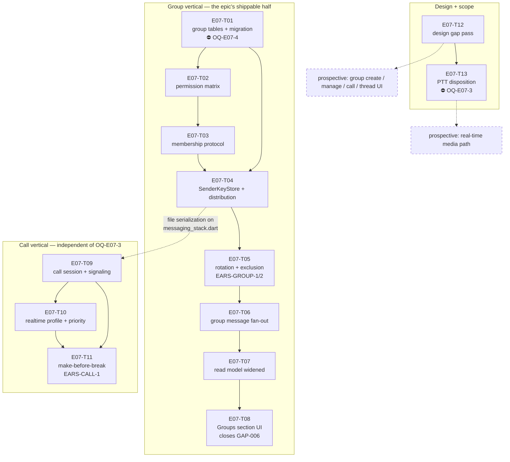

# E07 · Groups & Voice Calls · Progress

**Status:** todo (sharded, awaiting 🧍 `analyze_report`) · **Started:** — ·
**Completed:** — · **Progress:** 0/13

## Tasks

| Task | Title | Layer | Size | MoSCoW | depends_on | Status |
|---|---|---|---|---|---|---|
| E07-T01 | Group data model + schema migration ⛔🧍 | backend | M | must | — | todo (blocked: `OQ-E07-4`) |
| E07-T02 | Group role permission matrix | backend | S | must | T01 | todo |
| E07-T03 | Group membership control protocol | backend | M | must | T02 | todo |
| E07-T04 | Drift-backed `SenderKeyStore` + key distribution | backend | M | must | T01, T03 | todo |
| E07-T05 | Key rotation on membership change + exclusion | backend | M | must | T04 | todo |
| E07-T06 | Group message send/receive fan-out | backend | M | must | T05 | todo |
| E07-T07 | Conversation read model widened to groups | backend | S | must | T06 | todo |
| E07-T08 | Conversations "Groups" section (closes GAP-006) | frontend | M | must | T07 | todo |
| E07-T09 | Call session state machine + signaling | backend | M | should | T04 | todo |
| E07-T10 | Real-time traffic profile + call priority | backend | M | should | T09 | todo |
| E07-T11 | Make-before-break call route migration ⛔ | backend | M | must | T09, T10 | todo |
| E07-T12 | E07 design gap pass — derived contracts | docs | M | must | — | todo |
| E07-T13 | PTT — resolve `OQ-E07-2` ⛔ | docs | S | could | T12 | todo |

⛔ = carries or is blocked by a 🧍 Open Question — see §Blocked.

## Dependency graph

**Parallel sets** (file-collision-checked, analyze gate §Collision matrix):
`{T01, T12}` → `{T02}` → `{T03}` → `{T04}` → `{T06, T09}` →
`{T07, T10}` → `{T08, T11, T13}`.

**T09's `depends_on: [E07-T04]` is deliberate serialization, not a semantic
dependency** — call signaling needs nothing from the sender-key layer, but
both register a control kind in `lib/core/messaging/messaging_stack.dart`.
Do not "fix" the DAG by removing it.

## Blocked / Frozen

- **`E07-T01` — 🧍 `OQ-E07-4` (schema migration 12 → 13).** Rule 3 names
  schema migrations as a human call. The DDL and three forks are on the
  task file. **The whole group vertical T02…T08 sits behind this.**
- **`E07-T13` — 🔴 `OQ-E07-3` (real-time media transport).** The human's
  own parking condition for PTT (`IMP-001`). T13 must not start while
  `OQ-E07-3` is open.
- **Prospective media path, and the four prospective UI tasks** — blocked
  on `OQ-E07-3` and on 🧍 `design_contract_approval` for GAP-018…GAP-022
  respectively. Neither is sharded; see `epic.md` §Tasks.

**Not blocked, contrary to first appearance:** `E07-T09`, `E07-T10` and
`E07-T11` are dispatchable without `OQ-E07-3` — the epic is sliced so the
call session, priority and migration *control* are independent of the media
transport, with `NullCallMediaTransport` as the honest v1 seam.

## Gates

| Gate | State |
|---|---|
| 🧍 `analyze_report` | ⏳ AWAITING HUMAN (`epic.md` §Analyze report) |
| 🧍 `OQ-E07-4` — schema migration | ⏳ AWAITING HUMAN (blocks T01→T08) |
| 🔴 `OQ-E07-3` — real-time media transport | ⏳ AWAITING HUMAN (blocks T13 + prospective media path) |
| 🧍 `design_contract_approval` | ⏳ REOPENED for GAP-018…GAP-022 (`design/gaps.md`) |

## Carried-forward observations (not yet a task)
_(empty at sharding — created deliberately so it has a reader from day one.
`L-process-008`, promoted to a rule after E06: **read this section before
each new dispatch and cross-check the next task's `files:` fence.** E06's
highest-severity finding, `E06-B02` (S1), sat correctly recorded in this
exact section for eight tasks with no reader.)_

## Bug sweep
_(after all 13 tasks land — `skills/bug-sweep`. Note `L-process-009`: every
E07 bug task file must carry a §4 scope fence; every bug file in the
project before E06's retro lacked one.)_

## Event log (append-only)
- 2026-08-26 E07 drafted during Wave 1 epic-breakdown; deferred to a later wave.
- 2026-08-30 PTT re-homed from E06 to E07 by human decision (`IMP-001`,
  `GAP-017`); recorded as `OQ-E07-2` with the owner named as "this epic's
  sharding pass".
- 2026-08-31 **Sharded into 13 tasks** by the planner against `development`
  @ `73eb4b3` (384/384 green). `skills/task-sharding` §0 run before slicing:
  E06's retro + tracker (bug sweep, carried-forward observations, merge-gate
  notes), E05's and E03's retros, `IMP-001`, `design/gaps.md` GAP-006/017,
  and the E06 bug files were read, and **17 inherited obligations were
  enumerated** — see `epic.md` §Analyze report, *Inherited obligations*.
  `OQ-E07-2` (PTT) discharged into a named task, `E07-T13`. Design gap pass
  added GAP-018…GAP-022 to `design/gaps.md` (🟡, `design_contract_approval`
  reopened); only `E07-T08` is a sharded frontend task, the rest are
  prospective by rule 2. **Two rule-3 questions raised rather than guessed:**
  `OQ-E07-3` (real-time media transport for calls and PTT — no ADR covers
  it, every option is a new dependency) and `OQ-E07-4` (the group schema
  migration). ADR-0003's deferred Sender-Keys layering was designed
  deliberately at this pass, as that ADR and this epic's own §Risks both
  required, and recorded as `OQ-E07-8` for cheap rejection. Analyze report
  appended to `epic.md`; 🧍 `analyze_report` gate ⏳.
