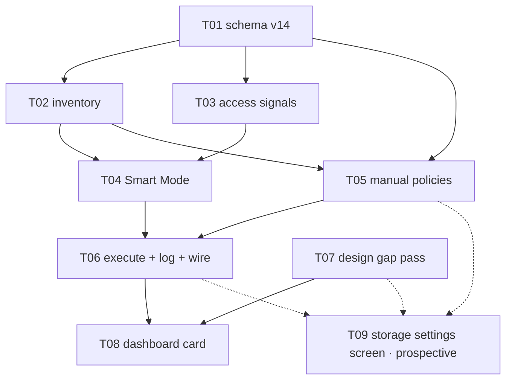

# E08 · Local Storage & Management

## Business goal
Give users control over local storage growth (voice/PTT/call recordings,
attachments, conversation history) via a default "Smart Mode" that explains
its own decisions, plus manual policies.

## User-visible outcome
Storage warnings on the dashboard, an explainable Smart Mode, and manual
delete-by-age/size policies.

## Scope
**In scope:** Smart Mode heuristic (age/size/type/access-frequency/activity/
pressure/temp-status/importance), manual policies, dashboard storage
warnings (informational only, no forced action), decision explanations.
**Out of scope:** anything about what's stored (E06/E07 own that) — this
epic only manages lifecycle.

## Acceptance criteria (epic-level, EARS)
- **EARS-STORE-1**: WHILE Smart Mode is active, the system SHALL determine removal candidates using the eight named factors. (FR-STORE-005)
- **EARS-STORE-2**: The dashboard SHALL show storage warnings as informational only, never requiring a "Clean Now" action. (FR-STORE-006)

Cross-cutting: **NFR-SCALE-001** *(needs number, A-002 placeholder)*,
**NFR-PRIV-001** bind here.

## Tasks
*(sharded 2026-09-02 against `development` @ `66d3a3f` — E07 fully merged,
698/698 tests green)*

| id | title | layer | size | MoSCoW | depends_on |
|---|---|---|---|---|---|
| E08-T01 | Storage schema migration v14 — item stats, policy settings, decision log | backend | M | must | — |
| E08-T02 | Storage inventory read model — what is stored locally, in real bytes | backend | M | must | T01 |
| E08-T03 | Access-frequency signals — record when stored items are actually used | backend | S | should | T01 |
| E08-T04 | Smart Mode — the eight-factor retention plan and its per-candidate reasons | backend | M | must | T01, T02, T03 |
| E08-T05 | Manual policies and mode selection — older-than-X, over-X-MB | backend | S | should | T01, T02 |
| E08-T06 | Retention execution, the decision log, and wiring the manager into the app | backend | M | must | T04, T05 |
| E08-T07 | Design gap pass — Storage settings screen + dashboard warning expansion | docs | M | must | — |
| E08-T08 | Dashboard Local Storage card — real figures, informational warning, expansion | frontend | M | must | T06, T07 |

### Prospective (not sharded — cannot be, yet)

| id | title | why not sharded |
|---|---|---|
| E08-T09 | Storage settings screen — mode selection, manual policy parameters, decision explanations (`FR-STORE-004`, `FR-STORE-007`) | Rule 2: its `design_contract:` would be `design/screens/settings-storage.md`, which **`E08-T07` has not written yet**. `scheduler.py --validate` rejects a frontend task pointing at a non-existent contract, and it is right to — this is E07's established precedent for exactly this situation ("sharding them would point `design_contract:` at a file `E07-T12` has not written"). **Shard it the moment T07 lands and the human clears `GAP-024`.** Its shape is fully described by `GAP-024`; nothing about it is unknown except the contract it must cite. Expected: `layer: frontend`, `should`, M, `depends_on: [E08-T05, E08-T06, E08-T07]`, sole owner of `lib/app/routes.dart`, `lib/features/settings/**` and `lib/features/storage/presentation/**` |

Parallel sets, in order: **{T01, T07}** → **{T02, T03}** → **{T04, T05}** →
**{T06}** → **{T08}**, with **T09** sharded and added after T07 lands.

## Open Questions

- **OQ-E08-1 — the storage denominator: what is "45% used" a percentage
  of?** 🔴 **blocking** for the *storage pressure* factor (E08-T04) and for
  the dashboard card's percentage (E08-T08). Rule 3 (a number the spec does
  not contain, plus possibly a dependency).
  - **Why it can't be defaulted:** `GAP-011` already recorded that no quota
    exists "anywhere in this schema or spec", and
    `dashboard_controller.dart` has carried `isMeasured: false`
    *permanently* ever since rather than fabricate one. E08 measures the
    numerator honestly and still has no denominator. Dart has no
    free-space API, so even option (a) is a mechanism decision.
  - **Options:** **(a)** device-volume free space, read via a Pigeon
    platform channel — **no new dependency**, ADR-0004 already authorises
    Pigeon; the honest "pressure" input, but a real native surface to
    build and test on two platforms. **(b)** a user-set app storage budget
    with a human-supplied default; simple, no native code, but the default
    *is* the missing NFR-SCALE-001 number and an agent must not pick it.
    **(c)** no percentage at all — the card shows real measured bytes and
    the design's `45% used` string becomes a disclosed deviation
    (`GAP-026`).
  - **Advisory:** **(a) for the pressure factor + (c) for the card, now;
    (b) later if you want a user-visible budget.** That ships an honest
    card immediately, gives Smart Mode a real pressure input without
    inventing a ceiling, and leaves `storage_policy_settings.budget_bytes`
    (already in T01's schema, nullable, NULL) as the place (b) lands.
  - **Status:** 🟡 open · **Answer:** _<empty>_ · **Answered by:** _<human>_

- **OQ-E08-2 — NFR-SCALE-001 has no number, and A-002 does not cover
  storage.** ⚠️ **important** (not blocking: E08-T04 ships its thresholds
  as named, documented placeholders in one value object).
  - **The finding the prompt asked for, answered directly:** `A-002`'s
    recorded statement is *"v1 **group size and relay hop count** use
    conservative placeholder defaults"*, and its revisit trigger is *"when
    the groups/encryption or routing/relay epics are sharded"*. **Storage
    is outside A-002's own scope**, so E08 cannot shelter under it — but
    the *shape* of A-002's resolution (a documented, tunable placeholder
    rather than a blocking unknown) applies cleanly here.
  - **Options:** **(i)** extend A-002's placeholder approach to storage
    thresholds by recording a new assumption `A-004` with a named revisit
    trigger — cheap, unblocks E08-T04, and honest as long as every
    threshold is marked tunable. **(ii)** supply real numbers now (a
    history-size ceiling, a retention age, a pressure trigger point).
    **(iii)** amend NFR-SCALE-001 itself with numbers, via
    `skills/change-impact`.
  - **Advisory: (i) now, (iii) at the E08 retro.** Rule 7's "done means
    proven" is satisfiable against a documented placeholder; it is not
    satisfiable against an undocumented one, which is the only outcome
    worth blocking over.
  - **Status:** 🟡 open · **Answer:** _<empty>_ · **Answered by:** _<human>_

- **OQ-E08-3 — what is Smart Mode actually permitted to delete?**
  🔴 **blocking** for E08-T06's apply path (the plan, log and wiring are
  unblocked). Rule 1 + rule 3.
  - **The finding:** BRD §20/§22's entire worked example is media — voice
    messages 820 MB, call recordings 620 MB, attachments 310 MB, temporary
    cache 50 MB. **None of it exists in this build.** No file in `lib/`
    writes any media artifact; the voice/PTT/attachment contracts
    (`GAP-014`/`015`/`016`/`023`) are approved but unbuilt and wait on the
    prospective media-path task. Meanwhile relay payloads — the only
    genuinely "temporary" class — are *already* reclaimed on TTL by
    `RelayEngine.reclaimPayloads` (E04-B02), driven by `E06-T06`'s
    coordinator. **So the only sizeable deletable data left today is
    encrypted conversation content**, and Smart Mode is the default mode
    (FR-STORE-004), which means the app would begin deleting user messages
    on first run.
  - **Options:** **(a)** Smart Mode's allow-list is limited to classes
    whose loss is not user-visible data loss; message content is removed
    **only** under a manual policy the user explicitly chose. **(b)** Smart
    Mode may delete old message bodies, keeping tombstones so E05's dedup,
    sequence and sync-cursor guarantees survive — a real design, touching
    merged reliability code. **(c)** ship E08 as forecast + explanation
    only ("Will remove…", exactly the BRD's own future tense) and defer all
    execution until the media path exists.
  - **Advisory: (a), with (c)'s honesty.** The whole explanation surface
    ships now and is genuinely useful; the executor ships with an empty
    allow-list until you say otherwise; nothing irreversible happens to
    conversation history by default. `docs/conventions.md`'s own migration
    rule — never drop user conversation data without an explicit
    human-approved exception — points the same way.
  - **Status:** 🟡 open · **Answer:** _<empty>_ · **Answered by:** _<human>_

- **OQ-E08-4 — "importance" and "temporary status" are undefined terms.**
  ⚠️ **important** (E08-T04 reports both factors `unavailable` until
  answered; it does not invent a definition).
  - FR-STORE-005 names eight factors; `spec/glossary.md` defines Smart Mode
    but neither term, and no schema column exists for either. *Temporary
    status* is derivable defensibly (relay payload = temporary, message =
    not) and E08-T02 does so explicitly. *Importance* is not derivable at
    all.
  - **Options for importance:** **(a)** derive it from state that already
    exists — a Trusted relationship (E02) plus a never-delete rule for
    undelivered messages; no new UI, no new column. **(b)** an explicit
    user "keep" control — a real feature with no design source and no FR.
    **(c)** treat it as permanently unavailable and disclose it in the
    explanation surface.
  - **Advisory: (a).** It uses data the app already has, needs no schema
    change, and is explainable in one sentence to the user — which is what
    FR-STORE-007 requires of every factor.
  - **Status:** 🟡 open · **Answer:** _<empty>_ · **Answered by:** _<human>_

- **OQ-E08-5 — FR-STORE-002 and FR-STORE-003 have no owner.** ⚠️
  **important** — a traceability finding, not a build blocker.
  - This epic's `traces_to:` claims FR-STORE-001…007, but its own §Scope
    excludes "anything about what's stored". FR-STORE-002 (store voice/PTT/
    call recordings) and FR-STORE-003 (the low-CPU default voice profile)
    are *storage-of-media* requirements: E06 never sharded T15/T16/T17,
    E07's PTT pass produced a disposition rather than a build, and the
    media-path task remains prospective. **Nothing builds them, and E08
    will not.**
  - **Options:** **(i)** leave the ids on E08 but record here that their
    owner is the prospective media-path task (honest, and this entry is
    the record). **(ii)** move them off E08 onto that task/epic via
    `skills/change-impact` so `docs/traceability.md` stops reporting them
    under a closed epic.
  - **Advisory: (i) now, (ii) when the media-path task is created** — an
    IMP report for a two-id re-home is cheap then and premature now.
  - **Status:** 🟡 open · **Answer:** _<empty>_ · **Answered by:** _<human>_

- **OQ-E08-6 — E08 is not in an approved wave.** ⚠️ **important** —
  process, not scope.
  - `epics/README.md`'s `epic_breakdown_and_wave` clearance covers **Wave 1
    [E01…E06]** and explicitly lists E08 under "deferred to later waves".
    E07 was sharded and shipped without re-opening it; E08 now repeats
    that. `skills/epic-breakdown` says the line is re-opened for **every**
    wave. An agent does not re-open or re-clear a human's gate line, so
    this is recorded rather than acted on.
  - **Advisory:** clear a Wave 2 line covering E07 (retroactively) and E08
    in `epics/README.md`, or say E08 should wait.
  - **Status:** 🟡 open · **Answer:** _<empty>_ · **Answered by:** _<human>_

## Analyze report
*(`skills/task-sharding` §6, run 2026-09-02 against E08-T01…T08, on
`development` @ `66d3a3f`, 698/698 tests green. `E08-T09` is **prospective,
not sharded** — see §Tasks; it is counted in the coverage rows and excluded
from the sizing/collision rows, because a task that does not exist cannot
collide with one that does.)*

| Check | Result | Notes |
|---|---|---|
| EARS trace | ✅ pass | Both epic-level criteria are owned by a named task: **EARS-STORE-1** → T04 (with all eight factors tabled explicitly in its §2, six scored and two reporting `unavailable` rather than defaulted), **EARS-STORE-2** → T08. Every task carries ≥1 `traces_to:` FR id and ≥1 EARS criterion. New sub-ids EARS-STORE-3…19 are contiguous, non-colliding with any id used in E00–E07 (checked across `epics/`, `spec/`, `test/`), and each cites an existing FR; EARS-STORE-20…22 are reserved for the prospective T09 and are written into its `GAP-024` shape, not minted here. No orphan in either direction among FR-STORE-001, 005, 006, 007. **FR-STORE-004 is owned by sharded T05 (the persistence + policy semantics) with its *selection UI* on prospective T09** — named here so the half-ownership is visible rather than assumed. **FR-STORE-002/003 have no owner at all and are raised as `OQ-E08-5`, not quietly claimed** |
| Contract sanity | ✅ pass | No API surface (no server, ADR-0005). One schema migration (T01) owned by one task, three tables, one version bump. One inventory (T02) with one reader chain. One settings row with one repository (T05) and one writer. `RetentionPlan` is defined once (T04) and reused by T05, T06, T08, T09 rather than re-declared. The decision log has **one writer** (T06) and **two readers** rendering the *same* rows (T08 expansion, T09 screen) — the "state defined in two documents" trap E05-B03 was. Machine keys (`category_key`, `reason_code`) are separated from display copy by contract, so the design gate's character-for-character strings have exactly one source |
| Collision matrix | ✅ pass | Empty for every parallelizable pair. Shared files serialized by `depends_on` or owned outright: `lib/core/persistence/*` → **T01 alone**; `lib/app/bindings.dart` → **T06 alone**; `lib/features/dashboard/**` and `test/design/design_probe_test.dart` → **T08 alone**; `lib/features/chat/**` → **T03 alone**; `design/gaps.md` and `design/screens/*` → **T07 alone**; `messaging_coordinator.dart` → **T06 alone**. `lib/app/routes.dart` and `lib/features/settings/**` are reserved for the prospective T09 and touched by no sharded task — **and T09 must not be given the probe fixture when it is sharded**, since T08 now owns that file; that is the one collision the deferral created and it is recorded here so a later sharding pass does not walk into it |
| Scope fences | ✅ pass | All eight §4 sections non-empty and specific to the temptation *that* task invites — T01's "does not add a `pinned`/`important` column, that would decide OQ-E08-4 by schema", T02's "deletes nothing, permanently; does not touch relay TTL", T04's "does not invent a definition for importance or a value for the denominator", T06's "does not choose which classes are deletable", T07's "does not invent a Clean Now button, a confirmation dialog, or any forced action", T08's "no delete affordance, not even disabled" and its explicit re-decline of E06's delivery-tick colour chore, T08's own "does not widen the probe fixture beyond the two named seeds" |
| MoSCoW inflation | ⚠️ **exception, justified** | 6/8 sharded tasks are `must` (75%); across the epic's full 9-task shape it is 6/9 (67%). Graded on merits, then checked rather than asserted — **and no task was upgraded to fix a ratio, nor downgraded to fix one**. Three of the six (**T01** schema, **T02** inventory, **T07** design contracts) are hard preconditions nothing else can proceed without; the other three (**T04**, **T06**, **T08**) own the epic's two EARS criteria and the only path from a plan to a real one. The `should` tasks were graded down honestly: **T03** (the epic degrades correctly without it — the access-frequency factor simply reports `unavailable`), **T05** (Smart Mode is the *default*; the manual modes are FR-STORE-004's alternatives), **T09** (the dashboard already satisfies FR-STORE-006/007's user-visible promise). **The ratio is worse in the sharded set precisely because the one deferred task is a `should`** — deferring it was forced by rule 2, not chosen, and it would be dishonest to re-grade a `must` to compensate. No `could`: a task nobody would miss should not have been sharded |
| Size | ✅ pass | 6×M, 2×S, **no L**. Two L candidates split deliberately: "the storage engine" became **T04** (Smart Mode scoring) + **T05** (manual policies) + **T06** (execution, log, composition), so the one task that can destroy user data is small enough to review line by line; and "storage UI" became **T08** (dashboard card) + the prospective **T09** (settings screen), on disjoint trees |
| Design | ⚠️ **pass, gated — and it cost a task** | **One** sharded `layer: frontend` task: **T08**, pointing at `design/screens/dashboard.md` — a file that exists, has a golden, and whose elements 15-18 it builds. The settings screen is **not sharded**, because its contract does not exist yet and `scheduler.py --validate` correctly rejected the first draft that pointed at it: *"E08-T09: design_contract 'design/screens/settings-storage.md' does not exist"*. That is rule 2 working, and it is E07's own precedent applied. Gap pass performed at sharding: **GAP-024…GAP-027** appended to `design/gaps.md`, all 🟡, all with bare `approved by:` lines (`L-process-002`). **GAP-026 and GAP-027 carry no proposal at all**, only named forks — deliberately, because both would otherwise write a number or a scope the spec does not contain |
| Obligation ownership | ✅ pass | Grepped every task file for every other task id and for sibling-naming prose. Four cross-task obligations found, each independently stated in the **owning** task's binding contract: (1) **T01's `budget_bytes` column exists for a value T01 does not set** — T05's `setBudgetBytes` and T08's "percentage only with a real budget" each state the rule independently and test it; (2) **T02's `StorageItemKind` media values have no producer** — T02 owns a test asserting they yield zero items, rather than leaving the seam as prose; (3) **T04 produces machine keys whose copy lives elsewhere** — T07's contract and T08's "copy character-for-character from the contract" state the ownership from the consuming side, and T04's §4 forbids user-facing strings from its own diff; (4) **T06's composition wiring** — the obligation that has now escaped this project twice (`OQ-E06-T06-4` caught it, `E07-B03` did not) is inside T06's own `files:` fence (`bindings.dart`, `messaging_coordinator.dart`) with a DoD line requiring `grep -rn "StorageManager(" lib/` to show a real composition-root call site, **not** left to a later task |
| **Inherited obligations** | ⚠️ **pass with 3 covered, 3 owned-open, 6 explicitly declined** | §0 was run before slicing. **12 obligations enumerated, 0 silently dropped.** Full table below |

### Inherited obligations — §0 pass

Sources read in full before slicing (`L-process-007`'s promoted rule):
`epics/E06-personal-chat/retro.md` (§Open follow-ups, §What went wrong),
`epics/E06-personal-chat/tracker.md` (§Carried-forward observations,
§Bug sweep), `epics/E06-personal-chat/epic.md` (§Scope and its T15/T17
notes, which name E08 directly), `epics/E07-groups-calls/retro.md`
(§Open follow-ups for the next epic's sharding to read),
`epics/E07-groups-calls/tracker.md` §Carried-forward observations,
`epics/E07-groups-calls/epic.md` §Inherited obligations + the PTT/
FR-STORE-002 passage, `design/gaps.md` (GAP-005, GAP-011, GAP-014…023),
and `lib/features/dashboard/presentation/dashboard_controller.dart`'s own
header, which names E08 as the owner of the missing quota.

| # | Obligation (source) | Disposition |
|---|---|---|
| 1 | **`GAP-011` — the dashboard Local Storage card has no data source "until E08"**, `⚪ deferred (until E08)`, with `Smart Mode - Older than 10 days` explicitly static "until E08 builds the retention policy it describes" | **covered-by E08-T08** — real measured figures, the real active-policy summary line, and the expansion. `GAP-011`'s `built:`/status lines are updated as a T08 DoD item |
| 2 | **`dashboard_controller.dart`'s header: `isMeasured` "stays `false`, permanently, until E08 defines a real quota — never a fake percentage presented as measured"** | **covered-by E08-T08 §2 + `OQ-E08-1`** — and deliberately *not* resolved by inventing a quota. T08 ships bytes and discloses the deviation; the quota itself is the human's (`GAP-026`) |
| 3 | **E07 tracker §Carried-forward (2026-08-31, S4): the v12→v13 migration test asserts the added entities *exist*, not that the added set is *exactly* those — "fold into whichever task first adds a schema version beyond 13, then this line can be retired"** | **covered-by E08-T01** — T01 is that task; its test asserts exact set equality of added tables and indexes, and §3/§DoD require the observation be retired in the Run log rather than re-carried |
| 4 | **E07 retro §Open follow-ups: the design-probe fixture still seeds zero groups (`L-design-002`, now a rule) — "whichever task next touches `test/design/design_probe_test.dart` should close this, not just re-disclose it a fourth time"** | **covered-by E08-T08** — T08 is the next task in the project to touch that file (it must seed a storage plan or the gate is blind to its own new card, which is `L-design-002`'s other half), so the group seed is an in-fence, narrowly-scoped deliverable with a DoD line, plus a requirement to re-check every screen's gate score after the fixture change. *(Originally assigned to T09; re-homed to T08 when T09 became prospective — the obligation moved with the file, which is the point of tying it to the file rather than to a task id.)* |
| 5 | **E06 `epic.md`: "E06-T15 … overlaps E08's storage scope — settle the boundary before sharding" and "E06-T17 … E08 owns retention — fence it explicitly"** | **covered by the epic §Scope + every task's §4** — E08 owns *lifecycle only*; T02 §4 forbids adding any media capture path, and the media artifacts themselves stay with the prospective media-path task. The boundary is now written on both sides |
| 6 | **E04-B02 / E06-T06: relay payload retention is owned by `RelayEngine.reclaimPayloads` on the coordinator tick** | **explicitly declined, with the constraint kept alive** — T02 §4, T04 §4 and T06 §4 each forbid deleting or reclaiming a relay payload, and T06 records relay groups as `skipped` with the owning mechanism named. This is also the finding that made `OQ-E08-3` blocking: with relay TTL already owned, the only sizeable deletable class left is user conversation content |
| 7 | **`GAP-014`/`015`/`016`/`023` (voice, attachments, location, PTT) are approved contracts with no build; FR-STORE-002 stores the artifacts they describe** | **owned Open Question `OQ-E08-5`** — E08 will not build the media path, and says so rather than leaving FR-STORE-002/003 looking claimed. `StorageItemKind` carries the media kinds as an explicit, tested-empty seam so the media task extends rather than redesigns |
| 8 | **E07 retro §Open follow-ups: `E07-B02`/`E07-B03` (P3, deferred) both need the prospective real-time media-path task** | **explicitly declined for E08, with reason** — both are routing/call-seam defects with no storage-lifecycle content; adopting them here would put an unrelated vertical inside a storage epic's fence. Owner remains the media-path task, and this row is the record that E08 read them and declined |
| 9 | **E07 tracker §Carried-forward: `CallMigrationController` is not wired into `lib/`; two further seam gaps handed to the media-path task** | **explicitly declined, but its *lesson* is claimed** — the wiring itself is the media task's. The *pattern* (a controller nothing constructs) is answered structurally in E08 by putting `bindings.dart` inside T06's own fence with a grep-based DoD line, rather than leaving E08's manager to be wired "later" |
| 10 | **E06 retro §5 / E07 obligation #11: the delivery-tick colour tokens still diverge across chat/dashboard/conversations — a standing S4 chore** | **explicitly declined again, with reason** — T08 edits `dashboard_view.dart` and could fix it in passing, which is exactly why its §4 forbids it: a drive-by fix to a shared token across three screens is out-of-scope work on merged code (rule 6). Named here so the second decline is visible rather than an omission |
| 11 | **`metrics.csv`/`runs/` have never been written (`L-process-015`, and every retro since E00)** | **explicitly NOT owned by an E08 task** — it has no FR/NFR id, so a task for it fails rule 1 and `make validate`. Routed to the human as a harness item; eighth consecutive epic to record it |
| 12 | **The lesson hook still never injects `qa.md`** (E05, E06 retros) | **explicitly NOT owned by an E08 task** — a harness-configuration change affecting every dispatch, which two retros have said should not be made silently. Routed to the human |

**Net on this row:** 12 obligations — **4 covered by a named task
(#1-#4), plus #5 covered structurally by the epic's own scope fences, 1
carried as an explicitly-owned Open Question with an owner and a revisit
trigger (#7), and 6 explicitly declined with reasons and re-homed
(#6, #8-#12). Zero silently dropped.** The obligation most likely to have
been lost was **#3** — a single S4 line in E07's tracker, addressed to
"whichever task first adds a schema version beyond 13", which is E08-T01
and which nobody would have connected without reading that section.

**Net overall:** 6/9 checks clean pass, 1 disclosed MoSCoW exception with
an evidenced justification, 1 Design row that passes but is gated on
`design_contract_approval` and cost one task its shard, 1
Inherited-obligations pass with its open
items enumerated above. **Two 🔴 blocking rule-3 questions raised rather
than guessed (`OQ-E08-1` the storage denominator, `OQ-E08-3` what Smart
Mode may delete), plus one 🧍 schema-migration gate (`OQ-E08-T01-1`) and
four ⚠️ important questions** — each with options, honest trade-offs and an
advisory recommendation.

🧍 **HUMAN GATE** (`analyze_report`) — ⏳ AWAITING HUMAN.

**What is dispatchable once this gate clears, and what is not.**
`E08-T07` (the design gap pass) is dispatchable immediately — it is the
critical path for both frontend tasks and blocks on nothing. **`E08-T01`
is not**: its migration is the 🧍 `db_schema_migration` gate
(`OQ-E08-T01-1`), and the entire backend chain T02…T06 sits behind it.
`E08-T04` is dispatchable after T01/T02/T03 **for six of its eight
factors**; the other two stay `unavailable` until `OQ-E08-1`/`OQ-E08-4`
are answered. **`E08-T06`'s apply path is hard-blocked on `OQ-E08-3`** —
its plan, log and wiring are not. `E08-T08` additionally waits on the
human clearing `GAP-025`/`GAP-026`, and **`E08-T09` cannot be sharded at
all** until T07 lands and `GAP-024` is cleared. This epic therefore **cannot fully
proceed under the standing "continue without per-gate pauses"
instruction**: a schema migration, a possible native measurement path, a
missing NFR number, and "may the app delete the user's messages by
default" are all squarely rule 3's, and none has a safe default an agent
may assume.

## Retro
→ `retro.md` (written after E08 completion)
