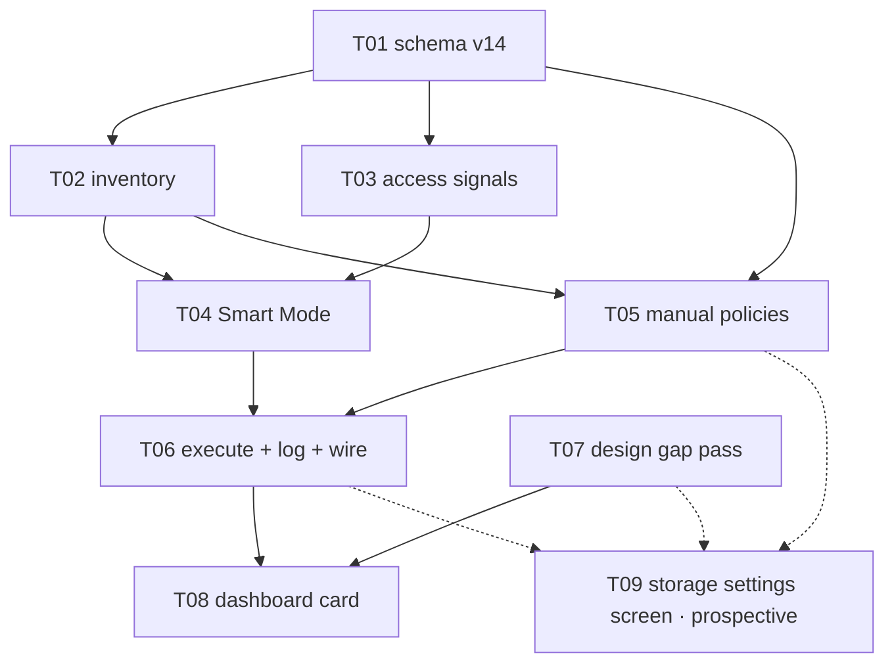

# E08 · Local Storage & Management · Progress

**Status:** **all 8 sharded tasks merged, reviewed APPROVE.** `E08-T06`
(the only code path that permanently deletes user data, ADR-0005's
no-server-copy) and `E08-T08` (the dashboard card) both survived
multi-round adversarial review — real bugs found and fixed in both, none
of them data-loss bugs. Build-complete; ready for the epic-level bug
sweep, then the human `verified` gate and merge to `development`.
**Bug sweep run 2026-09-02** — see §Bug sweep at the end of this file:
**6 defects filed (`E08-B01`…`B06`, one S1, one S2, three S3, one S4)**,
🧍 `bug_priorities` ⏳ AWAITING HUMAN. **The epic→`development` PR does not
open until P1/P2 = 0** (`skills/release`). ·
**Started:** 2026-09-02 ·
**Completed:** — · **Progress:** 8/8 sharded (+1 prospective) + 6 bug tasks

**Still open, non-blocking, for the bug sweep or a future task to pick
up:**
- 🟡 `OQ-E08-T05-1` (`E08-T05.md`) — the `overSizeMb` item-fetch callback
  has no paging control; must be answered before any `overSizeMb` plan is
  applied in production with >500 items in one kind (currently
  unreachable — no device in this build has that much stored data yet).
- 🟡 `OQ-E08-T08-2` (`E08-T08.md`) — the shared design-probe dumper's
  `InkWell`-swallowing limitation (`L-frontend-001`'s known category) now
  confirmed hitting **both** dashboard cards (Network Status and Local
  Storage), not just this task's own. Root cause, evidence, and a proposed
  fix shape are recorded in the task file — judged complete enough for a
  future task to act on without rediscovery. Do not reshape either card's
  `InkWell` to work around it.

**Cleared 2026-09-02:** `analyze_report` (human resolved all 6 OQs at
sharding), `db_schema_migration` (`OQ-E08-T01-1`, human approved T01's
DDL as specified), `OQ-E08-1` (storage denominator — device free space +
no fabricated percentage), `OQ-E08-3` (Smart Mode excludes conversation
content by default).

## Tasks

| id | title | layer | size | MoSCoW | depends_on | status |
|---|---|---|---|---|---|---|
| E08-T01 | Storage schema migration v14 | backend | M | must | — | done · builder (sonnet) → reviewer (opus) · APPROVE · squash-merged `4507119` (PR #17) + follow-up fix `43b891f` |
| E08-T02 | Storage inventory read model | backend | M | must | T01 | done · builder (sonnet) → reviewer (opus) · APPROVE · squash-merged `1efec77` (PR #18) |
| E08-T03 | Access-frequency signals | backend | S | should | T01 | done · builder (sonnet) → reviewer (opus) · APPROVE · squash-merged `222c6dd` (PR #19) |
| E08-T04 | Smart Mode — the eight-factor plan | backend | M | must | T01, T02, T03 | done · builder (sonnet) → reviewer (opus) · APPROVE · squash-merged `77f0505` (PR #20) |
| E08-T05 | Manual policies + mode selection | backend | S | should | T01, T02 | done · builder (sonnet) → reviewer (opus) · round 1 CHANGES → round 2 APPROVE · squash-merged `1c54ecc` (PR #21) |
| E08-T06 | Retention execution + decision log + wiring | backend | M | must | T04, T05 | done · builder (sonnet) → reviewer (opus) · round 1 CHANGES → round 2 APPROVE → CI-fix APPROVE · squash-merged `48f51e3` (PR #22) |
| E08-T07 | Design gap pass | docs | M | must | — | done · planner (opus) → reviewer (sonnet) · APPROVE · squash-merged `a94e483` (PR #16) |
| E08-T08 | Dashboard Local Storage card | frontend | M | must | T06, T07 | done · builder-ui (sonnet) → reviewer (opus) · round 1 CHANGES → round 2 APPROVE · squash-merged `ece088f` (PR #23) |
| E08-T09 | Storage settings screen | frontend | M | should | T05, T06, T07 | **prospective — not sharded** |

**Why T09 has no task file yet:** rule 2. Its `design_contract:` would be
`design/screens/settings-storage.md`, which `E08-T07` has not written —
`scheduler.py --validate` rejected exactly that and was right to. Shard it
the moment T07 lands and `GAP-024` is cleared. **When sharding it, do not
give it `test/design/design_probe_test.dart`** — `E08-T08` owns that file.

**Parallel sets, in order:** {T01, T07} → {T02, T03} → {T04, T05} → {T06} →
{T08}, with T09 sharded and slotted after T07 lands. WIP cap is 3
(`harness.yaml`), so the widest set fits.

**Anti-collision:** no two tasks in any parallel set share a file. Sole
owners of the contended paths: `lib/core/persistence/*` → T01 ·
`lib/app/bindings.dart` + `messaging_coordinator.dart` → T06 ·
`lib/features/dashboard/**` + `test/design/design_probe_test.dart` → T08 ·
`lib/features/chat/**` → T03 · `design/**` → T07. `lib/app/routes.dart`
and `lib/features/settings/**` are reserved for T09 and touched by no
sharded task.

## Carried-forward observations (not yet a task)

_(empty at sharding — created deliberately so it has a reader from day one.
`L-process-008`, a rule since E06: **read this section before each new
dispatch and cross-check the next task's `files:` fence.** E06's
highest-severity finding, `E06-B02` (S1), sat correctly recorded in this
exact section for eight tasks with no reader.)_

- **2026-09-02 · E08 sharding · the eight factors are not eight equal
  things (advisory, S3).** Six of `FR-STORE-005`'s factors have real inputs
  in this build; *storage pressure* and *importance* have none
  (`OQ-E08-1`, `OQ-E08-4`). `E08-T04` reports them `unavailable` rather
  than defaulting them — **check at every downstream dispatch that no
  reader has quietly started treating `Unavailable` as `0.0`**, which would
  reintroduce the synthesized-measurement defect E04-B03 established the
  prohibition against. Owner: T06, T08 and T09 dispatches.

- **2026-09-02 · E08 sharding · relay retention has an owner already
  (advisory, S4).** `RelayEngine.reclaimPayloads` (E04-B02) on
  `MessagingCoordinator`'s tick (E06-T06) owns relay payload TTL. Three
  E08 fences forbid touching it. **Check at T06's dispatch** that the
  storage pass appended to the tick has not been placed *before* the
  existing reclaim, and that a storage-pass failure cannot abort the
  messaging work in the same tick.

- **2026-09-02 · E08 sharding · FR-STORE-002/003 are claimed by this epic
  and built by nobody (`OQ-E08-5`).** Recorded here as well as in the
  epic's Open Questions so it survives the epic close: if the human
  chooses option (ii), it needs an IMP report at the time the media-path
  task is created, not at E08's retro.

- **2026-09-02 · E08-T01 review (F2) · `onCreate` is not re-runnable at
  all — pre-existing, not introduced by T01 (advisory, S3).** A fresh
  install killed mid-`onCreate` and reopened fails on
  `SqliteException(1): index idx_messages_conversation_created_at already
  exists` — an E05-era `Migrator.createIndex` call with no `IF NOT
  EXISTS`. Reproduces identically on `epic_08` base, unrelated to storage.
  Out of E08's fence entirely; recorded so it has a reader before the E08
  sweep (or any future infra-hardening pass) rather than being lost.

- **2026-09-02 · E08-T03 review · three observations for T04's brief and
  a future wiring follow-up (advisory, S4 each).** (1) `recordConversationOpened`
  correctly writes `kind=message` with a *conversation* id as `item_id`
  per T03's own contract — **T04 must not join `storage_item_stats` to
  `messages` naively**, since a `message`-kind row's `item_id` matches no
  `messages.id`. (2) `ChatController.onClose` calls `_recorder?.dispose()`
  — harmless today (per-controller instance, `dispose()` only flushes),
  but if a future task wires a *shared* recorder into
  `chat_binding.dart`, the first chat close would tear down the shared
  instance; that task should scope the recorder per-controller or swap
  the call to `flush()`. (3) `recordAccess` has no dispose-guard (a call
  after `dispose()` re-arms the debounce timer) — not reachable in the
  current wiring, cheap to add if the shared-instance path above is ever
  taken.

- **2026-09-02 · E08-T04 review · three observations for T06's dispatch,
  the plan's first real caller (advisory, S3/S4).** (1) **S3 —
  `budgetBytes == 0` synthesizes a fake `pressureRatio` of `1.0`**
  (`smart_mode_policy.dart:135-137`) — a zero denominator is undefined,
  not "100% full", and would relabel every candidate's reason as
  `storagePressure`. Unreachable today (no caller passes `budgetBytes`
  yet). **`E08-T06` must never pass `0`**, and `OQ-E08-1`'s eventual
  budget-semantics answer should say whether a zero/absent budget reports
  `Unavailable`. (2) **S4 — the storage-pressure reason-override branch
  is live but untested** (`smart_mode_policy.dart:241-247`) — when
  pressure is high it silently replaces an already-chosen reason with
  `storagePressure`. Disclosed honestly, no EARS criterion currently
  requires a test for it, but it needs one before it can run for real
  under a genuine budget. (3) **S4, non-blocking** — the never-accessed
  vs. rarely-accessed thresholds (7 days vs. 30 days,
  `retention_plan.dart` `SmartModeThresholds`) treat absence of an access
  row ~4× more harshly than observed non-use. Both are correct
  `A-004` placeholders per `OQ-E08-T04-1`, but the asymmetry is worth the
  human's attention when real numbers replace them.

- **2026-09-02 · E08-T06 round-2 review · the transactional-atomicity
  claim has no regression test in the deliverable's own suite (advisory,
  S4 — for the epic sweep).** `retention_executor.dart`'s own doc comment
  asserts "a delete whose decision row fails to write never happens
  either" — true today, proven true by the round-2 reviewer's manual
  probe (forcing the decision-row write itself to fail) — but none of
  T06's 11 executor tests would catch a regression that removed the
  `db.transaction()` wrapper while keeping delete-then-log order; all 11
  stay green. A drop-in test exists (a `StorageDecisionLog` subclass
  throwing on `outcome: applied`, asserting the message row survives) —
  worth adding at the epic sweep or whenever `retention_executor.dart` is
  next touched, so this property stays proven by the suite, not only by
  a one-time manual review probe.

- **2026-09-02 · E08-T08 round-2 review · a skipped-for-other-reasons row
  still renders under "Will remove:" on the log-fallback path (advisory,
  S4 — for the epic sweep).** E.g. a group skipped by the undelivered-
  message guard (`retention_executor.dart:230`) — not by the structural
  Smart-Mode/relay exclusions the card's filter already handles. Judged
  correct, not a defect: those messages genuinely become removable once
  delivered, and the live-plan path has the identical behavior (not a new
  divergence this task introduced). Worth a second look at this seam
  during the sweep, not a fix owed by T08.

- **2026-09-02 · E08 bug sweep · two answered human decisions were never
  built and had no epic-level reader (advisory, S3 — now `E08-B05`).**
  `OQ-E08-1` is 🟢 answered *"(a) device free space via Pigeon for the
  pressure factor"* and `OQ-E08-4` is 🟢 answered *"(a) derive importance
  from a Trusted relationship (E02) + a never-delete rule for undelivered
  messages"*. Built: (c)'s dashboard half, and the undelivered-message rule.
  **Not built, by anyone:** the Pigeon free-space channel (`pigeons/` has
  only `transport.dart`; `setBudgetBytes` has zero callers in `lib/`, so
  `budgetBytes` is permanently NULL) and the Trusted-relationship
  derivation. Both factors therefore report `Unavailable` forever, and
  `smart_mode_policy.dart:147-149` still tells the user *"importance is not
  a defined term in this build"* about a term the human defined on
  2026-09-02. `OQ-E08-T04-3` disclosed this honestly **inside `E08-T04.md`**
  — which is precisely the read-by-nobody position `L-process-008` became a
  rule to prevent. This entry is the reader. **Owner: `E08-B05`, plus two
  scoped follow-up tasks (a Pigeon free-space task; an E02-fenced importance
  task) that do not exist yet.**

- **2026-09-02 · E08 bug sweep · `itemsOfKind`'s 500-row window is the
  epic's single highest-value defect and it was mis-triaged as unreachable
  (advisory, S1/S2 — now `E08-B01`/`E08-B02`).** Any task that next touches
  `storage_inventory.dart`, `manual_policy.dart` or `StorageManager
  .runPass` must fix the paging rather than raise `limit` — raising it moves
  the cliff and gives up the "bounded by construction" property, which is
  correct and worth keeping. **Do not close `E08-B02` on `E08-B01`'s fix
  alone**: one shared enumeration change may serve both, but each needs its
  own regression test, because the two callers fail in different directions
  (B01 selects the wrong rows for deletion; B02 silently under-reports).

## Event log (append-only)
- 2026-08-26 E08 drafted during Wave 1 epic-breakdown; deferred to a later wave.
- 2026-09-02 Sharded into 8 tasks (+1 prospective) by the planner against `development` @
  `66d3a3f` (698/698 green, E07 and its retro fully merged).
  `skills/task-sharding` §0 run before slicing per `L-process-007`: E06's
  and E07's `retro.md`, both trackers' §Carried-forward observations and
  §Bug sweep, E06's `epic.md` (whose T15/T17 rows name E08 by id), E07's
  `epic.md` PTT/FR-STORE-002 passage, `design/gaps.md` and
  `dashboard_controller.dart`'s own header were all read — **12 inherited
  obligations enumerated, 0 dropped** (see `epic.md` §Inherited
  obligations). Design gap pass added `GAP-024`…`GAP-027` to
  `design/gaps.md`, all 🟡 with bare `approved by:` lines
  (`L-process-002`); two of the four deliberately carry **no proposal**,
  only named forks. **Six Open Questions raised rather than guessed** —
  two 🔴 blocking (`OQ-E08-1` the storage denominator, `OQ-E08-3` what
  Smart Mode may delete by default), four ⚠️ important (`OQ-E08-2`
  NFR-SCALE-001's missing number, `OQ-E08-4` the undefined "importance"
  and "temporary status", `OQ-E08-5` FR-STORE-002/003 have no owner,
  `OQ-E08-6` E08 is not in an approved wave). Analyze report appended to
  `epic.md`; 🧍 `analyze_report` gate ⏳.
- 2026-09-02 **A-002 checked explicitly, as the sharding brief asked.**
  A-002's own recorded statement covers *group size and relay hop count*,
  and its revisit trigger names the groups and routing epics — **storage
  is outside its scope**, so E08 cannot defer under it. Raised as
  `OQ-E08-2` with an advisory to extend the same placeholder *shape* to
  storage via a new `A-004`, which keeps E08 unblocked without pretending
  A-002 already covered it.
- 2026-09-02 **`E08-T09` deferred to prospective during the same pass.**
  The first draft sharded it with `design_contract:
  design/screens/settings-storage.md`; `scheduler.py --validate` rejected
  it — that file is `E08-T07`'s deliverable and does not exist yet. Rule 2
  and E07's own precedent both say the same thing, so the task file was
  removed rather than the contract faked, its shape recorded in `epic.md`
  §Prospective and in `GAP-024`, and its one inherited obligation (the
  `L-design-002` probe-fixture seed) re-homed to `E08-T08`, which owns that
  file. Validator clean afterwards.

## Review log

### E08-T01 — 2026-09-02 — 📋 **APPROVE** (reviewer: `claude-opus-5`; `executed_by`: `claude-sonnet-5` ✅ rule 5)

- **DDL: verified against a real `sqlite_master` dump**, not source
  reading — column-for-column identical to the human-approved §5 contract.
  `budget_bytes INTEGER NULL` with no `DEFAULT`, both PKs and both indexes
  exact.
- **scope: clean.** `pubspec.yaml`/`pubspec.lock` zero bytes changed;
  `messages`/`delivery_states`/`relay_packets`/`routes`/`sync_cursors`/
  group-crypto tables confirmed untouched by diff AND by the migration
  test's own byte-identical DDL assertion pre/post.
- **atomicity: proven by differential fault injection**, not just read.
  Reviewer threw inside the migration step with and without the
  transaction wrap — without it, all three tables persisted half-created
  after a simulated crash (the exact hazard §6 named); with it, zero
  tables and `user_version` unchanged.
- **exact-set-equality migration test: independently re-falsified.**
  Reviewer injected their own extra table, reproduced the claimed failure
  signature exactly, reverted, confirmed green — not trusting the
  builder's report of their own falsification.
- **default-row tests: confirmed structurally distinct** `onCreate`
  (`NativeDatabase.memory()` → `wasCreated`) vs. `onUpgrade` (raw v13 DB →
  `hadUpgrade`) paths — no shared hook that could fake one via the other.
- **`database.g.dart`: confirmed genuinely regenerated.** Reviewer reran
  `build_runner` themselves — byte-identical output, zero diff.
- **suite: 713/713**, `flutter analyze` clean, both re-run by reviewer.

**Two non-blocking findings, both recorded rather than gated on:**
- **F1 (S3) — the default-row insert wasn't retry-safe** against a crash
  in drift's post-`onUpgrade` version-stamping window (reproduced via
  fault injection: `UNIQUE constraint failed` on re-run). Reviewer's
  recommended fix (`InsertMode.insertOrIgnore` on both insert call sites,
  zero risk, no re-review needed) applied directly by the orchestrator as
  a same-day follow-up commit (`43b891f`) — re-verified 713/713 green,
  analyze clean.
- **F2 (S3, pre-existing, not introduced by this task)** — see
  §Carried-forward observations above.

**Ready to squash-merge — done.** Squash-merged to `epic_08` as `4507119`
(PR #17), plus the F1 follow-up fix `43b891f`.

### E08-T07 — 2026-09-02 — 📋 **APPROVE** (reviewer: `claude-sonnet-5`; `executed_by`: `claude-opus-5` ✅ rule 5)

- **scope: in-contract** — diff confined to exactly the 4 claimed paths.
- **`approved by:` lines on GAP-024/025/026/027: directly grepped, genuinely
  blank** — no self-signature (`L-process-002`).
- **rule 2 primitive reuse: spot-checked**, including one honestly
  disclosed deviation (a title colour substituted because the parent
  screen's own value wasn't in its own measured token table).
- **`dashboard.md`'s generated table region: confirmed byte-identical**
  to HEAD via diff — only the new Derived-state section added.
- **OQ-E08-1/OQ-E08-3 fidelity: verified against the full open-question
  text**, not a paraphrase — copy matches the human's actual decision
  exactly (no fabricated percentage, "Not measured" never "0", Smart
  Mode's content-exclusion copy, empty state framed as expected-default
  not rare).
- **No forbidden UI element** (Clean Now / apply-now / dialog / delete
  affordance) found anywhere — confirmed by grep and cross-checked that
  no dialog primitive exists anywhere in this design system.
- Zero Dart files touched; suite result provably a no-op. Design gate
  correctly n/a for a pre-build derived contract.

**Ready to squash-merge — done.** Squash-merged to `epic_08` as `a94e483`
(PR #16).

### E08-T02 — 2026-09-02 — 📋 **APPROVE** (reviewer: `claude-opus-5`; `executed_by`: `claude-sonnet-5` ✅ rule 5)

- **scope: in-contract** — diff confined to exactly the 3 declared
  `create:` files.
- **real measured bytes: confirmed by reading the SQL**, not by trusting
  the claim — every measurement is `SUM(LENGTH(...))`/`COUNT(*)` against
  `AppDatabase`, zero decrypt/parse calls anywhere in the file.
- **DB file size structurally excluded from `totalBytes()`** (never
  enters `classTotals` at all — not a runtime guard, a type-level
  omission) — falsified by injecting a `databaseFile` entry into
  `classTotals`, confirmed rejected.
- **NULL-payload exclusion matters more than claimed**: reviewer found
  `relay_packets.size_bytes` goes *stale* after `reclaimPayloads` nulls
  only `payload`, so using `LENGTH(payload)` gated on `IS NOT NULL`
  (rather than the cheaper, wrong `size_bytes` column) avoided a real
  E04-B03-shaped fabricated-measurement bug.
- **Four media kinds: confirmed zero producers anywhere in `lib/`** via
  grep; zero-reporting is in-contract per the task's own §3/§6/§8.
- **`LENGTH()`-on-BLOB test: falsified independently** by swapping to
  character-length semantics — caught the regression exactly as claimed.
- **suite: 720/720**, `flutter analyze` clean, both re-run by reviewer;
  CI (2 runs) confirmed green before merge.
- Two non-blocking findings recorded above (§Carried-forward): F1 (a
  differently-named decrypt call could theoretically slip the guard) and
  F2 (`StorageClassTotal` has no way to express "unmeasurable" yet,
  harmless today).

**Ready to squash-merge — done.** Squash-merged to `epic_08` as `1efec77`
(PR #18).

### E08-T03 — 2026-09-02 — 📋 **APPROVE** (reviewer: `claude-opus-5`; `executed_by`: `claude-sonnet-5` ✅ rule 5)

- **Cross-task duplicate-enum consolidation confirmed genuine, not just
  claimed.** T03 was dispatched in parallel with T02 off the same base
  commit and initially declared a disclosed-temporary local
  `StorageItemKind` enum; once T02 merged, the orchestrator sent the
  builder back to consolidate onto T02's canonical enum before review.
  Reviewer grepped the whole tree: exactly one `enum StorageItemKind`
  declaration exists (T02's), zero in this PR's diff.
- **Atomic upsert: proven by logging the real emitted SQL**, not by
  reading Dart alone — a single `INSERT ... ON CONFLICT DO UPDATE` with
  the increment evaluated SQL-side, no read-then-write race window. A
  100-call/20-concurrent-flush interleaving probe landed exactly 100, no
  lost updates.
- **Three independent falsifications**, each reproducing the builder's
  own claim exactly: the atomic-increment swap (15 vs 5 mismatch), the
  debounce removal (coalescing test fails on its own pre-window
  assertion), and the error-swallowing removal (both best-effort tests
  fail).
- **NULL-until-observed semantics confirmed**: real wall-clock timestamp
  on first access, never a synthesized 0, no row at all for an
  unobserved item.
- **`ChatController` wiring genuinely optional** — confirmed structurally
  by the full pre-existing test suite (630+ lines, none passing a
  `recorder:` argument) still passing unmodified.
- **No read-back of `storage_item_stats` anywhere in `lib/`**, confirmed
  by grep — this task only writes.
- **suite: 730/730**, `flutter analyze` clean, both re-run by reviewer;
  CI (2 runs) confirmed green before merge.
- Three non-blocking observations recorded above (§Carried-forward), all
  aimed at T04's brief or a future wiring follow-up.

**Ready to squash-merge — done.** Squash-merged to `epic_08` as `222c6dd`
(PR #19).

### E08-T04 — 2026-09-02 — 📋 **APPROVE** (reviewer: `claude-opus-5`; `executed_by`: `claude-sonnet-5` ✅ rule 5)

- **Two orchestrator-ratified deviations re-verified, not taken on
  faith.** `OQ-E08-T04-2` (added `items` parameter): reviewer read T02's
  actual types and confirmed `StorageInventorySnapshot`/`StorageClassTotal`
  genuinely hold only class-level aggregates, no per-item data — the
  parameter is structurally necessary, not a convenience. Purity
  confirmed via import/grep: zero Drift/`AppDatabase`/`DateTime.now`
  hits, doc-comment prose only. `OQ-E08-T04-3` (importance stays
  `Unavailable`): confirmed the code path is unconditional with no
  reassignment anywhere, and the `files:` fence genuinely contains none
  of E02's trust-relationship code — the scope-creep concern was real.
- **No-fabricated-defaults property attacked directly**, not by
  inspection: reviewer swapped both `pressure` and `importance` to
  `Scored(0.0)` and confirmed each change breaks exactly its own targeted
  test.
- **Threshold-literal grep and no-composite-score claims independently
  reproduced.**
- **Determinism: falsified, not trusted.** Reviewer deleted the group
  sort — exactly 1 test failed (the determinism test itself) out of 740,
  confirming the tie-break is genuinely wired, not decorative.
- **`stats` key helper: falsified.** Reviewer swapped the one call site
  to an ad-hoc lookup (the exact `kind:id`-vs-`id` bug §6 warns about) —
  two tests failed.
- **suite: 740/740**, `flutter analyze` clean, both re-run by reviewer;
  CI (2 runs) confirmed green before merge.
- Three non-blocking findings recorded above (§Carried-forward), all
  aimed at `E08-T06`'s dispatch — the plan's first real caller.

**Ready to squash-merge — done.** Squash-merged to `epic_08` as `77f0505`
(PR #20).

### E08-T05 — 2026-09-02 — 📋 **CHANGES** round 1 (reviewer: `claude-opus-5`; `executed_by`: `claude-sonnet-5` ✅ rule 5)

- **scope: in-contract** — diff confined to exactly the 4 declared files.
- **F1 (S2, blocking) — `overSizeMb` applies the byte cap per storage
  category, not to the total.** Reviewer's own probe: cap 300, three
  kinds of 200 each (600 total, 2× over cap) → plan is **empty**, no
  removals, because no single kind individually exceeds the cap. Directly
  contradicts the task's own §6 ("which items go when **the total**
  exceeds the cap") and the human-approved design contract's copy
  ("Delete old data when storage exceeds X MB" — the total). All four
  existing `overSizeMb` tests used a single-kind snapshot, so the defect
  was structurally untested, not just missed.
- **F2 (S3) — recorded as `OQ-E08-T05-1`, not a code fix.** The `items()`
  callback's fixed §5 signature has no paging control; in production it's
  `StorageInventory.itemsOfKind`'s default `limit=500, ORDER BY
  created_at DESC` — newest 500, not oldest. Beyond 500 items in one
  kind, "oldest-first" silently operates on the wrong window. This is a
  contract gap T05 cannot fix inside its own fence — needs a
  human/planner decision on how `StorageInventory` should expose an
  oldest-first paged read, or an explicit accepted-limitation note.
- **Everything else verified sound, several beyond the builder's own
  testing:** validation exactness across all 10 branches including
  boundary values; `watch()`'s broadcast/replay behavior confirmed with a
  stronger probe (two live subscriptions on one stream instance) than the
  builder's own test provided; MiB/MB conversion happens exactly once;
  no Smart Mode factor leakage into manual modes (the specific defect
  class §4 warns against); all disclosed deviations
  (`StoragePolicySettingRow` return type, `StorageMode`'s placement,
  empty factor maps, duplicated category-key mapping) judged sound on
  their individual merits.
- **The builder's disclosed non-red-first process was probed, not just
  noted**: reviewer independently reproduced both of the builder's own
  falsification claims (tie-break removal, validation-branch removal) —
  both held — then falsified a THIRD claim the builder hadn't tested
  (`Value(null)` vs `Value.absent()` writes) — also held. The actual gap
  wasn't falsification quality; F1's cap semantics were simply never
  identified as a claim needing a test, because every existing test
  matched the shape the (buggy) implementation already had.
- **suite: 756/756**, `flutter analyze` clean, both re-run by reviewer.

**Routed back to the same implementer (rule: same builder gets first
right of repair) for F1.** F2 recorded as `OQ-E08-T05-1` in the task
file, not blocking F1's fix.

### E08-T05 — 2026-09-02 — 📋 **APPROVE** round 2 (reviewer: `claude-opus-5`; `executed_by`: `claude-sonnet-5` ✅ rule 5)

- **F1's fix independently verified, not trusted.** Reviewer reproduced
  the original zero-removal repro against the fixed code, then built a
  genuinely discriminating adversarial fixture (mixed item sizes/ages
  across kinds) where global-oldest-first and per-kind-then-concatenate
  actually diverge — confirmed the fix chooses the correct global answer,
  and confirmed a same-timestamp cross-kind tie-break works correctly.
- **Three independent falsifications**, all reproducing their exact
  expected failure signature, then restored to a byte-identical clean
  tree: the per-kind gate reverted (exact round-1 symptom reproduced),
  the global sort reverted (wrong items selected, matching what a
  per-kind pass would choose), the unmodifiable-list fix reverted
  (`UnsupportedError` reproduced). **Notably: the round-1 pre-existing
  tests stayed green even with F1 reverted** — mechanical proof the new
  regression test is what actually holds the line, not decoration.
- **Re-grouping after global selection confirmed correct** — per-kind
  byte/item totals reflect only that kind's own selected items, no
  pool-total leakage.
- **Secondary `const []` bug confirmed fixed with no sibling instance** —
  grepped the whole file; one pre-existing E08-T02 instance probed and
  confirmed not a live hazard.
- **F2/`OQ-E08-T05-1` confirmed correctly left untouched** — no attempted
  fix, still open, correctly deferred to a human/planner decision.
- **One additional detail folded into the same open question**, not a
  new entry: `runningBytes` is seeded from the SQL-summed total but
  decremented by pooled-item bytes, so the same 500-item truncation could
  also cause *under-planning* (exhausting the pool while still over cap),
  not just wrong-item selection. Whoever answers `OQ-E08-T05-1` should
  treat this as part of the same gap.
- **suite: 757/757**, `flutter analyze` clean, both re-run twice by
  reviewer; CI (2 runs) confirmed green before merge.

**Ready to squash-merge — done.** Squash-merged to `epic_08` as `1c54ecc`
(PR #21).

### E08-T06 — 2026-09-02 — 📋 **CHANGES** round 1 (reviewer: `claude-opus-5`; `executed_by`: `claude-sonnet-5` ✅ rule 5) — highest-scrutiny pass, deletion-safety task

- **The single most important property — Smart Mode can never delete a
  message, under any circumstance — verified and could not be broken.**
  Reviewer probed `apply()` directly, bypassing `StorageManager` entirely,
  with `plan.mode: 'smart'` and `allowedKinds` containing all seven
  kinds: zero deletions, all rows survived. Falsified (disabled the
  guard): the exact same probe deletes everything, confirming the guard
  is genuinely load-bearing, not dead code. The builder's disclosed
  defense-in-depth addition (refusing `message` deletion whenever
  `plan.mode == 'smart'`, independent of the caller's `allowedKinds`)
  held under direct adversarial testing.
- **Delivery-state guard, relay-payload protection, restart-safe
  throttle, composition-root wiring, and tick-failure isolation — all
  independently falsified and all held.** Reviewer wrote original probes
  for each (not reusing the builder's own tests), broke the code, watched
  the right test fail for the right reason, restored.
- **Two blocking findings, both about the decision log's honesty, not
  about deleting the wrong data:**
  - **F1 — "transactional" is claimed 4 times (contract, doc comments,
    §7 checklist) and implemented zero times.** No `db.transaction(...)`
    exists anywhere in `retention_executor.dart`. Reviewer's probe: two
    candidate groups, the second delete call throws mid-loop → one group
    genuinely deleted, the other not, but the log records **both** as
    `outcome: applied`. FR-STORE-007's only record of what the app's only
    deletion path did is now wrong.
  - **F2 — every Smart Mode pass writes a false `outcome: applied` row**,
    even when zero items were ever deleted (which is every Smart Mode
    pass on this build, since Smart Mode can never touch messages and no
    other class exists yet). The zero-candidate throttle sentinel — sound
    for its stated purpose, confirmed by falsification — is being emitted
    in an unintended second context, so `storage_decisions` accumulates
    "applied" rows on a device that has never deleted anything.
- **Two smaller issues, not blocking on their own:** F3 (a doc comment in
  `bindings.dart` describes composition ordering incorrectly, though the
  actual behavior is safe) and F4 (a database-file-size measurement
  helper swallows its own failures with no trace — safe direction, but
  invisible on a device where it fails).
- **suite: 773/773**, `flutter analyze` clean, both re-run by reviewer.

**Routed back to the same implementer for F1/F2 (required), F3 (trivial),
F4 (fix or explicitly defer).** Reviewer's framing: "deletion safety
itself — the part that is unrecoverable if wrong — I could not break, and
I tried hard to." The remaining issues are integrity-of-the-audit-trail
bugs, not data-loss bugs.

### E08-T06 — 2026-09-02 — 📋 **APPROVE** round 2, substance (reviewer: `claude-opus-5`; `executed_by`: `claude-sonnet-5` ✅ rule 5) — merge held on a CI-only fix

- **F1's per-group atomicity fix independently verified with probes the
  builder never ran, not the builder's own tests.** Reviewer forced the
  *decision-row write itself* to fail (not the delete) and confirmed the
  delete rolls back — durable proof the transaction is real, not
  cosmetic, traced through drift's zone-based engine resolution.
  **Found the pre-fix bug was worse than round 1 reported**: the original
  code had no try/catch around the delete loop at all, so a mid-pass
  failure crashed the whole retention pass, not just mislogged one group.
  Confirmed a failing group's transaction rollback does not abort
  processing of *other* groups in the same pass (3-group probe: 2
  correctly deleted+logged, 1 correctly survives+logged skipped).
  Falsified by reverting to the pre-fix shape — two tests fail for the
  right reason.
- **F2's sentinel fix verified, plus a positive check the reviewer added
  on their own**: confirmed a genuine Smart-Mode pass with real candidate
  groups that get correctly skipped by the mode guard is NOT confused
  with the zero-candidate sentinel case — different code path, group's
  own `categoryKey` preserved, never the `'none'` sentinel.
- **F3 mostly fixed**; one sub-clause in the corrected comment is itself
  slightly inaccurate (timer scheduling timing), but the comment's actual
  safety conclusion is correct — non-blocking, cosmetic.
- **F4 verified**: `ObservabilityService.instance.logError(...)` genuinely
  called, failure direction unchanged and still safe.
- **All of round 1's deletion-safety properties re-verified from
  scratch after this round's refactor**, not assumed to still hold —
  delivery-state guard, relay-payload guard (confirmed genuine
  defense-in-depth: a second layer catches it even with the first
  disabled), Smart-Mode-never-message (re-confirmed live through the new
  per-group path), restart-safe throttle, composition-root wiring,
  tick-failure isolation, unchanged tick semantics.
- **suite: 775/775**, `flutter analyze` clean **on the reviewer's local
  toolchain** — but CI (a newer Flutter version) failed on a real,
  version-sensitive lint the local run didn't catch:
  `unawaited_return_in_try_block` on `bindings.dart:199` (F4's own fix —
  `return file.length();` inside a try-block without `await`, which
  means an async failure from that call escapes the local `catch`
  entirely, defeating F4's purpose). **Genuine correctness bug, not a
  style nit** — routed back to the same implementer for a one-line
  `await` fix; does not require a third full review round.
- One non-blocking finding recorded for the epic's bug sweep: the
  transactional-atomicity claim itself (§2's "logged before it happens,
  in the same transaction") has no direct regression test in the
  deliverable's own suite — only the reviewer's manual probe caught it.
  A drop-in test (a `StorageDecisionLog` subclass throwing on `outcome:
  applied`, asserting the message row survives) is available for T08 or
  the sweep to add.

**Approved in substance; merge held until the CI-only `flutter analyze`
fix lands** (does not need a third review round per the reviewer's own
framing — a one-line fix inside already-approved code).

**CI-fix confirmed:** `bindings.dart:199` — `return file.length();` → `return
await file.length();`, so an async failure from `.length()` itself is
caught by F4's `catch` block, not just a failure from `exists()`. CI green
on both runs before merge (`33640096635`, `33640103226`).

**Ready to squash-merge — done.** Squash-merged to `epic_08` as `48f51e3`
(PR #22). Verified locally post-merge: 775/775, `flutter analyze` clean.

### E08-T08 — 2026-09-02 — 📋 **CHANGES** round 1 (reviewer: `claude-opus-5`; `executed_by`: `claude-sonnet-5` ✅ rule 5)

- **F1 (S2, blocking) — the card never actually reads
  `StorageDecisionLog.latestPass()`; the explanation surface is dead on
  relaunch.** `dashboard_controller.dart` reads only the in-memory
  `_storage.latestPlan.value`. `StorageManager.runPass` returns without
  touching `latestPlan` whenever the durable throttle window (6 hours,
  tracked via `storage_decisions.decided_at`) hasn't elapsed — which is
  the common case, not an edge case. Reviewer's probe: seeded and ran a
  real pass, then built a **fresh** `StorageManager` over the same DB
  (simulating an app relaunch) — `latestPlan` stayed null, explanation
  length 0, despite real decision rows existing in the database. The
  task's own §2 and the controller's own doc comment both explicitly
  claim both sources are observed; only one is. **Why the existing test
  suite didn't catch it**: every test ran `runPass` in the same process
  immediately before constructing the controller, so `latestPlan` was
  always warm — never simulating a real relaunch reading the durable log
  instead.
- **F2 (S3) — the sole guard on the epic-level `EARS-STORE-2` (no action
  affordance, ever) is a 4-string denylist, not a structural check.**
  Falsified: reviewer added a live, functioning "Free up space" button to
  the card and the existing test still passed.
- **F3 (S3) — the design gate is structurally blind to the entire card,
  and the Run log's stated cause for the dashboard score delta is
  wrong.** The card's elements don't appear in the probe dump at all —
  cause is the known `InkWell`-swallowing probe limitation
  (`L-frontend-001`), correctly why the widget itself must NOT be
  reshaped, but the Run log attributed the score shift to "real
  data-driven content" instead of this actual mechanism. Since this task
  explicitly claims to close `L-design-002` (the fixture blindness
  carry-forward), either the probe gap needs a scoped fix or an
  explicitly-named follow-up — not left implied-closed while still blind.
- **Two significant claims independently verified sound, not just
  trusted**: the `_actionableGroups` filter (hiding message-kind groups
  from Smart Mode's display, since Smart Mode can never actually delete
  them) judged correct on the merits — it mirrors the executor's own
  categorical invariants and hides nothing FR-STORE-007 requires the user
  to see. The one group-conversation fixture seed confirmed genuinely
  real (probe dump now contains `Groups`/`Family` content it previously
  had zero of), not superficial.
- **suite: 780/780**, `flutter analyze` clean, design-verify numbers
  for all four fixture-fed screens independently reproduced exactly.

**Routed back to the same implementer for F1 (required, with a
relaunch-simulation regression test), F2 (required), F3 (fix or
explicitly scope a follow-up + correct the Run log).**

### E08-T08 — 2026-09-02 — 📋 **APPROVE** round 2 (reviewer: `claude-opus-5`; `executed_by`: `claude-sonnet-5` ✅ rule 5)

- **F1's durable-log fallback: verified with probes the reviewer wrote
  beyond the builder's own tests**, each with an explicit precondition
  proving the assertion isn't vacuous. Specifically confirmed the exact
  "false Smart-Mode-will-delete-your-messages" warning this task's
  design exists to prevent is **not** resurrected via the log-read path —
  the most important thing to check, since a bug here would recreate the
  epic's central safety property through a different code path. All five
  row-exclusion filters (applied-outcome, relay, smart-mode messages,
  zero-candidate sentinel, plus category-key mapping fidelity between
  `SmartModePolicy`/`ManualPolicy` and the log reader) independently
  falsified — each one's removal breaks a targeted assertion.
- **F2's structural affordance test verified**, including an
  anti-false-positive check the builder hadn't run: an unrelated button
  added to a *different* card on the same screen does not trip the test,
  confirming correct subtree scoping (not an over-broad check that would
  false-positive on unrelated future changes).
- **F3's probe-blindness claim independently confirmed** (Network Status
  card equally blind, not something this task introduced), and the
  scoped-out `OQ-E08-T08-2` follow-up judged complete enough to act on
  without rediscovery (one clarifying note added on the proposed fix
  shape, since the blocking element is the `InkWell`'s own
  framework-internal child, not an author-authored nested interactive).
- **suite: 782/782**, `flutter analyze` clean; design-verify score
  confirmed byte-identical to round 1 (structurally guaranteed — this
  round touched only the data-loading path, not the widget tree).
- **Scope confirmed clean**: shared probe-dumper file untouched, as
  required. Two disclosed `files:` fence gaps from round 1 (a path
  segment omission, one untracked test file) backfilled by the
  orchestrator post-merge for the record — not scope creep, just a
  sharding-time typo.
- One non-blocking observation recorded above for the epic sweep.

**Ready to squash-merge — done.** Squash-merged to `epic_08` as `ece088f`
(PR #23).

---

## E08 build-complete, 2026-09-02

**All 8 sharded tasks done, reviewed APPROVE, squash-merged.** 782/782
tests, `flutter analyze` clean (re-verified locally post-merge). Two
tasks (`E08-T06`, `E08-T08`) required a second review round; both
findings in both cases were real defects (never a data-loss bug in T06's
case — the epic's central safety property — and a real but
non-catastrophic dead-feature bug in T08's case), and both were caught
because reviewers falsified claims independently rather than trusting
green test suites at face value.

**Next per `AGENTS.md`: the epic-level bug sweep** (`skills/bug-sweep`),
then the human `verified` gate, then merge to `development`. Starting
checklist for the sweep, from this epic's own review history:
- `OQ-E08-T05-1` (item-fetch paging gap, `E08-T05`)
- `OQ-E08-T08-2` (probe-dumper `InkWell` blindness, `E08-T08`)
- The missing atomicity regression test for `retention_executor.dart`
  (`E08-T06` round-2 carried-forward)
- The skipped-for-other-reasons row rendering under "Will remove:"
  (`E08-T08` round-2 carried-forward)
- `OQ-E08-5` (FR-STORE-002/003 have no owner — recorded at sharding,
  still true)
- Re-check whether `L-process-011`/`L-process-012`'s promoted rules
  (bug-file `files:` fence + `status:` value) actually held for this
  epic's own sharded tasks, not just future bug files — a light
  self-check, not expected to find anything.

---

## Bug sweep — 2026-09-02 (reviewer: `claude-opus-5`, independent worktree)

**Baseline verified before starting:** `epic_08` @ `0b272d3`, 782/782 tests
green, `flutter analyze` clean. Design gate re-run against a freshly
regenerated Flutter probe: `dashboard` **50 missing / 34 copy / 61 style /
1 off-palette / 11 layout** and `conversations` **46 / 28 / 49 / 1 / 8** —
byte-for-byte the numbers `E08-T08`'s round-2 Run log recorded. **No design
drift** was introduced by any merge after T08; the red is the pre-existing,
disclosed `OQ-E08-T08-2` probe blindness.

**Six defects found, all with reviewer-written probes** (`sweep_probe_test
.dart`, scratch, deliberately not committed — the numbers are quoted
verbatim in each bug file):

| id | severity | what | reachable today? |
|---|---|---|---|
| `E08-B01` | **S1** | `overSizeMb` skips the genuinely-oldest items and permanently deletes newer ones instead, past 500 items in a kind | no — no UI can set a manual mode until `E08-T09` |
| `E08-B02` | **S2** | Smart Mode's forecast truncates at 500 items/kind; the dashboard under-reports by 4× at 2000 messages | **yes** — default mode, every device past 500 messages |
| `E08-B03` | S3 | a delete orphans `delivery_states` + `storage_item_stats` forever; `_accessStats()` materializes that growing table every pass | the materialization half: **yes** |
| `E08-B04` | S3 | a deleted message passes E05's id dedup, so a re-delivered copy returns dated *today* | no — needs a manual mode |
| `E08-B05` | S3 | `EARS-STORE-1`'s eight factors ship as six; `OQ-E08-1(a)` and `OQ-E08-4(a)` were answered by the human and neither was built or given an owner | **yes** |
| `E08-B06` | S4 | the card's live-plan path lists just-deleted items under "Will remove:"; the durable-log path correctly excludes them | no |

🧍 **HUMAN GATE (`bug_priorities`) — ⏳ AWAITING HUMAN.** Severity above is
the reviewer's; **priority is yours**. All six carry `priority: { p: TBD }`
and `status: blocked`. Per `skills/release`, the epic→`development` PR opens
only when P1/P2 = 0. Note the reachability column: `E08-B01`'s S1 is a
property of the code path, not of anything a user of *this* build can
trigger — that is deliberately priority information, not a severity
discount.

**The single root cause behind B01 and B02** is one line:
`StorageInventory.itemsOfKind`'s `ORDER BY created_at DESC LIMIT 500`
(`storage_inventory.dart:167`) with two callers that never page —
`ManualPolicy._planOverSize` (`manual_policy.dart:186`) and
`StorageManager.runPass`'s Smart branch (`storage_manager.dart:123-129`).
`OQ-E08-T05-1` had already named half of this and judged it *"currently
unreachable — no device in this build has that much stored data yet"*.
**That judgement was wrong on both counts:** the threshold is 500 messages,
not a large corpus, and the live blast radius is the **default** Smart Mode
path, which `OQ-E08-T05-1` never covered. Measured, not argued: at 2000
aged messages the plan reports 500 items / 50 000 bytes against a SQL ground
truth of 2000 / 200 000.

### Starting-checklist dispositions

1. **`OQ-E08-T05-1`** — real, and materially worse than recorded. Split into
   `E08-B01` (S1, wrong items deleted) and `E08-B02` (S2, wrong forecast).
   The "under-planning" half recorded at T05 round 2 is folded into B01.
2. **`OQ-E08-T08-2`** (probe-dumper `InkWell` blindness) — **not a bug, and
   correctly deferred.** Independently reproduced: the dashboard's numbers
   are identical to T08's record, so nothing regressed, and the fix touches
   `flutter_probe_dumper.dart`, which every screen's gate shares. Fixing it
   here would move four screens' scores inside a sweep, which is exactly the
   drive-by this epic's fences forbid. `L-frontend-001` stands: **do not
   reshape either card's `InkWell`.** Leave as an owned follow-up.
3. **The missing atomicity regression test** — **written and merged by this
   sweep**, not deferred:
   `test_EARS_STORE_13_a_delete_whose_decision_row_fails_to_write_is_rolled_back`
   (`test/core/storage/retention_executor_test.dart`), via a
   `_AppliedRowFailingLog` that throws on `outcome: applied`. Every existing
   F1 test breaks the *delete* side; this one breaks the *log* side, which is
   the only way to tell a real `db.transaction()` from mere delete-then-log
   ordering. **Falsified:** removing `apply()`'s `db.transaction(...)`
   wrapper while keeping the same order and try/catch leaves all 9
   pre-existing executor tests green and fails exactly this one, for the
   right reason (`Expected: not null / Actual: <null>`). Wrapper restored
   byte-identical (`git diff` empty), re-run green.
4. **Skipped-for-other-reasons rows under "Will remove:"** — **confirmed
   correct, not a defect**, as T08's round-2 reviewer judged: an
   undelivered-message group genuinely becomes removable once delivered, so
   a forecast is the right description, and both render paths agree on it.
   The second look did however find a *different* divergence at the same
   seam — the live-plan path shows **already-applied** groups, which the log
   path explicitly excludes — filed as `E08-B06` (S4).
5. **`OQ-E08-5`** (FR-STORE-002/003 have no owner) — **confirmed still
   accurately recorded**, in both `epic.md`'s Open Questions and
   §Carried-forward. No action. Re-homing waits on the media-path task's
   creation, per the human's answer (i).
6. **`L-process-011`/`L-process-012` self-check** — the rules as written
   held: 8/8 sharded tasks carry a valid `status: done` and a populated
   `files:` fence, 8/8 have a §4 scope fence, `scheduler.py --validate` is
   clean. **But the self-check as scoped would have missed a real defect
   that `make health` caught:** `E08-T07.md`'s frontmatter carried
   **duplicate keys** — real values at lines 11-13 and a second, empty
   `reviewed_at:`/`reviewed_by:`/`review_outcome:` block at lines 34-36.
   YAML is last-wins, so the harness read this task as *reviewed by nobody*,
   failing both H5 (rule 5 unverifiable) and H7 (merge gate skipped) — the
   only E08 task in either list, while the tracker's own Review log has the
   full APPROVE record. **Fixed by this sweep** (duplicate block deleted,
   values at 11-13 preserved); `make health` now reports **zero E08 entries**
   in any check. Remaining H4/H5/H7 failures are all E05/E06 legacy and
   outside this sweep's fence. Lesson candidate: a `status:`-and-`files:`
   self-check does not catch a *shadowed* key, and `--validate` does not
   either — only `make health` does.

### What was probed and held

Not everything checked was broken. Verified sound, each against a
reviewer-written probe or a direct read, not against a claim:

- **Coordinator tick ordering** (§Carried-forward, 2026-09-02, S4) — the
  storage pass runs strictly **after** `processQueue`/`sweepExpired`/
  `reclaimPayloads` (`messaging_coordinator.dart:346-364`), in its own
  try/catch with its own `storagePassFailures` counter. A storage-pass
  failure cannot abort the messaging work in the same tick. **Held.**
- **`Unavailable` is never treated as `0.0`** by any downstream reader
  (the E04-B03 prohibition, the observation T04's reviewer aimed at every
  downstream dispatch) — grepped and read through T06 and T08. **Held.**
- **Composition root** — `bindings.dart:160-171` really constructs
  `StorageManager`, `Get.put`s it, and assigns
  `coordinator.storageManager`. The `OQ-E06-T06-4`/`E07-B03` pattern (a
  controller nothing constructs) did **not** recur. **Held.**
- **Sync cursors** — a retention delete does not rewind
  `sync_cursors.last_confirmed_sequence_number`, and that is *correct*: the
  backfill path re-requests by sequence number and is unaffected. Checked
  because it looked like a seam; it isn't one. **Held.**
- **The conversation-activity shield** shields an active conversation's
  *entire* history from every other factor, however old
  (`smart_mode_policy.dart:119-123`, `activeConversationWindowDays: 14`).
  Surprising in practice — the conversations that consume the most storage
  are the active ones — but it is documented, deliberate, and an `A-004`
  tunable placeholder. **Not a defect.** Flagged only so the human sees it
  when real numbers replace the placeholders.
- **`storage_decisions` grows unbounded** (≥1 row per 6-hour pass, no
  pruning anywhere). Bounded by ~10 groups/pass and ~100 bytes/row, so
  ~1.5 MB/year worst case. Real, append-only *by design* (FR-STORE-007),
  and pruning an audit log is a product question. **Recorded, not filed.**

**Suite after the sweep: 783/783** (782 + the new atomicity regression
test), `flutter analyze` clean, `scheduler.py --validate` clean.
**No product code was changed by this sweep** — the diff is one test, one
frontmatter fix, six bug files and this section.
