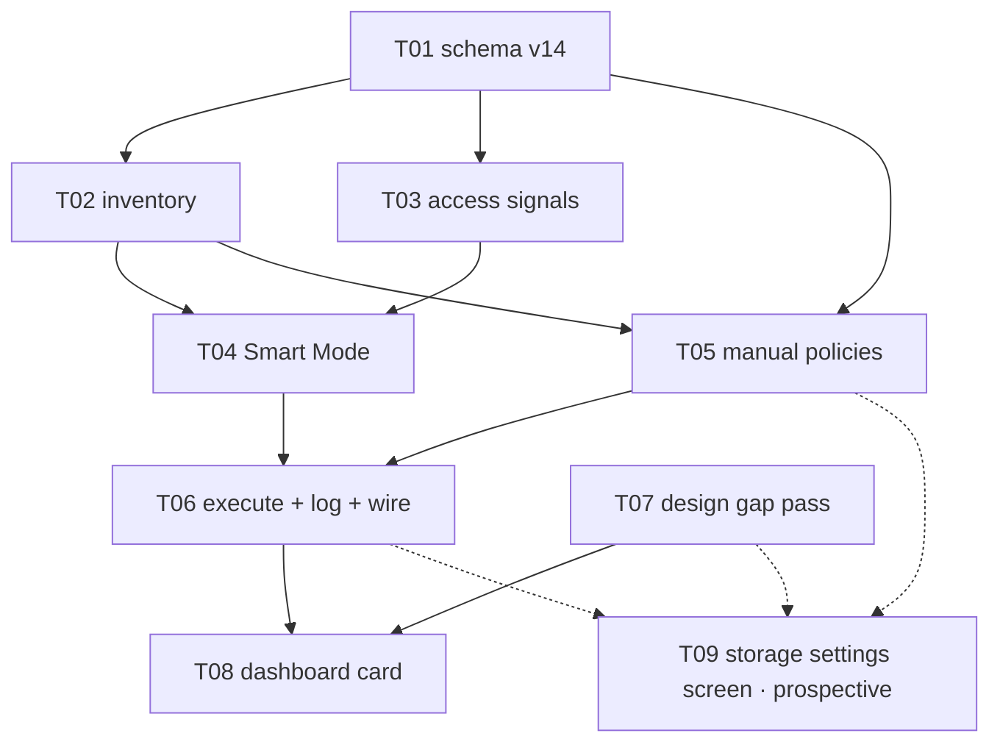

# E08 · Local Storage & Management · Progress

**Status:** `E08-T01`, `E08-T02`, `E08-T03`, `E08-T04`, `E08-T05` and
`E08-T07` all merged, reviewed APPROVE (T05 took 2 review rounds — a real
S2 bug, `overSizeMb` capping per-kind instead of against the combined
total, found and fixed). All 6 open questions from sharding resolved by
the human 2026-09-02 (see `epic.md` §Open Questions). `E08-T06` is
dispatchable next. ·
**Started:** 2026-09-02 ·
**Completed:** — · **Progress:** 6/8 sharded (+1 prospective)

**Remaining gates:**
- 🧍 `design_contract_approval` for `GAP-024`…`GAP-027` (`design/gaps.md`)
  — ⏳ AWAITING HUMAN — gates T08's build, and gates T09 being sharded at
  all. `E08-T07` produced the contracts; approval of the gap entries
  themselves is a separate, still-open gate.
- 🟡 `OQ-E08-T05-1` (`E08-T05.md`) — the `overSizeMb` item-fetch callback
  has no paging control; `StorageInventory.itemsOfKind`'s default
  500-item newest-first window can make "oldest-first" silently operate
  on the wrong window past 500 items in one kind. **Does not block
  `E08-T06`'s dispatch** (the plan/log/wiring work is unaffected), but
  **must be answered before `E08-T06` executes any `overSizeMb` plan in
  production** — executing a plan built on a truncated, wrong-end window
  would delete based on a lie about which items are actually oldest.

**Cleared 2026-09-02:** `analyze_report` (human resolved all 6 OQs at
sharding), `db_schema_migration` (`OQ-E08-T01-1`, human approved T01's
DDL as specified), `OQ-E08-1` (storage denominator — device free space +
no fabricated percentage), `OQ-E08-3` (Smart Mode excludes conversation
content by default).

## Tasks

| id | title | layer | size | MoSCoW | depends_on | status |
|---|---|---|---|---|---|---|
| E08-T01 | Storage schema migration v14 | backend | M | must | — | done · builder (sonnet) → reviewer (opus) · APPROVE · squash-merged `4507119` (PR #17) + follow-up fix `43b891f` |
| E08-T02 | Storage inventory read model | backend | M | must | T01 | done · builder (sonnet) → reviewer (opus) · APPROVE · squash-merged `1efec77` (PR #18) |
| E08-T03 | Access-frequency signals | backend | S | should | T01 | done · builder (sonnet) → reviewer (opus) · APPROVE · squash-merged `222c6dd` (PR #19) |
| E08-T04 | Smart Mode — the eight-factor plan | backend | M | must | T01, T02, T03 | done · builder (sonnet) → reviewer (opus) · APPROVE · squash-merged `77f0505` (PR #20) |
| E08-T05 | Manual policies + mode selection | backend | S | should | T01, T02 | done · builder (sonnet) → reviewer (opus) · round 1 CHANGES → round 2 APPROVE · squash-merged `1c54ecc` (PR #21) |
| E08-T06 | Retention execution + decision log + wiring | backend | M | must | T04, T05 | todo |
| E08-T07 | Design gap pass | docs | M | must | — | done · planner (opus) → reviewer (sonnet) · APPROVE · squash-merged `a94e483` (PR #16) |
| E08-T08 | Dashboard Local Storage card | frontend | M | must | T06, T07 | todo — blocked on 🧍 `design_contract_approval` GAP-024/025 |
| E08-T09 | Storage settings screen | frontend | M | should | T05, T06, T07 | **prospective — not sharded** |

**Why T09 has no task file yet:** rule 2. Its `design_contract:` would be
`design/screens/settings-storage.md`, which `E08-T07` has not written —
`scheduler.py --validate` rejected exactly that and was right to. Shard it
the moment T07 lands and `GAP-024` is cleared. **When sharding it, do not
give it `test/design/design_probe_test.dart`** — `E08-T08` owns that file.

**Parallel sets, in order:** {T01, T07} → {T02, T03} → {T04, T05} → {T06} →
{T08}, with T09 sharded and slotted after T07 lands. WIP cap is 3
(`harness.yaml`), so the widest set fits.

**Anti-collision:** no two tasks in any parallel set share a file. Sole
owners of the contended paths: `lib/core/persistence/*` → T01 ·
`lib/app/bindings.dart` + `messaging_coordinator.dart` → T06 ·
`lib/features/dashboard/**` + `test/design/design_probe_test.dart` → T08 ·
`lib/features/chat/**` → T03 · `design/**` → T07. `lib/app/routes.dart`
and `lib/features/settings/**` are reserved for T09 and touched by no
sharded task.

## Carried-forward observations (not yet a task)

_(empty at sharding — created deliberately so it has a reader from day one.
`L-process-008`, a rule since E06: **read this section before each new
dispatch and cross-check the next task's `files:` fence.** E06's
highest-severity finding, `E06-B02` (S1), sat correctly recorded in this
exact section for eight tasks with no reader.)_

- **2026-09-02 · E08 sharding · the eight factors are not eight equal
  things (advisory, S3).** Six of `FR-STORE-005`'s factors have real inputs
  in this build; *storage pressure* and *importance* have none
  (`OQ-E08-1`, `OQ-E08-4`). `E08-T04` reports them `unavailable` rather
  than defaulting them — **check at every downstream dispatch that no
  reader has quietly started treating `Unavailable` as `0.0`**, which would
  reintroduce the synthesized-measurement defect E04-B03 established the
  prohibition against. Owner: T06, T08 and T09 dispatches.

- **2026-09-02 · E08 sharding · relay retention has an owner already
  (advisory, S4).** `RelayEngine.reclaimPayloads` (E04-B02) on
  `MessagingCoordinator`'s tick (E06-T06) owns relay payload TTL. Three
  E08 fences forbid touching it. **Check at T06's dispatch** that the
  storage pass appended to the tick has not been placed *before* the
  existing reclaim, and that a storage-pass failure cannot abort the
  messaging work in the same tick.

- **2026-09-02 · E08 sharding · FR-STORE-002/003 are claimed by this epic
  and built by nobody (`OQ-E08-5`).** Recorded here as well as in the
  epic's Open Questions so it survives the epic close: if the human
  chooses option (ii), it needs an IMP report at the time the media-path
  task is created, not at E08's retro.

- **2026-09-02 · E08-T01 review (F2) · `onCreate` is not re-runnable at
  all — pre-existing, not introduced by T01 (advisory, S3).** A fresh
  install killed mid-`onCreate` and reopened fails on
  `SqliteException(1): index idx_messages_conversation_created_at already
  exists` — an E05-era `Migrator.createIndex` call with no `IF NOT
  EXISTS`. Reproduces identically on `epic_08` base, unrelated to storage.
  Out of E08's fence entirely; recorded so it has a reader before the E08
  sweep (or any future infra-hardening pass) rather than being lost.

- **2026-09-02 · E08-T03 review · three observations for T04's brief and
  a future wiring follow-up (advisory, S4 each).** (1) `recordConversationOpened`
  correctly writes `kind=message` with a *conversation* id as `item_id`
  per T03's own contract — **T04 must not join `storage_item_stats` to
  `messages` naively**, since a `message`-kind row's `item_id` matches no
  `messages.id`. (2) `ChatController.onClose` calls `_recorder?.dispose()`
  — harmless today (per-controller instance, `dispose()` only flushes),
  but if a future task wires a *shared* recorder into
  `chat_binding.dart`, the first chat close would tear down the shared
  instance; that task should scope the recorder per-controller or swap
  the call to `flush()`. (3) `recordAccess` has no dispose-guard (a call
  after `dispose()` re-arms the debounce timer) — not reachable in the
  current wiring, cheap to add if the shared-instance path above is ever
  taken.

- **2026-09-02 · E08-T04 review · three observations for T06's dispatch,
  the plan's first real caller (advisory, S3/S4).** (1) **S3 —
  `budgetBytes == 0` synthesizes a fake `pressureRatio` of `1.0`**
  (`smart_mode_policy.dart:135-137`) — a zero denominator is undefined,
  not "100% full", and would relabel every candidate's reason as
  `storagePressure`. Unreachable today (no caller passes `budgetBytes`
  yet). **`E08-T06` must never pass `0`**, and `OQ-E08-1`'s eventual
  budget-semantics answer should say whether a zero/absent budget reports
  `Unavailable`. (2) **S4 — the storage-pressure reason-override branch
  is live but untested** (`smart_mode_policy.dart:241-247`) — when
  pressure is high it silently replaces an already-chosen reason with
  `storagePressure`. Disclosed honestly, no EARS criterion currently
  requires a test for it, but it needs one before it can run for real
  under a genuine budget. (3) **S4, non-blocking** — the never-accessed
  vs. rarely-accessed thresholds (7 days vs. 30 days,
  `retention_plan.dart` `SmartModeThresholds`) treat absence of an access
  row ~4× more harshly than observed non-use. Both are correct
  `A-004` placeholders per `OQ-E08-T04-1`, but the asymmetry is worth the
  human's attention when real numbers replace them.

## Event log (append-only)
- 2026-08-26 E08 drafted during Wave 1 epic-breakdown; deferred to a later wave.
- 2026-09-02 Sharded into 8 tasks (+1 prospective) by the planner against `development` @
  `66d3a3f` (698/698 green, E07 and its retro fully merged).
  `skills/task-sharding` §0 run before slicing per `L-process-007`: E06's
  and E07's `retro.md`, both trackers' §Carried-forward observations and
  §Bug sweep, E06's `epic.md` (whose T15/T17 rows name E08 by id), E07's
  `epic.md` PTT/FR-STORE-002 passage, `design/gaps.md` and
  `dashboard_controller.dart`'s own header were all read — **12 inherited
  obligations enumerated, 0 dropped** (see `epic.md` §Inherited
  obligations). Design gap pass added `GAP-024`…`GAP-027` to
  `design/gaps.md`, all 🟡 with bare `approved by:` lines
  (`L-process-002`); two of the four deliberately carry **no proposal**,
  only named forks. **Six Open Questions raised rather than guessed** —
  two 🔴 blocking (`OQ-E08-1` the storage denominator, `OQ-E08-3` what
  Smart Mode may delete by default), four ⚠️ important (`OQ-E08-2`
  NFR-SCALE-001's missing number, `OQ-E08-4` the undefined "importance"
  and "temporary status", `OQ-E08-5` FR-STORE-002/003 have no owner,
  `OQ-E08-6` E08 is not in an approved wave). Analyze report appended to
  `epic.md`; 🧍 `analyze_report` gate ⏳.
- 2026-09-02 **A-002 checked explicitly, as the sharding brief asked.**
  A-002's own recorded statement covers *group size and relay hop count*,
  and its revisit trigger names the groups and routing epics — **storage
  is outside its scope**, so E08 cannot defer under it. Raised as
  `OQ-E08-2` with an advisory to extend the same placeholder *shape* to
  storage via a new `A-004`, which keeps E08 unblocked without pretending
  A-002 already covered it.
- 2026-09-02 **`E08-T09` deferred to prospective during the same pass.**
  The first draft sharded it with `design_contract:
  design/screens/settings-storage.md`; `scheduler.py --validate` rejected
  it — that file is `E08-T07`'s deliverable and does not exist yet. Rule 2
  and E07's own precedent both say the same thing, so the task file was
  removed rather than the contract faked, its shape recorded in `epic.md`
  §Prospective and in `GAP-024`, and its one inherited obligation (the
  `L-design-002` probe-fixture seed) re-homed to `E08-T08`, which owns that
  file. Validator clean afterwards.

## Review log

### E08-T01 — 2026-09-02 — 📋 **APPROVE** (reviewer: `claude-opus-5`; `executed_by`: `claude-sonnet-5` ✅ rule 5)

- **DDL: verified against a real `sqlite_master` dump**, not source
  reading — column-for-column identical to the human-approved §5 contract.
  `budget_bytes INTEGER NULL` with no `DEFAULT`, both PKs and both indexes
  exact.
- **scope: clean.** `pubspec.yaml`/`pubspec.lock` zero bytes changed;
  `messages`/`delivery_states`/`relay_packets`/`routes`/`sync_cursors`/
  group-crypto tables confirmed untouched by diff AND by the migration
  test's own byte-identical DDL assertion pre/post.
- **atomicity: proven by differential fault injection**, not just read.
  Reviewer threw inside the migration step with and without the
  transaction wrap — without it, all three tables persisted half-created
  after a simulated crash (the exact hazard §6 named); with it, zero
  tables and `user_version` unchanged.
- **exact-set-equality migration test: independently re-falsified.**
  Reviewer injected their own extra table, reproduced the claimed failure
  signature exactly, reverted, confirmed green — not trusting the
  builder's report of their own falsification.
- **default-row tests: confirmed structurally distinct** `onCreate`
  (`NativeDatabase.memory()` → `wasCreated`) vs. `onUpgrade` (raw v13 DB →
  `hadUpgrade`) paths — no shared hook that could fake one via the other.
- **`database.g.dart`: confirmed genuinely regenerated.** Reviewer reran
  `build_runner` themselves — byte-identical output, zero diff.
- **suite: 713/713**, `flutter analyze` clean, both re-run by reviewer.

**Two non-blocking findings, both recorded rather than gated on:**
- **F1 (S3) — the default-row insert wasn't retry-safe** against a crash
  in drift's post-`onUpgrade` version-stamping window (reproduced via
  fault injection: `UNIQUE constraint failed` on re-run). Reviewer's
  recommended fix (`InsertMode.insertOrIgnore` on both insert call sites,
  zero risk, no re-review needed) applied directly by the orchestrator as
  a same-day follow-up commit (`43b891f`) — re-verified 713/713 green,
  analyze clean.
- **F2 (S3, pre-existing, not introduced by this task)** — see
  §Carried-forward observations above.

**Ready to squash-merge — done.** Squash-merged to `epic_08` as `4507119`
(PR #17), plus the F1 follow-up fix `43b891f`.

### E08-T07 — 2026-09-02 — 📋 **APPROVE** (reviewer: `claude-sonnet-5`; `executed_by`: `claude-opus-5` ✅ rule 5)

- **scope: in-contract** — diff confined to exactly the 4 claimed paths.
- **`approved by:` lines on GAP-024/025/026/027: directly grepped, genuinely
  blank** — no self-signature (`L-process-002`).
- **rule 2 primitive reuse: spot-checked**, including one honestly
  disclosed deviation (a title colour substituted because the parent
  screen's own value wasn't in its own measured token table).
- **`dashboard.md`'s generated table region: confirmed byte-identical**
  to HEAD via diff — only the new Derived-state section added.
- **OQ-E08-1/OQ-E08-3 fidelity: verified against the full open-question
  text**, not a paraphrase — copy matches the human's actual decision
  exactly (no fabricated percentage, "Not measured" never "0", Smart
  Mode's content-exclusion copy, empty state framed as expected-default
  not rare).
- **No forbidden UI element** (Clean Now / apply-now / dialog / delete
  affordance) found anywhere — confirmed by grep and cross-checked that
  no dialog primitive exists anywhere in this design system.
- Zero Dart files touched; suite result provably a no-op. Design gate
  correctly n/a for a pre-build derived contract.

**Ready to squash-merge — done.** Squash-merged to `epic_08` as `a94e483`
(PR #16).

### E08-T02 — 2026-09-02 — 📋 **APPROVE** (reviewer: `claude-opus-5`; `executed_by`: `claude-sonnet-5` ✅ rule 5)

- **scope: in-contract** — diff confined to exactly the 3 declared
  `create:` files.
- **real measured bytes: confirmed by reading the SQL**, not by trusting
  the claim — every measurement is `SUM(LENGTH(...))`/`COUNT(*)` against
  `AppDatabase`, zero decrypt/parse calls anywhere in the file.
- **DB file size structurally excluded from `totalBytes()`** (never
  enters `classTotals` at all — not a runtime guard, a type-level
  omission) — falsified by injecting a `databaseFile` entry into
  `classTotals`, confirmed rejected.
- **NULL-payload exclusion matters more than claimed**: reviewer found
  `relay_packets.size_bytes` goes *stale* after `reclaimPayloads` nulls
  only `payload`, so using `LENGTH(payload)` gated on `IS NOT NULL`
  (rather than the cheaper, wrong `size_bytes` column) avoided a real
  E04-B03-shaped fabricated-measurement bug.
- **Four media kinds: confirmed zero producers anywhere in `lib/`** via
  grep; zero-reporting is in-contract per the task's own §3/§6/§8.
- **`LENGTH()`-on-BLOB test: falsified independently** by swapping to
  character-length semantics — caught the regression exactly as claimed.
- **suite: 720/720**, `flutter analyze` clean, both re-run by reviewer;
  CI (2 runs) confirmed green before merge.
- Two non-blocking findings recorded above (§Carried-forward): F1 (a
  differently-named decrypt call could theoretically slip the guard) and
  F2 (`StorageClassTotal` has no way to express "unmeasurable" yet,
  harmless today).

**Ready to squash-merge — done.** Squash-merged to `epic_08` as `1efec77`
(PR #18).

### E08-T03 — 2026-09-02 — 📋 **APPROVE** (reviewer: `claude-opus-5`; `executed_by`: `claude-sonnet-5` ✅ rule 5)

- **Cross-task duplicate-enum consolidation confirmed genuine, not just
  claimed.** T03 was dispatched in parallel with T02 off the same base
  commit and initially declared a disclosed-temporary local
  `StorageItemKind` enum; once T02 merged, the orchestrator sent the
  builder back to consolidate onto T02's canonical enum before review.
  Reviewer grepped the whole tree: exactly one `enum StorageItemKind`
  declaration exists (T02's), zero in this PR's diff.
- **Atomic upsert: proven by logging the real emitted SQL**, not by
  reading Dart alone — a single `INSERT ... ON CONFLICT DO UPDATE` with
  the increment evaluated SQL-side, no read-then-write race window. A
  100-call/20-concurrent-flush interleaving probe landed exactly 100, no
  lost updates.
- **Three independent falsifications**, each reproducing the builder's
  own claim exactly: the atomic-increment swap (15 vs 5 mismatch), the
  debounce removal (coalescing test fails on its own pre-window
  assertion), and the error-swallowing removal (both best-effort tests
  fail).
- **NULL-until-observed semantics confirmed**: real wall-clock timestamp
  on first access, never a synthesized 0, no row at all for an
  unobserved item.
- **`ChatController` wiring genuinely optional** — confirmed structurally
  by the full pre-existing test suite (630+ lines, none passing a
  `recorder:` argument) still passing unmodified.
- **No read-back of `storage_item_stats` anywhere in `lib/`**, confirmed
  by grep — this task only writes.
- **suite: 730/730**, `flutter analyze` clean, both re-run by reviewer;
  CI (2 runs) confirmed green before merge.
- Three non-blocking observations recorded above (§Carried-forward), all
  aimed at T04's brief or a future wiring follow-up.

**Ready to squash-merge — done.** Squash-merged to `epic_08` as `222c6dd`
(PR #19).

### E08-T04 — 2026-09-02 — 📋 **APPROVE** (reviewer: `claude-opus-5`; `executed_by`: `claude-sonnet-5` ✅ rule 5)

- **Two orchestrator-ratified deviations re-verified, not taken on
  faith.** `OQ-E08-T04-2` (added `items` parameter): reviewer read T02's
  actual types and confirmed `StorageInventorySnapshot`/`StorageClassTotal`
  genuinely hold only class-level aggregates, no per-item data — the
  parameter is structurally necessary, not a convenience. Purity
  confirmed via import/grep: zero Drift/`AppDatabase`/`DateTime.now`
  hits, doc-comment prose only. `OQ-E08-T04-3` (importance stays
  `Unavailable`): confirmed the code path is unconditional with no
  reassignment anywhere, and the `files:` fence genuinely contains none
  of E02's trust-relationship code — the scope-creep concern was real.
- **No-fabricated-defaults property attacked directly**, not by
  inspection: reviewer swapped both `pressure` and `importance` to
  `Scored(0.0)` and confirmed each change breaks exactly its own targeted
  test.
- **Threshold-literal grep and no-composite-score claims independently
  reproduced.**
- **Determinism: falsified, not trusted.** Reviewer deleted the group
  sort — exactly 1 test failed (the determinism test itself) out of 740,
  confirming the tie-break is genuinely wired, not decorative.
- **`stats` key helper: falsified.** Reviewer swapped the one call site
  to an ad-hoc lookup (the exact `kind:id`-vs-`id` bug §6 warns about) —
  two tests failed.
- **suite: 740/740**, `flutter analyze` clean, both re-run by reviewer;
  CI (2 runs) confirmed green before merge.
- Three non-blocking findings recorded above (§Carried-forward), all
  aimed at `E08-T06`'s dispatch — the plan's first real caller.

**Ready to squash-merge — done.** Squash-merged to `epic_08` as `77f0505`
(PR #20).

### E08-T05 — 2026-09-02 — 📋 **CHANGES** round 1 (reviewer: `claude-opus-5`; `executed_by`: `claude-sonnet-5` ✅ rule 5)

- **scope: in-contract** — diff confined to exactly the 4 declared files.
- **F1 (S2, blocking) — `overSizeMb` applies the byte cap per storage
  category, not to the total.** Reviewer's own probe: cap 300, three
  kinds of 200 each (600 total, 2× over cap) → plan is **empty**, no
  removals, because no single kind individually exceeds the cap. Directly
  contradicts the task's own §6 ("which items go when **the total**
  exceeds the cap") and the human-approved design contract's copy
  ("Delete old data when storage exceeds X MB" — the total). All four
  existing `overSizeMb` tests used a single-kind snapshot, so the defect
  was structurally untested, not just missed.
- **F2 (S3) — recorded as `OQ-E08-T05-1`, not a code fix.** The `items()`
  callback's fixed §5 signature has no paging control; in production it's
  `StorageInventory.itemsOfKind`'s default `limit=500, ORDER BY
  created_at DESC` — newest 500, not oldest. Beyond 500 items in one
  kind, "oldest-first" silently operates on the wrong window. This is a
  contract gap T05 cannot fix inside its own fence — needs a
  human/planner decision on how `StorageInventory` should expose an
  oldest-first paged read, or an explicit accepted-limitation note.
- **Everything else verified sound, several beyond the builder's own
  testing:** validation exactness across all 10 branches including
  boundary values; `watch()`'s broadcast/replay behavior confirmed with a
  stronger probe (two live subscriptions on one stream instance) than the
  builder's own test provided; MiB/MB conversion happens exactly once;
  no Smart Mode factor leakage into manual modes (the specific defect
  class §4 warns against); all disclosed deviations
  (`StoragePolicySettingRow` return type, `StorageMode`'s placement,
  empty factor maps, duplicated category-key mapping) judged sound on
  their individual merits.
- **The builder's disclosed non-red-first process was probed, not just
  noted**: reviewer independently reproduced both of the builder's own
  falsification claims (tie-break removal, validation-branch removal) —
  both held — then falsified a THIRD claim the builder hadn't tested
  (`Value(null)` vs `Value.absent()` writes) — also held. The actual gap
  wasn't falsification quality; F1's cap semantics were simply never
  identified as a claim needing a test, because every existing test
  matched the shape the (buggy) implementation already had.
- **suite: 756/756**, `flutter analyze` clean, both re-run by reviewer.

**Routed back to the same implementer (rule: same builder gets first
right of repair) for F1.** F2 recorded as `OQ-E08-T05-1` in the task
file, not blocking F1's fix.

### E08-T05 — 2026-09-02 — 📋 **APPROVE** round 2 (reviewer: `claude-opus-5`; `executed_by`: `claude-sonnet-5` ✅ rule 5)

- **F1's fix independently verified, not trusted.** Reviewer reproduced
  the original zero-removal repro against the fixed code, then built a
  genuinely discriminating adversarial fixture (mixed item sizes/ages
  across kinds) where global-oldest-first and per-kind-then-concatenate
  actually diverge — confirmed the fix chooses the correct global answer,
  and confirmed a same-timestamp cross-kind tie-break works correctly.
- **Three independent falsifications**, all reproducing their exact
  expected failure signature, then restored to a byte-identical clean
  tree: the per-kind gate reverted (exact round-1 symptom reproduced),
  the global sort reverted (wrong items selected, matching what a
  per-kind pass would choose), the unmodifiable-list fix reverted
  (`UnsupportedError` reproduced). **Notably: the round-1 pre-existing
  tests stayed green even with F1 reverted** — mechanical proof the new
  regression test is what actually holds the line, not decoration.
- **Re-grouping after global selection confirmed correct** — per-kind
  byte/item totals reflect only that kind's own selected items, no
  pool-total leakage.
- **Secondary `const []` bug confirmed fixed with no sibling instance** —
  grepped the whole file; one pre-existing E08-T02 instance probed and
  confirmed not a live hazard.
- **F2/`OQ-E08-T05-1` confirmed correctly left untouched** — no attempted
  fix, still open, correctly deferred to a human/planner decision.
- **One additional detail folded into the same open question**, not a
  new entry: `runningBytes` is seeded from the SQL-summed total but
  decremented by pooled-item bytes, so the same 500-item truncation could
  also cause *under-planning* (exhausting the pool while still over cap),
  not just wrong-item selection. Whoever answers `OQ-E08-T05-1` should
  treat this as part of the same gap.
- **suite: 757/757**, `flutter analyze` clean, both re-run twice by
  reviewer; CI (2 runs) confirmed green before merge.

**Ready to squash-merge — done.** Squash-merged to `epic_08` as `1c54ecc`
(PR #21).
