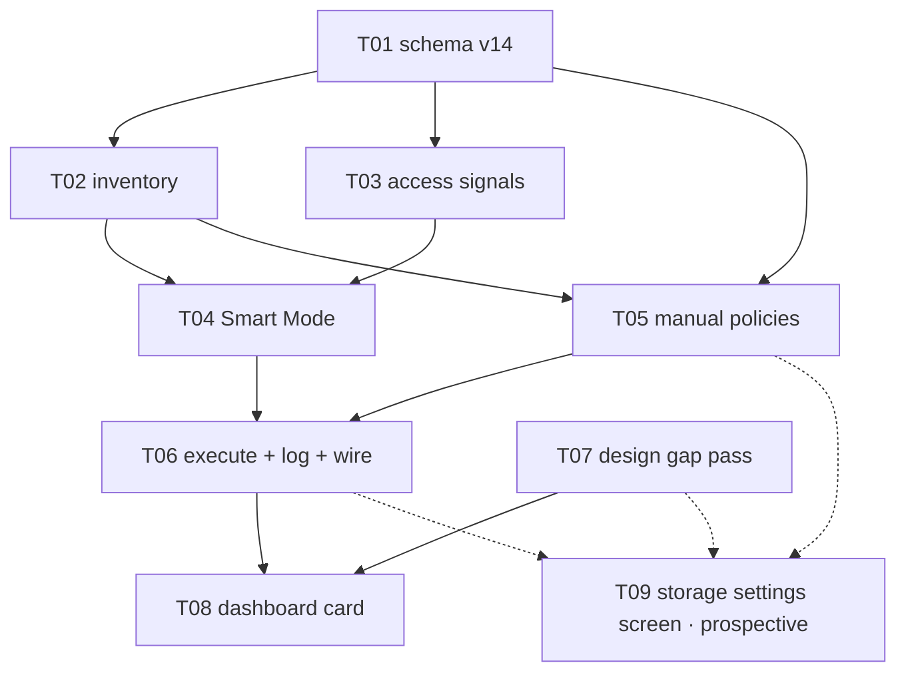

# E08 · Local Storage & Management · Progress

**Status:** sharded, awaiting 🧍 `analyze_report` · **Started:** — ·
**Completed:** — · **Progress:** 0/8 sharded (+1 prospective)

**Blocking gates before any dispatch:**
- 🧍 `analyze_report` (`epic.md` §Analyze report) — ⏳ AWAITING HUMAN
- 🧍 `db_schema_migration` (`OQ-E08-T01-1`, E08-T01) — ⏳
- 🧍 `design_contract_approval` for `GAP-024`…`GAP-027` (`design/gaps.md`)
  — ⏳ — gates T08's build, and gates T09 being sharded at all
- 🔴 `OQ-E08-1` (storage denominator) — blocks T04's pressure factor and
  T08's percentage
- 🔴 `OQ-E08-3` (what Smart Mode may delete) — blocks T06's apply path

## Tasks

| id | title | layer | size | MoSCoW | depends_on | status |
|---|---|---|---|---|---|---|
| E08-T01 | Storage schema migration v14 | backend | M | must | — | todo |
| E08-T02 | Storage inventory read model | backend | M | must | T01 | todo |
| E08-T03 | Access-frequency signals | backend | S | should | T01 | todo |
| E08-T04 | Smart Mode — the eight-factor plan | backend | M | must | T01, T02, T03 | todo |
| E08-T05 | Manual policies + mode selection | backend | S | should | T01, T02 | todo |
| E08-T06 | Retention execution + decision log + wiring | backend | M | must | T04, T05 | todo |
| E08-T07 | Design gap pass | docs | M | must | — | todo |
| E08-T08 | Dashboard Local Storage card | frontend | M | must | T06, T07 | todo |
| E08-T09 | Storage settings screen | frontend | M | should | T05, T06, T07 | **prospective — not sharded** |

**Why T09 has no task file yet:** rule 2. Its `design_contract:` would be
`design/screens/settings-storage.md`, which `E08-T07` has not written —
`scheduler.py --validate` rejected exactly that and was right to. Shard it
the moment T07 lands and `GAP-024` is cleared. **When sharding it, do not
give it `test/design/design_probe_test.dart`** — `E08-T08` owns that file.

**Parallel sets, in order:** {T01, T07} → {T02, T03} → {T04, T05} → {T06} →
{T08}, with T09 sharded and slotted after T07 lands. WIP cap is 3
(`harness.yaml`), so the widest set fits.

**Anti-collision:** no two tasks in any parallel set share a file. Sole
owners of the contended paths: `lib/core/persistence/*` → T01 ·
`lib/app/bindings.dart` + `messaging_coordinator.dart` → T06 ·
`lib/features/dashboard/**` + `test/design/design_probe_test.dart` → T08 ·
`lib/features/chat/**` → T03 · `design/**` → T07. `lib/app/routes.dart`
and `lib/features/settings/**` are reserved for T09 and touched by no
sharded task.

## Carried-forward observations (not yet a task)

_(empty at sharding — created deliberately so it has a reader from day one.
`L-process-008`, a rule since E06: **read this section before each new
dispatch and cross-check the next task's `files:` fence.** E06's
highest-severity finding, `E06-B02` (S1), sat correctly recorded in this
exact section for eight tasks with no reader.)_

- **2026-09-02 · E08 sharding · the eight factors are not eight equal
  things (advisory, S3).** Six of `FR-STORE-005`'s factors have real inputs
  in this build; *storage pressure* and *importance* have none
  (`OQ-E08-1`, `OQ-E08-4`). `E08-T04` reports them `unavailable` rather
  than defaulting them — **check at every downstream dispatch that no
  reader has quietly started treating `Unavailable` as `0.0`**, which would
  reintroduce the synthesized-measurement defect E04-B03 established the
  prohibition against. Owner: T06, T08 and T09 dispatches.

- **2026-09-02 · E08 sharding · relay retention has an owner already
  (advisory, S4).** `RelayEngine.reclaimPayloads` (E04-B02) on
  `MessagingCoordinator`'s tick (E06-T06) owns relay payload TTL. Three
  E08 fences forbid touching it. **Check at T06's dispatch** that the
  storage pass appended to the tick has not been placed *before* the
  existing reclaim, and that a storage-pass failure cannot abort the
  messaging work in the same tick.

- **2026-09-02 · E08 sharding · FR-STORE-002/003 are claimed by this epic
  and built by nobody (`OQ-E08-5`).** Recorded here as well as in the
  epic's Open Questions so it survives the epic close: if the human
  chooses option (ii), it needs an IMP report at the time the media-path
  task is created, not at E08's retro.

## Event log (append-only)
- 2026-08-26 E08 drafted during Wave 1 epic-breakdown; deferred to a later wave.
- 2026-09-02 Sharded into 8 tasks (+1 prospective) by the planner against `development` @
  `66d3a3f` (698/698 green, E07 and its retro fully merged).
  `skills/task-sharding` §0 run before slicing per `L-process-007`: E06's
  and E07's `retro.md`, both trackers' §Carried-forward observations and
  §Bug sweep, E06's `epic.md` (whose T15/T17 rows name E08 by id), E07's
  `epic.md` PTT/FR-STORE-002 passage, `design/gaps.md` and
  `dashboard_controller.dart`'s own header were all read — **12 inherited
  obligations enumerated, 0 dropped** (see `epic.md` §Inherited
  obligations). Design gap pass added `GAP-024`…`GAP-027` to
  `design/gaps.md`, all 🟡 with bare `approved by:` lines
  (`L-process-002`); two of the four deliberately carry **no proposal**,
  only named forks. **Six Open Questions raised rather than guessed** —
  two 🔴 blocking (`OQ-E08-1` the storage denominator, `OQ-E08-3` what
  Smart Mode may delete by default), four ⚠️ important (`OQ-E08-2`
  NFR-SCALE-001's missing number, `OQ-E08-4` the undefined "importance"
  and "temporary status", `OQ-E08-5` FR-STORE-002/003 have no owner,
  `OQ-E08-6` E08 is not in an approved wave). Analyze report appended to
  `epic.md`; 🧍 `analyze_report` gate ⏳.
- 2026-09-02 **A-002 checked explicitly, as the sharding brief asked.**
  A-002's own recorded statement covers *group size and relay hop count*,
  and its revisit trigger names the groups and routing epics — **storage
  is outside its scope**, so E08 cannot defer under it. Raised as
  `OQ-E08-2` with an advisory to extend the same placeholder *shape* to
  storage via a new `A-004`, which keeps E08 unblocked without pretending
  A-002 already covered it.
- 2026-09-02 **`E08-T09` deferred to prospective during the same pass.**
  The first draft sharded it with `design_contract:
  design/screens/settings-storage.md`; `scheduler.py --validate` rejected
  it — that file is `E08-T07`'s deliverable and does not exist yet. Rule 2
  and E07's own precedent both say the same thing, so the task file was
  removed rather than the contract faked, its shape recorded in `epic.md`
  §Prospective and in `GAP-024`, and its one inherited obligation (the
  `L-design-002` probe-fixture seed) re-homed to `E08-T08`, which owns that
  file. Validator clean afterwards.
