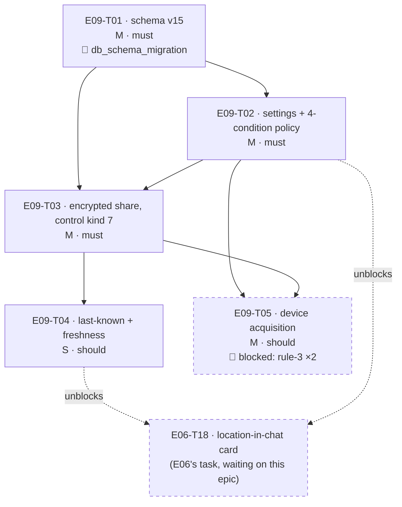

# E09 · Location Sharing · Progress

**Status:** **all 5 sharded tasks merged, reviewed APPROVE — build-complete.**
`E09-T05`'s two rule-3 blockers (`OQ-E09-T05-1`/`-2`) were answered
2026-09-04 and it shipped. **Backend/logic only** — this epic ships no
screen; see §Why there is no frontend task. ·
**Started:** 2026-09-03 · **Completed:** 2026-09-04 · **Progress:** 5/5
sharded + 5 bug tasks filed by the sweep

**Bug sweep run 2026-09-04** (`skills/bug-sweep`, reviewer `claude-opus-5`,
independent worktree off `epic_09`@`cd643f0`) — see §Bug sweep below.
**11 bugs total (`E09-B01`…`B11`, `B06`-`B11` filed by follow-on review
rounds).** `E09-B09`/`B11` (the S1 identity-poisoning exploit) closed
2026-09-04, accepted as disclosed risk via `ADR-0003`'s addendum, PR #54.
**P1 = 0. P2/P3 still nonzero** (`E09-B02`, `E09-B05`, `E09-B08`,
`E09-B10` open — see the table below) — the `skills/release` gate for the
epic→`development` PR stays **CLOSED** until those clear too.

**Still open, non-blocking, carried forward:**
- 🟡 `OQ-E09-2` (`epic.md`) — the toggles still have **no settings surface**.
  `FR-LOC-001`/`FR-LOC-002` are persisted, enforced and tested, but a user
  cannot change them in-app until the Privacy & Security design pass
  (`GAP-005`, still 🟡 proposed) happens. Owner: human.
- 🟡 `OQ-E09-3` / `OQ-E09-T03-2` — `RelayDeliveryState.failed` remains
  unwritten by choice. **Re-verified this sweep:** grep across `lib/` finds
  no assignment anywhere in the codebase; `LocationShareService` returns
  `LocationShareOutcome.transportFailed` to its own caller instead
  (`location_share_service.dart:300-312`). Correctly owned, not dropped.
  Owner: human.
- 🟡 **`LocationUnavailableReason.notConnected` is unreachable in
  production.** Both production callers of `LocationVisibilityPolicy.evaluate`
  pass this device's own `localState` for `remoteState`
  (`location_share_service.dart:224`, `location_read_model.dart:183`),
  because no two-sided relationship-state exchange exists — the accepted
  `OQ-E09-T02-1` limitation. With `remoteState == localState`, `connected`
  ⟺ `authorized`, so `notConnected` can only ever be produced by a test that
  passes the two states differently. Not a defect and not filed as one; the
  reason value is the seam `FR-TRUST-007` (E11) fills. Recorded so nobody
  rediscovers it as a bug.
- 🟡 **`epics/E06-personal-chat/epic.md:110`'s `E06-T18` row is now stale**
  — it still reads "needs E09's permission model existing
  (FR-LOC-001/002/003)", which E09 has now delivered (T02's four-condition
  policy + T04's `live`/`lastKnown`/`unavailable` reading). Not edited by
  this sweep: it is E06's file, outside E09's fence. Owner: planner, at
  E06-T18's sharding. `E09-B01` additionally `blocks: [E06-T18]` and must
  land first.

## Tasks

| Task | Title | Layer | Size | MoSCoW | depends_on | Status |
|---|---|---|---|---|---|---|
| E09-T01 | Location schema migration v15 — global toggle, per-peer toggles, single last-known fix per peer | backend | M | must | — | done · builder (sonnet) → reviewer (**sonnet — rule-5 breach, see `E09-B05`**) · APPROVE · merged `764b150` (PR #32) |
| E09-T02 | Location sharing settings repository + the four-condition visibility policy | backend | M | must | T01 | done · builder (sonnet) → reviewer (**sonnet — rule-5 breach, see `E09-B05`**) · APPROVE · merged `f6f3117` (PR #35) |
| E09-T03 | Encrypted location share wire protocol (control kind 7) — gated send and gated receive | backend | M | must | T01, T02 | done · builder (sonnet) → reviewer (**sonnet — rule-5 breach, see `E09-B05`**) · APPROVE · merged `4c03aa2` (PR #38) · CI red on GitHub Actions **billing**, not code; merged on the reviewer's own local run |
| E09-T04 | Last-known-location fallback with explicit freshness — stale is never presented as live | backend | S | should | T03 | done · builder (sonnet) → reviewer (opus, cross-model) · round 1 CHANGES (2 falsified defects in `watch()`) → round 2 APPROVE · merged `ab03dba` (PR #41) + follow-up `5f4afc6` |
| E09-T05 | Device location acquisition — real `LocationSource`, runtime permission, composition-root wiring | backend | M | should | T02, T03 | done · builder (sonnet) → reviewer (opus, cross-model) · round 1 CHANGES (F1: unfalsifiable `fail()` guards) → round 2 APPROVE · merged `9a221c4` (PR #42) · **on-device manual steps 4/5 NOT performed — standing limitation** |

## Bug tasks

| Bug | Title | Sev | Prio | Status |
|---|---|---|---|---|
| E09-B01 | `watch()` never re-evaluates the policy on a relationship change — a blocked peer stays visible | S2 | P2 | todo |
| E09-B02 | Blocking a peer never deletes their stored coordinates; T04 §4 hands retention to E08, which does not own it | S2 | P2 | todo |
| E09-B03 | `AndroidManifest.xml` comment claims an E04 Bluetooth regression check that §9 records as never performed | S3 | P2 | todo |
| E09-B04 | Tracker/epic status never advanced past sharding — `0/5`, all `todo`, five merges unrecorded | S3 | P2 | **done** (this sweep) |
| E09-B05 | Rule 5 breach — T01/T02/T03 reviewed by the same model that implemented them | S2 | P2 | todo |

## State machine

```
todo ──▶ in-progress ──▶ review-requested ──┬─▶ changes-requested ──▶ in-progress
                                            └─▶ done ──▶ 🧍 verified
                    side states: blocked (needs a human answer) · frozen (rate limit)
```

*(Historical, kept as written at sharding — T05 has since cleared this and
is `done`.)* `E09-T05` sat in `blocked` from the start: `OQ-E09-T05-1` (which location
package — a new dependency) and `OQ-E09-T05-2` (the Android manifest
permission change, which touches the posture E04's Bluetooth transport
depends on) are both rule-3 human calls. It leaves `blocked` when they are
answered, not when someone feels ready.

## DAG



`T04` and `T05` are the only pair that could run in parallel, and their
`files:` lists are disjoint (see §Anti-collision matrix). Everything else is
strictly serial.

## Anti-collision matrix

Only tasks that could be unblocked simultaneously are compared. `T01→T02→T03`
is a chain; `T04` and `T05` both depend on `T03`, so they are the one
parallelizable pair.

| | T04 | T05 |
|---|---|---|
| **T04** | — | **∅** |
| **T05** | **∅** | — |

- T04 touches `lib/features/location/domain/location_read_model.dart` and
  `lib/features/location/data/location_fix_repository.dart` (+ their tests).
- T05 touches `lib/features/location/data/platform_location_source.dart`,
  `pubspec.yaml`, `android/app/src/main/AndroidManifest.xml`,
  `lib/core/messaging/messaging_stack.dart` and
  `test/core/messaging/messaging_stack_test.dart`.
- **No shared file. Matrix empty.**

Three files *are* written by two tasks each, and every one of them is
**serialized by `depends_on`, not left to luck**:

| File | Writers | Serialized by |
|---|---|---|
| `lib/core/messaging/messaging_stack.dart` | T03 registers control kind 7; T05 swaps in the real `LocationSource` | `T05 depends_on: [E09-T03]` |
| `test/core/messaging/messaging_stack_test.dart` | same pair, same reason | same |
| `lib/features/location/data/location_fix_repository.dart` (+ its test) | T03 creates it; T04 adds `watchFix` | `T04 depends_on: [E09-T03]` |

Since T04 and T05 are the only parallelizable pair and share none of the
above, the matrix is genuinely empty rather than empty-by-assertion.

## Why there is no frontend task in this epic

Two surfaces would be needed, and neither is shardable:

1. **The toggles' settings screen** — `FR-LOC-001`/`FR-LOC-002` need a UI. It
   would live in the Privacy & Security sub-screen, which **has no design
   source**: `design/gaps.md` `GAP-005` is 🟡 *proposed*, not approved, and
   carries E02's still-open `OQ-E02-T03-1`. Rule 2: a frontend task without an
   approved `design_contract:` is not shardable.
2. **The location card in chat** — this one *does* have an approved contract
   (`design/screens/chat-location.md`, GAP-016 🟢 approved 2026-08-30,
   card-only, no map). **It is not E09's.** `epics/E06-personal-chat/epic.md`
   line 110 already claims it as the prospective **`E06-T18`**, explicitly
   blocked on "E09's permission model existing (FR-LOC-001/002/003)". E09
   builds that permission model; duplicating the card here would give one
   design contract two owners.

E09's own `epic.md` §Scope already scoped out the map UI, and
`design_screens: [settings]` in its frontmatter is aspirational — the settings
surface for these toggles does not exist yet. Recorded as `OQ-E09-2`.

## Event log (append-only)
- 2026-08-26 E09 drafted during Wave 1 epic-breakdown; deferred to a later wave.
- 2026-09-04 `skills/task-sharding` pass. Step 0 (inherited obligations) read
  E02/E03/E04 retros §Open follow-ups, their `epic.md` §Bug sweep sections and
  every bug file's advisories; findings recorded in `epic.md` §ANALYZE REPORT.
  Epic EARS extended from 2 to 5 criteria so all five `traces_to:` FR ids own
  one (`EARS-LOC-3/4/5` added — no new scope, the FR ids were already claimed).
  Five tasks written from `epics/_templates/task.template.md`. Collision matrix
  empty. `scheduler.py --validate` green. ANALYZE REPORT appended to `epic.md`;
  🧍 `analyze_report` gate ⏳ AWAITING HUMAN — **no task dispatches until it
  clears.**
- 2026-09-04 🧍 `analyze_report` cleared (decision authority explicitly
  delegated to the agent for this session). All five items under "For the
  human, before you clear this gate" decided; `OQ-E09-T05-1`/`-2` answered,
  so `E09-T05` moved `blocked` → `todo`. `OQ-E09-T01-1`
  (🧍 `db_schema_migration`) also cleared — v15 DDL approved as specified.
- 2026-09-03 `E09-T01` merged — PR #32, `764b150`, APPROVE.
- 2026-09-03 `E09-T02` merged — PR #35, `f6f3117`, APPROVE.
- 2026-09-04 `E09-T03` merged — PR #38, `4c03aa2`, APPROVE. GitHub Actions CI
  red on a **billing/spending-limit** fault, account-wide, not a code defect;
  merged on the reviewer's own independent local `flutter analyze` +
  `flutter test` run (864/864).
- 2026-09-04 `E09-T04` merged — PR #41, `ab03dba`, round 1 CHANGES → round 2
  APPROVE (cross-model, opus). Two real falsified defects in `watch()`.
  Follow-up `5f4afc6` renamed two regression tests off the `EARS-LOC-15` id.
- 2026-09-04 `E09-T05` merged — PR #42, `9a221c4`, round 1 CHANGES → round 2
  APPROVE (cross-model, opus). On-device manual steps 4/5 **not performed**;
  recorded as a standing limitation, not ticked.
- 2026-09-04 **`skills/bug-sweep` end-of-epic sweep** (reviewer
  `claude-opus-5`, independent worktree off `cd643f0`). Full suite re-run
  locally: `flutter analyze` clean, `flutter test` **895/895 passed**. All 17
  EARS ids traced to named tests. Five defects filed, `E09-B01`…`B05`.
  Backfilled the five merge entries above, which this log was missing
  entirely — that omission is itself `E09-B04`.
- 2026-09-04 This tracker and `epic.md` brought up to E08's closure shape
  (`E09-B04`, S3/P2, discharged by this same commit).

## Bug sweep — 2026-09-04 (reviewer: `claude-opus-5`, independent worktree)

Run off `epic_09`@`cd643f0` in a clean worktree, per `skills/bug-sweep`.
CI is unavailable account-wide (GitHub Actions billing), so the local run
below is the only verification and was treated as such.

### Suite — run by the reviewer, not trusted from a PR body
- `flutter analyze` → **No issues found.**
- `flutter test` → **895/895 passed** (E09 added ~98 tests over E08's 797).

### EARS coverage — 17/17
Every `EARS-LOC-1` … `EARS-LOC-17` has ≥1 test named for it, across
`location_visibility_policy_test.dart`, `location_settings_repository_test.dart`,
`location_share_service_test.dart`, `location_share_test.dart`,
`location_read_model_test.dart`, `location_fix_repository_test.dart`,
`platform_location_source_test.dart`, `location_tables_test.dart`,
`database_migration_test.dart` and `messaging_stack_test.dart`. No orphan in
either direction.

**Test-quality spot checks** (`skills/review` §2, "falsify the evidence"):
the load-bearing negative guards are counter-based
(`_FakeLocationSource.callCount`, `expect(fake.callCount, 0)` at
`location_share_service_test.dart:152, 180`), which genuinely fails if the
send-side gate is removed — the `fail()`-based shape the T05 reviewer proved
unfalsifiable was replaced in `10b7050` and does not recur here.
**Disclosed limitation of this sweep:** deliberate source mutation was not
permitted in this session's environment, so falsification was done by
independent probe (below) and by reading each guard's failure mode, not by
breaking the code and re-running.

### Cross-task seams examined
| Seam | Verdict |
|---|---|
| T01 schema → T02/T03/T04 repositories | ✅ PK-per-peer invariant holds; `location_fixes` physically cannot hold history |
| T02 policy → T03 send gate / T03 receive gate | ✅ gate genuinely evaluated twice, independently (`location_share_service.dart:234, 364`); neither side trusts the other |
| T02 policy → **T04 `watch()`** | ❌ **`E09-B01`** — only 2 of the policy's 4 inputs are watched |
| T03 `deleteFix` → the block path | ❌ **`E09-B02`** — the only delete trigger is an inbound frame |
| T03 registration → T05 real source in the composition root | ✅ `messaging_stack.dart:395-406`; `_UnavailableLocationSource` genuinely retired |
| T04 §4 "retention is E08's" → E08's actual scope | ❌ folded into **`E09-B02`** — E08 has no location kind and never touches the table |
| E09 → E08 storage inventory | ✅ no defect: `location_fixes` is not an enumerable `StorageItemKind`, but its bytes are inside `databaseFile`'s real on-disk measurement, and the row count is bounded by peer count |
| E09 → E11 `EARS-FB-1` (no permanent location in Firebase) | ✅ no Firebase path exists in any E09 file |
| E09 → E13 `EARS-DIAG-1` (never log location) | ✅ zero logging calls of any kind under `lib/features/location/` or in `location_share.dart` |
| E09 → E06-T18 (the consumer this epic exists to unblock) | ⚠️ delivered, but `E09-B01` must land first; E06's own row is stale (carried forward above) |
| Manifest change → E04 Bluetooth posture | ⚠️ static checks pass; **unverified on hardware** — see the merge-gate condition below |

### The scope-creep / invented-API pass
Diff `cc4baff..cd643f0` is **33 files, +10 619 / −2 228**, of which
`database.g.dart` (Drift codegen) is the bulk of both. Every non-generated
file maps to exactly one task's `files:` list. Findings: **none.** No
invented API, no dependency beyond the human-approved `geolocator: 14.0.2`
exact pin, no refactor outside scope, no deletion of pre-existing behaviour
(the only deletions in a hand-written file are the four lines of
`database_migration_test.dart`'s v13→v14 exact-set assertion, **widened**
to v13→v15 with the widening disclosed in the test's own comment).

### 🧍 HUMAN GATE — `bug_priorities`
Severities are the reviewer's. **Priorities were set by the agent under the
decision authority explicitly delegated by the human for this session** —
the same convention already used for `OQ-E09-T05-1/2/3`, `OQ-E09-T04-1/2`,
`OQ-E09-T01-1` and the `analyze_report` gate itself. Each bug file's
§Feedback log records the reasoning. The human may override any of them.

| Bug | Severity | Priority | Blocks the epic→`development` PR? |
|---|---|---|---|
| `E09-B01` | S2 | P2 | no — `status: done` |
| `E09-B02` | S2 | P2 | **yes** — `status: review-requested` |
| `E09-B03` | S3 | P2 | no — `status: done` |
| `E09-B04` | S3 | P2 | no — already discharged |
| `E09-B05` | S2 | P2 | **yes** — `status: todo` |
| `E09-B06` | S2 | P2 | no — `status: done` |
| `E09-B07` | S3 | should | no — `status: done` |
| `E09-B08` | S3 | P3 | **yes** — `status: todo` |
| `E09-B09` | S1 | P1 | no — `status: done`, resolved 2026-09-04 by `E09-B11`'s accepted-risk decision (see below) |
| `E09-B10` | S3 | P2 | **yes** — `status: todo` |
| `E09-B11` | S1 | P1 | no — `status: done`, resolved 2026-09-04: human delegated the rule-3 decision ("do what is best"); accepted TOFU's risk app-wide (ADR-0003 addendum) rather than a per-file patch. PR #54, 3 review rounds, final Opus verdict APPROVE, merged into `epic_09`. |

**Post-B09/B11 status (2026-09-04):** the S1 identity-poisoning exploit
(`E09-B09`→`E09-B11`) is closed as an accepted, disclosed risk — see
`agent/memory/decisions/ADR-0003-crypto-protocol.md` §Addendum
(2026-09-04) for the full record. **This does not clear the epic's
release gate**: `E09-B02` (`review-requested`), `E09-B05`, `E09-B08`, and
`E09-B10` are still open P2/P3 bugs from the earlier sweep, unrelated to
this session's E09-B11 work and untouched by it. **P1 = 0** (both S1s
now closed); **P2/P3 still nonzero** — the epic→`development` PR remains
closed on that basis alone, independent of the B09/B11 resolution.
gate is **closed**.

### 🧍 Merge-gate condition — on-device verification (not filed as a bug)
`E09-T05`'s manual steps 3/4/5 — a real GPS fix acquisition, and confirming
E04's Bluetooth discovery survives the `maxSdkVersion="30"` lift on an API
≤30 **and** an API 31+ device — were **never performed**; no physical device
or emulator existed in this environment. This is disclosed correctly in
`E09-T05.md` §7/§9 and its DoD box is deliberately unticked.

**Assessed honestly, as asked:** this is an *unmet verification obligation*,
not a defect. It has no expected-vs-actual, so it has no repro and no
regression test, and filing it as a P1/P2 bug would block the epic on
hardware nobody in this environment has — while E05–E08 all shipped riding
the same unverified E04 transport (this epic's own inherited obligation #7).
So it is recorded here as a **human merge-gate condition**, matching E04's
own retro precedent, rather than as `E09-B0n`.

**Residual risk: low, and unmeasured.** Independently re-checked this sweep:
`geolocator_android-5.0.2` declares no `ACCESS_FINE_LOCATION` of its own, so
no merger conflict; `BLUETOOTH_SCAN`'s `neverForLocation` flag is
byte-identical to its pre-E09 form (diff against `cc4baff`); the flag is an
assertion about what the *Bluetooth scan* derives, and E09 derives position
from the location provider; E04's `BluetoothPermissions.kt` still branches on
`SDK_INT` and never requests `ACCESS_FINE_LOCATION` for a scan on API 31+.
None of that substitutes for the hardware check.

**The human decides at the `verified` gate:** run steps 3/4/5 on real
hardware, or accept the risk explicitly and carry it into E09's retro.
`E09-B03` exists because the manifest currently *claims* this was already
done.

## Carried-forward observations (read before this epic's retro)
- **2026-09-04 · `E09-B05`'s retroactive re-review of `E09-T03` (opus) ·
  the `frame.source`-trust defect (`E09-B09`) is plausibly not unique to
  location sharing. UPDATE 2026-09-04 (post-`E09-B11`): confirmed, and
  resolved as an accepted risk, not a fix.** `E09-B11`'s round-2 review
  confirmed all four sibling decrypt call sites share the identical
  unguarded `DriftSignalProtocolStore.isTrustedIdentity` trust-on-first-use
  shape: `receive_message_use_case.dart:107`, `call_signaling.dart:608`,
  `group_membership_service.dart:501` (`lib/features/groups/domain/`),
  `group_crypto_service.dart:389` (`lib/core/crypto/`). The human decided
  (delegated: "do what is best") to accept TOFU's risk profile app-wide
  rather than patch any one call site — recorded in
  `agent/memory/decisions/ADR-0003-crypto-protocol.md` §Addendum
  (2026-09-04). **No code change to any of the four sibling sites** — the
  decision is disclosed acceptance, not elimination. Any future epic
  building real authenticated first-contact (safety-number/QR verification,
  or `E11`'s device directory as an authoritative identity source) would
  supersede this addendum, not silently edit it. Original note, still true
  as history: this was explicitly out of `E09-B09`'s fix fence, and its
  false E08-ownership near-miss pattern (`E09-B02`) is why it got written
  down here instead of left in a review comment.
- **2026-09-04 · `E09-B07`'s fix review (opus) · a bug's own §Regression
  test / §Fix direction asserted an acceptance criterion that is
  mathematically unfalsifiable, and nobody noticed until the fix was
  reviewed.** `E09-B07` demanded a test proving `LocationVisibilityPolicy`
  "delegates, not re-derives" `ConflictResolver.resolveLocationSharing`,
  with the acceptance shape "inlining `globalEnabled && peerEnabled` must
  fail." But `resolveLocationSharing(a, b)` is literally defined as
  `a && b` — delegating and inlining are the same total function on
  `bool × bool`, indistinguishable by any output-comparison test, full
  stop. The fix delivered everything actually testable (a real
  divergence-mutant sweep proving the guard isn't vacuous) but could not
  and cannot deliver the literal claim as written. **Retro candidate: when
  a bug/task's acceptance criterion names a specific code substitution as
  "must fail," check whether that substitution is provably
  output-equivalent to the correct code before finalizing the criterion —
  not just plausible-sounding.** No action needed on `E09-B07` itself
  (closed correctly, reviewer's own judgment call); this is a
  process-authoring lesson, not a code defect.
