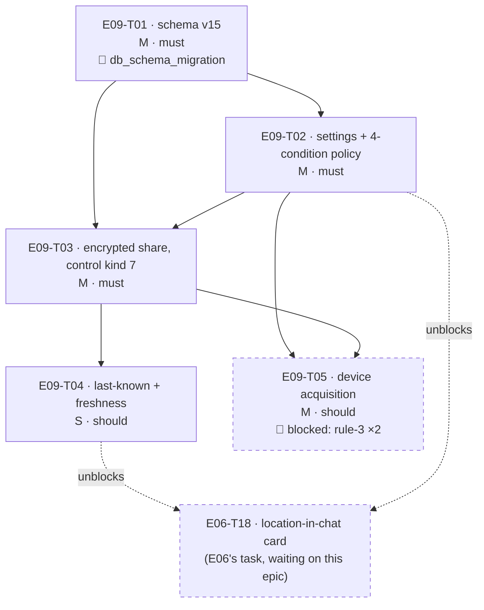

# E09 · Location Sharing · Progress

**Status:** **sharded 2026-09-04 — 5 tasks, awaiting the 🧍 `analyze_report`
gate before any dispatch.** `E09-T01`–`T04` are dispatchable the moment that
gate clears (T01 additionally fires the 🧍 `db_schema_migration` gate on its
own §5). `E09-T05` is `blocked` on two rule-3 human decisions and is **not**
dispatchable regardless. **Backend/logic only** — this epic ships no screen;
see §Why there is no frontend task. ·
**Started:** — · **Completed:** — · **Progress:** 0/5

## Tasks

| Task | Title | Layer | Size | MoSCoW | Status | depends_on |
|---|---|---|---|---|---|---|
| E09-T01 | Location schema migration v15 — global toggle, per-peer toggles, single last-known fix per peer | backend | M | must | todo | — |
| E09-T02 | Location sharing settings repository + the four-condition visibility policy | backend | M | must | todo | T01 |
| E09-T03 | Encrypted location share wire protocol (control kind 7) — gated send and gated receive | backend | M | must | todo | T01, T02 |
| E09-T04 | Last-known-location fallback with explicit freshness — stale is never presented as live | backend | S | should | todo | T03 |
| E09-T05 | Device location acquisition — real `LocationSource`, runtime permission, composition-root wiring | backend | M | should | **blocked** | T02, T03 |

## State machine

```
todo ──▶ in-progress ──▶ review-requested ──┬─▶ changes-requested ──▶ in-progress
                                            └─▶ done ──▶ 🧍 verified
                    side states: blocked (needs a human answer) · frozen (rate limit)
```

`E09-T05` sits in `blocked` from the start: `OQ-E09-T05-1` (which location
package — a new dependency) and `OQ-E09-T05-2` (the Android manifest
permission change, which touches the posture E04's Bluetooth transport
depends on) are both rule-3 human calls. It leaves `blocked` when they are
answered, not when someone feels ready.

## DAG



`T04` and `T05` are the only pair that could run in parallel, and their
`files:` lists are disjoint (see §Anti-collision matrix). Everything else is
strictly serial.

## Anti-collision matrix

Only tasks that could be unblocked simultaneously are compared. `T01→T02→T03`
is a chain; `T04` and `T05` both depend on `T03`, so they are the one
parallelizable pair.

| | T04 | T05 |
|---|---|---|
| **T04** | — | **∅** |
| **T05** | **∅** | — |

- T04 touches `lib/features/location/domain/location_read_model.dart` and
  `lib/features/location/data/location_fix_repository.dart` (+ their tests).
- T05 touches `lib/features/location/data/platform_location_source.dart`,
  `pubspec.yaml`, `android/app/src/main/AndroidManifest.xml`,
  `lib/core/messaging/messaging_stack.dart` and
  `test/core/messaging/messaging_stack_test.dart`.
- **No shared file. Matrix empty.**

Three files *are* written by two tasks each, and every one of them is
**serialized by `depends_on`, not left to luck**:

| File | Writers | Serialized by |
|---|---|---|
| `lib/core/messaging/messaging_stack.dart` | T03 registers control kind 7; T05 swaps in the real `LocationSource` | `T05 depends_on: [E09-T03]` |
| `test/core/messaging/messaging_stack_test.dart` | same pair, same reason | same |
| `lib/features/location/data/location_fix_repository.dart` (+ its test) | T03 creates it; T04 adds `watchFix` | `T04 depends_on: [E09-T03]` |

Since T04 and T05 are the only parallelizable pair and share none of the
above, the matrix is genuinely empty rather than empty-by-assertion.

## Why there is no frontend task in this epic

Two surfaces would be needed, and neither is shardable:

1. **The toggles' settings screen** — `FR-LOC-001`/`FR-LOC-002` need a UI. It
   would live in the Privacy & Security sub-screen, which **has no design
   source**: `design/gaps.md` `GAP-005` is 🟡 *proposed*, not approved, and
   carries E02's still-open `OQ-E02-T03-1`. Rule 2: a frontend task without an
   approved `design_contract:` is not shardable.
2. **The location card in chat** — this one *does* have an approved contract
   (`design/screens/chat-location.md`, GAP-016 🟢 approved 2026-08-30,
   card-only, no map). **It is not E09's.** `epics/E06-personal-chat/epic.md`
   line 110 already claims it as the prospective **`E06-T18`**, explicitly
   blocked on "E09's permission model existing (FR-LOC-001/002/003)". E09
   builds that permission model; duplicating the card here would give one
   design contract two owners.

E09's own `epic.md` §Scope already scoped out the map UI, and
`design_screens: [settings]` in its frontmatter is aspirational — the settings
surface for these toggles does not exist yet. Recorded as `OQ-E09-2`.

## Event log (append-only)
- 2026-08-26 E09 drafted during Wave 1 epic-breakdown; deferred to a later wave.
- 2026-09-04 `skills/task-sharding` pass. Step 0 (inherited obligations) read
  E02/E03/E04 retros §Open follow-ups, their `epic.md` §Bug sweep sections and
  every bug file's advisories; findings recorded in `epic.md` §ANALYZE REPORT.
  Epic EARS extended from 2 to 5 criteria so all five `traces_to:` FR ids own
  one (`EARS-LOC-3/4/5` added — no new scope, the FR ids were already claimed).
  Five tasks written from `epics/_templates/task.template.md`. Collision matrix
  empty. `scheduler.py --validate` green. ANALYZE REPORT appended to `epic.md`;
  🧍 `analyze_report` gate ⏳ AWAITING HUMAN — **no task dispatches until it
  clears.**
