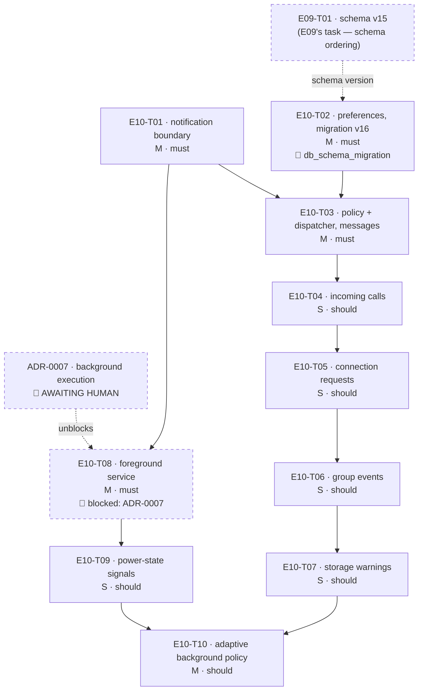

# E10 · Notifications & Background Operation · Progress

**Status:** **10/10 bugs closed as of 2026-09-04**
(`E10-B01`..`B10`, `B08` discovered post-sweep during `B04`'s fix review;
`B09`/`B10` found by a later retroactive rule-5 re-review of `T01`).
`E10-B01`, `B02`, `B03`, `B04`, `B08`, `B09`, `B10` fixed, cross-model
(Opus) reviewed — APPROVE on every one — and merged. `B06`/`B07` assessed
non-blocking (tracking-only). **`E10-B05`'s rule-3 decision was delegated
by the human ("do what is best") — option (b)(ii) chosen and implemented,
PR #66, 2 review rounds (round 1 REQUEST_CHANGES on a stale-notification
race, round 2 APPROVE), merged.** **A retroactive rule-5 re-review of
`T01`/`T02` (same pattern found in E09/E11 this session) then found 2
more real bugs in `T01` (`E10-B09`: no notification-tap delivery
producer; `E10-B10`: `ensureReady()` could throw/hang instead of
returning `bool`), both fixed. `T02` re-reviewed clean, no findings.**
**P1/P2 = 0.** `B09`/`B10` stamped P2 at the `bug_priorities` gate under
delegated decision authority, 2026-09-05 — both already fixed and
APPROVEd by the time the stamp landed, so this is a record-keeping close,
not an open gate. All 10 tasks + all 10 bugs merged and cross-model
reviewed; full suite green
after every fix (see individual bug files for exact counts). `ADR-0007`
accepted (option 1, connectedDevice, boot-restart in scope) unblocked
T08/T09/T10 earlier this session. **Backend/native only** — this epic
ships no screen; see §Why there is no frontend task. ·
**Started:** 2026-09-04 · **Completed (build):** 2026-09-04 ·
**Swept:** 2026-09-04 · **Progress:** 10/10 tasks, 10/10 bugs done

## Tasks

| Task | Title | Layer | Size | MoSCoW | Status | depends_on |
|---|---|---|---|---|---|---|
| E10-T01 | Native notification boundary — Pigeon `NotificationApi`, channels, POST_NOTIFICATIONS | cross-cutting | M | must | done | — |
| E10-T02 | Notification preferences — Drift migration v16 + repository | backend | M | must | done | E09-T01 |
| E10-T03 | Notification policy + dispatcher; new-message notifications | backend | M | must | done | T01, T02 |
| E10-T04 | Incoming-call notifications — `CallSignaling` seam | backend | S | should | done | T03 |
| E10-T05 | Connection-request notifications — `PrekeyExchange` seam | backend | S | should | done | T04 |
| E10-T06 | Group-event notifications — `GroupMembershipService` seam | backend | S | should | done | T05 |
| E10-T07 | Storage-warning notifications — `StorageManager.latestPlan` observer | backend | S | should | done | T06 |
| E10-T08 | Android foreground service — retained engine, persistent notification | cross-cutting | M | must | done | T01 |
| E10-T09 | Power-state signals — Doze, Battery Saver, screen lock, restriction | cross-cutting | S | should | done | T08 |
| E10-T10 | Adaptive background policy — one tick, cadence + discovery | backend | M | should | done | T07, T09 |

## State machine

```
todo ──▶ in-progress ──▶ review-requested ──┬─▶ changes-requested ──▶ in-progress
                                            └─▶ done ──▶ 🧍 verified
                    side states: blocked (needs a human answer) · frozen (rate limit)
```

`E10-T08` sits in `blocked` from the start. `ADR-0007` presents four
background-execution options with an advisory recommendation and its
`Decision` line read `⏳ AWAITING HUMAN` when this was written (ADR-0007 was since accepted, option 1, 2026-09-04). This is the gate `E06-T06.md:128-133`
demanded in writing before any background-execution code — a new manifest
permission set and an architecture choice, both rule 3. T08 leaves `blocked`
when ADR-0007 is `accepted` and §S1 (service type) is settled, not when
someone feels ready. `T09`/`T10` are `todo` but transitively unreachable
until then.

## DAG



Two independent lines run through this epic: the **notification line**
(T01 → T03 → T04 → T05 → T06 → T07) and the **background line**
(T01 → T08 → T09), joining at T10. The T04→T05→T06→T07 chain is serialized
*on purpose* — each of those tasks registers a source in `lib/app/bindings.dart`,
and serializing is honest where an empty-by-assertion matrix would not be.

## Anti-collision matrix

Only tasks that could be unblocked simultaneously are compared.
Simultaneously-unblocked pairs: **(T01, T02)**, **(T03, T08)**,
**(T04, T09)**, **(T05, T09)**, **(T06, T09)**, **(T07, T09)**.

| | T01 | T02 | T03 | T04 | T05 | T06 | T07 | T08 | T09 |
|---|---|---|---|---|---|---|---|---|---|
| **T01** | — | **∅** | — | — | — | — | — | — | — |
| **T02** | **∅** | — | — | — | — | — | — | — | — |
| **T03** | — | — | — | — | — | — | — | **∅** | — |
| **T04** | — | — | — | — | — | — | — | — | **∅** |
| **T05** | — | — | — | — | — | — | — | — | **∅** |
| **T06** | — | — | — | — | — | — | — | — | **∅** |
| **T07** | — | — | — | — | — | — | — | — | **∅** |

(`—` = the pair cannot be unblocked at the same time, so no comparison is
needed. `∅` = no shared file.)

Why each `∅` is real, not asserted:

- **T01 ∥ T02** — T01 is `pigeons/notifications.dart` + `lib/core/notifications/`
  + the two Android notification files + `MainActivity.kt` + the manifest.
  T02 is `lib/core/persistence/` + one repository + tests. Nothing overlaps.
- **T03 ∥ T08** — T03 is `lib/core/notifications/{policy,dispatcher,sources}`
  + `lib/app/bindings.dart`. T08 is `pigeons/background.dart` +
  `lib/core/background/` + the three Android background files +
  `MainActivity.kt` + the manifest. T08 does **not** touch `bindings.dart`
  (its composition-root wiring is deliberately deferred to T10, precisely so
  this pair stays disjoint).
- **T04/T05/T06/T07 ∥ T09** — the notification line touches
  `lib/core/notifications/sources/`, `bindings.dart`, and one E04–E08 seam
  file each (`call_signaling.dart`, `prekey_exchange.dart`,
  `group_membership_service.dart`, none for T07). T09 touches
  `pigeons/background.dart`, the background generated/native files and
  `lib/core/background/`. Disjoint.

Files written by more than one task, each **serialized by `depends_on`, not
by luck**:

| File | Writers | Serialized by |
|---|---|---|
| `android/app/src/main/MainActivity.kt` | T01 registers the notification host; T08 the background host | `T08 depends_on: [E10-T01]` |
| `android/app/src/main/AndroidManifest.xml` | T01 adds `POST_NOTIFICATIONS`; T08 adds `FOREGROUND_SERVICE` + `<service>` | `T08 depends_on: [E10-T01]` |
| `lib/app/bindings.dart` | T03, T04, T05, T06, T07 each register a source; T10 adds the lifecycle observer | the T03→T04→T05→T06→T07→T10 chain |
| `pigeons/background.dart` + its two generated files | T08 creates; T09 extends | `T09 depends_on: [E10-T08]` |
| `lib/core/background/background_service.dart` + `background_stub.dart` | T08 creates; T09 extends | same |
| `lib/core/persistence/database.dart` + `database.g.dart` | `E09-T01` (v15) and `E10-T02` (v16) — **a cross-epic collision** | `T02 depends_on: [E09-T01]` |

**Matrix empty.**

## Why there is no frontend task in this epic

`design_screens: [settings]` in the epic frontmatter is aspirational. Two
surfaces would be needed and neither is shardable under rule 2:

1. **The Notifications sub-screen.** `design/screens/settings.md` draws a
   *row* — elements 38-42, `notifications` · `Notifications` · `Alerts,
   silent modes, LED behaviors` — and **no destination screen exists in any
   of the fourteen measured contracts**. There is no `design/gaps.md` entry
   for it either (the closest precedents are `GAP-005`, still 🟡 proposed for
   Privacy & Security, and `GAP-024`, approved for Storage). A frontend task
   without an approved `design_contract:` is not shardable. `OQ-E10-1`.
2. **The Battery / background-execution sub-screen.** Same shape: elements
   33-37, `battery_full_alt` · `Battery` · `Background execution, power
   saving modes`, a row with no destination. `OQ-E10-1`.

Consequence, stated plainly: after this epic the notification categories and
privacy level are persisted, enforced and tested, and a user **cannot change
any of them from inside the app**. That is rule 2 working as intended, and it
is worth knowing before the gate clears rather than after.

A third surface is also fenced out: `E06-T12.md:116-117` handed "notifications,
background status, or connectivity change alerts" on the **Dashboard** to
E10 — but `design/screens/dashboard.md` is an *approved, measured* contract
with no such element, so adding one is an extra element needing its own
`design/gaps.md` entry and human approval. `OQ-E10-9`.

The copy this epic must ship anyway — notification titles/bodies and the
permanent foreground-service notification — is proposed inside each task's §5
so a reviewer can check it, and is flagged for the human at the analyze gate
rather than presented as approved design.

## Event log (append-only)
- 2026-08-26 E10 drafted during Wave 1 epic-breakdown; deferred to a later wave.
- 2026-09-04 `skills/task-sharding` pass. Step 0 (inherited obligations) read
  E04's and E06's `retro.md` §Open follow-ups, their `epic.md` §Bug sweep /
  §Open Questions, and every bug file in both epics (`E04-B01..B03`,
  `E06-B01..B04`) plus `E05-B02`, `E08-T06`, `E09-T05` and the E06 task files
  that name E10. **Neither retro mentions E10 at all** — all thirteen
  obligations live in task files. Findings in `epic.md` §ANALYZE REPORT.
  Epic EARS extended from 1 to 6 criteria so all five `traces_to:` FR ids own
  one (`EARS-NOTIFY-1/2`, `EARS-PLAT-2/3/4` added — no new scope; the FR ids
  were already claimed). `ADR-0007` written and left `⏳ AWAITING HUMAN`.
  Ten tasks written from `epics/_templates/task.template.md`. Collision
  matrix empty. `python agent/orchestrator/scheduler.py --validate` green.
  ANALYZE REPORT appended to `epic.md`; 🧍 `analyze_report` gate ⏳ AWAITING
  HUMAN — **no task dispatches until it clears.**

## Carried-forward observations (read before the end-of-epic sweep)
- **2026-09-04 · `E10-T04`'s cross-model review · `CallSignaling.dispose()`
  has no caller anywhere in `lib/`.** `E10-T04` added `dispose()` to close
  the new `notices` stream controller, but nothing in the composition root
  (`messaging_stack.dart` or elsewhere) calls it — the same unwired-
  capability shape as `E09-B02`/`E09-B06` (`L-process-007`). Not a live leak
  today (the app process, not the controller, is what actually ends), but a
  correctness gap that must not be silently carried past this epic's close.
  **Owner: whichever task next touches `messaging_stack.dart`'s
  `CallSignaling` construction/teardown, or the end-of-epic sweep if none
  does.** Confirmed present as of PR #45 (merged 2026-09-04).
- **2026-09-04 · same review · `OQ-E10-T04-2`'s generic notification copy
  ("NEXORA" / "Notification") is confirmed still shipping**, not a
  theoretical gap — the reviewer's own probe read back the actual posted
  title/body. `notification_policy.dart`'s copy table was deliberately left
  out of `E10-T04`'s fence; whichever task next extends that copy table (or
  the end-of-epic sweep) must not close E10 with this string still live.
- **2026-09-04 · `E10-T05`'s cross-model review · `PrekeyExchange.dispose()`
  has no caller anywhere in `lib/` — third instance of the same pattern.**
  Confirmed inert, not a leak: `messaging_stack.dart:600` documents
  `MessagingStack.dispose()` itself as "test-only — the app process never
  calls this", so no live code path was ever going to reach either
  `dispose()`. Fold into the `CallSignaling.dispose()` entry above when
  wiring teardown for real — one composition-root dispose pass should close
  both, not two separate fast-follows. Also noted: the source's per-peer
  dedup state is evaluated inside `.where()` (per-subscription, not
  process-wide) and never resets on a `blocked → unblocked → unknown`
  transition — matches the task's contract as written, not a defect, but
  worth a second look if this epic's sweep ever needs "notify again after
  re-becoming unknown" behaviour.
- **2026-09-04 · `E10-T06`'s cross-model review · `GroupMembershipService
  .dispose()` is a FOURTH unwired instance of the same pattern.** Same
  shape and same conclusion as the three above (inert — nothing in
  `messaging_stack.dart` calls any of the four). **This is now the
  concrete trigger to act, not just note**: whichever task next touches
  `messaging_stack.dart`'s composition/teardown should wire all four
  (`CallSignaling`, `PrekeyExchange`, `GroupMembershipService`, and
  whatever E10-T07 adds if it follows the same pattern) in one pass rather
  than four separate fast-follows.
- **2026-09-04 · same review · CF-1 (S4, non-blocking): `_emitGroupEventNotice`
  is called unawaited inside `handleControlFrame`'s success branch**
  (`group_membership_service.dart:621`). Two group events processed in
  quick succession could have their notifications observed out of order
  relative to the underlying state changes, since the emit is fire-and-
  forget. Unobservable today (no copy differentiates event order in the
  posted notification), but should be revisited once `notification_policy
  .dart`'s copy table is extended (the same fast-follow `OQ-E10-T04-2`/
  `OQ-E10-T06-1` already name).
- **2026-09-04 · `E10-T07`'s cross-model review · `StorageNotificationSource
  .dispose()` is a FIFTH unwired instance of the same pattern** (`Get.put(...,
  permanent: true)` with no teardown caller). Confirmed inert, same as the
  other four. Five separate sources now share the identical gap — strong
  signal that whichever task first builds real app-lifecycle teardown
  (most plausibly `E10-T10`, which already owns the adaptive background
  policy) should wire all five (`CallSignaling`, `PrekeyExchange`,
  `GroupMembershipService`, `StorageNotificationSource`, and
  `NotificationDispatcher.stop()`/`MessagingStack.dispose()` themselves) in
  one composition-root pass, not five fast-follows.
- **2026-09-04 · same review · S4, non-blocking: `test_EARS_NOTIFY_14_
  null_plan_posts_nothing` doesn't actually prove the §6-named risk it's
  named for.** The reviewer's own probe (flipping the null-plan guard to
  disarm rather than ignore) still passed all six of the builder's tests,
  but failed a new probe testing the `over -> null -> over` sequence (must
  stay at one post, not re-post). The production code is correct -- this is
  a test-coverage gap, not a defect. Fold in an `over -> null -> over`
  regression test the next time this file is touched.
- **2026-09-04 · `E10-T08`'s cross-model review · a process kill + boot
  restart revives the foreground service but not the Dart isolate/tick
  until the user reopens the app (deviation #2, confirmed accurate and
  understated by the reviewer).** After a real process kill, the
  `FlutterEngineCache` is empty, so `BackgroundApiHost`'s `eventsApi` is
  null — `EARS-PLAT-8`'s "SHALL report its state to Dart" is unreachable
  by construction in this scenario, and the restarted service shows its
  permanent "relaying messages" notification while nothing actually
  relays until the app is manually reopened. Fixing this needs
  `lib/app/main.dart` (headlessly reviving the Dart isolate on service
  restart), outside `E10-T08`'s own `files:` fence. **Filed as an S3
  finding for the end-of-epic sweep**, not fixed in T08 itself.
- **2026-09-04 · same review · `TransportApiHost`/`NotificationApiHost`
  are constructed with the Activity and stay attached after it is
  destroyed** (`MainActivity.kt:59,63`), so a backgrounded
  `startDiscovery()` call runs against a destroyed Activity via
  `BluetoothTransport.kt:447`/`:153`. Whether this actually crashes,
  no-ops, or silently misbehaves was not determined (no on-device
  verification possible in this environment) — **flagged as an S3 item
  for the end-of-epic sweep** to assess with real hardware, not confirmed
  as a live defect here.
- **2026-09-04 · same review · `EARS-PLAT-10` (E10-T08's boot-restart
  criterion) has no test, while the task's own DoD demands one for every
  §8 criterion — a contract contradiction inside the task file itself**,
  the same shape `E09-B07`'s retro lesson already named (an acceptance
  criterion the task's own contract can't actually satisfy). Flagged for
  the planner at E10's retro, not a builder defect.
- **2026-09-04 · `E10-T09`'s cross-model review · S3, non-blocking: a
  `PowerStateMonitor`/4-receiver leak on Flutter engine recreation.**
  `MainActivity.cleanUpFlutterEngine` skips `detach()` while the
  foreground service is running (by design, per `E10-T08`), so a later
  `configureFlutterEngine` call constructs a SECOND `PowerStateMonitor`
  and registers 4 more broadcast receivers without ever unregistering the
  first set. Dart-side dedup neutralises the observable behaviour (no
  duplicate events reach the app), so this is a resource leak only, not a
  functional defect. `MainActivity.kt` is outside `E10-T09`'s own
  `files:` fence — routed to whichever task next touches engine
  lifecycle (`E10-T10` is the natural owner) or the end-of-epic sweep.
- **2026-09-04 · same review · Android publishes no broadcast for
  `isBackgroundRestricted`.** Unlike the other four power-state signals,
  there is no `ACTION_*_CHANGED` intent for background-restriction status
  — it can only be read via `powerState()`'s poll, never observed as a
  push event. `E10-T10` (the adaptive background policy, the natural
  consumer of these signals) must re-read `powerState()` on resume rather
  than assuming the stream alone is authoritative for this one signal.
- **2026-09-04 · same review · S4, non-blocking test-coverage note:
  `test_EARS_PLAT_11_missing_signal_reads_false` asserts a value the test
  itself mocks in**, so it cannot actually fail if the real Kotlin guard
  it's meant to prove (an older-API-level signal defaulting to `false`)
  were ever broken. In-contract per the task's own §8, and not a defect —
  just a test that proves less than its name implies. Worth tightening
  if this file is next touched.
- **2026-09-04 · `E10-T10`'s cross-model review · S3, non-blocking:
  `EARS-PLAT-13`'s own §5 table contradicts itself, not the code that
  implements it.** The reviewer confirmed `background_policy.dart:85`
  short-circuits on `stoppedBySystem` BEFORE evaluating the power-state
  signals, producing `discoveryAllowed: true` under Doze +
  `stoppedBySystem` — which reads as a violation of EARS-PLAT-13's letter,
  until checked against the task's own §5 table, which the builder
  implemented exactly and deliberately tested for this combination
  (`background_policy_test.dart:156-174`). **The table itself is wrong,
  not the implementation.** Folds into the already-open `OQ-E10-T10-2`.
  Owner: planner, at this epic's retro or sweep.
- **2026-09-04 · same review · two S4s, non-blocking.** (1) The
  discovery-gating seam (`_discoveryAllowed`/`startDiscovery()`/
  `stopDiscovery()` wiring) has no test at the composition level — only
  `BackgroundPolicy.plan`'s pure logic is unit-tested; nothing proves the
  plan is actually *applied* correctly to the real discovery calls. (2)
  `_discoveryAllowed` starts `null`, which means the very first
  `_applyPlan` call issues an unbidden `startDiscovery()` before any real
  power-state signal has been read — likely harmless (discovery starting
  is the natural default) but worth a name if this file is next touched.

## Bug sweep — 2026-09-04 (reviewer: `claude-opus-5`, independent worktree)

**Baseline verified before starting:** `epic_10` @ `0f48d16`, fetched fresh
from origin into an isolated worktree (`../sweep-e10`), never the shared
working directory. **`flutter test` (full suite): 913/913 passed, exit 0.**
`flutter analyze`: **1 issue**, an `annotate_overrides` info in
`test/core/calls/call_migration_controller_test.dart:177` — pre-existing E07
test code, not touched by any E10 task, not an E10 finding. GitHub Actions CI
is down (billing); this local run is the primary verification and it is
clean.

**Design gate: n/a.** Zero `layer: frontend` tasks, no `design_contract:`
claimed by any of the ten (`epic.md` §Analyze gate checks, Design row). No
screen was touched, so no contract could drift. `OQ-E10-1` (no design source
for any notification surface, including the mandatory foreground-service
string) remains open and human-owned — it is the reason there is nothing to
verify, not a thing this sweep can close.

**Scope audit: clean.** Every one of the ten tasks touched **only** the files
in its declared `files:` list — no stray file, no lockfile drift, no
undeclared `.g.dart`. Every fence held under direct check: T07 touched zero
E08 files; T08/T09/T10 contain no `Timer`, `WorkManager`, `AlarmManager` or
isolate anywhere in `lib/core/background/` or `android/.../background/`; T09
added no manifest line; T10's `messaging_coordinator.dart` diff is comments +
one `final` removal + `setTickInterval` and nothing else; the T04/T05/T06
seam files are **+114/-0, +80/-0, +158/-0** — literally zero lines removed,
so "no behavioural line moved" is provable, not asserted. No Pigeon method
exists outside its owning task's §5 schema. Deviations are disclosed in every
case bar one (see CF-2 below). Minor undeclared *public surface* inside
declared files (`NotificationSink`, `stableNotificationId`,
`BackgroundControl`, `BackgroundStub`, `allClearPowerState`) is recorded as
an observation, not a violation — nothing invented an API, a field or a path.

### Seven defects found

| id | severity | priority | what | reachable today? |
|---|---|---|---|---|
| `E10-B01` | **S2** | **P1** | `BootReceiver` is `android:exported="false"`, so the system can never deliver `BOOT_COMPLETED` — EARS-PLAT-10 / ADR-0007 §S3 is dead code on every device. Also has **zero** tests. | **yes** — every device, every reboot |
| `E10-B02` | S3 | P2 | Discovery runs during Doze/Battery Saver by two routes: the `stoppedBySystem` short-circuit, and a power state never seeded at startup. The seam that applies the plan has no test at all. | **yes** — any cold start in Doze |
| `E10-B03` | S3 | P2 | Four of the five shipped notification classes post identical `NEXORA`/`Notification` copy; each owning task's §5 copy never reached the file that renders it. | **yes** — every non-message notification |
| `E10-B04` | S3 | P2 | Each app close/reopen while the service runs leaks a `PowerStateMonitor`, 4 broadcast receivers, 2 Pigeon hosts and a destroyed `Activity`. Unbounded, in the process this epic made permanent. | **yes** — every reopen |
| `E10-B05` | S3 | P2 | After a process kill or reboot the service revives and permanently claims to be "relaying messages" with no Dart isolate behind it. **`done`** — human delegated the decision, option (b)(ii) implemented, PR #66 merged. | resolved |
| `E10-B06` | S4 | P4 | Six `dispose()`/`stop()` methods with no caller in `lib/`. **Assessed as inert, not a leak** — see CF-1. | n/a |
| `E10-B07` | S4 | P3 | Five EARS criteria green on tests that cannot fail; mutations to the guarded lines survive the whole suite. | n/a |
| `E10-B08` | S2 | P1 | `E10-B01`'s own fix commit introduced an illegal `--` inside an `AndroidManifest.xml` comment, breaking Gradle's manifest merge for the whole app since. **Done, merged.** | **yes** — every `flutter build apk` since `e62f91f` |
| `E10-B09` | S2 | P2 | `T01`'s notifications had no `setContentIntent`/`setAutoCancel` and nothing ever called `onNotificationTapped` -- every posted notification was un-tappable and never dismissed itself. **Done, merged.** Found by the retroactive rule-5 re-review of `T01`. | **yes** — every user-facing category |
| `E10-B10` | S2 | P2 | `NotificationService.ensureReady()` had no `try`/`catch` and no timeout -- a host-channel error threw uncaught, and a never-arriving permission result hung forever, silently killing every notification source for the process's life. **Done, merged, 2 review rounds.** Found by the same re-review pass. | **yes** — reachable via the same "no Activity, revived engine" shape `E10-B05` found |

**Post-sweep status (2026-09-04):** `E10-B01` fixed directly. `E10-B02`,
`E10-B03`, `E10-B04` each built, cross-model (Opus) reviewed — **APPROVE**,
all three — and merged (PRs #64, #62, #63). `E10-B08` (discovered during
`E10-B04`'s build as a pre-existing regression from the already-merged
`E10-B01` commit) fixed, reviewed — **APPROVE** — and merged (PR #65).
`E10-B05` resolved 2026-09-04: human delegated the rule-3 decision ("do
what is best") after reviewing options (a)/(b)/(c); option (b)(ii) chosen
and implemented (PR #66, 2 review rounds, APPROVE), merged into `epic_10`.
**P1/P2 now 0.** The epic→`development` PR is now eligible to open
(`skills/release`).

**Two reviewer-written probes, quoted in the bug files:**
- Deleted `notification_policy.dart:91` (the `full` → `senderOnly` privacy
  downgrade). `flutter test test/core/notifications/` → **49/49 passed.**
  The guard is currently a behavioural no-op and no test protects it —
  `E10-B07` F2, and a hard prerequisite of `E10-B03`'s fix.
- Static mutation of `storage_notification_source.dart:100` to
  `{ _wasOverThreshold = false; return; }` leaves the whole suite green while
  making `over → null → over` double-notify — `E10-B07` F1, confirming T07's
  own carried-forward suspicion.

🧍 **HUMAN GATE (`bug_priorities`).** Severity above is the reviewer's own
call throughout. **Priority was set under the decision authority explicitly
delegated by the human for this session** — the same convention used at every
other gate this session — applying the judgement a human would: cheap fix +
dead accepted feature = P1; real but bounded and non-user-visible = P2;
evidence quality on a security guarantee = P3; hygiene with no growth = P4.
Each bug file carries its own priority rationale under §Priority.

**`E10-B05` is `blocked` with `owner_agent: planner`**, handled the same way
`E09-B11` and `E11-B01` were: it needs an architecture decision (does NEXORA
get a headless Dart entrypoint, or does the service stop claiming to relay?)
that is rule-3 territory and was not made by ADR-0007. Three costed options
and a non-binding advisory are in the bug file. **No agent decides this.**

**P1/P2 = 5.** Per `skills/release` and `skills/bug-sweep`, the
epic→`development` PR does not open until that is zero.

### Dispositions — every carried-forward observation, none dropped

The tracker's §Carried-forward observations held **15 bullets** across
T04-T10's reviews (the hand-off named 12; all 15 are disposed here rather
than only the counted ones). Each is confirmed-and-filed, or confirmed
non-blocking with the reason stated.

**CF-1 · The five (now six) unwired `dispose()` instances**
— `CallSignaling` (T04), `PrekeyExchange` (T05), `GroupMembershipService`
(T06), `StorageNotificationSource` (T07), plus
`NotificationDispatcher.stop()` / `MessagingStack.dispose()`.
→ **Filed as `E10-B06` (S4, P4) — and the tracker's own framing is
falsified.** Four entries described a growing resource-leak pattern with an
increasingly urgent tone. At epic close, with nowhere left to hide behind a
task boundary, the honest finding is that **it is not a leak and is not
becoming one**: every one of these is a `Get.put(..., permanent: true)`
singleton built exactly once in `AppBinding`, `AppBinding` runs from `main()`,
and `main()` runs once per isolate. T08's engine retention means the isolate
now *outlives* the Activity rather than being rebuilt with it
(`MainActivity.provideFlutterEngine` returns the cached engine; `main()` is
not re-entered), so the count of each object is one, forever, and never
grows. Each task's decline was a correct rule-6 scope read, not five people
dodging.
**T10 added a sixth** (`BackgroundLifecycleObserver.stop()`) and did not
mention teardown in its §4 at all, after T07 had named T10 as the owner — so
the buck was genuinely passed to a task that never picked it up. That is the
process defect worth a retro lesson, and it is why this is filed rather than
carried an eighth time. Sequenced **after** `E10-B05`: if that resolves
toward a headless entrypoint, wire them; otherwise deleting them is the more
honest fix.
**The genuinely unbounded leak this epic did introduce is native, and is
`E10-B04`** — see CF-9/CF-11.

**CF-2 · Generic notification copy still shipping**
→ **Confirmed still true at epic close, and worse than recorded. Filed as
`E10-B03` (S3, P2).** Read directly at `notification_policy.dart:112-122`:
the `default:` arm returns `('NEXORA', 'Notification')` for **four** classes,
not one — `incomingCall`, `connectionRequest`, `groupEvent` and
`storageWarning`. Only `message` has copy. Each owning task contracted its
own strings in its own §5 (T04:108, T05:105, T06:108, T07:107) and none could
reach `notification_policy.dart`, which is inside T03's fence. **New finding:
T04 and T06 disclosed the non-delivery in their §Deviations; T05 and T07 did
not** — a minor undisclosed contract non-delivery, transitively covered by
T04/T06's carry-forward but never stated in those two files.

**CF-3 · `PrekeyExchange`'s per-peer dedup evaluated inside `.where()`, never
reset on `blocked → unblocked → unknown`**
→ **Confirmed non-blocking, no bug filed.** T05's reviewer already recorded
this as "matches the task's contract as written, not a defect", and that
still holds: EARS-NOTIFY-10/11 say one notification per peer while `unknown`
and none while `blocked`/`trusted`/`allowed`, and the code does exactly that
(both proven — `connection_request_notification_source_test.dart:31,57,89,113`).
"Notify again after re-becoming unknown" is a **product** question nobody has
asked for; inventing it would be scope creep. Left as a note for whoever
first wants that behaviour.

**CF-4 · `_emitGroupEventNotice` called unawaited inside
`handleControlFrame`'s success branch** (`group_membership_service.dart:621`)
→ **Confirmed non-blocking, no bug filed.** Still fire-and-forget, still
theoretically re-orderable. It stays unobservable for the same reason T06's
reviewer gave, and `E10-B03` **strengthens** rather than weakens that: even
once per-class copy lands, `groupEvent` renders the single generic
`Group activity` string (`NotificationFacts` carries no
`GroupEventNotice.kind`, `E10-T06.md:209`, and B03 explicitly forbids adding
one), so no copy differentiates event order. Re-evaluate only if a future
task gives group notifications per-kind copy — recorded in `E10-B03`'s
§What this fix does NOT do so that task will read it.

**CF-5 · `test_EARS_NOTIFY_14_null_plan_posts_nothing` proves less than its
name**
→ **Confirmed by the sweep's own mutation probe. Filed as `E10-B07` F1
(S4, P3).** Mutating `storage_notification_source.dart:100` to
`{ _wasOverThreshold = false; return; }` leaves the **entire 913-test suite**
green while making an `over → null → over` sequence double-notify, violating
EARS-NOTIFY-15. Production code is correct; the evidence is not.

**CF-6 · The headless-revive gap** (process kill + boot restart revives the
service but not the Dart isolate/tick until the app reopens)
→ **Confirmed, escalated from S3-with-a-shrug to a blocking planner
decision. Filed as `E10-B05` (S3, P2, `blocked`, `owner_agent: planner`).**
**Yes, it materially undermines FR-PLAT-001's background-operation goal** —
that is the sweep's requested judgement, and three things that were separate
at T08's review are now one:
1. `E10-B01` means the boot half was latent; fixing B01 makes it live.
2. ADR-0007's own constraint 4 says any answer assuming stock-Android
   behaviour is wrong on the only hardware this project has, and three MIUI
   restrictions are on record. **Process kill is the expected path there, not
   the rare one**, and `START_STICKY` revival is exactly what follows it.
3. **ADR-0007 chose option 1 on the argument that it needs "no new Dart code
   path at all".** That is true while the process lives and false the moment
   it dies — reviving headlessly requires precisely the second composition
   root options 2 and 3 were rejected for. The decision was made on a
   comparison that did not price this in.
Concretely: nothing relays, **`reclaimPayloads()` does not run so NFR-SEC-001's
retention guarantee is unhonoured**, `eventsApi` is null so EARS-PLAT-8's
"SHALL report its state to Dart" is unreachable by construction, and a
permanent notification asserts "relaying messages" on a device where nothing
is. It is self-perpetuating — nothing in that state will ever start an engine.
Severity stays **S3** only because opening the app is a real and complete
workaround. It is a high S3.

**CF-7 · `TransportApiHost`/`NotificationApiHost` constructed with the
Activity and left attached after it is destroyed**
→ **Confirmed, mechanism established, folded into `E10-B04` (S3, P2).** Not
left as "assess with real hardware": the cause is statically determinable.
`MainActivity.cleanUpFlutterEngine:84-94` deliberately skips `detach()` while
the service runs (correct — the hosts must keep working), so the *stale*
host holding the destroyed Activity remains the live Pigeon handler until the
app is reopened. Every background notification is therefore built with
`NotificationManagerCompat.from(destroyedActivity)`, which **works** (a
destroyed `Activity` is still a usable `Context` for the notification
manager) — that is why nothing has been observed. `requestPermission()` on
that same object would call `ActivityCompat.requestPermissions` on a
destroyed Activity. The real cost is retention, not a crash: see CF-9.

**CF-8 · `EARS-PLAT-10` has no test while the task's own DoD demands one**
→ **Confirmed, and a second defect found underneath it. Folded into
`E10-B01`.** A repo-wide grep of `test/` for
`BOOT_COMPLETED|BootReceiver|messaging_active` returns exactly one hit — a
prose comment at `background_service_test.dart:9`. Nothing would fail if
`BootReceiver.onReceive` were emptied or its guard inverted. **The new
finding: `EARS-PLAT-10` is defined twice with different text** —
`E10-T08.md:236` (boot restart) and `E10-T09.md:157` (power-state emission) —
and `epic.md:62` lists "PLAT-10, 11" as T09's, so the boot criterion is
effectively un-indexed and the epic's EARS-trace row looked green because
**T09's** tests cover **T09's** PLAT-10. That is how a `must`-graded,
ADR-accepted feature shipped statically broken (`E10-B01`) with zero tests
and a clean analyze gate. **Renumbering one of the two ids is a planner call
at this epic's retro**, recorded in `E10-B01` §Second, related defect.

**CF-9 · `PowerStateMonitor` / 4-receiver leak on Flutter engine recreation**
→ **Confirmed, generalised, and promoted from a routed-onward note to a
filed bug: `E10-B04` (S3, P2).** T09's reviewer had the mechanism right.
`PowerStateMonitor.register()`'s `if (registered) return` guard
(`PowerStateMonitor.kt:92`) is an **instance** field, and
`configureFlutterEngine` builds a brand-new `BackgroundApiHost` — and so a
brand-new monitor — on every Activity attach, including onto the cached
engine. Per close/reopen cycle while the service runs: one monitor, four
receivers, two Activity-holding Pigeon hosts (CF-7) and one retained
destroyed `Activity`, none ever released. **This, not CF-1, is the epic's
real leak**, and it exists precisely because `E10-T08` removed the bound that
used to contain it — before this epic, closing the app destroyed the engine,
the isolate and the process. `MainActivity.kt` was outside T09's and T10's
fences, so neither could close it; at the sweep it belongs to the epic.

**CF-10 · Android publishes no broadcast for `isBackgroundRestricted`**
→ **Confirmed accurate, and confirmed already acted on. No bug filed.** T09's
reviewer's instruction — that T10 must re-read `powerState()` on resume
rather than trusting the stream — **was followed**:
`BackgroundLifecycleObserver.didChangeAppLifecycleState` calls
`_refreshPowerStateOnResume()` on `AppLifecycleState.resumed`, with a
citation to this very carry-forward in the code comment. This is a
carry-forward that worked as designed. **However**, the same reasoning
applies to *startup* and was not applied there — `start()` subscribes without
ever reading `powerState()` once, so a cold start inside Doze never learns
about it. That gap is route (b) of **`E10-B02`**, and the fix reuses
`_refreshPowerStateOnResume()` rather than writing a second reader.

**CF-11 · `test_EARS_PLAT_11_missing_signal_reads_false` asserts a value it
mocks in**
→ **Confirmed. Filed as `E10-B07` F3 (S4, P3).** The test installs a mock
returning `allClearPowerState()` (`power_state_test.dart:186-193`) then
asserts every field is `false` (`:198-202`). The real guard — the API-level
fallbacks at `PowerStateMonitor.kt:55-74` — is Kotlin, unexercised, and could
be inverted without this test noticing. The sibling dedup test at `:136` is
genuinely real; only the missing-signal half is hollow.

**CF-12 · `EARS-PLAT-13`'s own §5 table contradicts itself on
`stoppedBySystem` + Doze**
→ **Confirmed, decided, and filed as `E10-B02` (S3, P2). The requested
decision: fix the CODE, and correct the table to match.** The reasoning, since
the hand-off asked for a call rather than a re-description:
the criterion is law (rule 1) and says *"WHILE the device is in Doze or
Battery Saver, the system SHALL NOT start peer discovery"*. The §5 table is a
task-file proposal, which does not outrank it. And the table's stated
rationale — *"nothing is running anyway"* — is **factually false**:
`stoppedBySystem` means the foreground *service* died, not the process. The
observer can only see that event because the Dart isolate is alive to receive
it, so the tick is still firing and `transport.startDiscovery()` really does
turn the radio on — at the worst possible moment, since the likeliest reason
the system just killed the service is Doze or an OEM battery killer. The app's
response to being throttled must not be to start scanning. So: reorder the
power check ahead of the short-circuit, correct the table row **and its
rationale sentence** in `E10-T10.md`, and note the correction under the
already-open `OQ-E10-T10-2` **without** changing any of the six unmeasured
interval numbers. `background_policy_test.dart:156-174` currently asserts the
wrong behaviour as correct and must be inverted.

**CF-13 · The discovery-gating seam has no composition-level test**
→ **Confirmed and materially upgraded from S4. Folded into `E10-B02`.** Not
merely a coverage gap: every hit for `discoveryAllowed` in `test/` is in
`background_policy_test.dart`, asserting the pure function's return value.
**Deleting the entire `if/else` block in `_applyPlan` that actually calls
`startDiscovery()`/`stopDiscovery()` fails no test.** EARS-PLAT-13 says "the
system SHALL NOT start peer discovery"; what is proven is that a `bool` has
the right value. That is precisely why CF-12's two live violations went
uncaught, and it is why `E10-B02`'s regression test is specified at the
composition level rather than against the pure function.

**CF-14 · `_discoveryAllowed` starts `null`, so the first `_applyPlan` issues
an unbidden `startDiscovery()`**
→ **Confirmed, and it is not harmless. Folded into `E10-B02` route (b).**
T10's reviewer judged it "likely harmless (discovery starting is the natural
default)". Combined with CF-10's startup gap that judgement does not hold: on
a cold start inside Doze, `_powerState` is `allClearPowerState()`,
`plan.discoveryAllowed` is `true`, `_discoveryAllowed` is `null` so nothing
suppresses it, and discovery starts — with a 60 s tick — for as long as Doze
lasts. Seeding the power state largely moots it; `E10-B02` also asks whether
the field should start `false`.

**CF-15 · Bookkeeping** — `E10-T09.md:31` carries `status: done` with an
empty `completed_at:`.
→ **Confirmed, trivial, no bug filed.** Recorded here so the retro or the
next docs commit fixes it. Not worth a bug file.

### Scope creep, invented APIs, undisclosed deviations — the audit

**None found at the level that matters.** No task wrote outside its `files:`
list; no Pigeon method exists outside a §5 schema; no fence was breached. Two
things are recorded as observations rather than violations:
1. **Undeclared public surface inside declared files** — `NotificationSink`
   (`notification_service.dart:27`), `stableNotificationId`
   (`notification_policy.dart:56`), `BackgroundControl` +
   `BackgroundStub`'s whole surface (`background_service.dart:31`,
   `background_stub.dart`), `allClearPowerState()` (`power_state.dart:29`),
   `NotificationStub.cancelled`/`ensureReadyCallCount`. Each is a helper or
   test seam inside a file the task owns; none invents an API a caller
   outside the epic depends on. Worth naming at retro as a §5-completeness
   habit, not a defect.
2. **T05 and T07 did not disclose that their §5 copy never shipped** — see
   CF-2. The only undisclosed contract non-delivery in the epic.

### Not swept, and why

- **On-device verification of anything native.** No installable device
  (`E04-T03b` §Run log: three `INSTALL_FAILED_USER_RESTRICTED`
  confirmations). `E10-B01` and `E10-B04` are therefore argued statically
  from the manifest and from Android's documented dispatch behaviour, and
  each bug file says so rather than implying a measurement.
- **NFR-BATT-001.** Still never measured by anyone, in any epic
  (`E06-T06.md:528-534`). E10 is the epic that makes the app run
  continuously and it closes without a number. `E10-T10` §5's six cadence
  values remain unmeasured defaults under `OQ-E10-T10-2`; `E10-B02`
  explicitly forbids changing them.
- **`OQ-E10-8`** (an open RFCOMM socket and its blocking read thread during
  Doze) — still unowned, still unverifiable here, untouched by this sweep.
- **The ten `OQ-E10-*` open questions** — all still human-owned and none
  closed by this sweep. `OQ-E10-1` in particular is now load-bearing for
  `E10-B03` and `E10-B05`.

### Carried-forward observations found during fix review (post-sweep, 2026-09-04)

Two new findings surfaced by the independent reviewers of `E10-B02`'s and
`E10-B04`'s fixes — neither is a defect in the fix being reviewed, both are
pre-existing seams the reviewer noticed while verifying. Logged here per
`L-process-008` (a carried-forward observation gets a reader, even when it
isn't the current bug's problem) rather than left in a PR comment where the
next dispatch won't see it.

- **CF-16 · A third ungated route to the radio** — `devices_controller.dart:115`
  calls `startDiscovery()` directly, with no `BackgroundPolicy` consultation
  at all. `E10-B02`'s fix closes the two routes through
  `BackgroundLifecycleObserver`, but this call site bypasses that seam
  entirely. Self-limiting under Doze (the screen must be off for Doze to be
  active, and this is a user-tap-driven controller), but **not** self-limiting
  under Battery Saver, which can be active with the screen on. Found by the
  `E10-B02` reviewer (PR #64). Not filed as its own bug — no observed
  violation, only a live gap — but the next task or bug touching
  `devices_controller.dart` or `BackgroundPolicy` should route this call
  through the same gate, or explicitly decide not to and say why.
- **CF-17 · Reopen-while-connected silently drops mesh links without
  notifying Dart** — `TransportApiHost.detach` → `BluetoothTransport.release()`
  (`BluetoothTransport.kt:394-415`) closes every open socket **without**
  emitting `onConnectionStateChanged(DISCONNECTED)` (contrast the normal
  disconnect path at `:229`, which does emit it). Combined with `E10-B04`'s
  fix (which now correctly calls `detach()` on the previous host set every
  reopen while the service runs), a close/reopen cycle while the service has
  live mesh connections will close those sockets and leave Dart's connection
  state stale — showing devices as connected that no longer are. **Not a
  regression from E10-B04**: pre-fix, the leaked old `TransportApiHost` kept
  the sockets nominally alive (just serving a destroyed Activity); post-fix,
  the sockets are correctly closed but the state event is correctly missing.
  Found by the `E10-B04` reviewer (PR #63). Recommend logging as a new bug
  the next time any task or bug touches `BluetoothTransport.kt` or
  `TransportApiHost.kt` — do not expand `E10-B04`'s own fence to cover it.
- **CF-18 · The recovery path E10-B05 built never reports `RUNNING` back to
  Dart** — `ForegroundMeshService.watchForEngineAttach()` (added by
  `E10-B05`'s fix) re-reads `FlutterEngineCache` and calls
  `startAsForeground()` the moment an engine attaches after a process-kill
  revival, but does not also call `emitState(ServiceState.RUNNING)`. Dart's
  `_serviceState` (`lib/app/bindings.dart:422`) is seeded `stopped` at
  startup and never independently queries `isRunning()`, so after recovery
  completes Dart still believes the service is stopped even though it is
  genuinely running. Not a regression — this is the same pre-existing
  "cannot report state to a Dart side that does not exist yet" limitation
  `ForegroundMeshService.kt:44-48` already documents, and `onCreate`'s own
  `emitState(RUNNING)` at startup is dropped for the identical reason when
  the cache is empty. Found by the `E10-B05` round-2 reviewer (PR #66), who
  notes this diff creates the one moment where `eventsApi` is guaranteed
  non-null and an engine has just attached — a one-line `emitState` there
  would close `EARS-PLAT-8`'s "SHALL report its state to Dart" gap in
  exactly the scenario it was written for. Recommend as a small follow-up
  fix the next time `ForegroundMeshService.kt` is touched, not a reopen of
  `E10-B05`.
- **CF-19 · `E10-B09`'s cold-start tap delivery is inferred, not proven on
  a real device.** A true cold start (process launched by tapping a
  notification alone) runs `configureFlutterEngine` before Dart's own
  entrypoint executes, so `NotificationApiHost.notifyTapped`'s event post
  reaches a Dart side that hasn't constructed `NotificationService`/
  registered `NotificationEventsApi.setUp` yet. This should be safely
  buffered by `dart:ui`'s platform-channel `ChannelBuffers` (default
  capacity 1 per channel) until that registration happens, but this has
  not been verified on real hardware — no device/emulator existed in this
  environment (same constraint noted throughout this project, e.g.
  E09-T05's own unmet manual-verification gate). Found by the `E10-B09`
  reviewer (PR #79). The warm path (app already running, `singleTop`,
  `onNewIntent`) is unaffected and does not depend on this timing.
  Recommend as a manual verification step the next time real hardware is
  available, not a blocking gap today.
- **CF-20 · `E10-B09`'s tap intent extras are never consumed, so a
  process-death-then-restore Activity recreation could re-deliver the
  same tap.** `MainActivity`'s `setIntent(intent)` in `onNewIntent`
  persists the tap extras on the Activity's own intent; if the OS later
  recreates that Activity after a process death (not a config change,
  which the manifest already covers via `android:configChanges`), it
  re-enters `configureFlutterEngine` with the same intent and could
  re-forward the same tap. No user-visible impact today —
  `notificationTapped` has no consumer yet (`OQ-E10-1` still open) — but
  becomes a real double-navigation the moment routing lands. Found by the
  `E10-B09` reviewer (PR #79). Fix direction, for whoever builds the
  routing: `intent.removeExtra(...)` immediately after
  `handleNotificationTapIntent` consumes the extras.
- **CF-21 · `NotificationService.post()`/`cancel()` share `ensureReady()`'s
  original defect class, just not its own bug's fence.** Both forward the
  raw Pigeon call directly (`notification_service.dart:136,141`); a "host
  not attached" `PlatformException` (the same shape `E10-B10` fixed for
  `ensureChannels()`) would propagate uncaught from either. `post()`'s own
  doc comment ("never throws") is scoped only to a permission refusal, not
  this case. `notification_service.dart` **is** in `E10-B10`'s `files:` —
  the exclusion is by that bug's own prose fence, not the file list. Also
  found (round-2 review): `lib/core/notifications/sources/
  call_notification_source.dart:71`'s `unawaited(sink.cancel(...))` has no
  `runZonedGuarded`/`PlatformDispatcher.onError` anywhere in
  `lib/main.dart`/`lib/app/main.dart` to catch a rejected Future from this
  same path. Not exploitable via a synchronous throw (`cancel()` is
  `async`), but a rejected Future would still surface as an unhandled
  async error. Found by the `E10-B10` reviewer (PR #79), correctly left
  out of that bug's fence. Recommend as the next small fix in this file,
  same shape as `E10-B10`, not folded in retroactively.
