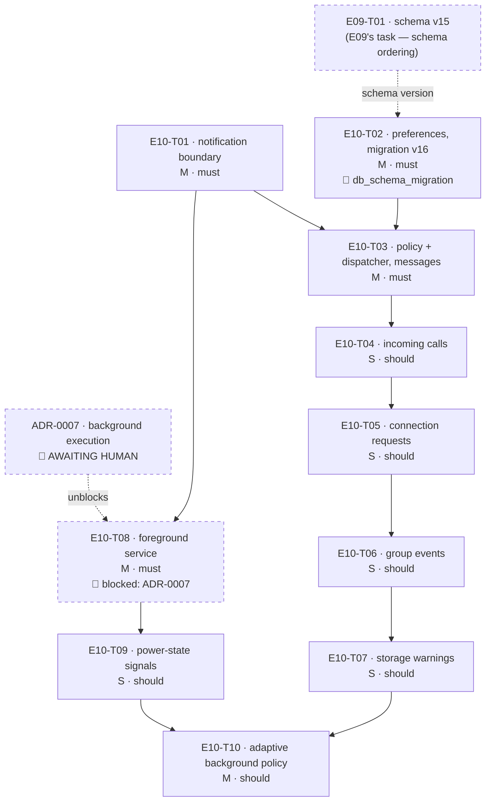

# E10 · Notifications & Background Operation · Progress

**Status:** **sharded 2026-09-04 — 10 tasks, awaiting the 🧍 `analyze_report`
gate before any dispatch.** `E10-T01` and `E10-T02` are dispatchable the
moment that gate clears (T02 additionally fires 🧍 `db_schema_migration` and
carries a cross-epic dependency on `E09-T01` for the schema version).
`E10-T08` is **`blocked`** on `ADR-0007` (background execution architecture,
`⏳ AWAITING HUMAN`) and takes `E10-T09`/`E10-T10` with it. **Backend/native
only** — this epic ships no screen; see §Why there is no frontend task. ·
**Started:** — · **Completed:** — · **Progress:** 0/10

## Tasks

| Task | Title | Layer | Size | MoSCoW | Status | depends_on |
|---|---|---|---|---|---|---|
| E10-T01 | Native notification boundary — Pigeon `NotificationApi`, channels, POST_NOTIFICATIONS | cross-cutting | M | must | todo | — |
| E10-T02 | Notification preferences — Drift migration v16 + repository | backend | M | must | todo | E09-T01 |
| E10-T03 | Notification policy + dispatcher; new-message notifications | backend | M | must | todo | T01, T02 |
| E10-T04 | Incoming-call notifications — `CallSignaling` seam | backend | S | should | todo | T03 |
| E10-T05 | Connection-request notifications — `PrekeyExchange` seam | backend | S | should | todo | T04 |
| E10-T06 | Group-event notifications — `GroupMembershipService` seam | backend | S | should | todo | T05 |
| E10-T07 | Storage-warning notifications — `StorageManager.latestPlan` observer | backend | S | should | todo | T06 |
| E10-T08 | Android foreground service — retained engine, persistent notification | cross-cutting | M | must | **blocked** | T01 |
| E10-T09 | Power-state signals — Doze, Battery Saver, screen lock, restriction | cross-cutting | S | should | todo | T08 |
| E10-T10 | Adaptive background policy — one tick, cadence + discovery | backend | M | should | todo | T07, T09 |

## State machine

```
todo ──▶ in-progress ──▶ review-requested ──┬─▶ changes-requested ──▶ in-progress
                                            └─▶ done ──▶ 🧍 verified
                    side states: blocked (needs a human answer) · frozen (rate limit)
```

`E10-T08` sits in `blocked` from the start. `ADR-0007` presents four
background-execution options with an advisory recommendation and its
`Decision` line reads `⏳ AWAITING HUMAN`. This is the gate `E06-T06.md:128-133`
demanded in writing before any background-execution code — a new manifest
permission set and an architecture choice, both rule 3. T08 leaves `blocked`
when ADR-0007 is `accepted` and §S1 (service type) is settled, not when
someone feels ready. `T09`/`T10` are `todo` but transitively unreachable
until then.

## DAG



Two independent lines run through this epic: the **notification line**
(T01 → T03 → T04 → T05 → T06 → T07) and the **background line**
(T01 → T08 → T09), joining at T10. The T04→T05→T06→T07 chain is serialized
*on purpose* — each of those tasks registers a source in `lib/app/bindings.dart`,
and serializing is honest where an empty-by-assertion matrix would not be.

## Anti-collision matrix

Only tasks that could be unblocked simultaneously are compared.
Simultaneously-unblocked pairs: **(T01, T02)**, **(T03, T08)**,
**(T04, T09)**, **(T05, T09)**, **(T06, T09)**, **(T07, T09)**.

| | T01 | T02 | T03 | T04 | T05 | T06 | T07 | T08 | T09 |
|---|---|---|---|---|---|---|---|---|---|
| **T01** | — | **∅** | — | — | — | — | — | — | — |
| **T02** | **∅** | — | — | — | — | — | — | — | — |
| **T03** | — | — | — | — | — | — | — | **∅** | — |
| **T04** | — | — | — | — | — | — | — | — | **∅** |
| **T05** | — | — | — | — | — | — | — | — | **∅** |
| **T06** | — | — | — | — | — | — | — | — | **∅** |
| **T07** | — | — | — | — | — | — | — | — | **∅** |

(`—` = the pair cannot be unblocked at the same time, so no comparison is
needed. `∅` = no shared file.)

Why each `∅` is real, not asserted:

- **T01 ∥ T02** — T01 is `pigeons/notifications.dart` + `lib/core/notifications/`
  + the two Android notification files + `MainActivity.kt` + the manifest.
  T02 is `lib/core/persistence/` + one repository + tests. Nothing overlaps.
- **T03 ∥ T08** — T03 is `lib/core/notifications/{policy,dispatcher,sources}`
  + `lib/app/bindings.dart`. T08 is `pigeons/background.dart` +
  `lib/core/background/` + the three Android background files +
  `MainActivity.kt` + the manifest. T08 does **not** touch `bindings.dart`
  (its composition-root wiring is deliberately deferred to T10, precisely so
  this pair stays disjoint).
- **T04/T05/T06/T07 ∥ T09** — the notification line touches
  `lib/core/notifications/sources/`, `bindings.dart`, and one E04–E08 seam
  file each (`call_signaling.dart`, `prekey_exchange.dart`,
  `group_membership_service.dart`, none for T07). T09 touches
  `pigeons/background.dart`, the background generated/native files and
  `lib/core/background/`. Disjoint.

Files written by more than one task, each **serialized by `depends_on`, not
by luck**:

| File | Writers | Serialized by |
|---|---|---|
| `android/app/src/main/MainActivity.kt` | T01 registers the notification host; T08 the background host | `T08 depends_on: [E10-T01]` |
| `android/app/src/main/AndroidManifest.xml` | T01 adds `POST_NOTIFICATIONS`; T08 adds `FOREGROUND_SERVICE` + `<service>` | `T08 depends_on: [E10-T01]` |
| `lib/app/bindings.dart` | T03, T04, T05, T06, T07 each register a source; T10 adds the lifecycle observer | the T03→T04→T05→T06→T07→T10 chain |
| `pigeons/background.dart` + its two generated files | T08 creates; T09 extends | `T09 depends_on: [E10-T08]` |
| `lib/core/background/background_service.dart` + `background_stub.dart` | T08 creates; T09 extends | same |
| `lib/core/persistence/database.dart` + `database.g.dart` | `E09-T01` (v15) and `E10-T02` (v16) — **a cross-epic collision** | `T02 depends_on: [E09-T01]` |

**Matrix empty.**

## Why there is no frontend task in this epic

`design_screens: [settings]` in the epic frontmatter is aspirational. Two
surfaces would be needed and neither is shardable under rule 2:

1. **The Notifications sub-screen.** `design/screens/settings.md` draws a
   *row* — elements 38-42, `notifications` · `Notifications` · `Alerts,
   silent modes, LED behaviors` — and **no destination screen exists in any
   of the fourteen measured contracts**. There is no `design/gaps.md` entry
   for it either (the closest precedents are `GAP-005`, still 🟡 proposed for
   Privacy & Security, and `GAP-024`, approved for Storage). A frontend task
   without an approved `design_contract:` is not shardable. `OQ-E10-1`.
2. **The Battery / background-execution sub-screen.** Same shape: elements
   33-37, `battery_full_alt` · `Battery` · `Background execution, power
   saving modes`, a row with no destination. `OQ-E10-1`.

Consequence, stated plainly: after this epic the notification categories and
privacy level are persisted, enforced and tested, and a user **cannot change
any of them from inside the app**. That is rule 2 working as intended, and it
is worth knowing before the gate clears rather than after.

A third surface is also fenced out: `E06-T12.md:116-117` handed "notifications,
background status, or connectivity change alerts" on the **Dashboard** to
E10 — but `design/screens/dashboard.md` is an *approved, measured* contract
with no such element, so adding one is an extra element needing its own
`design/gaps.md` entry and human approval. `OQ-E10-9`.

The copy this epic must ship anyway — notification titles/bodies and the
permanent foreground-service notification — is proposed inside each task's §5
so a reviewer can check it, and is flagged for the human at the analyze gate
rather than presented as approved design.

## Event log (append-only)
- 2026-08-26 E10 drafted during Wave 1 epic-breakdown; deferred to a later wave.
- 2026-09-04 `skills/task-sharding` pass. Step 0 (inherited obligations) read
  E04's and E06's `retro.md` §Open follow-ups, their `epic.md` §Bug sweep /
  §Open Questions, and every bug file in both epics (`E04-B01..B03`,
  `E06-B01..B04`) plus `E05-B02`, `E08-T06`, `E09-T05` and the E06 task files
  that name E10. **Neither retro mentions E10 at all** — all thirteen
  obligations live in task files. Findings in `epic.md` §ANALYZE REPORT.
  Epic EARS extended from 1 to 6 criteria so all five `traces_to:` FR ids own
  one (`EARS-NOTIFY-1/2`, `EARS-PLAT-2/3/4` added — no new scope; the FR ids
  were already claimed). `ADR-0007` written and left `⏳ AWAITING HUMAN`.
  Ten tasks written from `epics/_templates/task.template.md`. Collision
  matrix empty. `python agent/orchestrator/scheduler.py --validate` green.
  ANALYZE REPORT appended to `epic.md`; 🧍 `analyze_report` gate ⏳ AWAITING
  HUMAN — **no task dispatches until it clears.**

## Carried-forward observations (read before the end-of-epic sweep)
- **2026-09-04 · `E10-T04`'s cross-model review · `CallSignaling.dispose()`
  has no caller anywhere in `lib/`.** `E10-T04` added `dispose()` to close
  the new `notices` stream controller, but nothing in the composition root
  (`messaging_stack.dart` or elsewhere) calls it — the same unwired-
  capability shape as `E09-B02`/`E09-B06` (`L-process-007`). Not a live leak
  today (the app process, not the controller, is what actually ends), but a
  correctness gap that must not be silently carried past this epic's close.
  **Owner: whichever task next touches `messaging_stack.dart`'s
  `CallSignaling` construction/teardown, or the end-of-epic sweep if none
  does.** Confirmed present as of PR #45 (merged 2026-09-04).
- **2026-09-04 · same review · `OQ-E10-T04-2`'s generic notification copy
  ("NEXORA" / "Notification") is confirmed still shipping**, not a
  theoretical gap — the reviewer's own probe read back the actual posted
  title/body. `notification_policy.dart`'s copy table was deliberately left
  out of `E10-T04`'s fence; whichever task next extends that copy table (or
  the end-of-epic sweep) must not close E10 with this string still live.
- **2026-09-04 · `E10-T05`'s cross-model review · `PrekeyExchange.dispose()`
  has no caller anywhere in `lib/` — third instance of the same pattern.**
  Confirmed inert, not a leak: `messaging_stack.dart:600` documents
  `MessagingStack.dispose()` itself as "test-only — the app process never
  calls this", so no live code path was ever going to reach either
  `dispose()`. Fold into the `CallSignaling.dispose()` entry above when
  wiring teardown for real — one composition-root dispose pass should close
  both, not two separate fast-follows. Also noted: the source's per-peer
  dedup state is evaluated inside `.where()` (per-subscription, not
  process-wide) and never resets on a `blocked → unblocked → unknown`
  transition — matches the task's contract as written, not a defect, but
  worth a second look if this epic's sweep ever needs "notify again after
  re-becoming unknown" behaviour.
- **2026-09-04 · `E10-T06`'s cross-model review · `GroupMembershipService
  .dispose()` is a FOURTH unwired instance of the same pattern.** Same
  shape and same conclusion as the three above (inert — nothing in
  `messaging_stack.dart` calls any of the four). **This is now the
  concrete trigger to act, not just note**: whichever task next touches
  `messaging_stack.dart`'s composition/teardown should wire all four
  (`CallSignaling`, `PrekeyExchange`, `GroupMembershipService`, and
  whatever E10-T07 adds if it follows the same pattern) in one pass rather
  than four separate fast-follows.
- **2026-09-04 · same review · CF-1 (S4, non-blocking): `_emitGroupEventNotice`
  is called unawaited inside `handleControlFrame`'s success branch**
  (`group_membership_service.dart:621`). Two group events processed in
  quick succession could have their notifications observed out of order
  relative to the underlying state changes, since the emit is fire-and-
  forget. Unobservable today (no copy differentiates event order in the
  posted notification), but should be revisited once `notification_policy
  .dart`'s copy table is extended (the same fast-follow `OQ-E10-T04-2`/
  `OQ-E10-T06-1` already name).
- **2026-09-04 · `E10-T07`'s cross-model review · `StorageNotificationSource
  .dispose()` is a FIFTH unwired instance of the same pattern** (`Get.put(...,
  permanent: true)` with no teardown caller). Confirmed inert, same as the
  other four. Five separate sources now share the identical gap — strong
  signal that whichever task first builds real app-lifecycle teardown
  (most plausibly `E10-T10`, which already owns the adaptive background
  policy) should wire all five (`CallSignaling`, `PrekeyExchange`,
  `GroupMembershipService`, `StorageNotificationSource`, and
  `NotificationDispatcher.stop()`/`MessagingStack.dispose()` themselves) in
  one composition-root pass, not five fast-follows.
- **2026-09-04 · same review · S4, non-blocking: `test_EARS_NOTIFY_14_
  null_plan_posts_nothing` doesn't actually prove the §6-named risk it's
  named for.** The reviewer's own probe (flipping the null-plan guard to
  disarm rather than ignore) still passed all six of the builder's tests,
  but failed a new probe testing the `over -> null -> over` sequence (must
  stay at one post, not re-post). The production code is correct -- this is
  a test-coverage gap, not a defect. Fold in an `over -> null -> over`
  regression test the next time this file is touched.
