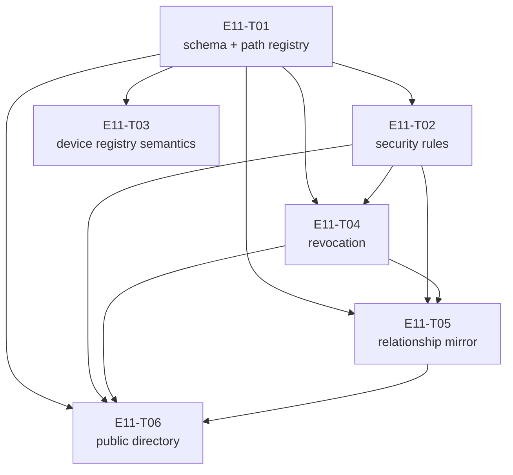

# E11 · Firebase Metadata Sync · Progress

**Status:** todo (sharded, analyze gate cleared 2026-09-04) · **Started:** — · **Completed:** — · **Progress:** 0/6

## Tasks

| Task | Status | Depends on | Blocks |
|---|---|---|---|
| E11-T01 | todo | — | T02, T03, T04, T05, T06 |
| E11-T02 | todo | T01 | T04, T05, T06 |
| E11-T03 | todo | T01 | — |
| E11-T04 | todo | T01, T02 | T05, T06 |
| E11-T05 | todo | T01, T02, T04 | T06 |
| E11-T06 | todo | T01, T02, T04, T05 | — |

## DAG

`T02`/`T03` are the only pair that can run concurrently (once `T01` merges)
— disjoint `files:`. `T04`, `T05`, `T06` all share
`firebase_paths.dart`/`firebase_boundary.dart`/`database.rules.json`/
`docs/firebase-schema.md` and are therefore fully serialized: `T04` first,
then `T05`, then `T06`. `T05`→`T06` is not a semantic dependency (T06 does
not read T05's output) — it exists purely to prevent the file collision the
Analyze gate caught (`epic.md` §ANALYZE REPORT, Collision matrix).

## Anti-collision matrix

| | T01 | T02 | T03 | T04 | T05 | T06 |
|---|---|---|---|---|---|---|
| **T01** | — | dep | dep | dep | dep | dep |
| **T02** | | — | none | dep | dep | dep |
| **T03** | | | — | none | none | none |
| **T04** | | | | — | dep | dep |
| **T05** | | | | | — | dep |
| **T06** | | | | | | — |

"dep" = serialized by `depends_on` (shared files would otherwise collide).
"none" = genuinely disjoint `files:`, safe to run concurrently once shared
dependencies clear.

## Why there is no frontend task
`ui_surface: []` and `design_screens: []` in `epic.md`'s frontmatter are
accurate, not placeholders — every E11 deliverable is a Firebase schema,
rules file, or backend service with no user-facing surface of its own.
Confirmed at sharding rather than assumed.

## Gates

| Gate | State |
|---|---|
| 🧍 `analyze_report` | ✅ cleared by human (decision authority explicitly delegated to the agent for this session), 2026-09-04 |
| 🧍 `ADR-0008` — Firebase cross-account visibility boundary | ✅ accepted, option 2 (public device directory), 2026-09-04 — unblocks `E11-T06`; `E09-T02`'s deferred two-sided exchange (`OQ-E09-T02-1`) resolved as a permanent limitation for the cross-account half, covered for the own-account half by `E11-T05` |

## Event log (append-only)
- 2026-08-26 E11 drafted during Wave 1 epic-breakdown; deferred to a later wave.
- 2026-09-04 Sharded into 6 tasks (T01–T06). `ADR-0008` proposed and decided
  in the same pass. Analyze gate cleared. Six inherited obligations found,
  from `OQ-E09-T02-1`, `OQ-E06-T07-1`, and the `E07` tracker's TOFU note —
  none filed by E01/E02 directly, all filed by later epics against E11 as
  the chain unfolded.
