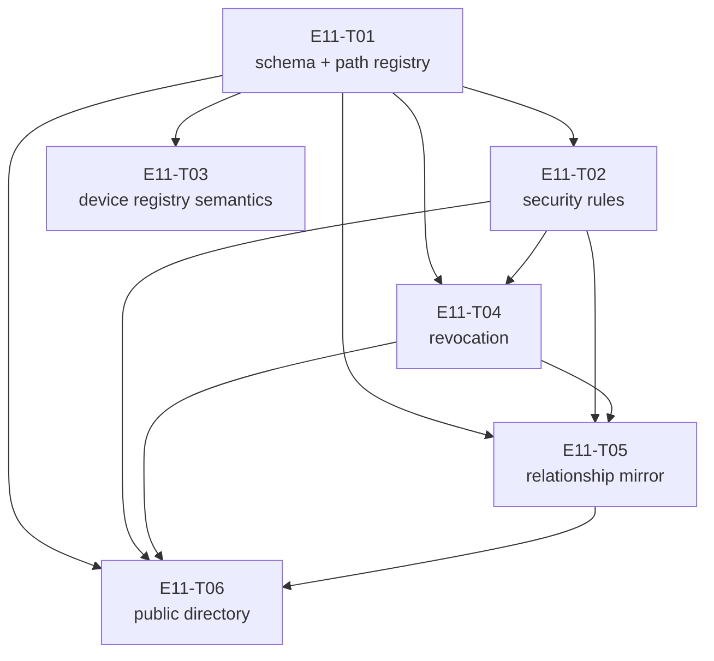

# E11 · Firebase Metadata Sync · Progress

**Status:** build-complete, bug sweep run 2026-09-04 — 3 bugs open (P2×2, P3×1), epic→`development` PR **blocked** until P1/P2 = 0 · **Started:** 2026-09-04 · **Completed (build):** 2026-09-04 · **Progress:** 6/6 tasks done

## Tasks

| Task | Status | Depends on | Blocks |
|---|---|---|---|
| E11-T01 | done | — | T02, T03, T04, T05, T06 |
| E11-T02 | done | T01 | T04, T05, T06 |
| E11-T03 | done | T01 | — |
| E11-T04 | done | T01, T02 | T05, T06 |
| E11-T05 | done | T01, T02, T04 | T06 |
| E11-T06 | done | T01, T02, T04, T05 | — |

## Bugs (from the 2026-09-04 sweep)

| Bug | Status | Severity | Priority | Owner |
|---|---|---|---|---|
| E11-B01 | blocked | S2 | P2 | planner (design decision, not a scoped fix) |
| E11-B02 | todo | S2 | P2 | builder |
| E11-B03 | todo | S4 | P3 | planner (docs-only) |

## DAG

`T02`/`T03` are the only pair that can run concurrently (once `T01` merges)
— disjoint `files:`. `T04`, `T05`, `T06` all share
`firebase_paths.dart`/`firebase_boundary.dart`/`database.rules.json`/
`docs/firebase-schema.md` and are therefore fully serialized: `T04` first,
then `T05`, then `T06`. `T05`→`T06` is not a semantic dependency (T06 does
not read T05's output) — it exists purely to prevent the file collision the
Analyze gate caught (`epic.md` §ANALYZE REPORT, Collision matrix).

## Anti-collision matrix

| | T01 | T02 | T03 | T04 | T05 | T06 |
|---|---|---|---|---|---|---|
| **T01** | — | dep | dep | dep | dep | dep |
| **T02** | | — | none | dep | dep | dep |
| **T03** | | | — | none | none | none |
| **T04** | | | | — | dep | dep |
| **T05** | | | | | — | dep |
| **T06** | | | | | | — |

"dep" = serialized by `depends_on` (shared files would otherwise collide).
"none" = genuinely disjoint `files:`, safe to run concurrently once shared
dependencies clear.

## Why there is no frontend task
`ui_surface: []` and `design_screens: []` in `epic.md`'s frontmatter are
accurate, not placeholders — every E11 deliverable is a Firebase schema,
rules file, or backend service with no user-facing surface of its own.
Confirmed at sharding rather than assumed.

## Gates

| Gate | State |
|---|---|
| 🧍 `analyze_report` | ✅ cleared by human (decision authority explicitly delegated to the agent for this session), 2026-09-04 |
| 🧍 `ADR-0008` — Firebase cross-account visibility boundary | ✅ accepted, option 2 (public device directory), 2026-09-04 — unblocks `E11-T06`; `E09-T02`'s deferred two-sided exchange (`OQ-E09-T02-1`) resolved as a permanent limitation for the cross-account half, covered for the own-account half by `E11-T05` |

## Bug sweep — 2026-09-04 (reviewer: `claude-opus-5`, independent worktree `E:/Code/Flutter/12/sweep-e11`)

**Baseline verified before starting:** `epic_11` @ `877e8bd`, confirmed
byte-identical to `origin/epic_11` (pulled fresh, not a cached copy).
**891/891 tests green**, `flutter analyze` → "No issues found!". No design
gate applies — `ui_surface: []`/`design_screens: []` are accurate, confirmed
again at sweep time (zero `layer: frontend` tasks, no screen contract in any
task's frontmatter).

**Security re-derivation (independently, not trusting the merge-time record).**
Both `ADR-0008` properties were re-derived from `database.rules.json` by the
reviewer, and re-proved with the reviewer's own read-cascade model written
without reference to the shipped `_cascadingReadGranted` helper
(`test/zz_reviewer_probe_test.dart`, scratch, not committed):

- **Parent-node-unreadable holds.** `directory` has no `.read` of its own;
  the root has none; root `$other` is a *sibling* wildcard that does not
  match the named `directory` key. RTDB read rules cascade **down only**,
  so a read at `/directory` is default-deny while `/directory/$deviceId`
  (`.read: "auth != null"`, `database.rules.json:87`) is granted. Probes 1/2
  confirm; probes 4/5 confirm the model has teeth by detecting a hoisted
  `.read` mutation. Enumeration/crawl is structurally impossible. ✅
- **No bare `true` anywhere.** The file contains exactly four `.read`/`.write`
  rules plus the root `$other` deny pair; none is a boolean `true`
  (`database.rules.json:5,6,87,88,108,109`). ✅
- **`ownerUid` is anchored to server-authenticated identity.** `.write`
  (`:88`) requires `newData.child('ownerUid').val() === auth.uid` **and**
  `(!data.exists() || data.child('ownerUid').val() === auth.uid)` — so a
  caller can only ever write their own uid, and cannot overwrite another
  account's entry. `publish`'s caller-supplied `uid` argument is therefore
  not a trust hole: a lying client is rejected server-side. ✅ Delete is also
  denied (on a null write `newData.child('ownerUid').val()` is null ≠
  `auth.uid`), which independently confirms `OQ-E11-T06-3`'s conclusion.

**Item 5 of the sweep brief — the `frame.source`/TOFU pattern from `E09-B09`.**
Checked directly. The *write* side is clean, for the reason above: Firebase
`auth.uid` is server-authenticated, genuinely unlike a mesh frame's
self-asserted `source`. But the pattern **does** recur on the *read* side in
a subtler form — see `E11-B02`: `lookupDevice` decodes the identity key from
two independent, attacker-controlled fields of the same node and never checks
they agree, so one entry can yield two different identities to the two
consumers `ADR-0008` created it for. Proven with a reviewer probe, not argued.

**Three defects found:**

| id | severity | what | reachable today? |
|---|---|---|---|
| `E11-B01` | **S2** | `directory/$deviceId` is never published by the running app — `DeviceDirectoryService` is never constructed anywhere in `lib/`, and the one production `IdentityService` passes no publish hook. EARS-FB-17 holds only in tests. | no — nothing consumes the directory yet, so the node is empty rather than wrong |
| `E11-B02` | **S2** | `lookupDevice` accepts an entry whose `identityPublicKey` disagrees with the identity key inside its own `prekeyBundle`; one entry yields two different identities | no — blocked behind B01 (node never populated, no consumer wired) |
| `E11-B03` | S4 | `E11-T06` edited two production files outside its `files:` fence with no §Deviations entry; its own §3 mandated changes its frontmatter did not permit | n/a — process/traceability |

**The seam behind B01, stated plainly.** E11 ships four Firebase services.
Only `FirebaseMetadataService` (pre-existing, from E01) has a production call
site (`lib/features/login/domain/sign_in_use_case.dart:28`), which is why
T01/T03's device-registry semantics genuinely run. `DeviceRevocationService`
(T04) and `RelationshipSyncService` (T05) are also never constructed in
`lib/` — but both tasks **disclose that explicitly** in their §4 fences
("this task ships the service, proven, with no caller yet"), so that is a
deferral, not a defect. `E11-T06` is the exception: its §3 affirmatively
claims the wiring as delivered and its §4 says nothing about deferring it.
The hook *points* shipped; the wiring did not. No task's own tests could
catch this — T06's tests inject the callback by hand — and no task's `files:`
fence contained a composition root, which is precisely why it belongs to the
sweep and not to any task review.

**Why B01 is `blocked`/`owner_agent: planner` and not a scoped fix.**
`publish(uid, deviceId)` needs an authenticated Firebase uid;
`MessagingStack.create` — where the prekey-rotation trigger fires
(`messaging_stack.dart:497-499`) — has no auth context whatsoever
(`grep -n "uid\|FirebaseAuth\|currentUser" lib/core/messaging/messaging_stack.dart`
returns nothing), and `ADR-0005` makes that deliberate: the app is
offline-first and device identity is fully local. So "when does a device
whose keys rotated while signed out publish?" is a real rule-3 design
question, not a wiring oversight. The equally valid resolution — amend
EARS-FB-17 to the publisher-only shape T04/T05 used — is also a planner call.
Handled the same way `E09-B11` was.

### What was probed and held
- **EARS-FB-2 boundary guard** — every Realtime Database write path in `lib/`
  is preceded by `FirebaseBoundary.assertAllowedFields`: directory `:182`,
  revocation `:109`, device metadata `:125`, relationship `:85`, sync cursor
  `:219`. No `.ref(...).set/update` bypasses it. ✅
- **Obligation #5 (`ConflictResolver` had zero production callers since
  E05-T05)** — genuinely closed, not just claimed: `resolveRevocation` at
  `device_revocation_service.dart:187`, `resolveTrust` at
  `relationship_sync_service.dart:143`. Real production call sites. ✅
- **EARS trace** — all 19 criteria (FB-1…FB-19) have at least one named test;
  no orphan. ✅
- **Scope creep / invented APIs** — the epic diff vs `development` is 29
  files, all Firebase/crypto/persistence or E11's own epic docs. No unrelated
  file, no dependency change, no `pubspec` edit. The only fence breach is
  `E11-B03`'s, which is a documentation defect, not scope creep in substance.
- **The three recorded T06 Open Questions are still accurately described.**
  `OQ-E11-T06-1` (first-publish squatting) and `OQ-E11-T06-2` (one-time
  prekey reuse) are correct as written and unchanged. `OQ-E11-T06-3`'s
  *conclusion* (no delete path) is correct and independently re-derived, but
  its stated *mechanism* is misattributed — it says a null write "fails the
  `.write` rule's `hasChildren` shape", whereas `hasChildren` lives in
  `.validate` (which RTDB skips entirely on delete); the actual blocker is
  `.write`'s `newData.child('ownerUid').val() === auth.uid` clause evaluating
  against a null `newData`. Same outcome, wrong reason. Not filed as a bug —
  folded here and into the retro as a doc-accuracy note.
- **Rules-test robustness** — the shipped `_grantsForAnyAuthenticatedCaller`
  only recognises the exact string `auth != null`, so an equivalently-broad
  but differently-spelled grant (`auth.uid != null`) hoisted to `directory`
  would slip past `_cascadingReadGranted` (reviewer probe 6). **Not a
  finding:** the sibling test `the only rules under directory/ are the exact
  ones E11-T06 documents` pins the rule set under `/directory` to exactly two
  entries by key, and would fail loudly on any such addition. Genuine
  defence in depth; noted so the next editor does not remove one half
  believing the other covers it.

🧍 **HUMAN GATE (`bug_priorities`) — severity is the reviewer's; priority set
under decision authority explicitly delegated by the human for this session's
gate-clearing** (same convention as this session's E09/E10 work):

| id | priority | direction |
|---|---|---|
| `E11-B01` | **P2** | planner decides the publish lifecycle **or** amends EARS-FB-17 to publisher-only. Defensible human override: P3, but only paired with amending the criterion — not with leaving it claimed-but-unmet. |
| `E11-B02` | **P2** | fix before merge — small, entirely inside T06's own file, and it stops two future epics inheriting an unsound primitive |
| `E11-B03` | P3 | docs-only; next planning pass. Does not block the merge. |

**P1/P2 = 0 is required before the epic→`development` PR opens
(`skills/release`). Currently P1 = 0, P2 = 2 → the merge is BLOCKED.**

## Event log (append-only)
- 2026-08-26 E11 drafted during Wave 1 epic-breakdown; deferred to a later wave.
- 2026-09-04 Sharded into 6 tasks (T01–T06). `ADR-0008` proposed and decided
  in the same pass. Analyze gate cleared. Six inherited obligations found,
  from `OQ-E09-T02-1`, `OQ-E06-T07-1`, and the `E07` tracker's TOFU note —
  none filed by E01/E02 directly, all filed by later epics against E11 as
  the chain unfolded.
- 2026-09-04 T01–T06 all implemented, cross-model reviewed and merged into
  `epic_11` (PRs #40–#46). Build complete at `877e8bd`.
- 2026-09-04 End-of-epic bug sweep run by the reviewer in an isolated
  worktree. 891/891 tests green, `flutter analyze` clean, `ADR-0008`'s two
  security properties independently re-derived and re-proved with the
  reviewer's own read-cascade model. **3 bugs filed** — `E11-B01` (S2/P2,
  blocked on planner: the directory is never published in production),
  `E11-B02` (S2/P2: `lookupDevice` accepts a self-inconsistent identity),
  `E11-B03` (S4/P3: T06 fence breach, docs-only). Epic→`development` PR
  blocked until P1/P2 = 0.
