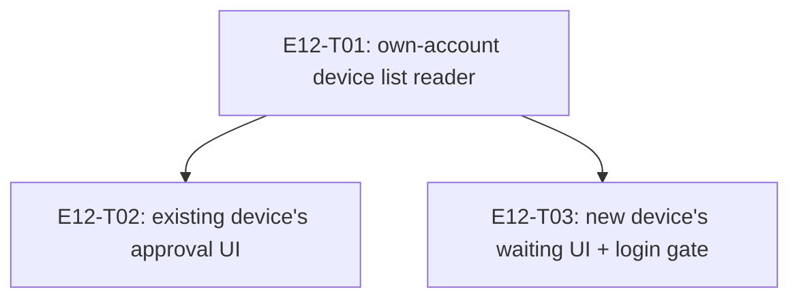

# E12 · Account Recovery & Device Enrollment · Progress

**Status:** all 3 tasks done, cross-model reviewed, merged into `epic_12`.
Bug sweep run 2026-09-06 — **NOT ready for the `development` merge.** 3× S1
found at the cross-task seams (`E12-B01`, `E12-B02`, `E12-B03`); the
epic→dev PR opens only when P1/P2 = 0 (`skills/bug-sweep` §4), and priority
is 🧍 awaiting the human. ·
**Started:** 2026-09-05 · **Completed:** 2026-09-05 · **Progress:** 3/3
tasks done, 8 bugs filed, 0 closed

## Tasks

| Task | Status | Depends on | Blocks |
|---|---|---|---|
| E12-T01 | done | — | T02, T03 |
| E12-T02 | done | T01 | — |
| E12-T03 | done | T01 | — |

## DAG

`T02` and `T03` are independent of each other (disjoint files — `T02`
touches `devices_controller.dart`/`devices_view.dart`, `T03` touches
`login_controller.dart`/new `recovery/` files) and may build in either
order or in parallel once `T01` lands.

## Anti-collision matrix
Empty. No two tasks share a file.

## Event log (append-only)
- 2026-08-26 E12 drafted during Wave 1 epic-breakdown; deferred to a later wave.
- 2026-09-05 — Sharded into 3 tasks (task-sharding skill), after
  `GAP-028`'s two derived design contracts were approved and written.
  Backend investigation found `FR-RECOVER-001` needs almost no new
  protocol: `RelationshipSyncService`'s existing push/pull mechanism
  (E11-T05, `users/$uid/relationships/*`) already lets a new device
  detect its own approval, and `DevicesController`'s existing
  `verify`/`block` methods already record trust — the only missing piece
  was a way to read back the account's own device list
  (`FirebaseMetadataService`, T01), used to classify a discovered peer as
  "my own enrolling device" instead of a stranger.
- 2026-09-05 — T01 merged into `epic_12` (cross-model reviewed, APPROVE).
  T02 merged into `epic_12` (cross-model reviewed, APPROVE, with a real
  race condition caught during implementation — concurrent discovery
  events could each miss a resolved-value cache and both independently
  call `readOwnDeviceIds`; fixed by caching the in-flight `Future`
  itself instead, verified by the reviewer via falsification). T03
  merged into `epic_12` (cross-model reviewed, APPROVE — all 4 EARS
  criteria mutation-falsified; two self-disclosed deviations, a lazy
  `Get.find` fallback and a design-verify tooling gap, both
  independently re-verified as legitimate). All 3 tasks now on
  `epic_12`; epic not yet merged into `development` pending the bug
  sweep (§Carried-forward below).

## Bug sweep (2026-09-06, reviewer, independent worktree off `origin/epic_12`)

**Verdict: NOT ready for the `development` merge.** `flutter test` green
(1170/1170) and `flutter analyze` clean (1 pre-existing `annotate_overrides`
info in an unrelated E13 test file) — and the epic's headline requirement is
nonetheless non-functional end to end. Every task passed its own review; all
three S1s live in the seams between tasks, where each task's tests mocked the
other side.

| Bug | Sev | Summary |
|---|---|---|
| `E12-B01` | S1 | Every returning user routes to `/device-enrollment`, not `/dashboard`, on every launch after the first |
| `E12-B02` | S1 | Approval never leaves the approving phone — `RelationshipSyncService.push` has zero production callers |
| `E12-B03` | S1 | `pull()` can never RAISE trust, so `checkApproval()` can never return true |
| `E12-B04` | S3 | Own-device-id cache never invalidated — stale or failed read permanently disables classification |
| `E12-B05` | S3 | `devices` design gate blind on a `renderError` (tracker C1) |
| `E12-B06` | S3 | No `source: derived` screen registered in `design/sources.yaml` (tracker C1') |
| `E12-B07` | S4 | No widget test renders `DeviceEnrollmentView` (tracker C4) |
| `E12-B08` | S4 | New sign-in failure path + the one unlogged catch (tracker C5 + F1) |

Severity is the reviewer's; **priority is 🧍 the human's** (`bug_priorities`
gate) — every bug file carries `p: ⏳ AWAITING HUMAN`.

**Evidence.** Three reviewer-authored probes, composed from the real
production classes rather than each task's own fixtures, then removed:
- returning user: `launch 1 -> [/dashboard] registry=1`,
  `launch 2 -> [/device-enrollment] registry=2`
- write side: `PROBE store after verify(): {}` (local trust recorded, nothing
  mirrored)
- read side: `pull()` with remote `allowed`/`trusted`/`blocked` present →
  only `blocked` lands; `resolveTrust(unknown, allowed) = unknown`

**Cross-epic dependency.** `E12-B01` shares a root cause with `E13-T07`
(P1, mid-fix): sign-in minting a fresh device identity per launch. T07's
`files:` fence does **not** include `login_controller.dart`, where
`generateSecureDeviceId()` is actually called. Sequence T07 first, then
re-verify `E12-B01`'s repro; do not patch both sides independently.

**Retro material** (`skills/retro`): `E12-B02` and `E12-B06` are both
sharding defects, not coding defects — a task contract asserted a wiring that
did not exist (`E12-T02` §2), and a task carried a `design_contract:` it
structurally could not verify (`E12-T03`). `E12-B02` is another instance of
the `L-process-007` unwired-capability shape (E06, E09-B02/B06, E11-B01,
E13-T07).

## Carried-forward observations

> **Sweep triage 2026-09-06** — C1 → `E12-B05`; C1' → `E12-B06`; C4 →
> `E12-B07`; C5 + F1 → `E12-B08`. **C2** (the literal `Code: [pairing code]`
> placeholder) and **C3** (342px vs the contract's 326px button) are
> confirmed **correctly out of scope**, not bugs: C2 ships verbatim per the
> approved contract with real pairing-code generation explicitly future
> scope, and C3 is byte-identical inherited parity with the already-merged,
> already-golden `welcome_view.dart` — it cannot be adjudicated at all until
> `device-enrollment` has a golden of its own, which `E12-B06` blocks. Both
> stay recorded here rather than becoming bug files.
- **The `devices` screen's design gate has been reporting 0% match on a
  `renderError` probe, unrelated to any change in this epic.**
  `test/design/design_probe_test.dart`'s `devices` fixture setup
  registers `RelationshipRepository`/`BlockUseCase` before
  `DevicesBinding().dependencies()` but not `TransportService`, so the
  probe dumper's own `DevicesController` construction throws and the
  dumper honestly records `"renderError": true, "elements": []` — every
  `make design-verify SCREEN=devices` run since this gap opened has
  been reporting 0% (0/61), not a real regression. Confirmed by T02's
  cross-model reviewer via direct byte-for-byte reproduction against
  both the `epic_12` branch and the unmodified `origin/epic_12` baseline
  — identical failure output on both, so no task in this epic caused it
  and none can fix it from inside its own `files:` fence (the probe
  fixture is outside every E12 task's scope). Needs a dedicated fix
  (one line: register `TransportService` in that `setUp`) before the
  `devices` screen is genuinely gated again — flagging here per
  `skills/bug-sweep`'s carried-forward rule so it isn't silently
  rediscovered at the epic sweep.
- **The design-fidelity tooling gap is project-wide, not E12-specific
  (T03's reviewer, C1).** `design/sources.yaml` registers only the 7
  `source: ui` screens; none of the 11 `source: derived` contracts built
  and merged across E06-E11 — including E12's own new
  `device-enrollment.md`/`device-enrollment-approval.md` — are
  registered, so `make design-verify SCREEN=device-enrollment` fails
  with "no screen matched" rather than actually gating anything.
  Registering a derived screen in `design/sources.yaml` plus a
  `test/design/design_probe_test.dart` probe block is planner-owned
  (`design-fidelity` §1 Ingest), outside every builder task's own
  `files:` fence — E12-T03's own contract incorrectly implied extraction
  happens as part of the build task, which is a sharding defect worth a
  retro lesson, not a task defect. Both `device-enrollment.md` contracts
  were hand-verified against their built views instead (codepoint-exact
  copy match, token-by-token style match, confirmed by an independent
  reviewer pass) — real but ungated verification.
- **A literal `Code: [pairing code]` placeholder ships in
  `device_enrollment_view.dart` (T03's reviewer, C2).** Verbatim per the
  approved contract, and the real pairing-code value was explicitly out
  of `T03`'s own scope — but a real user will see this exact bracketed
  placeholder string on the waiting screen until the actual enrollment
  protocol (pairing code generation/exchange) is built. Needs an owner
  before E12 is considered feature-complete, not before it merges to
  `development` — the placeholder is honest, not broken.
- **`DeviceEnrollmentView`'s primary button renders 342px wide, not the
  contract's measured 326px (T03's reviewer, C3).** Traced to
  `width: double.infinity` inside 24px horizontal padding at the 390px
  viewport — byte-identical to the already-merged, already-golden
  `welcome_view.dart`'s own implementation of the same button shape.
  Inherited parity with an existing screen, not new drift; will need
  reconciling once `device-enrollment`'s own golden is ever extracted
  (blocked on the C1 tooling gap above).
- **No widget test renders `DeviceEnrollmentView` (T03's reviewer, C4).**
  The contract's most load-bearing requirement — "Continue without
  history" reachable from the very first frame, never gated behind the
  poll/timeout — is currently verified only by reading the widget source
  (confirmed correct by two independent readers this session), not by an
  actual `testWidgets` render/tap. A ~20-30 line addition to the
  already-`files:`-listed `device_enrollment_controller_test.dart` (or a
  sibling view test file) would close this.
- **One new failure path in the login flow (T03's reviewer, C5, S4).** If
  `DeviceIdentityRepository.latestDeviceIdentity()` throws (e.g. a Drift
  error) immediately after a successful local write, it now falls into
  `LoginController._signIn()`'s outer catch and renders as a mapped
  sign-in failure — before this task, no such read existed on this path
  and the flow would have proceeded straight to `/dashboard`. Narrow
  (a local read immediately after a successful local write that just
  produced the row being read), but new. Related to F1 below.
- **F1 (T03's reviewer, S4, non-blocking): the one silent-swallow catch
  in the diff.** `LoginController._resolveDeviceIdentityRepository()`'s
  `catch (_) { return null; }` is the only best-effort failure path in
  this whole feature that does NOT log via `ObservabilityService` (every
  sibling — `readOwnDeviceIds`, `pull`, `_signIn`'s own outer catch —
  does). A production `Get.find` failure is currently indistinguishable
  from a legitimate first-device case and emits no telemetry. One-line
  fix (`ObservabilityService.instance.logError('recovery.device_identity_repository_unresolved', cause: e)`),
  fold into the epic sweep rather than a standalone task.
- 2026-09-06 — **Epic sweep filed `E12-B01` through `E12-B08`** (3× S1 at
  cross-task seams: B01 device-id reuse — now resolved via `E13-T07`'s fix
  reaching `login_controller.dart`; B02/B03 enrollment approval never
  reached the enrolling device — fixed via a dedicated Firebase channel,
  human-decided, merged; B04–B08 lower-priority, all fixed and merged).
  The F1/C5 items above are superseded by `E12-B08`'s fix (the silent
  catch now logs; the login-flow failure path itself was judged
  acceptable, not fixed, since mapping a genuine read failure to a
  sign-in error is more honest than silently proceeding to `/dashboard`).
- 2026-09-06 — **B04's fix round 2 review surfaced two more carried-
  forward items**, both now tracked as their own bugs rather than left in
  a run log only: `E12-B04`'s own item 2 (a failed `readOwnDeviceIds` read
  is still cached identically to a genuine empty result, with no
  distinguishing telemetry — disclosed and deferred inside `E12-B04.md`'s
  own Run log, not yet a separate task) and **`E12-B12`** (the `devices`
  screen's design-verify gate, now that `E12-B05` fixed its broken probe,
  reports a real 62.3% (38/61) FAIL — pre-existing drift, not caused by
  any E12 change, but genuinely red and needs an owner before this epic
  is feature-complete).
- 2026-09-06 — **`E12-B09`/`E12-B10`/`E12-B11` filed** from B02/B03's own
  review: B09 (S3) an enrollment grant is permanent/unrevocable once
  written; B10 (S4) the grant's Firebase rule lacks a defense-in-depth
  self-grant check; B11 (S3) `RelationshipSyncService` is now fully dead
  production code and `FR-TRUST-007` has zero remaining wiring — a
  planner call on direction, not a coding defect.
