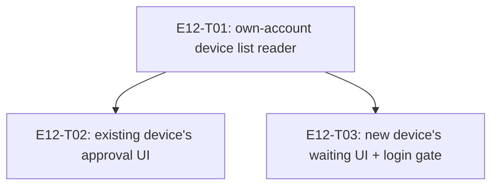

# E12 · Account Recovery & Device Enrollment · Progress

**Status:** sharded, 3 tasks, analyze gate run — see epic.md's ANALYZE
REPORT. Not yet dispatched. · **Started:** — · **Completed:** — ·
**Progress:** 0/3 tasks done

## Tasks

| Task | Status | Depends on | Blocks |
|---|---|---|---|
| E12-T01 | todo | — | T02, T03 |
| E12-T02 | todo | T01 | — |
| E12-T03 | todo | T01 | — |

## DAG

`T02` and `T03` are independent of each other (disjoint files — `T02`
touches `devices_controller.dart`/`devices_view.dart`, `T03` touches
`login_controller.dart`/new `recovery/` files) and may build in either
order or in parallel once `T01` lands.

## Anti-collision matrix
Empty. No two tasks share a file.

## Event log (append-only)
- 2026-08-26 E12 drafted during Wave 1 epic-breakdown; deferred to a later wave.
- 2026-09-05 — Sharded into 3 tasks (task-sharding skill), after
  `GAP-028`'s two derived design contracts were approved and written.
  Backend investigation found `FR-RECOVER-001` needs almost no new
  protocol: `RelationshipSyncService`'s existing push/pull mechanism
  (E11-T05, `users/$uid/relationships/*`) already lets a new device
  detect its own approval, and `DevicesController`'s existing
  `verify`/`block` methods already record trust — the only missing piece
  was a way to read back the account's own device list
  (`FirebaseMetadataService`, T01), used to classify a discovered peer as
  "my own enrolling device" instead of a stranger.
