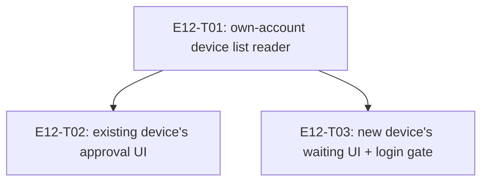

# E12 · Account Recovery & Device Enrollment · Progress

**Status:** sharded, 3 tasks, analyze gate run — see epic.md's ANALYZE
REPORT. Not yet dispatched. · **Started:** — · **Completed:** — ·
**Progress:** 0/3 tasks done

## Tasks

| Task | Status | Depends on | Blocks |
|---|---|---|---|
| E12-T01 | done | — | T02, T03 |
| E12-T02 | done | T01 | — |
| E12-T03 | review-requested | T01 | — |

## DAG

`T02` and `T03` are independent of each other (disjoint files — `T02`
touches `devices_controller.dart`/`devices_view.dart`, `T03` touches
`login_controller.dart`/new `recovery/` files) and may build in either
order or in parallel once `T01` lands.

## Anti-collision matrix
Empty. No two tasks share a file.

## Event log (append-only)
- 2026-08-26 E12 drafted during Wave 1 epic-breakdown; deferred to a later wave.
- 2026-09-05 — Sharded into 3 tasks (task-sharding skill), after
  `GAP-028`'s two derived design contracts were approved and written.
  Backend investigation found `FR-RECOVER-001` needs almost no new
  protocol: `RelationshipSyncService`'s existing push/pull mechanism
  (E11-T05, `users/$uid/relationships/*`) already lets a new device
  detect its own approval, and `DevicesController`'s existing
  `verify`/`block` methods already record trust — the only missing piece
  was a way to read back the account's own device list
  (`FirebaseMetadataService`, T01), used to classify a discovered peer as
  "my own enrolling device" instead of a stranger.
- 2026-09-05 — T01 merged into `epic_12` (cross-model reviewed, APPROVE).
  T02 merged into `epic_12` (cross-model reviewed, APPROVE, with a real
  race condition caught during implementation — concurrent discovery
  events could each miss a resolved-value cache and both independently
  call `readOwnDeviceIds`; fixed by caching the in-flight `Future`
  itself instead, verified by the reviewer via falsification).

## Carried-forward observations
- **The `devices` screen's design gate has been reporting 0% match on a
  `renderError` probe, unrelated to any change in this epic.**
  `test/design/design_probe_test.dart`'s `devices` fixture setup
  registers `RelationshipRepository`/`BlockUseCase` before
  `DevicesBinding().dependencies()` but not `TransportService`, so the
  probe dumper's own `DevicesController` construction throws and the
  dumper honestly records `"renderError": true, "elements": []` — every
  `make design-verify SCREEN=devices` run since this gap opened has
  been reporting 0% (0/61), not a real regression. Confirmed by T02's
  cross-model reviewer via direct byte-for-byte reproduction against
  both the `epic_12` branch and the unmodified `origin/epic_12` baseline
  — identical failure output on both, so no task in this epic caused it
  and none can fix it from inside its own `files:` fence (the probe
  fixture is outside every E12 task's scope). Needs a dedicated fix
  (one line: register `TransportService` in that `setUp`) before the
  `devices` screen is genuinely gated again — flagging here per
  `skills/bug-sweep`'s carried-forward rule so it isn't silently
  rediscovered at the epic sweep.
