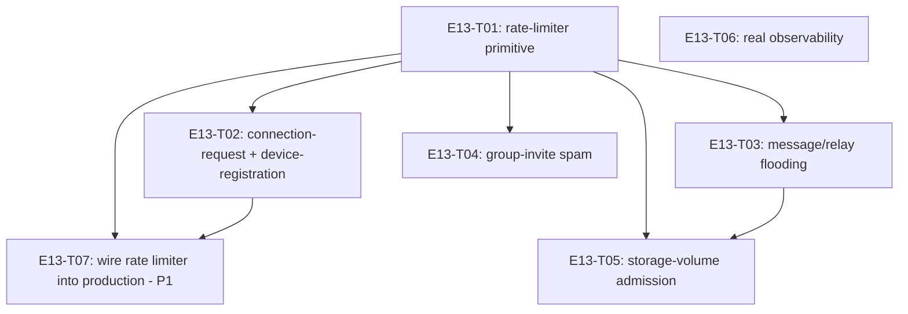

# E13 · Abuse Prevention & Diagnostics · Progress

**Status:** all 7 tasks done and merged into `development`. Epic-level bug
sweep run 2026-09-06 found 3 bugs: `E13-B01` (S3/P2, rate-limiter cleanup)
and `E13-B02` (S4/P4, identifier-leak audit) both fixed, reviewed, and
merged directly into `development`. `E13-B03` was re-scoped down
(2026-09-07, per `E13-B02`'s own reviewer recommendation, once its
original "no test seam exists" premise became false) from S3/P2 to a
narrower S4/P3 `SentryFlutter.init()` root-cause investigation — non-
blocking, `status: todo`, no further gate pending. · **Started:**
2026-09-05 · **Completed:** 2026-09-06 · **Progress:** 7/7 tasks done, 2/3
bugs closed, 1 narrow non-blocking follow-up remains

## Tasks

| Task | Status | Depends on | Blocks |
|---|---|---|---|
| E13-T01 | done | — | T02, T03, T04, T05, T06 |
| E13-T02 | done | T01 | T07 |
| E13-T03 | done | T01 | T05 |
| E13-T04 | done | T01 | — |
| E13-T05 | done | T01, T03 | — |
| E13-T06 | done | — | — |
| E13-T07 | done | T01, T02 | — |

## DAG

`T06` (observability) is independent of the rate-limiter primitive and
every subsystem task — it can run in any order relative to T01-T05, no
shared files.

## Anti-collision matrix

Only two tasks share a file: `T03` and `T05` both touch
`lib/core/routing_engine/relay_engine.dart`. Serialized via `T05`'s
`depends_on: [E13-T01, E13-T03]` — T05 runs strictly after T03 lands, so
this is never a parallel-edit collision. Every other pair of tasks touches
disjoint files.

## Event log (append-only)
- 2026-08-26 E13 drafted during Wave 1 epic-breakdown; deferred to a later wave.
- 2026-09-05 — Sharded into 6 tasks (task-sharding skill). E12 and E14
  were deferred at this pass: both have `ui_surface: [mobile]` and
  `design_screens: []` (no design contract exists or is derivable without
  a human-approved gap per rule 2) — E13 has `ui_surface: []`, no such
  blocker, so it went first out of the three deferred (Wave 2+) epics.
- 2026-09-05 — T01 (rate-limiter primitive), T06 (real observability,
  Sentry — human-approved dependency, two review rounds closing three
  real privacy-configuration gaps in the SDK's default data collection)
  merged into `epic_13`, both cross-model reviewed APPROVE.
- 2026-09-05 — T02 (connection-request + device-registration
  rate-limiting) merged, cross-model reviewed APPROVE — with a real
  blocking finding: the built-and-tested mechanism has **zero live
  production call site** (all 4 real construction sites, including one
  the task's own Open Question missed, are outside its `files:` fence by
  design). `EARS-ABUSE-4`/`5` are currently false in the running app.
  **`E13-T07` filed as a new P1 task** to close this before the epic can
  be considered complete — see its own file for the full obligation,
  including the precondition that `E13-T01`'s own unresolved
  `OQ-E13-T01-1` (unbounded `RateLimitCounters` growth under
  attacker-controlled bucket keys, empirically confirmed by the
  reviewer: 500 requests → 500 permanent rows, 0 denials) must resolve
  as PART of the wiring task, not after it.
- 2026-09-05 — T04 (group-invitation spam) merged, cross-model reviewed
  APPROVE — found and correctly disclosed that `_perform` is not the
  shared funnel the task assumed at sharding time; gated `createGroup`
  and `_perform` (scoped to `addMember` only) independently instead,
  sharing one bucket. Two non-blocking carry-forwards noted: `createGroup`
  now throws `AppFailure` with zero current callers (a future UI-wiring
  trap, already disclosed); the rate gate runs before the permission
  check on `addMember` (defensible, cosmetic asymmetry only).
- 2026-09-05 — T03 (message/relay flooding): first attempt correctly
  found `RelayEngine.enqueue` has no sender-identity parameter or column
  at all to rate-limit on, and stopped rather than guess (`Q-E13-T03-1`).
  Human decision: gate at the call site instead
  (`InboundPipeline`'s forward branch), keyed on the wire frame's claimed
  `frame.source` — no schema migration needed (`RateLimiter` has its own
  table). Accepted limitation: an attacker rotating claimed source ids
  per frame evades this gate; this still stops a naive single-identity
  flooder, which is most of the realistic threat model, and is
  consistent with this codebase's existing TOFU-trust posture elsewhere
  (same class of gap `E09-B09` already named). Merged.
- 2026-09-05 — T05 (storage-volume admission) merged, cross-model
  reviewed APPROVE after fixing a real fail-open bug: the byte-volume
  gate's rollover branch (fresh bucket / elapsed window) never compared
  the packet's own size against the budget, so a single oversized packet
  sailed through on the first hit of every window. Fixed with an explicit
  pre-check before calling `RateLimiter.allow`. Verified via falsification
  by both the implementer and an independent round-2 reviewer (adversarial
  pass: two sub-threshold packets summing over budget, exact-boundary
  test, denial-doesn't-poison-bucket test) — no remaining gap.
- 2026-09-06 — T07 (wire the rate limiter into production, P1) merged
  (PR #116) after 3 review rounds. Wired all 4 real construction sites
  (closing `OQ-E13-T02-1`, including the one site the original Open
  Question missed) and bounded `OQ-E13-T01-1` (stale-row eviction inside
  `RateLimiter.allow`'s own transaction — bounded to a rolling 2 days,
  not resolved in-window; see the 2026-09-06 sweep entries and `E13-B01`). Round 2 found a real S1/S2
  lockout bug: sign-in minted a brand-new local device identity on every
  launch, so a returning user hit the 5/24h registration rate limit after
  6 launches in a day and was silently stuck. Human-decided fix: reuse
  the existing local device identity when one exists, only rate-limiting
  genuinely new registrations. Round 2's own fix then introduced a
  narrower bug (F6): the identity read sat outside `_signIn`'s `try`
  block, so a thrown error there would hang the sign-in screen forever
  with nothing logged — fixed in round 3, independently falsified twice.
  Final verdict APPROVE; 🧍 `auth_or_payment_code` gate human-approved
  2026-09-06. **E13 is now 7/7, complete.**
- 2026-09-06 — **Epic-level bug sweep run** (`skills/bug-sweep`,
  independent reviewer, cross-model, claude-opus-5, isolated worktree off
  `origin/epic_13` @ `b5c3f99`). Full suite **1187/1187 green**,
  `flutter analyze` clean (one pre-existing `annotate_overrides` info in
  `test/core/calls/call_migration_controller_test.dart`, unrelated to
  E13). All 5 production `RateLimiter` wiring sites re-verified composed
  correctly after the merge: `bindings.dart:98-100`
  (`DeviceIdentityRepository`), `messaging_stack.dart:281-283` +
  `devices_controller.dart:50-52` (`EvaluateConnectionRequestUseCase`,
  two independent instances sharing one DB-backed bucket — shared, not
  double-counted), `inbound_pipeline.dart:309` (both gates),
  `group_membership_service.dart:314`. T05's fail-open fix and T07's
  device-identity-reuse fix were each falsified by the sweep (removing
  the fix makes exactly the right test fail: T05's
  `test_EARS_ABUSE_10_single_oversized_packet_denied_on_fresh_window`;
  T07's fix is guarded at three altitudes — use case, controller, and the
  full `widget_test.dart` journey) and restored. **Two findings, both
  filed: `E13-B01` (S3) and `E13-B02` (S4). Zero S1, zero S2.** Priority
  stamps pending the 🧍 `bug_priorities` human gate; with no S1/S2 the
  epic→`development` PR is unblocked once that gate lands.
- 2026-09-06 — Sweep dispositions for each carried-forward observation:
  **T02** closed by T07 (all 4 construction sites wired, verified).
  **T03**'s rotating-`frame.source` evasion — confirmed still an accepted
  limitation, not a defect; its second-order cost is `E13-B01`.
  **T04** — `GroupMembershipService.createGroup` confirmed still to have
  zero `lib/` callers, but so does every other group-membership entry
  point (no group-management UI exists yet), so the gate is correctly
  pre-placed rather than orphaned; the rate-gate-before-permission-check
  ordering on `addMember` is confirmed cosmetic (the bucket is keyed on
  the LOCAL device id, so it is not remotely probeable). No bug filed for
  either. **T05** — re-confirmed fixed, falsified independently. **T07**'s
  `deviceId`-only match — confirmed still accurate and still unreachable:
  `grep` over all of `lib/` for any sign-out/logout/account-switch path
  returns nothing. Stays a carried-forward note. **`OQ-E13-T01-1`** —
  eviction verified working end to end (50 three-day-old rows plus one
  `allow()` leaves exactly 1 row), but growth is bounded only across a
  rolling 2 days, not in-window: 500 rotated keys still produce 500 rows
  and zero denials. Corrected below and folded into `E13-B01`.
- **Carried-forward observation (T07's reviewer, non-blocking)**:
  `SignInUseCase.call` matches on `deviceId` only, never on account. If
  two different accounts ever sign in on the same device (no sign-out/
  logout path exists anywhere in `lib/` today, so unreachable), the
  second account's sign-in would silently reuse and rewrite the first
  account's device-identity row, and its registration would never be
  counted by the rate limiter. Needs a reader before any account-switch
  or logout feature lands.
