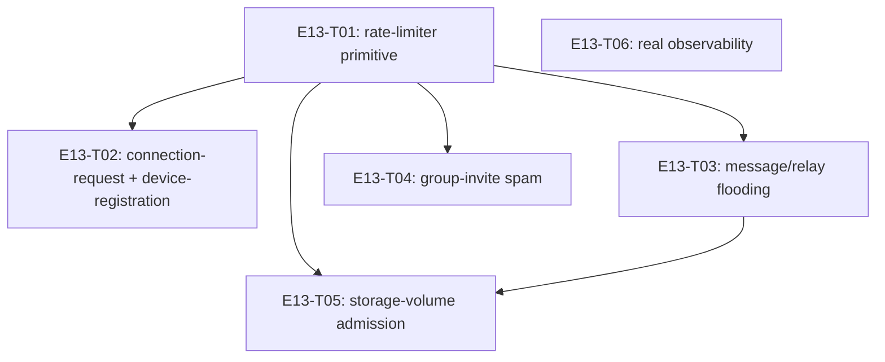

# E13 · Abuse Prevention & Diagnostics · Progress

**Status:** sharded, 6 tasks, analyze gate run — see epic.md's ANALYZE
REPORT. Not yet dispatched. · **Started:** — · **Completed:** — ·
**Progress:** 0/6 tasks done

## Tasks

| Task | Status | Depends on | Blocks |
|---|---|---|---|
| E13-T01 | todo | — | T02, T03, T04, T05, T06 |
| E13-T02 | todo | T01 | — |
| E13-T03 | todo | T01 | T05 |
| E13-T04 | todo | T01 | — |
| E13-T05 | todo | T01, T03 | — |
| E13-T06 | todo | — | — |

## DAG

`T06` (observability) is independent of the rate-limiter primitive and
every subsystem task — it can run in any order relative to T01-T05, no
shared files.

## Anti-collision matrix

Only two tasks share a file: `T03` and `T05` both touch
`lib/core/routing_engine/relay_engine.dart`. Serialized via `T05`'s
`depends_on: [E13-T01, E13-T03]` — T05 runs strictly after T03 lands, so
this is never a parallel-edit collision. Every other pair of tasks touches
disjoint files.

## Event log (append-only)
- 2026-08-26 E13 drafted during Wave 1 epic-breakdown; deferred to a later wave.
- 2026-09-05 — Sharded into 6 tasks (task-sharding skill). E12 and E14
  were deferred at this pass: both have `ui_surface: [mobile]` and
  `design_screens: []` (no design contract exists or is derivable without
  a human-approved gap per rule 2) — E13 has `ui_surface: []`, no such
  blocker, so it went first out of the three deferred (Wave 2+) epics.
