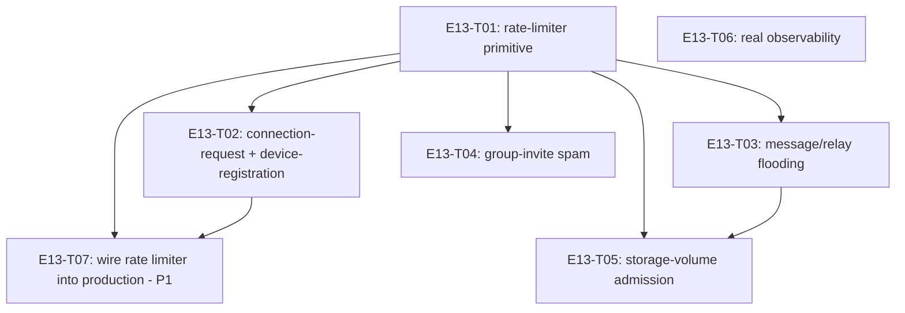

# E13 · Abuse Prevention & Diagnostics · Progress

**Status:** in progress — 4/7 tasks done and merged into `epic_13`
(T01, T02, T04, T06); T03 resumed after a human decision on its rate-limit
key (`Q-E13-T03-1` resolved); T05 blocked on T03; T07 (new, P1) added to
close a real gap T02's review found — the built rate limiter has zero
live production call site. · **Started:** 2026-09-05 · **Completed:** — ·
**Progress:** 4/7 tasks done

## Tasks

| Task | Status | Depends on | Blocks |
|---|---|---|---|
| E13-T01 | done | — | T02, T03, T04, T05, T06 |
| E13-T02 | done | T01 | T07 |
| E13-T03 | review-requested | T01 | T05 |
| E13-T04 | done | T01 | — |
| E13-T05 | todo | T01, T03 | — |
| E13-T06 | done | — | — |
| E13-T07 | todo | T01, T02 | — |

## DAG

`T06` (observability) is independent of the rate-limiter primitive and
every subsystem task — it can run in any order relative to T01-T05, no
shared files.

## Anti-collision matrix

Only two tasks share a file: `T03` and `T05` both touch
`lib/core/routing_engine/relay_engine.dart`. Serialized via `T05`'s
`depends_on: [E13-T01, E13-T03]` — T05 runs strictly after T03 lands, so
this is never a parallel-edit collision. Every other pair of tasks touches
disjoint files.

## Event log (append-only)
- 2026-08-26 E13 drafted during Wave 1 epic-breakdown; deferred to a later wave.
- 2026-09-05 — Sharded into 6 tasks (task-sharding skill). E12 and E14
  were deferred at this pass: both have `ui_surface: [mobile]` and
  `design_screens: []` (no design contract exists or is derivable without
  a human-approved gap per rule 2) — E13 has `ui_surface: []`, no such
  blocker, so it went first out of the three deferred (Wave 2+) epics.
- 2026-09-05 — T01 (rate-limiter primitive), T06 (real observability,
  Sentry — human-approved dependency, two review rounds closing three
  real privacy-configuration gaps in the SDK's default data collection)
  merged into `epic_13`, both cross-model reviewed APPROVE.
- 2026-09-05 — T02 (connection-request + device-registration
  rate-limiting) merged, cross-model reviewed APPROVE — with a real
  blocking finding: the built-and-tested mechanism has **zero live
  production call site** (all 4 real construction sites, including one
  the task's own Open Question missed, are outside its `files:` fence by
  design). `EARS-ABUSE-4`/`5` are currently false in the running app.
  **`E13-T07` filed as a new P1 task** to close this before the epic can
  be considered complete — see its own file for the full obligation,
  including the precondition that `E13-T01`'s own unresolved
  `OQ-E13-T01-1` (unbounded `RateLimitCounters` growth under
  attacker-controlled bucket keys, empirically confirmed by the
  reviewer: 500 requests → 500 permanent rows, 0 denials) must resolve
  as PART of the wiring task, not after it.
- 2026-09-05 — T04 (group-invitation spam) merged, cross-model reviewed
  APPROVE — found and correctly disclosed that `_perform` is not the
  shared funnel the task assumed at sharding time; gated `createGroup`
  and `_perform` (scoped to `addMember` only) independently instead,
  sharing one bucket. Two non-blocking carry-forwards noted: `createGroup`
  now throws `AppFailure` with zero current callers (a future UI-wiring
  trap, already disclosed); the rate gate runs before the permission
  check on `addMember` (defensible, cosmetic asymmetry only).
- 2026-09-05 — T03 (message/relay flooding): first attempt correctly
  found `RelayEngine.enqueue` has no sender-identity parameter or column
  at all to rate-limit on, and stopped rather than guess (`Q-E13-T03-1`).
  Human decision: gate at the call site instead
  (`InboundPipeline`'s forward branch), keyed on the wire frame's claimed
  `frame.source` — no schema migration needed (`RateLimiter` has its own
  table). Accepted limitation: an attacker rotating claimed source ids
  per frame evades this gate; this still stops a naive single-identity
  flooder, which is most of the realistic threat model, and is
  consistent with this codebase's existing TOFU-trust posture elsewhere
  (same class of gap `E09-B09` already named). Resumed, in review.
