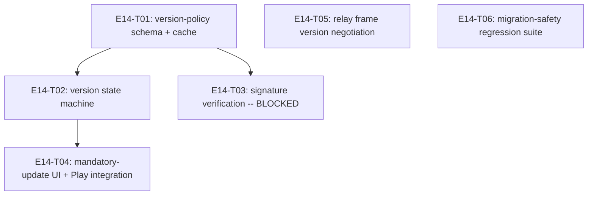

# E14 · Version & Update Management · Progress

**Status:** sharded, 6 tasks (1 blocked on a human decision), analyze
gate run — see epic.md's ANALYZE REPORT. Not yet dispatched. ·
**Started:** — · **Completed:** — · **Progress:** 0/6 tasks done

## Tasks

| Task | Status | Depends on | Blocks |
|---|---|---|---|
| E14-T01 | todo | — | T02, T05 |
| E14-T02 | todo | T01 | T04 |
| E14-T03 | todo, **blocked** (`OQ-E14-T03-1`) | T01 | — |
| E14-T04 | todo | T02 | — |
| E14-T05 | todo | — | — |
| E14-T06 | todo | — | — |

## DAG

`T05` and `T06` are fully independent of the version-policy track (T01/
T02/T03/T04) and of each other — no shared files, no dependency edges.

## Anti-collision matrix
Empty. `T02` and `T04` both may touch `pubspec.yaml`, but `T04` depends
on `T02` (serialized, never parallel).

## Event log (append-only)
- 2026-08-26 E14 drafted during Wave 1 epic-breakdown; deferred to a
  later wave.
- 2026-09-05 — Sharded into 6 tasks (task-sharding skill), after
  `GAP-029`'s derived design contract was approved and written. Claims
  `OQ-E11-2`'s reserved `config/version_policy` Firebase node (`T01`).
  `T03` (signed policy verification, `FR-VER-011`) is sharded but
  `status: todo`/`side: blocked` — it names a real key-infrastructure
  decision (`OQ-E14-T03-1`) this session has no basis to make
  unilaterally, rather than being silently dropped. `OQ-E14-1` (where
  `FR-VER-004`'s simulation framework lives, this epic or `E04`) remains
  open and unsharded — no task claims `FR-VER-004` in this pass.
