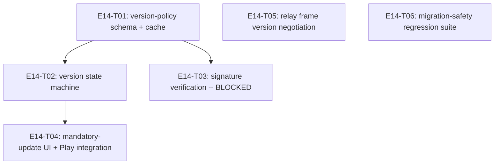

# E14 · Version & Update Management · Progress

**Status:** in progress — 5/6 tasks done and merged into `epic_14` (T01,
T02, T04, T05, T06); T03 remains `blocked` on a human key-infrastructure
decision (`OQ-E14-T03-1`) — the epic's only remaining item. · **Started:**
2026-09-05 · **Completed:** — · **Progress:** 5/6 tasks done

## Tasks

| Task | Status | Depends on | Blocks |
|---|---|---|---|
| E14-T01 | done | — | T02, T05 |
| E14-T02 | done | T01 | T04 |
| E14-T03 | todo, **blocked** (`OQ-E14-T03-1`) | T01 | — |
| E14-T04 | done | T02 | — |
| E14-T05 | done | — | — |
| E14-T06 | done | — | — |

## DAG

`T05` and `T06` are fully independent of the version-policy track (T01/
T02/T03/T04) and of each other — no shared files, no dependency edges.

## Anti-collision matrix
Empty. `T02` and `T04` both may touch `pubspec.yaml`, but `T04` depends
on `T02` (serialized, never parallel).

## Event log (append-only)
- 2026-08-26 E14 drafted during Wave 1 epic-breakdown; deferred to a
  later wave.
- 2026-09-05 — Sharded into 6 tasks (task-sharding skill), after
  `GAP-029`'s derived design contract was approved and written. Claims
  `OQ-E11-2`'s reserved `config/version_policy` Firebase node (`T01`).
  `T03` (signed policy verification, `FR-VER-011`) is sharded but
  `status: todo`/`side: blocked` — it names a real key-infrastructure
  decision (`OQ-E14-T03-1`) this session has no basis to make
  unilaterally, rather than being silently dropped. `OQ-E14-1` (where
  `FR-VER-004`'s simulation framework lives, this epic or `E04`) remains
  open and unsharded — no task claims `FR-VER-004` in this pass.
- 2026-09-05 — T01 (version-policy schema + cache) merged into
  `epic_14`, cross-model reviewed APPROVE (two rounds — found and fixed
  a non-falsifiable boundary-guard test, then a checklist/deviation
  contradiction).
- 2026-09-05 — T02 (version state machine) merged, cross-model reviewed
  APPROVE with a status correction: the implementer set `status: blocked`
  out of caution when no build-number-reading dependency existed in this
  codebase, but the task's own contract only required a PURE use case
  with injected providers — fully satisfied without any new dependency.
  Reclassified `blocked` → `review-requested` → `done` on the reviewer's
  own explicit recommendation. All 5 EARS criteria mutation-falsified,
  including the numeric-vs-lexicographic build-number comparison.
  **Carried forward to `T04`'s own dispatch** (already `depends_on: T02`):
  `T04` must both clear the 🧍 `new_dependency` gate for a real
  build-number reader (`package_info_plus` or similar) AND supply a real
  `InstalledBuildProvider` — until then this use case has zero live
  caller.
- 2026-09-05 — T05 (relay-frame version negotiation) merged, cross-model
  reviewed APPROVE. Investigation concluded near-no-op: `RelayEngine`
  never calls `RelayPacketFrame.deserialize` at all (a corrected premise
  from the task's own text) — the real caller, `InboundPipeline`,
  already gracefully drops an unknown-version frame and keeps processing
  subsequent legitimate ones. `E03`'s `prekey_bundle_codec.dart` already
  carries its own independent version marker, so the sum of both
  mechanisms already satisfies `FR-VER-001`/`002` without a new
  wire-format field. Falsified twice independently (both by the
  implementer and, separately, by the reviewer neutering the version
  guard itself) — both caught the regression correctly.
- 2026-09-05 — T06 (migration-safety regression suite) merged,
  cross-model reviewed APPROVE. Two independent falsification probes
  (a destructive table rebuild, a silent field-value corruption) both
  caught by the suite. **Non-blocking carry-forward**: the suite's own
  representative-version sample skips v9→v10's `relay_packets` `DROP
  TABLE` step — covered elsewhere by `relay_retention_migration_test.dart`,
  but worth adding v9 to this suite's own frame for completeness.
- 2026-09-05/06 — T04 (mandatory-update screen + Google Play in-app
  update integration) merged into `epic_14` (PR #109), after two
  human-approved new dependencies (`package_info_plus: 10.2.1`,
  `in_app_update: 5.0.0`, both pinned exact — 🧍 `new_dependency` gate
  cleared). Cross-model reviewed APPROVE. Non-dismissibility
  (`PopScope(canPop: false)`) falsified independently by the reviewer
  and re-falsified after a routing-context change (`initialRoute` made
  dynamic); FR-VER-007's never-a-raw-APK constraint verified against the
  actual pinned `in_app_update` package source. `Q-E14-T04-2`
  (`make design-verify SCREEN=version-update-required` still not run)
  remains open — see the project-wide design-fidelity tooling gap
  carried forward from E12's sweep; `version_update_view.dart` itself is
  unchanged since its prior hand-verification against the design
  contract. This task file's own `status:` field and this tracker had
  drifted to show T04 as `todo`/undone after the merge — corrected here;
  no code changed, bookkeeping only.

## Remaining work
Only `E14-T03` (signed policy verification, `FR-VER-011`) is left, and it
is genuinely blocked on `OQ-E14-T03-1` — a signing-key-infrastructure
decision only the human can make (rule 3). Once that decision lands and
`T03` either ships or is explicitly descoped, this epic is ready for its
bug sweep and `epic_14` → `development` merge.

## Bug sweep (2026-09-06)

Run by the reviewer (`claude-opus-5`) per `skills/bug-sweep`, in an isolated
worktree off `origin/epic_14` @ `925977b`, against the merged epic — T03
excluded as genuinely parked on `OQ-E14-T03-1`.

**Suite + lint on the merged branch:** `flutter test` → **1179/1179 pass**.
`flutter analyze` → **1 issue**, `annotate_overrides` (info) in
`test/core/calls/call_migration_controller_test.dart:177` — verified
pre-existing on `origin/development`, not E14's.

**Bugs filed — 5.** Severity is the reviewer's; 🧍 **priority is the human's**
(`bug_priorities` gate, all five stamped `p: TBD`).

| Bug | Severity | What |
|---|---|---|
| `E14-B01` | **S2** | `VersionPolicyService.refresh()` has zero production callers — the cache is never written, so every build always evaluates `upToDate` and the mandatory-update screen is unreachable in a shipped app |
| `E14-B02` | **S2** | `FR-VER-006`'s "block application communication" is unimplemented — `AppBinding` is `initialBinding`, so the coordinator/inbound pipeline/link feed/background service/notification dispatcher all start behind the update screen |
| `E14-B03` | S3 | `_readInstalledBuildNumber`'s catch-all fail-open (`1 << 62`) silently disables enforcement on any `PackageInfo` failure; needs `OQ-E14-B03-1` answered first |
| `E14-B04` | S4 | T06's carried-forward v9 gap, confirmed and filed so it has a reader |
| `E14-B05` | S4 | `docs/routes.md` missing the `/version-update-required` row |

**`E14-B01` is the sweep's whole justification.** Every one of T01/T02/T04
passed its own review, and each explicitly fenced the `refresh()` call site
out to one of the other two (`version_policy_service.dart:12-14`,
`evaluate_version_state_use_case.dart:15-17`, `main.dart:64-67`). The sum is
a hole no task's tests could see, because every per-task test injects the
cached policy itself. Reviewer's own end-to-end probe against a real
`AppDatabase`, composing exactly what `main.dart` composes:
`build=1, minimumSupportedBuild unset → upToDate → /welcome`; with the cache
row written directly, the identical composition gives
`updateRequired → /version-update-required`. The pipeline is correct; the
trigger is missing.

### Carried-forward observations — triage

- **`Q-E14-T04-2`** (`make design-verify SCREEN=version-update-required` never
  run) — **correctly deferred, no E14 bug filed.** Confirmed structural, not
  E14-specific: `design/screens/version-update-required.md`'s own frontmatter
  says `golden: none yet`, the screen is absent from `design/sources.yaml`,
  and the repo carries **17 contracts against 7 goldens**. The gate cannot run
  for this screen or for nine others; that is the project-wide
  design-fidelity tooling gap already raised by E12's sweep and it belongs
  there, not here. Consequence to record honestly: **T04's design fidelity is
  hand-verified only, never measured** — which `skills/design-fidelity`'s own
  self-test says is not a substitute.
- **T02's carry-forward** (T04 must clear the `new_dependency` gate and supply
  a real `InstalledBuildProvider`) — **discharged.** `package_info_plus:
  10.2.1` and `in_app_update: 5.0.0` both pinned exact and human-approved;
  `main.dart:113` supplies the real provider. Its residual risk is now
  `E14-B03`.
- **T06's carry-forward** (v9 absent from the suite's sample) — **confirmed
  real**, `migration_safety_regression_test.dart:762-766`; filed as
  `E14-B04` (S4).
- **T05's near-no-op conclusion** — **re-verified, no bug.** `RelayEngine`
  never calls `RelayPacketFrame.deserialize`; `InboundPipeline` drops an
  unknown-version frame and keeps processing. Nothing regressed.

### Verified clean by the sweep

- **`FR-VER-007` — "never silently download or install arbitrary APK files":
  PASS.** Traced the real call path into the pinned package source:
  `routes.dart:_immediateUpdateLauncher` → `InAppUpdate.performImmediateUpdate`
  → `InAppUpdatePlugin.kt:193-201` →
  `AppUpdateManager.startUpdateFlowForResult(AppUpdateOptions.defaultOptions(AppUpdateType.IMMEDIATE))`.
  No HTTP client, no APK URL, no `PackageInstaller`, no
  `ACTION_INSTALL_PACKAGE`; the download and install run entirely inside
  Google Play. Independently, `grep -niE "\.apk|installPackage|ACTION_INSTALL|REQUEST_INSTALL_PACKAGES"`
  over all of `lib/` and `android/app/src/main/AndroidManifest.xml` → no
  matches.
- **`EARS-VER-11` non-dismissibility: PASS**, by the reviewer's own probe (not
  the builder's test) — routed onto the screen through the real `GetPage`
  table, then attacked three ways: `handlePopRoute()` (system back / hardware
  button), `Get.back()`, and `Navigator.maybePop()`. The screen survived all
  three. Affordance count is exactly one `ElevatedButton`; no `TextButton`, no
  `IconButton`.
- **Firebase boundary:** `database.rules.json`'s `config/version_policy` node
  is `.write: false` for every client with a `$other: {".validate": false}`
  catch-all, and `VersionPolicyService._parse` runs
  `FirebaseBoundary.assertAllowedFields` on the read side and folds a
  violation into "no usable policy" rather than throwing.

### Gate status

**P1/P2 count: 🧍 not yet determined — priorities are the human's call**
(`bug_priorities`). Two **S2** defects are open (`E14-B01`, `E14-B02`), both
of which make the epic's own headline `EARS-VER-1` untrue in a shipped app.
`skills/bug-sweep`'s gate is "the epic→dev PR opens only when P1/P2 = 0", and
the reviewer's recommendation is that `E14-B01` and `E14-B02` warrant P1/P2 —
so **`epic_14` → `development` is NOT recommended for merge yet.** No merge
performed by the sweep.
