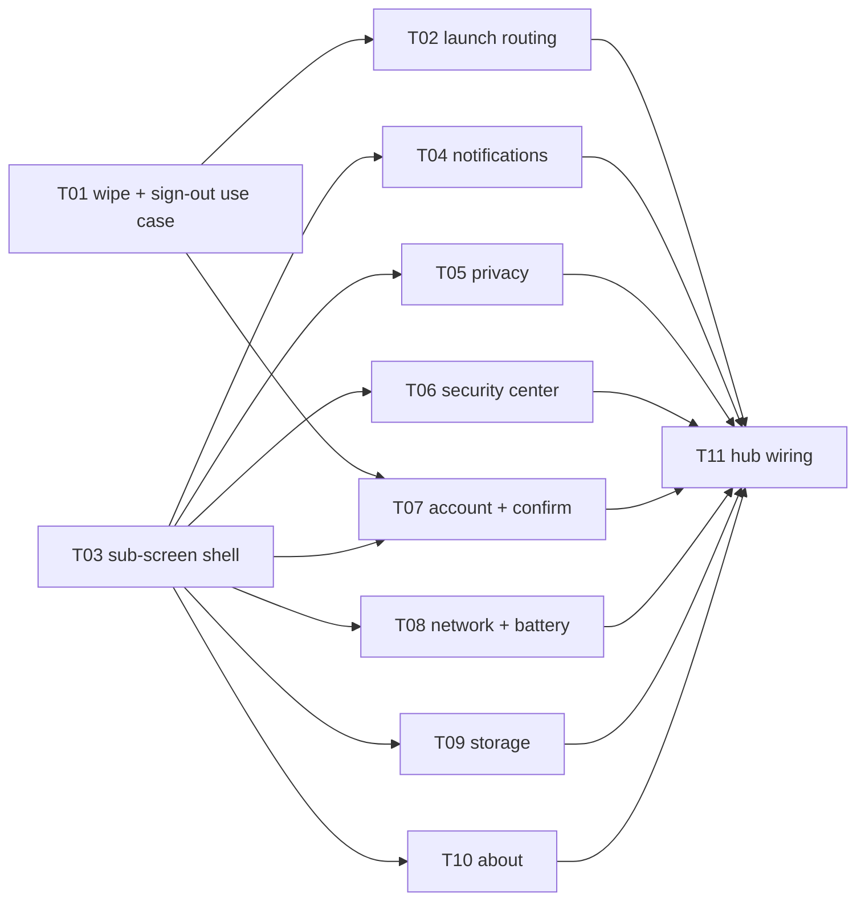

# E15 · Session Lifecycle & Settings Sub-Screens · Progress

**Status:** todo · **Started:** — · **Completed:** — · **Progress:** 0/11

> Only the ORCHESTRATOR edits this file.
> todo → in-progress → review-requested → (changes-requested →) done → verified
> · side: blocked, frozen

## ✅ All gates cleared 2026-09-08 — dispatch open

| Gate | Where | State |
|---|---|---|
| 🧍 `change_impact_approval` | `docs/impact/IMP-003-session-lifecycle-and-settings-subscreens.md` | ✅ cleared by human, 2026-09-08 (`AskUserQuestion` — "Yes, approve and start dispatching tasks") |
| 🧍 `design_contract_approval` | `design/gaps.md` (reopened for GAP-031…039) | ✅ cleared by human, 2026-09-08, same approval |
| 🧍 `analyze_report` | `epic.md` §Analyze report | ✅ cleared by human, 2026-09-08, same approval |
| 🟡 `Q-SEC-009` (blocking) | `spec/questions.md` | ✅ answered 2026-09-08 — (b) revoke best-effort |
| 🟡 `Q-FUNC-010` (blocking) | `spec/questions.md` | ✅ answered 2026-09-08 — (a) fix enrollment gate, accept rate limit |

Dispatch order (DAG-correct, per the human's stated Settings priority
2026-09-08): **T01 and T03 in parallel first** (no shared files, no
dependency between them — T01 is sign-out/wipe, T03 is the sub-screen
shell every sub-screen task depends on) → **T02** (needs T01) → then,
once T03 has merged, the 7 sub-screens in priority order: **T04**
Notifications → **T05/T06** Privacy & Security / Security Center → **T07**
Account (also needs T01) → **T08** Network+Battery → **T09** Storage →
**T10** About → **T11** hub wiring last (needs T02 + all seven
sub-screens).

## Tasks
- [ ] E15-T01 · Sign-out: local data wipe service and sign-out use case · todo · —
- [ ] E15-T02 · Session-aware launch routing, after the mandatory-update gate · todo · —
- [ ] E15-T03 · Settings sub-screen shell widget and design-gate registration · todo · —
- [ ] E15-T04 · Notifications settings screen · todo · —
- [ ] E15-T05 · Privacy & Security settings screen · todo · —
- [ ] E15-T06 · Security Center screen · todo · —
- [ ] E15-T07 · Account screen and sign-out confirmation · todo · —
- [ ] E15-T08 · Network and Battery settings screens · todo · —
- [ ] E15-T09 · Storage settings screen (E08 carry-forward) · todo · —
- [ ] E15-T10 · About / Updates screen · todo · —
- [ ] E15-T11 · Settings hub wiring: eight routes, eight rows, probe consolidation · todo · —

## Dependency graph

**Two independent roots.** `T01` (session) and `T03` (shell) start in parallel
— they share no file and no concept. `T03` then unblocks a **seven-wide fan**,
and `T11` is the single join.

## Dispatch order and WIP

WIP is capped at 3 (`harness.yaml`). Once the gates clear:

1. **{T01, T03}** — the two roots.
2. **{T02, T04, T05}** — T02 the moment T01 lands; T04 first of the screens,
   which is the human's own stated priority (Notifications).
3. **{T05, T06, T07}** — the human's second and third priorities, with T07 as
   soon as T01 has landed too.
4. **{T08, T09, T10}** — the remainder, in the human's stated order
   (Network / Storage / Battery / About).
5. **{T11}** — alone, after all eight.

## File ownership — why the seven-wide fan is safe

Every file that more than one task could plausibly want has exactly one owner,
declared in exactly one `files:` list:

| File | Sole owner |
|---|---|
| `lib/app/routes.dart` | **T11** |
| `lib/features/settings/presentation/settings_controller.dart` | **T11** |
| `lib/features/settings/presentation/settings_binding.dart` | **T11** |
| `lib/features/settings/presentation/settings_view.dart` | **T11** |
| `test/design/design_probe_test.dart` | **T11** |
| `design/sources.yaml` | **T03** |
| `lib/features/settings/presentation/widgets/settings_sub_screen_scaffold.dart` | **T03** |
| `lib/app/main.dart` | **T02** |
| `test/widget_test.dart` | **T02** |
| `lib/core/persistence/database.dart` | **T01** |
| `lib/core/auth/google_auth_service.dart` | **T01** |
| `lib/features/settings//**` | that sub-screen's own task |
| `design/golden/<screen>/**` | that screen's own task |

T04–T10 create files under their own `lib/features/settings//` directory,
their own `test/` mirror, their own `test/design/probe_<id>_test.dart` and
their own golden directory — **and nothing else**. The collision matrix is
empty by construction, not by luck.

This also honours **E08's own recorded warning**: its Analyze report reserved
`lib/app/routes.dart` and `lib/features/settings/**` for its prospective T09
and noted *"T09 must not be given the probe fixture when it is sharded, since
T08 now owns that file."* `E15-T09` touches neither.

## Review log
(date · task · reviewer model · outcome · design gate %)

## Blocked / Frozen
- **E15-T01** — 🟡 blocked on `Q-SEC-009` and `Q-FUNC-010` (both blocking, both
  in `spec/questions.md`). Rule 1: it does not start until both are answered.
- **E15-T02** — 🟡 blocked transitively via `depends_on: [E15-T01]`.

## Event log (append-only)
- 2026-09-08 E15 sharded by the planner (11 tasks) from `IMP-003`. Three human
  gates opened: `change_impact_approval`, `design_contract_approval`
  (reopened for GAP-031…039), `analyze_report`. Two blocking questions raised:
  `Q-SEC-009`, `Q-FUNC-010`. `E08-T09` retired into `E15-T09` with its reserved
  `EARS-STORE-20…22` intact.
