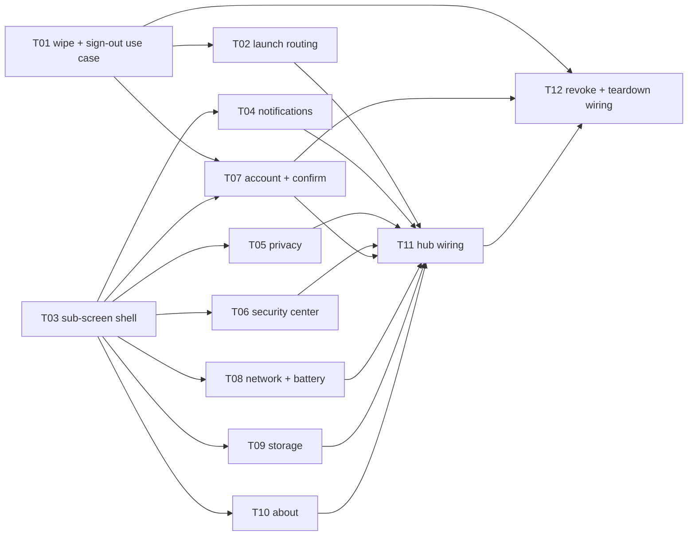

# E15 · Session Lifecycle & Settings Sub-Screens · Progress

**Status:** in-progress · **Started:** 2026-09-08 · **Completed:** — · **Progress:** 6/12

> Only the ORCHESTRATOR edits this file.
> todo → in-progress → review-requested → (changes-requested →) done → verified
> · side: blocked, frozen

## ✅ All gates cleared 2026-09-08 — dispatch open

| Gate | Where | State |
|---|---|---|
| 🧍 `change_impact_approval` | `docs/impact/IMP-003-session-lifecycle-and-settings-subscreens.md` | ✅ cleared by human, 2026-09-08 (`AskUserQuestion` — "Yes, approve and start dispatching tasks") |
| 🧍 `design_contract_approval` | `design/gaps.md` (reopened for GAP-031…039) | ✅ cleared by human, 2026-09-08, same approval |
| 🧍 `analyze_report` | `epic.md` §Analyze report | ✅ cleared by human, 2026-09-08, same approval |
| 🟡 `Q-SEC-009` (blocking) | `spec/questions.md` | ✅ answered 2026-09-08 — (b) revoke best-effort |
| 🟡 `Q-FUNC-010` (blocking) | `spec/questions.md` | ✅ answered 2026-09-08 — (a) fix enrollment gate, accept rate limit |

Dispatch order (DAG-correct, per the human's stated Settings priority
2026-09-08): **T01 and T03 in parallel first** (no shared files, no
dependency between them — T01 is sign-out/wipe, T03 is the sub-screen
shell every sub-screen task depends on) → **T02** (needs T01) → then,
once T03 has merged, the 7 sub-screens in priority order: **T04**
Notifications → **T05/T06** Privacy & Security / Security Center → **T07**
Account (also needs T01) → **T08** Network+Battery → **T09** Storage →
**T10** About → **T11** hub wiring last (needs T02 + all seven
sub-screens).

## Tasks
- [x] E15-T01 · Sign-out: local data wipe service and sign-out use case · done · PR #189, APPROVE (opus, escalations F1/F2 below) — merged `7ed8001`
- [x] E15-T02 · Session-aware launch routing, after the mandatory-update gate · done · PR #194 — merged
- [x] E15-T03 · Settings sub-screen shell widget and design-gate registration · done · PR #188, APPROVE (opus) — merged `62a8514`
- [x] E15-T04 · Notifications settings screen · done · PR #195 — merged
- [x] E15-T05 · Privacy & Security settings screen · done · PR #197, APPROVE (opus, round 3) — merged `00193ce`
- [x] E15-T06 · Security Center screen · done · PR #196, APPROVE (opus, round 5) — merged `cdbe253`
- [ ] E15-T07 · Account screen and sign-out confirmation · changes-requested · PR #199 open, round 1 CHANGES-REQUESTED (opus) — fix in progress
- [ ] E15-T08 · Network and Battery settings screens · review-requested · PR #200 open, review in progress (opus)
- [ ] E15-T09 · Storage settings screen (E08 carry-forward) · in-progress · a real `RenderFlex` overflow found in the default state during self-verification, being fixed before PR
- [ ] E15-T10 · About / Updates screen · in-progress · implemented, self-verification (analyze/tests/design-verify) in progress
- [ ] E15-T11 · Settings hub wiring: eight routes, eight rows, probe consolidation · todo · — (blocked on T07-T10 landing)
- [ ] E15-T12 · Wire SignOutUseCase's production teardown and remote-revoke closures · todo · — (new, 2026-09-10: shards the tracker's own F1/F2 resolution note below; depends on E15-T11)
- [x] E15-B01 · GetX lazyPut without fenix crashes on a second welcome/login/home visit · done · PR #191, APPROVE (opus) — merged `967fe84`
- [x] E15-B02 · Chat composer writes to a disposed TextEditingController mid-send · done · PR #191, APPROVE (opus) — merged `967fe84`

**B01/B02 note:** found live on physical hardware (Redmi 10 2022 + Pixel 8
Pro) during the E04-B06/B07 real-device Bluetooth mesh retest, not from
either task's own scope — filed here (E15) rather than E00/E06 because
`E15-T02`'s launch-routing rework and `E15-T07`'s logout→login round trip
are the features most directly exposed to both crashes going forward.

## Dependency graph

**Two independent roots.** `T01` (session) and `T03` (shell) start in parallel
— they share no file and no concept. `T03` then unblocks a **seven-wide fan**,
and `T11` is the single join. `T12` is a small tail task after `T11` — it
needs `T11`'s `settings_binding.dart` wiring to exist before it can construct
a production `SignOutUseCase` there.

## Dispatch order and WIP

WIP is capped at 3 (`harness.yaml`). Once the gates clear:

1. **{T01, T03}** — the two roots.
2. **{T02, T04, T05}** — T02 the moment T01 lands; T04 first of the screens,
   which is the human's own stated priority (Notifications).
3. **{T05, T06, T07}** — the human's second and third priorities, with T07 as
   soon as T01 has landed too.
4. **{T08, T09, T10}** — the remainder, in the human's stated order
   (Network / Storage / Battery / About).
5. **{T11}** — alone, after all eight.

## File ownership — why the seven-wide fan is safe

Every file that more than one task could plausibly want has exactly one owner,
declared in exactly one `files:` list:

| File | Sole owner |
|---|---|
| `lib/app/routes.dart` | **T11** |
| `lib/features/settings/presentation/settings_controller.dart` | **T11** |
| `lib/features/settings/presentation/settings_binding.dart` | **T11** |
| `lib/features/settings/presentation/settings_view.dart` | **T11** |
| `test/design/design_probe_test.dart` | **T11** |
| `design/sources.yaml` | **T03** |
| `lib/features/settings/presentation/widgets/settings_sub_screen_scaffold.dart` | **T03** |
| `lib/app/main.dart` | **T02** |
| `test/widget_test.dart` | **T02** |
| `lib/core/persistence/database.dart` | **T01** |
| `lib/core/auth/google_auth_service.dart` | **T01** |
| `lib/features/settings//**` | that sub-screen's own task |
| `design/golden/<screen>/**` | that screen's own task |

T04–T10 create files under their own `lib/features/settings//` directory,
their own `test/` mirror, their own `test/design/probe_<id>_test.dart` and
their own golden directory — **and nothing else**. The collision matrix is
empty by construction, not by luck.

This also honours **E08's own recorded warning**: its Analyze report reserved
`lib/app/routes.dart` and `lib/features/settings/**` for its prospective T09
and noted *"T09 must not be given the probe fixture when it is sharded, since
T08 now owns that file."* `E15-T09` touches neither.

## Review log
(date · task · reviewer model · outcome · design gate %)
- 2026-09-08 · E15-T03 · `claude-opus-5` (≠ executed_by `claude-sonnet-5`,
  rule 5) · APPROVE · design gate n/a (shell has no screen id/golden of its
  own, confirmed structurally not runnable, not a dodge). 1354/1354. Merged
  `62a8514`.
- 2026-09-08 · E15-T01 · `claude-opus-5` (≠ executed_by `claude-sonnet-5`,
  rule 5) · APPROVE, with two mandatory planner escalations (F1, F2 below)
  · design gate n/a (backend). 1363/1363. Merged `7ed8001`.
- 2026-09-09 · E15-T02 · `claude-opus-5` (≠ executed_by `claude-sonnet-5`,
  rule 5) · round 1 CHANGES-REQUESTED (F1: unguarded pending-wipe-completion
  crash loop; F2: duplicated version-gate predicate, not genuine
  delegation) → round 2 APPROVE. design gate n/a. 1379/1379. Merged
  `2cdbfaf`.
- 2026-09-09 · E15-T04 · `claude-opus-5` (≠ executed_by `claude-sonnet-5`,
  rule 5) · round 1 CHANGES-REQUESTED (F1: loading-window toggle guessed a
  default instead of no-op'ing) → round 2 APPROVE. design gate 100%
  (24/24). 1388/1388. Merged `40217b8`.
- 2026-09-09 · E15-T06 · `claude-opus-5` (≠ executed_by `claude-sonnet-5`,
  rule 5) · **5 rounds.** Round 1 CHANGES-REQUESTED (F1-F5: vacuous
  key-leak/back-affordance falsifications, stale wall-clock golden, no-op
  no-write test). Round 2 CHANGES-REQUESTED (F6: same vacuous-test shape
  for long-press affordances, found by hunting for it deliberately).
  Round 3 fixed F6 + 2 observations + OQ bookkeeping. Round 4
  CHANGES-REQUESTED (F7: OQ-E15-T06-1's provenance misattributed to the
  human when `design/gaps.md` explicitly delegated it to this task under
  rule 3 — doc-only). Round 5 APPROVE. design gate 100% (22/22).
  1404/1404. Merged `cdbe253`. **Every round's finding was a genuine
  defect, independently reproduced by the reviewer via its own
  falsification each time** — see §Carried-forward for the two residual
  observations (O1: Listener/pointer-callback gap; O2: OQ-E15-T06-2
  discoverability).
- 2026-09-09 · E15-T05 · `claude-opus-5` (≠ executed_by `claude-sonnet-5`,
  rule 5) · **3 rounds.** Round 1 CHANGES-REQUESTED (F1: vacuous `isNotNull`
  absence tests; F2: public repository field bypassing the read-only
  claim). Round 2 CHANGES-REQUESTED (F3: the F1 fix's denylist missed
  realistic vocabulary evasions like "passcode"; F5: a genuine spec-vs-
  design conflict on EARS-UI-9's "state the absence" clause, escalated
  and resolved by direct human decision — see GAP-040). Round 3 APPROVE.
  design gate 100% (23/23). 1416/1416. Merged `00193ce`. See
  §Carried-forward for two residual observations (O1: an icon-only,
  unlabeled control evades both the test and the design gate — a
  harness/probe limitation, not a task defect; O2: a one-line denylist
  tidy).

## Carried-forward observations (not yet a task)
- **F1 (S2) — the human's answered `Q-SEC-009`(b) (revoke the remote
  device-registry row) has no owner.** ~~Owner: whichever task wires
  `SignOutUseCase` for real…~~ **RESOLVED 2026-09-10: sharded as
  `E15-T12`.** `E15-T07`'s own review (round 1, opus) confirmed the punt
  was correct per rule 6 — `E15-T07`'s contract names only
  `SignOutUseCase.call()` + `Get.offAllNamed`, and no code anywhere yet
  constructs a *production* `SignOutUseCase` (that only happens once
  `E15-T11` registers `SignOutConfirmController` for real). `E15-T12`
  depends on `E15-T01`/`E15-T07`/`E15-T11` and adds the `revoke` seam +
  wires it in `settings_binding.dart`. Left unfixed, `Q-SEC-009`(b) would
  have silently degraded to (a) — the outcome the human explicitly
  rejected — and reopened `Q-FUNC-010`'s enrollment-gate dead end.
- **F2 (S2) — the singleton teardown (`_teardown` closure) has no owner
  either.** **RESOLVED 2026-09-10: sharded as `E15-T12`**, same task as F1
  (same production construction site in `settings_binding.dart`, same
  dependency on `E15-T11` landing first).
- **F3 (S4) — `LocalDataWipeService.wipe()` is not re-entrant.** Two
  concurrent calls leave correct final state but the losing call throws
  `AppFailure` despite the wipe succeeding — an unguarded double-tap on
  `E15-T07`'s confirm button would show a spurious "erase failed" after a
  successful sign-out. **Owner: `E15-T07`'s confirm button must disable
  itself after the first tap.**
- **E15-T06 review round 4, finding #1 (S4) — `test_EARS_DIAG_5_no_action_
  affordance_is_rendered` (Security Center) does not scan `Listener` or
  low-level `GestureDetector` pointer callbacks** (`onTapDown`,
  `onSecondaryTap`, `onPointerDown`, etc.) — only `onTap`/`onLongPress`/
  `onDoubleTap` on `InkWell`/`GestureDetector`/`Dismissible`. Proven by the
  reviewer: wrapping a row in `Listener(onPointerDown: (_) {})` or
  `GestureDetector(onTapDown: (_) {})` stays undetected. Zero real-world
  impact today (the shipped screen has no such widget), but `L-frontend-001`
  is precedent for exactly this evasion shape (E06-T10 swapped `InkWell`
  for a raw `Listener` to dodge a different probe classifier). **Owner:
  whichever future task touches `security_center_view.dart`** — if it adds
  any `Listener`/low-level pointer widget, extend this test's scan set
  first (`find.byType(Listener)` alongside the existing three) rather than
  assume the existing test still covers new affordances.
- **E15-T06's `OQ-E15-T06-2` (S3) — `signal_trusted_identities` has no
  first-seen-timestamp column, so the Security Center's "Trusted
  identities" row cannot show when an identity was first seen (design
  contract's own SC10), and `E15-T06` shipped with `timestamp: null` there
  rather than fabricating a value.** Full detail (table name, the needed
  column, the 🧍 `db_schema_migration` gate, and the exact call site to wire
  once the column exists — `trustedIdentities()`) lives in `E15-T06.md`'s
  own Open Questions section, but that section stops being read once the
  task is `done` and a future sharding pass reads the epic tracker and
  `spec/`, not closed task files. **Owner: whichever epic/task next touches
  `signal_trusted_identities`'s schema** — read `E15-T06.md`'s
  `OQ-E15-T06-2` in full before scoping that migration.
- **E15-T05 review round 3, observation O1 (S4, harness/probe limitation,
  not a task defect) — an icon-only, unlabeled control (no `Text`, no
  `Semantics` label) evades BOTH the new EARS-UI-9 allowlist test AND the
  `design-verify` gate itself.** Proven by the reviewer: a fully working
  app-lock switch built with no text, no semantics label, and an evasive
  identifier passed the full suite AND scored the golden 100% (23/23) —
  the probe dumper's `_isInteractive` family simply never observes an
  unlabeled interactive widget, the same shape as `L-frontend-001`. The
  gate did emit one `⚠️ layout delta` on the evasion run, so it isn't
  fully blind, but nothing failed it. **Owner: whichever task next touches
  the probe dumper/design-fidelity tooling** — not a fix for E15-T05
  itself; three simultaneous deliberate obfuscations are needed to trigger
  it, which is a harness-coverage gap, not a natural implementation
  mistake (contrast the round-2 vocabulary-evasion finding on the SAME
  screen, which a normal implementation would hit by accident).
- **E15-T05 review round 3, observation O2 (S5, one-line tidy, not
  blocking).** The source-inspection half of EARS-UI-9's test excludes
  PV22's own necessary "app lock"/"permissions" prose via a loose
  substring match (`!line.contains('not available in this')`) that a real
  forbidden field could dodge with a differently-worded trailing comment.
  Low severity — this is only the SECONDARY check; the allowlist render
  test is the one that actually closes the vocabulary-evasion class and
  isn't affected. **Owner: whoever next touches
  `privacy_settings_controller_test.dart`** — tighten the exclusion to
  match the full PV22 fragment instead of a generic phrase.

## Blocked / Frozen
- **E15-T02** — 🟡 blocked transitively via `depends_on: [E15-T01]`. `T01`
  is now done, so this is unblocked — dispatch open.

## Event log (append-only)
- 2026-09-08 E15 sharded by the planner (11 tasks) from `IMP-003`. Three human
  gates opened: `change_impact_approval`, `design_contract_approval`
  (reopened for GAP-031…039), `analyze_report`. Two blocking questions raised:
  `Q-SEC-009`, `Q-FUNC-010`. `E08-T09` retired into `E15-T09` with its reserved
  `EARS-STORE-20…22` intact.
