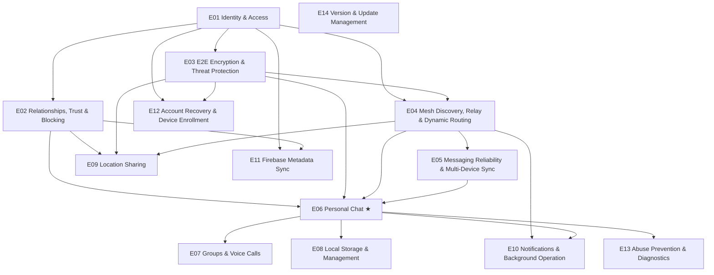

# Master epic map

**Gate:** 🧍 `epic_breakdown_and_wave` — ✅ cleared by human on 2026-08-26
("Approve as proposed" — the 14-epic map, WSJF scores, and Wave 1
[E01..E06] all approved as drafted.)

> Derived from `spec/srs.md` + `spec/feature-list.md`, scored via
> `skills/epic-breakdown`.

## The wave model

Epic 00 (genesis) is done and merged to `main` (see `epics/E00-genesis/`).
This is the first wave proposal since that exit gate closed.

No fixed count — **let the graph decide**. Tighter waves mean faster feedback.
★ = the wedge: the single highest-adoption-value epic — the reason the
product exists. Everything else is scaffolding around it.

## Dependency graph

`E14` has no dependencies (it only needs the genesis app shell, already on
`main`) and can run any time — shown as an isolated node deliberately.

## Epic table

| id | title | SRS module(s) | FR prefixes | wsjf | depends_on | status |
|----|-------|-------------|-------------|------|-----------|--------|
| E00 | Genesis / walking skeleton | — | — | — | — | done |
| E01 | Identity & Access | Identity & Auth | FR-AUTH-001..005 | 4.8 | — | done |
| E02 | Relationships, Trust & Blocking | Relationships & Trust | FR-TRUST-001..007, FR-BLOCK-001..003 | 4.0 | E01 | todo |
| E03 | E2E Encryption & Threat Protection | Security & Encryption | FR-SEC-001..004 | 3.5 | E01 | todo |
| E04 | Mesh Discovery, Relay & Dynamic Routing | Mesh Networking | FR-DISC-001..003, FR-ROUTE-001..009 | 2.8 | E01, E03 | todo |
| E05 | Messaging Reliability & Multi-Device Sync | Messaging Reliability | FR-MSG-001..008 | 3.2 | E03, E04 | todo |
| E06 | Personal Chat ★ | Personal & Group Comm. (split) | FR-COMM-001 | 4.2 | E02, E03, E04, E05 | todo |
| E07 | Groups & Voice Calls | Personal & Group Comm. (split) | FR-COMM-002, FR-GROUP-001..006, FR-CALL-001..003 | 2.1 | E06 | todo |
| E08 | Local Storage & Management | Offline & Local Storage | FR-STORE-001..007 | 3.0 | E06 | todo |
| E09 | Location Sharing | Location Sharing | FR-LOC-001..005 | 3.7 | E02, E03, E04 | todo |
| E10 | Notifications & Background Operation | Notifications & Background | FR-NOTIFY-001..002, FR-PLAT-001..003 | 3.6 | E04, E06 | todo |
| E11 | Firebase Metadata Sync | Firebase Integration | FR-FB-001..002 | 3.5 | E01, E02 | todo |
| E12 | Account Recovery & Device Enrollment | Account Recovery | FR-RECOVER-001..002 | 3.5 | E01, E03 | todo |
| E13 | Abuse Prevention & Diagnostics | Abuse Prevention & Diagnostics | FR-ABUSE-001, FR-DIAG-001..002 | 4.0 | E06 | todo |
| E14 | Version & Update Management | App Version Management | FR-VER-001..011 | 2.75 | — | todo |

WSJF = (business_value + time_criticality + risk_reduction) / job_size, each
1–10 — advisory, scored by the planner, **subject to your revision** at
approval.

FR-UI-001..005 (Material 3, theming, adaptive nav, progressive disclosure,
localization/RTL) are **cross-cutting** — bound as epic-level EARS on every
UI-bearing epic (E01, E02, E06, E07, E08, E09, E10), not their own epic, per
`spec/feature-list.md`'s own note.

NFRs bind to the epics they constrain, not a separate "NFR epic":
- **NFR-SEC-001** → E03
- **NFR-REL-001** → E04, E05
- **NFR-PERF-001** → E04, E05, E06 **[NEEDS NUMBER — spec/srs.md flags this; ask before these epics' acceptance criteria are written, or accept a qualitative EARS with a follow-up]**
- **NFR-BATT-001** → E04 **[NEEDS NUMBER]**
- **NFR-SCALE-001** → E05, E07, E08 **[NEEDS NUMBER — A-002 placeholder default applies until then]**
- **NFR-PRIV-001** → E08, E11

## Wave 1 (proposed)

The thinnest path from genesis to the wedge, plus its direct prerequisites.
Everything in this wave is either unblocked today or a direct dependency of
the wedge.

| Epic | Rationale |
|---|---|
| **E01 — Identity & Access** | Zero dependencies; every other epic needs device identity to exist first. |
| **E02 — Relationships, Trust & Blocking** | A connection has to be authorized (Trusted/Allowed/Unknown/Blocked) before two devices can chat at all — a direct prerequisite of the wedge. |
| **E03 — E2E Encryption & Threat Protection** | The wedge is a *secure* mesh messenger, not a messenger — encryption isn't addable later without a rewrite (ADR-0003 already locked the protocol family). |
| **E04 — Mesh Discovery, Relay & Dynamic Routing** | Without this, "chat" is just chat over one already-open socket — the mesh routing is what makes NEXORA NEXORA, not a generic messenger. |
| **E05 — Messaging Reliability & Multi-Device Sync** | Offline queue + dedup + ordering are load-bearing for "works when the network doesn't" — the wedge's core promise breaks without them. |
| **E06 — Personal Chat ★ (the wedge)** | The single screen-to-screen journey that makes NEXORA worth using: two people exchange a message, encrypted, over whatever transport is available, even offline. Everything above exists to make this real. |

**Deferred to later waves** (with why):
- **E07 — Groups & Voice Calls** — adds real complexity (key rotation, call routing) on top of a wedge that should prove itself in 1:1 first.
- **E08 — Local Storage & Management** — Smart Mode needs real conversation data to manage; build after E06 produces some.
- **E09 — Location Sharing** — a real but secondary feature; not on the critical path to proving the wedge.
- **E10 — Notifications & Background Operation** — important for a shippable app, but layers on top of working chat rather than gating it.
- **E11 — Firebase Metadata Sync** — see risk note below; a *minimal* slice may need to land inside E01/E02 regardless of this epic's own wave.
- **E12 — Account Recovery & Device Enrollment** — matters once real users have real keys to lose; not before.
- **E13 — Abuse Prevention & Diagnostics** — hardening; needs a working system to harden.
- **E14 — Version & Update Management** — no dependencies, could run in *any* wave in parallel without contention; deferred here only because it competes for the same WIP slots as the wedge chain, not because it's blocked. Worth slotting into Wave 1 if capacity allows (`wip_limit_parallel_agents` in `harness.yaml` is 2–4).

## Risks / open notes for the human gate

- **Firebase dependency ordering.** `FR-TRUST-007` (E02) requires relationship
  config to sync through Firebase where available, which presupposes *some*
  Firebase client wrapper existing — but that wrapper's fuller scope (E11)
  is deferred. Recommendation: E01 or E02's task-sharding carves out a
  minimal Firebase client (auth + device/trust metadata only, per the
  `FR-FB-001/002` boundary already locked) as its own task, rather than
  waiting on all of E11. E11 then owns the rest (revocation, push policy,
  version-policy delivery) in a later wave. Flag if you'd rather pull E11
  into Wave 1 wholesale instead.
- **NFR numeric targets** (`NFR-PERF-001`, `NFR-BATT-001`, `NFR-SCALE-001`)
  have no numbers anywhere in BRD/Design (risk R-003, `spec/knowledge-map.yaml`).
  Wave 1's epics can proceed with qualitative EARS criteria, but task-sharding
  for E04/E05/E06 will need real numbers before Definition-of-Done can be
  "proven" per rule 7 — worth supplying now if you have a target in mind
  (e.g. a battery-drain %/hour ceiling, a UI responsiveness ms budget).
- **Q-ARCH-004 / Q-FUNC-005 / Q-FUNC-006** fold into E04 (routing cost
  formula, migration threshold) and E07 (re-added-member history access)
  task-sharding as recommended-default v1 heuristics, per your earlier
  decision (see `epics/E00-genesis/epic.md` OQ-E00-1). Not a Wave 1 blocker
  for E04 — task-sharding will write the placeholder heuristic explicitly.

## Coverage

Every functional SRS id (FR-AUTH through FR-VER, 72 ids across 14 modules)
lands in exactly one epic above — checked by hand against
`spec/feature-list.md`'s module list; no orphans, no duplicates. FR-UI-* is
intentionally cross-cutting, not orphaned (see note above). A full computed
`docs/traceability.md` pass (`skills/traceability`) is recommended once tasks
exist under Wave 1's epics.

## Notes for the planner

- Epic ids are sequential in **execution order**, not aligned to SRS module
  numbers.
- Each approved epic gets `epics/E<NN>-<slug>/epic.md` from `_templates/`,
  then `skills/task-sharding` → the Analyze gate → dispatch.
- **UI epics** (E01 welcome/login already built in genesis; E02, E06, E07,
  E08, E09, E10 will need new screens): design contracts get extracted and
  🧍 approved *before* sharding. `dashboard`, `conversations`, `chat`,
  `devices`, `settings` already have contracts from genesis T03
  (`design/screens/`) — bind them to the epic that owns each route per
  `docs/routes.md`. A frontend task without a `design_contract:` fails
  `make validate` (rule 2). Recall OQ-E00-3: the Flutter-capable
  design-fidelity gate itself still needs building — first UI epic in
  Wave 1 (E02 or E06) should carry that as an early task, not defer it again.
